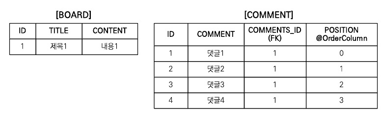
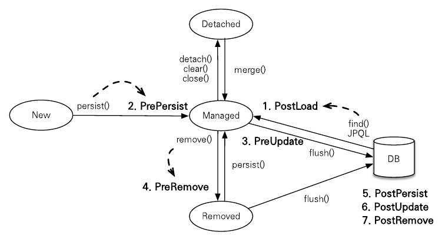

이번 장에서 다룰 주요 내용은 다음과 같다.

- 컬렉션: 다양한 컬렉션과 특징을 설명한다.
- 컨버터: 엔티티의 데이터를 변환해서 데이터베이스에 저장한다.
- 리스너: 엔티티에서 발생한 이벤트를 처리한다.
- 엔티티 그래프: 엔티티를 조회할 때 연관된 엔티티들을 선택해서 함께 조회한다.

# 14.1 컬렉션

JPA는 자바에서 기본으로 제공하는 Collection, List, Set, Map 컬렉션을 지원하고 다음 경우에 이 컬렉션을 사용할 수 있다.

- @OneToMany, @ManyToMany를 사용해서 일대다나 다대다 엔티티 관계를 매핑할 때
- @ElementCollection을 사용해서 값 타입을 하나 이상 보관할 때

자바 컬렉션 인터페이스의 특징은 다음과 같다.

- Collection: 자바가 제공하는 최상위 컬렉션이다. 하이버네이트는 중복을 허용하고 순서를 보장하지 않는다고 가정한다.
- Set: 중복을 허용하지 않는 컬렉션이다. 순서를 보장하지 않는다.
- List: 순서가 있는 컬렉션이다. 순서를 보장하고 중복을 허용한다.
- Map: Key, Value 구조로 되어 있는 특수한 컬렉션이다.

## 14.1.1 JPA와 컬렉션

하이버네이트는 엔티티를 영속 상태로 만들 때 컬렉션 필드를 하이버네이트에서 준비한 컬렉션으로 감싸서 사용한다.

다음은 하이버네이트 컬렉션을 확인하기 위한 예제이다.

```java
Team team = new Team();

System.out.println("before persist = " + team.getMembers().getClass());
em.persist(team);
System.out.println("after persist = " + team.getMembers().getClass())
```

위의 예제의 출력 결과는 다음과 같다.

> before persist = class java.util.ArrayList
after persist = class org.hibernate.collection.internal.PersistentBag
> 

출력 결과를 보면 원래 ArrayList 타입이었던 컬렉션이 하이버네이트가 제공하는 PersistentBag 타입으로 변경되었다. 하이버네이트는 컬렉션을 효율적으로 관리하기 위해 엔티티를 영속 상태로 만들 때 원본 컬렉션을 감싸고 있는 내장 컬렉션을 생성해서 이 내장 컬렉션을 사용하도록 참조를 변경한다. 하이버네이트가 제공하는 내장 컬렉션은 원본 컬렉션을 감싸고 있어서 래퍼 컬렉션으로도 부른다.

하이버네이트는 이런 특징 때문에 컬렉션을 사용할 때 다음처럼 즉시 초기화해서 사용하는 것을 권장한다.

```java
Collection<Member> members = new ArrayList<Member>();
```

다음은 컬렉션 인터페이스에 따른 하이버네이트 내장 컬렉션과 특징이다.

| 컬렉션 인터페이스 | 내장 컬렉션 | 중복 허용 | 순서 보관 |
| --- | --- | --- | --- |
| Collection, List | PersistentBag | O | X |
| Set | PersistentSet | X | X |
| List + @OrderColumn | PetsistenctList | O | O |

## 14.1.2 Collection, List

Collection, List 인터페이스는 중복을 허용하는 컬렉션이고 PersistentBag를 래퍼 컬랙션으로 사용한다.

Collection, List는 중복을 허용한다고 가정하므로 객체를 추가하는 add() 메소드는 내부에서 어떤 비교도 하지 않고 항상 true를 반환한다. 같은 엔티티가 있는지 찾거나 삭제할 때는 equals() 메소드를 사용한다.

```java
boolean result = comments.add(data);

comments.contains(comment); // equals 비교
comments.remove(comment); // equals 비교
```

Collection, List는 엔티티를 추가할 때 중복된 엔티티가 있는지 비교하지 않고 단순히 저장만 하면 된다. 따라서 엔티티를 추가해도 지연 로딩된 컬렉션을 초기화하지 않는다.

## 14.1.3 Set

Set은 중복을 허용하지 않는 컬렉션이다. 하이버네이트는 PersistentSet을 컬렉션 래퍼로 사용한다. 이 인터페이스는 HashSet으로 초기화하면 된다.

HashSet은 중복을 허용하지 않으므로 add() 메소드로 객체를 추가할 때마다 equals() 메소드로 같은 객체가 있는지 비교한다. 같은 객체가 없으면 객체를 추가하고 true를 반환하고, 같은 객체가 있어서 추가에 실패하면 false를 반환한다.

Set은 엔티티를 추가할 때 중복된 엔티티가 있는지 비교해야 한다. 따라서 엔티티를 추가할 때 지연 로딩된 컬렉션을 초기화한다.

## 14.1.4 List + @OrderColumn

다음 예제와 같이 List 인터페이스에 @OrderColumn을 추가하면 순서가 있는 특수한 컬렉션으로 인식한다. 순서가 있다는 의미는 데이터베이스에 순서 값을 저장해서 조회할 때 사용한다는 의미이다. 하이버네이트는 내부 컬렉션인 PersistentList를 사용한다.

```java
@Entity
public class Board {
	@Id @GeneratedValue
	private Long id;
	
	private String title;
	private String content;
	
	@OneToMany(mappedBy = "board")
	@OrderColumn(name = "POSITION")
	private List<Comment> comments = new ArrayList<Commnet>();
}
```

다음 예제의 Board.comments에 List를 사용하고 @OrderColumn을 추가했다. 따라서 Board.comments는 순서가 있는 컬렉션으로 인식된다.

순서가 있는 컬렉션은 데이터베이스에 순서 값도 함께 관리한다. 예제 코드에서 JPA는 List의 위치 값을 테이블의 POSITION 칼럼에 보관한다. 그런데 Board.comments 컬렉션은 Board 엔티티에 있지만 테이블의 일대다 관계의 특성상 위치 값은 다쪽에 저장해야 한다. 따라서 실제 POSITION칼럼은 COMMENT 테이블에 매핑된다.



그림 14.1 @OrderColumn Table

## 14.1.5 @OrderBy

@OrderColumn이 데이터베이스에서 순서용 칼럼을 매핑해서 관리했다면 @OrderBy는 데이터베이스의 ORDER BY절을 사용해서 컬렉션을 정렬한다. 따라서 순서용 칼럼을 매핑하지 않아도 된다. 그리고 @OrderBy는 모든 컬렉션에 사용할 수 있다.

다음은 @OrderBy를 사용한 예제이다.

```java
@Entity
public class Team {
	@Id @GeneratedValue
	private Long id;
	private String name;
	
	@OneToMany(mappedBy = "team")
	@OrderBy("username desc, id asc")
	private Set<Member> members = new HashSet<Member>();
}
```

# 14.2 @Converter

컨버터를 사용하면 엔티티의 데이터를 변환해서 데이터베이스에 저장할 수 있다.

예를 들어 자바의 boolean 타입을 사용한다고 할 때 데이터베이스 방언에 따라 다르지만 데이터베이스에 저장될 때는 0 또는 1인 숫자로 저장된다. 그런데 데이터베이스에 숫자 대신 문자 Y 또는 N으로 저장하고 싶다면 컨버터를 사용하면 된다.

다음은 컨버터를 사용하는 예제이다.

```java
@Entity
public class Member {
	@Id
	private Long id;
	private String username;
	
	@Convert(converter=BooleanToYNConverter.class)
	private boolean vip;
}
```

다음 예제의 vip 필드는 boolean 타입이다. @Convert를 적용해서 데이터베이스에 저장되기 전에 BooleanToYNConverter 컨버터가 동작하도록 했다.

이렇게 회원 엔티티를 저장하면 데이터베이스의 VIP 칼럼에는 Y 또는 N이 저장된다.

## 14.2.1 글로벌 설정

모든 Boolean 타입에 컨버터를 적용하려면 다음 예제와 같이 @Converter(autoApply = true) 옵션을 적용하면 된다.

```java
@Converter(autoApply = true)
public class BooleanToYNConverter implements AttributeConverter<Boolean, String> {
	...
}
```

# 14.3 리스너

JPA 리스너 기능을 사용하면 엔티티의 생명주기에 따른 이벤트를 처리할 수 있다.

## 14.3.1 이벤트 종류

이벤트 종류와 발생 시점은 다음과 같다.



그림 14.2 리스너 시점

1. PostLoad: 엔티티가 영속성 컨텍스트에 조회된 직후 또는 refresh를 호출한 후
2. PrePersist: persist() 메소드를 호출해서 엔티티를 영속성 컨텍스트에 관리하기 직전에 호출된다.
3. PreUpdate: flush나 commit을 호출해서 엔티티를 데이터베이스에 수정하기 직전에 호출된다.
4. PreRemove: remove() 메소드를 호출해서 엔티티를 영속성 컨텍스트에서 삭제하기 직전에 호출된다.
5. PostPersist: flush나 commit을 호출해서 엔티티를 데이터베이스에 저장한 직후에 호출된다.
6. PostUpdate: flush나 commit을 호출해서 엔티티를 데이터베이스에 수정한 직후에 호출된다.
7. PostRemove: flus나 commit을 호출해서 엔티티를 데이터베이스에 삭제한 직후에 호출된다.

## 14.3.2 이벤트 적용 위치

이벤트는 엔티티에서 직접 받거나 별도의 리스너를 등록해서 받을 수 있다.

- 엔티티에 직접 적용
- 별도의 리스너 등록
- 기본 리스너 사용

### 엔티티에 직접 적용

다음은 이벤트를 엔티티에 직접 적용하는 예제이다.

```java
@Entity
public class Duck {
	@Id @GeneratedValue
	private  Long id;
	
	private String name;
	
	@PrePersist
	public void prePersist() {
		System.out.println("Duck.prePersist id=" + id);
	}
	
	@PostPersist
	public void postPersist() {
		System.out.println("Duck.postPersist id=" + id);
	}
	
	@PostLoad
	public void postLoad() {
		System.out.println("Duck.postLoad");
	}
	
	@PreRemove
	public void preRemove() {
		System.out.println("Duck.preRemove"));
	}

	@PostRemove
	public void postRemove() {
		System.out.println("Duck.postRemove"));
	}	
}
```

이렇게 하면 엔티티에 이벤트가 발생할 때마다 어노테이션으로 지정한 메소드가 실행된다.

### 별도의 리스너 등록

다음은 별도의 리스너를 등록하는 예제이다.

```java
@Entity
@EntityListeners(DuckListener.class)
public class Duck {
	...
}

public class DuckListener {
	@PrePersist
	public void prePersist(Obejct obj) {
		System.out.println("Duck.prePersist obj = [" + obj + "]");
	}
	
	@PostPersist
	public void postPersist() {
		System.out.println("Duck.postPersist obj = [" + obj + "]");
	}
}
```

### 기본 리스너 사용

모든 엔티티의 이벤트를 처리하려면 META-INF/orm.xml에 기본 리스너로 등록하면 된다.

여러 리스너를 등록했을 때 이벤트 호출 순서는 다음과 같다.

1. 기본 리스너
2. 부모 클래스 리스너
3. 리스너
4. 엔티티

# 14.4 엔티티 그래프

엔티티를 조회할 때 연관된 엔티티들을 함께 조회하려면 글로벌 fetch 옵션을 FetchType.EAGER로 설정하거나 JPQL에서 페치 조인을 사용하면 된다.

글로벌 fetch 옵션은 애플리케이션 전체에 영향을 주고 변경할 수 없는 단점이 있다. 그래서 일반적으로 글로벌 fetch 옵션은 FetchType.LAZY를 사용하고 엔티티를 조회할 때 연관된 엔티티를 함께 조회할 필요가 있으면 JPQL의 페치 조인을 사용한다.

그런데 페치 조인을 사용하면 같은 JPQL을 중복해서 작성하는 경우가 많다. JPA 2.1에 추가된 엔티티 그래프 기능을 사용하면 엔티티를 조회하는 시점에 함께 조회할 연관된 엔티티를 선택할 수 있다. 따라서 JPQL은 데이터를 조회하는 기능만 수행하면 되고 연관된 엔티티를 함께 조회하는 기능은 엔티티 그래프를 사용하면 된다.

## 14.4.1 Named 엔티티 그래프

다음은 Named 엔티티 그래프의 예제이다.

```java
@NamedEntityGraph(name = "Order.withMembrer", attributeNodes = {
	@NamedAttributeNode("member")
})
@Entity
@Table(name = "ORDERS")
public class Order {
	@Id @GeneratedValue
	private Long id;
	
	@ManyToOne(fetch = FetchType.LAZY, optional = false)
	@JoinColumn(name = "MEMBER_ID")
	private Member member;
}
```

Named 엔티티 그래프는 @NamedEntityGraph로 정의한다.

Order.member가 지연로딩으로 설정되어 있지만 엔티티 그래프에서 함께 조회할 속성으로 member를 선택했으므로 이 엔티티 그래프를 사용하면 Order를 조회할 때 연관된 member도 함께 조회할 수 있다.

## 14.4.2 em.find()에서 엔티티 그래프 사용

다음은 엔티티 그래프를 사용하는 예제이다.

```java
EntityGraph graph = em.getEntityGraph("Order.withMember");

Map hints = new HashMap();
hints.put("javax.persistence.fetchgraph", graph);

Order order = em.find(Order.class, orderId, hints);
```

Named 엔티티 그래프를 사용하려면 정의한 그래프를 em.getEntityGraph를 통해서 찾아오면 된다. 엔티티 그래프는 JPA의 힌트 기능을 사용해서 동작한다. em.find로 Order를 조회할 때 힌트 정보도 같이 포함해서 조회하면 된다.

## 14.4.3 subgraph

Order→OrderItem→Item까지 참조가 이어지는 여러 엔티티를 함께 조회하려면 subgraph를 사용하면 된다.

다음은 subgraph의 예제이다.

```java
@NamedEntityGraph(name = "Order.withAll", attributeNodes = {
	@NamedAttributeNode("member"),
	@NamedAttributeNode(value = "orderItem", subgraph = "orderItems")
	},
	subgraph = @NamedSubgraph(name = "orderItems", attributeNodes = {
		@NamedAttributeNode("item")
	})
)
```

## 14.4.4 JPQL에서 엔티티 그래프 사용

JPQL에서 엔티티 그래프를 사용하는 방법은 em.find()와 동일하게 힌트만 추가하면 된다.

다음은 JPQL에서 사용하는 예제이다.

```java
List<Order> reulstList = 
	em.createQuery("select o from Order o wher o.id = :orderId", Order.class)
		.setParameter("orderId", orderId)
		.setHint("javax.persistence.fetchgraph", em.getEntityGraph("Order.withAll"))
		.getResultList();
```

## 14.4.5 동적 엔티티 그래프

엔티티를 동적으로 구성하려면 createEntityGraph() 메소드를 사용하면 된다.

다음은 동적 엔티티 그래프의 예제이다.

```java
EntityGraph graph = em.creatEntityGraph(Order.class);
graph.addAttributeNodes("member");

Map hints = new HashMap();
hints.put("javax.persistence.fetchgraph", graph);

Order order = em.find(Order.class, orderId, hints);
```

## 14.4.6 엔티티 그래프 정리

- ROOT에서 시작
    
    엔티티 그래프는 항상 조회하는 엔티티의 ROOT에서 시작해야 한다.
    
- 이미 로딩된 엔티티
    
    영속성 컨텍스트에 해당 엔티티가 로딩되어 있으면 엔티티 그래프가 적용되지 않는다.
    
- fetchgraph, loadgraph의 차이
    
    fetchgraph는 엔티티 그래프에 선택한 속성만 함께 조회한다. 반면에 loadgraph는 엔티티 그래프에 선택한 속성뿐만 아니라 글로벌 fetch 모드가 FetchType.EAGER로 설정된 연관관계도 포함해서 함께 조회한다.
    

# 14.5 정리

이번 장에서 학습한 내용은 다음과 같다.

- JPA가 지원하는 컬렉션의 종류와 특징들을 알아보았다.
- 컨버터를 사용하면 엔티티의 데이터를 변환해서 데이터베이스에 지정할 수 있다.
- 리스너를 사용하면 엔티티에서 발생한 이벤트를 받아서 처리할 수 있다.
- 페치 조인은 객체지향 쿼리를 사용해야 하지만 엔티티 그래프를 사용하면 객체 지향 쿼리를 사용하지 않아도 원하는 객체 그래프를 한 번에 조회할 수 있다.