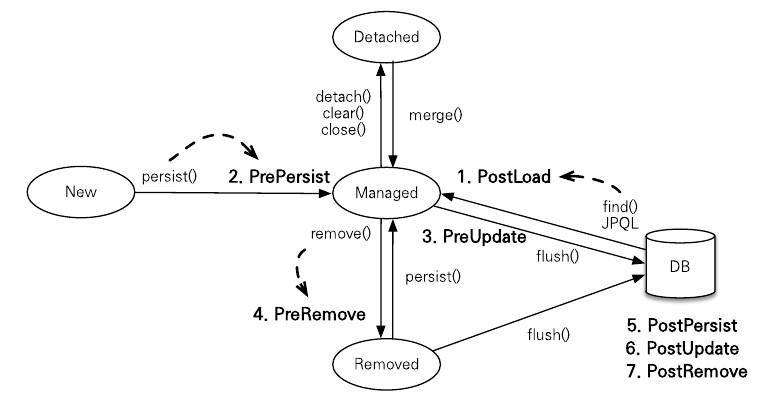

# 14장 컬렉션과 부가 기능

이 장에서 다룰 내용

1. 컬렉션 : 다양한 컬렉션의 특징을 설명한다.
2. 컨버터 : 엔티티의 데이터를 변환해서 DB에 저장한다.
3. 리스너 : 엔티티에서 발생한 이벤트를 처리한다.
4. 엔티티 그래프 : 엔티티를 조회할 때 연관된 엔티티를 선택해서 함께 조회한다.

# 14.1. 컬렉션

JPA는 자바에서 기본 제공하는 Collection, List, Set, Map을 지원한다.  

다음 경우에 이 컬렉션을 사용할 수 있다.

- @OneToMany, @ManyToMany를 사용해서 일대다나 다대다 엔티티 관계를 매핑할 때
- @ElementCollection을 사용해서 값 타입을 하나 이상 보관할 때

자바 컬렉션 인터페이스의 특징

- Collection : 자바가 제공하는 최상위 컬렉션. 중복 허용하고 순서 보장하지 않는다고 가정
- Set : 중복을 허용하지 않는 컬렉션. 순서 보장 X
- List : 순서가 있는 컬렉션. 순서를 보장하고 중복 허용
- Map : Key, Value 구조로 되어 있는 특수 컬렉션.

## 14.1.1. JPA와 컬렉션

하이버네이트는 엔티티를 영속 상태로 만들 때 컬렉션 필드를 하이버네이트에서 준비한 컬렉션으로 감싸서 사용한다.  
```java
@Entity
public class Team{
    
    @Id 
    private String id;
    
    @OneToMany
    @JoinColumn
    private Collection<Member> members = new ArrayList<Member>();
}
```
위 코드의 Team은 members 컬렉션을 필드로 가지고 있다.  

다음 코드로 Team을 영속 상태로 만들어보자.  

```java
Team team = new Team();

System.out.println("before persist = " + team.getMembers().getClass());
em.persist(parent);
System.out.println("after persist = " + team.getMembers().getClass());
```

출력 결과는 다음과 같다.  

```java
before persist = class java.util.ArrayList
after persist = class org.hibernate.collection.internal.PersistentBag
```

원래 ArrayList 타입이었던 컬렉션이 엔티티를 영속 상태로 만든 직후가 PersistentBag 타입으로 변경되었다.  

하이버네이트는 컬렉션의 효율적 관리를 위해 엔티티를 영속 상태로 만들 때 원본 컬렉션을 감싸고 있는 내장 컬렉션을
 생성해서 이 내장 컬렉션을 사용하도록 참조를 변경한다.  

하이버네이트는 이런 특징 때문에 컬렉션을 사용할 때 즉시 초기화해서 사용하는 것을 권장한다.  

| 컬렉션 인터페이스           | 내장 컬렉션         | 중복 허용 | 순서 보관 |
|---------------------|----------------|-------|-------|
| Collection, List    | PersistenceBag | O     | X     |
| Set                 | PersistenceSet | X     | X     |
| List + @OrderColumn | PersistentList | O     | O     |


## 14.1.2. Collection, List

중복을 허용하는 컬렉션이고 PersistentBag을 래퍼 컬렉션으로 사용한다.  

ArrayList로 초기화하면 된다.  

Collection, List는 중복을 허용한다고 가정하므로 객체를 추가하는 add() 메소드는 내부에서 어떤 비교도 하지 않고
 항상 true를 반환한다.  

같은 엔티티가 있는지 찾거나 할 때는 equals()메소드를 사용한다.  

`Collection, List는 엔티티 추가 시 중복 엔티티가 있는지 비교하지 않고 단순 저장만 하면 된다.`  
`따라서 엔티티를 추가해도 지연 로딩된 컬렉션을 초기화하지 않는다.`

## 14.1.3. Set

Set은 중복을 허용하지 않는 컬렉션이다. 하이버네이트는 PersistentSet을 컬렉션 래퍼로 사용한다.  

이 인터페이스는 HashSet으로 초기화하면 된다.  

HashSet은 중복 허용 하지 않으므로 add()메소드로 객체 추가시마다 equals()메소드로 같은 객체가 있는지 비교한다.  

HashSet은 해시 알고리즘을 사용하므로 hashcode()도 함께 사용해서 비교한다.  

`Set은 엔티티를 추가할 때 중복된 엔티티가 있는지 비교해야 한다.`  
`따라서 엔티티를 추가할 때 지연 로딩된 컬렉션을 초기화한다.`

## 14.1.4. List + @OrderColumn

실무에서 잘 사용하지 않는다. 패스

## 14.1.5. @OrderBy

DB의 ORDER BY 절을 사용해서 컬렉션을 정렬한다.  

@OrderBy는 모든 컬렉션에 사용할 수 있다. 

```java
@OneToMany(mappedBy = "team")
@OrderBy("username desc, id asc")
private Set<Member> members = new HashSet<Member>();
```
Team.members를 보면 @OrderBy를 적용했다.  

@OrderBy의 값으로 username, desc, id asc를 사용해서 Member의 username 필드로 내림차순 정렬, id로 오름차순 정렬했다.  

@OrderBy의 값은 JPQL의 order by절처럼 엔티티의 필드를 대상으로 한다.  

# 14.2. @Converter

컨버터를 사용하면 엔티티의 데이터를 변환해서 DB에 저장할 수 있다.  

회원의 VIP 여부를 자바의 boolean 타입을 사용하고 싶다고 하자.  

JPA를 사용하면 DB에 저장될 때 0 또는 1인 숫자로 저장된다.  

그런데 DB에 숫자 대신 문자 Y 또는 N 으로 저장하고 싶다면 컨버터를 사용하면 된다.  

매핑할 테이블을 만들어준다. VIP 컬럼을 VARCHAR(1)로 만들어서 Y 또는 N으로 저장하도록 한다.  

```java
@Entity
public class Member{
    @Id @GeneratedValue
    private Long id;
    
    private String username;
    
    @Convert(converter = BooleanToYNConverter.class)
    private boolean vip;
}
```

회원 엔티티의 vip 필드느는 boolean 타입이다.  

@Convert를 적용해서 DB에 저장되기 직전에 BooleanToYNConverter 컨버터가 동작하도록 했다.  

```java
@Converter
public class BooleanToYNConverter implements AttributeConverter<Boolean, String>{
    @Override
    public String convertToDatabaseColumn(Boolean attribute){
        return (attribute != null && attribute) ? "Y" : "N";
    }
    
    @Override
    public Boolean convertToEntityAttribute(String dbData){
        return "Y".equals(dbData);
    }
}
```

컨버터 클래스는 @Convert 어노테이션을 사용하고 AttributeConverter 인터페이스를 구현해야 한다.  

그리고 제네릭에 현재 타입과 변환할 타입을 지정해야 한다.  

AttributeConverter 인터페이스는 다음 두 메소드를 구현해야 한다.  

1. convertToDatabaseColumn() : 엔티티의 데이터를 DB 컬럼에 저장할 데이터로 변환한다.
2. convertToEntityAttribute() : DB에서 조회한 컬럼 데이터를 엔티티의 데이터로 변환한다.  


컨버터는 클래스 레벨에도 설정할 수 있다.  

단 이때는 attributeName 속성을 사용해서 어떤 필드에 컨버터를 적용할지 명시해야 한다.  

```java
@Entity
@Convert(converter = BooleanToYNConverter.class, attributeName = "vip")
public class Member{
    @Id @GeneratedValue
    private Long id;
    
    private String username;
    
    private boolean vip;
}
```

## 14.2.1. 글로벌 설정

모든 Boolean 타입에 컨버터를 적용하려면 @Converter(autoApply = true) 옵션을 적용하면 된다.  

```java
@Converter(autoApply = true)
public class BooleanToYNConverter implements AttributeConverter<Boolean, String>{
    @Override
    public String convertToDatabaseColumn(Boolean attribute){
        return (attribute != null && attribute) ? "Y" : "N";
    }
    
    @Override
    public Boolean convertToEntityAttribute(String dbData){
        return "Y".equals(dbData);
    }
}
```

| 속성                | 기능                            | 기본값   |
|-------------------|-------------------------------|-------|
| converter         | 사용할 컨버터 지정.                   |      |
| attributeName     | 컨버터 적용 필드 지정.                 |  |
| disableConversion | 글로벌 컨버터나 상속 받은 컨버터를 사용하지 않는다. | false |

# 14.3. 리스너

모든 엔티티를 대상으로 언제 어떤 사용자가 삭제를 요청했는지 모두 로그로 남겨야 하는 요구사항 가정.  

애플리케이션 삭제 로직을 하나씩 찾아 로그를 남기는 것은 비효율적.  

JPA 리스너 기능 사용 시 엔티티 생명주기에 따른 이벤트 처리 가능.  

## 14.3.1. 이벤트 종류
  

1. PostLoad : 엔티티가 영속성 컨텍스트에 조회된 직후 또는 refresh를 호출한 후
2. PrePersist : persist() 메소드를 호출해서 엔티티를 영속성 컨텍스트에 관리하기 직전에 호출
3. PreUpdate : flush나 commit을 호출해서 엔티티를 DB에 수정하기 직전에 호출
4. PreRemove : remove() 메소드를 호출해서 엔티티를 영속성 컨텍스트에서 삭제하기 직전에 호출
5. PostPersist : flush나 commit을 호출해서 엔티티를 DB에 저장한 후에 호출 
6. PostUpdate : flush나 commit을 호출해서 엔티티를 DB에 수정한 직후에 호출
7. PostRemove : flush나 commit을 호출해서 엔티티를 DB에 삭제한 직후에 호출

## 14.3.2. 이벤트 적용 위치

이벤트는 엔티티에서 직접 받거나 별도의 리스너를 등록해서 받을 수 있다.  

### 엔티티에 직접 적용
```java
@Entity
public class Duck{
    @Id @GeneratedValue
    private Long id;
    
    private String name;
    
    @PrePersist
    public void prePersist(){
        System.out.println("Duck.prePersist id = " + id);
    }
    @PostPersist
     public void postPersist(){
          System.out.println("Duck.postPersist id = " + id);
     }
     @PostLoad
     public void postLoad(){
          System.out.println("Duck.postLoad id = " + id);
     }
     @PreRemove
        public void preRemove(){
            System.out.println("Duck.preRemove id = " + id);
        }
     @PostRemove
        public void postRemove(){
            System.out.println("Duck.postRemove id = " + id);
        }   
}
```
위 코드는 엔티티에 이벤트가 발생할 때마다 어노테이션으로 지정한 메소드가 실행된다.  

엔티티를 저장하면 다음과 같이 출력된다.
```java
Duck.prePersist id = null(아이디가 생성되기 전에 호출)
Duck.postPersist id = 1(아이디가 생성된 후에 호출)
```
이벤트를 처리할 별도의 리스너를 등록하는 방법도 있다.

### 별도의 리스너 등록
```java
@Entity
@EntityListeners(DuckListener.class)
public class Duck{
    
}
public class DuckListener{
    @PrePersist
    public void prePersist(Object obj){
        System.out.println("DuckListener.prePersist obj = {" + obj + "}");
    }
    @PostPersist
    public void postPersist(Object obj){
        System.out.println("DuckListener.postPersist obj = {" + obj + "}");
    }
}
```

리스너는 대상 엔티티를 파라미터로 받을 수 있다.  

반환 타입은 void로 설정해야 한다.  

### 기본 리스너 사용
모든 엔티티의 이벤트를 처리하려면 META-INF/orm.xml에 기본 리스너로 등록하면 된다.  

여러 리스너를 등록했을 때 이벤트 호출 순서는 다음과 같다.  

1. 기본 리스너
2. 부모 클래스 리스너
3. 리스너
4. 엔티티

### 더 세밀한 설정
더 세밀한 설정을 위한 어노테이션도 있다.  

1. javax.persistence.ExcludeDefaultListeners : 기본 리스너 무시
2. javax.persistence.ExcludeSuperclassListeners : 상위 클래스 리스너 무시

이벤트를 잘 활용하면 대부분의 엔티티에 공통 적용하는 등록 일자, 수정 일자 처리와 해당 엔티티를 누가 등록하고 수정했는지에 대한 기록을 리스너 하나로 처리할 수 있다.  

# 14.4. 엔티티 그래프

엔티티를 조회할 때 연관된 엔티티들을 함께 조회하려면 글로벌 fetch 옵션을 FetchType.EAGER로 설정한다.  

또는 JPQL에서 페치 조인을 사용하면 된다.  

글로벌 fetch 옵션은 애플리케이션 전체에 영향을 주고 변경할 수 없는 단점이 있다.  

그래서 일반적으로 글로벌 fetch 옵션은 FetchType.LAZY를 사용하고 엔티티를 조회할 때 연관된 엔티를 함께 조회할 필요가 있으면 JPQL의 페치 조인을 사용한다.  

하지만 페치 조인 사용 시 같은 JPQL 중복 작성하는 경우가 많다.  

엔티티 그래프 기능을 사용하면 엔티티 조회 시점에 함께 조회할 연관된 엔티티를 선택할 수 있다.  

따라서 JPQL은 데이터 조회하는 기능만 수행하면 되고 연관된 엔티티를 함께 조회하는 기능은 엔티티 그래프를 사용하면 된다.  

그러므로 엔티티 그래프 기능을 적용하면 다음 JPQL만 사용하면 된다.  

엔티티 그래프 기능은 엔티티 조회시점에 연관된 엔티티들을 함께 조회하는 기능이다.  

정적 정의하는 Named 엔티티 그래프와 동적 정의하는 엔티티 그래프가 있다. 

예제에 사용할 엔티티 모델은 다음과 같다.  

  

## 14.4.1. Named 엔티티 그래프
주문을 조회할 때 연관된 회원도 함께 조회하는 엔티티 그래프를 사용해보자.

```java
@NamedEntityGraph(name = "Order.withMember", attributeNodes = {
    @NamedAttributeNode("member")
})
@Entity
@Table(name = "ORDERS")
public class Order{
    @Id @GeneratedValue
    @Column(name = "ORDER_ID")
    private Long id;
    
    @ManyToOne(fetch = FetchType.LAZY, optional = false)
    @JoinColumn(name = "MEMBER_ID")
    private Member member; //주문 회원
}
```

Named 엔티티 그래프는 @NamedEntityGraph를 사용해서 정의한다.  

- name : 엔티티 그래프의 이름을 정의한다. 
- attributeNodes : 함께 조회할 속성을 선택한다. @NamedAttributeNode를 사용해서 선택한다.

Order.member가 지연 로딩으로 되어 있지만 엔티티 그래프에서 함께 조회할 속성으로 member를 선택했으므로 Order를 조회할 때 연관된 member도 함께 조회할 수 있다.  

## 14.4.2. em.find()에서 엔티티 그래프 사용
```java
@EntityGraph graph = em.getEntityGraph("Order.withMember");

Map hints = new HashMap();
hints.put("javax.persistence.fetchgraph", graph);

Order order = em.find(Order.class, orderId, hints);
```

Named 엔티티 그래프를 사용하려면 정의한 엔티티 그래프를 em.getEntityGraph("Order.withMember")를 통해 찾아오면 된다.  

엔티티 그래프는 JPA의 힌트 기능을 사용해서 동작한다.  

힌트의 키로 javax.persistence.fetchgraph를 사용하고 값으로 엔티티 그래프를 넘겨주면 된다.  

## 14.4.3. subgraph
Order -> OrderItem -> Item까지 함께 조회해보자.  

Order -> OrderItem은 Order가 관리하는 필드지만 OrderItem -> Item은 Order가 관리하는 필드가 아니다.  

이 때 subgraph를 사용한다.  

```java
@NamedEntityGraph(name = "Order.withAll", attributeNodes = {
    @NamedAttributeNode("member"),
    @NamedAttributeNode(value = "orderItems", subgraph = "orderItems"),
}, subgraphs = {
    @NamedSubgraph(name = "orderItems", attributeNodes = @NamedAttributeNode("item"))
})
@Entity
@Table(name = "ORDERS")
public class Order{
    @Id @GeneratedValue
    @Column(name = "ORDER_ID")
    private Long id;
    
    @ManyToOne(fetch = FetchType.LAZY, optional = false)
    @JoinColumn(name = "MEMBER_ID")
    private Member member; //주문 회원
    
    @OneToMany(mappedBy = "order", cascade = CascadeType.ALL)
    private List<OrderItem> orderItems = new ArrayList<OrderItem>();
}

@Entity
@interface 
public class OrderItem{
    @Id @GeneratedValue
    @Column(name = "ORDER_ITEM_ID")
    private Long id;
    
    @ManyToOne(fetch = FetchType.LAZY, optional = false)
    @JoinColumn(name = "ITEM_ID")
    private Item item;
}
```

이 엔티티 그래프는 Order -> Member, Order -> OrderItem, OrderItem -> Item의 객체 그래프를 함께 조회한다.  

이 때 OrderItem -> Item은 Order의 객체 그래프가 아니므로 subgraph의 속성으로 정의해야 한다.  

이 속성은 @NamedSubgraph를 사용해서 서브 그래프를 정의한다.  

여기서는 orderItems라는 이름의 서브 그래프가 item을 함께 조회하도록 정의했다.  

사용하는 코드를 보자.  
```java
Map hints = new HashMap();
hints.put("javax.persistence.fetchgraph", em.getEntityGraph("Order.withAll"));

Order order = em.find(Order.class, orderId, hints);
```  

Order.withAll이라는 Named 엔티티 그래프를 사용해서 Order 엔티티를 조회했다.  

실행된 SQL을 보면 엔티티 그래프에서 지정한 엔티티들을 함께 조회한다.  

```sql
select o.*, m.*, oi.*, i.*
from
    ORDERS o
inner join
    Member m
        on o.MEMBER_ID = m.MEMBER_ID
left outer join 
    ORDER_ITEM oi
        on o.ORDER_ID = oi.ORDER_ID
left outer join
    Item i
        on oi.ITEM_ID = i.ITEM_ID
where
    o.ORDER_ID = ?
```

## 14.4.4. JPQL에서 엔티티 그래프 사용

em.find()와 동일하게 힌트만 추가하면 된다.  

```java
List<Order> resultList = 
    em.createQuery("select o from Order o where o.id = :orderId", Order.class)
        .setParameter("orderId", orderId)
        .setHint("javax.persistence.fetchgraph", em.getEntityGraph("Order.withAll"))
        .getResultList();
```

## 14.4.5. 동적 엔티티 그래프

createEntityGraph() 메소드를 사용하면 된다.  

`Public <T> EntityGraph<T> createEntityGraph(Class<T> rootType);`

처음 사용한 Named 엔티티 그래프를 동적으로 구성해보자. 
```java
EntityGraph<Order> graph = em.createEntityGraph(Order.class);
graph.addAttributeNodes("member");

Map hints = new HashMap();
hints.put("javax.persistence.fetchgraph", graph);

Order order = em.find(Order.class, orderId, hints);
```

em.createEntityGraph로 동적 엔티티 그래프를 만들고 graph.addAttributeNodes를 사용해서 Order.member 속성을 엔티티 그래프에 포함했다.  

조금 더 복잡한 subgraph 기능을 동적 구성해보자.
```java
EntityGraph<Order> graph = em.createEntityGraph(Order.class);
graph.addAttributeNodes("member");
Subgraph<OrderItem> orderItems = graph.addSubgraph("orderItems");
orderItems.addAttributeNodes("item");

Map hints = new HashMap();
hints.put("javax.persistence.fetchgraph", graph);

Order order = em.find(Order.class, orderId, hints);
```

graph.addSubgraph 메소드를 사용해서 서브 그래프가 item 속성을 포함하도록 했다.  

## 14.4.6. 엔티티 그래프 정리

### ROOT에서 시작
엔티티 그래프는 항상 조회하는 엔티티의 ROOT 에서 시작해야 한다.  

Order 엔티티를 조회하는데 Member부터 시작하는 엔티티 그래프를 사용하면 안된다.  

### 이미 로딩된 엔티티
영속성 컨텍스트에 해당 엔티티가 이미 로딩되어 있으면 엔티티 그래프가 적용되지 않는다.  

### fetchgraph, loadgraph의 차이
예제에서는 fetchgraph 힌트를 사용했는데 이는 엔티티 그래프에 선택한 속성만 함께 조회한다.  

loadgraph 속성은 엔티티 그래프에 선택한 속성뿐만 아니라 글로벌 fetch 모드가 FetchType.EAGER로 설정된 연관관계도 포함해서 함께 조회한다.  

