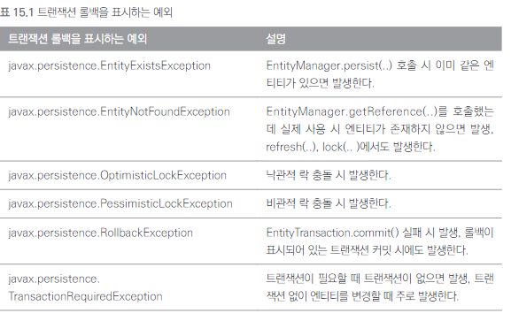
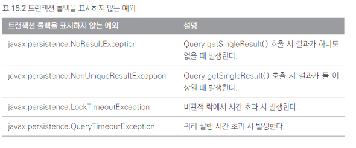
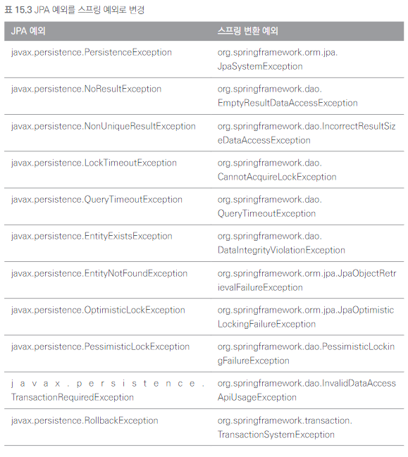
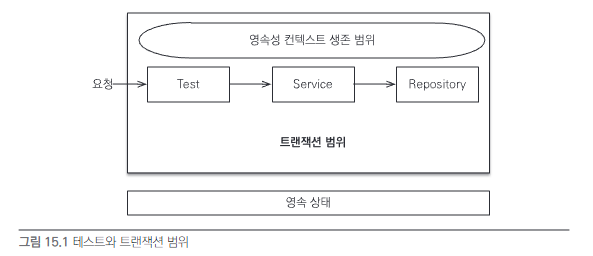
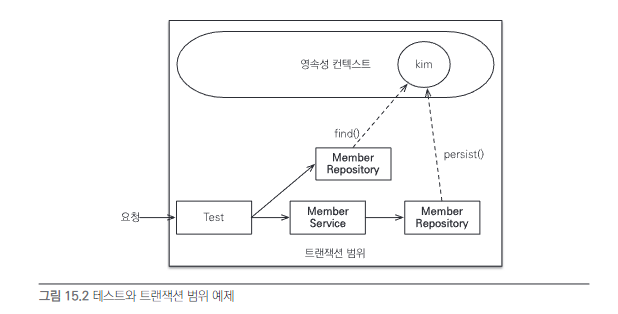
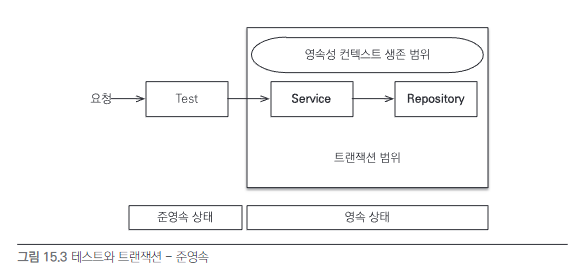
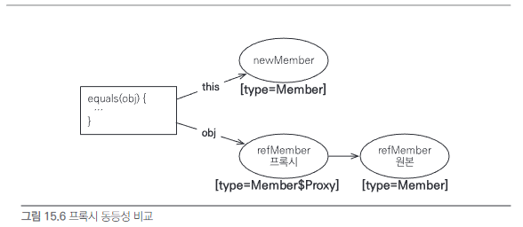
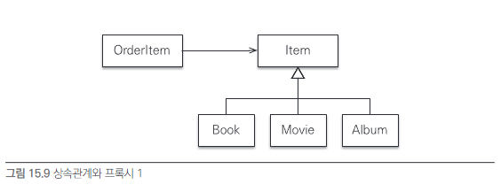
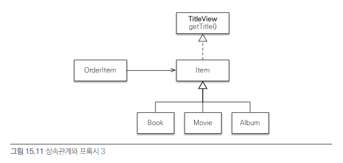
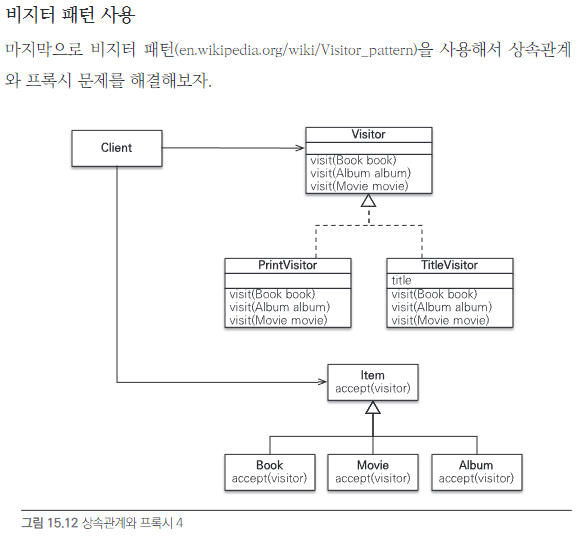

# 15장 고급 주제와 성능 최적화

JPA의 깊이 있는 고급 주제들과 JPA의 성능을 최적화하는 다양한 방법을 알아보자. 

## 15.1. 예외 처리
### 15.1.1. JPA 표준 예외 처리
JPA 표준 예외들은 javax.persistence.PersistenceException의 자식 클래스다.  

그리고 이 예외 클래스는 RuntimeException의 자식이므로 JPA 예외는 모두 언체크 예외다.  

JPA 표준 예외는 크게 2가지로 나눌 수 있다.

- 트랜잭션 롤백을 표시하는 예외
- 트랜잭션 롤백을 표시하지 않는 예외



트랜잭션 롤백을 표시하는 예외는 심각한 예외이므로 복구해선 안된다.  

표시하지 않는 예외는 심각한 예외가 아니므로 트랜잭션을 커밋할지 롤백할지 판단하면 된다.  

### 15.1.2. 스프링 프레임워크의 JPA 예외 변환
서비스 계층에서 데이터 접근 계층의 구현 기술에 직접 의존하는 것은 좋은 설계라 할 수 없다.  

예외도 마찬가지인데 예를 들어 서비스 계층에서 JPA의 예외를 직접 사용하면 JPA에 의존하게 된다.  

스프링 프레임워크는 데이터 접근 계층에 대한 예외를 추상화해서 개발자에게 제공한다.  

### 15.1.3. 스프링 프레임워크에 JPA 예외 변환기 적용
JPA 예외를 스프링 프레임워크가 제공하는 추상화된 예외로 변경하려면 PersistenceExceptionTranslationPostProcessor를 빈으로 등록하면 된다.  

이는 @Repository 어노테이션을 사용한 곳에 예외 변환 AOP를 적용해 JPA 예외를 스프링 프레임워크가 추상화한 예외로 변환해준다.  

JAVAConfig 사용 시 다음과 같이 등록한다.
```java
@Bean
public PersistenceExceptionTranslationPostProcessor exceptionTranslation() {
    return new PersistenceExceptionTranslationPostProcessor();
}
```

예외 변환 코드를 보자.
```java
@Repository
public class NoResultExceptionTestRepository{
    @PersistenceContext EntityManager em;
    
    public Member findMember(){
        //조회된 데이터가 없음
        return em.createQuery("select m from Member m where m.id = 100", Member.class)
            .getSingleResult();
    }
}
```

findMember() 메소드는 엔티티 조회하려고 getSingleResult 메소드를 사용했다.  

이 메소드는 조회된 결과가 없으면 NoResultException이 발생한다.  

이 예외가 findMember() 메소드를 빠져 나갈 때 PersistenceExceptionTranslationPostProcessor에서 등록한 AOP 인터셉터가 동작해 예외를 EmptyResultDataAccessException으로 변환한다.  

예외를 그대로 반환하고 싶으면 throws 절에 그대로 반환할 JPA 예외나 JPA 예외의 부모 클래스를 직접 명시한다.  

java.lang.Exception을 선언하면 모든 예외의 부모이므로 예외를 변환하지 않는다.  

```java
@Repository
public class NoResultExceptionTestService{
    @PersistenceContext EntityManager em;
    
    public member findMember() throws javax.persistence.NoResultException{
        return em.createQuery("select m from Member m", Member.class)
            .getSingleResult();}
}
```

### 15.1.4. 트랜잭션 롤백 시 주의사항
트랜잭션을 롤백하는 것은 DB 반영사항만 롤백하는 것이지 수정한 자바 객체까지 복구해주지는 않는다.  

엔티티 조회 후 수정하는 중 문제가 생겨 트랜잭션을 롤백하면 DB의 데이터는 원래대로 복구되지만 
객체는 수정된 상태로 영속성 컨텍스트에 남아있다.  

스프링 프레임워크는 이런 문제를 예방하기 위해 영속성 컨텍스트의 범위에 따라 다른 방법을 사용한다.  

기본 전략인 트랜잭션당 영속성 컨텍스트 전략은 문제가 발생하면 트랜잭션 AOP 종료 시점에 트랜잭션을 롤백하면서 영속성 컨텍스트도 함께 종료한다.  

문제는 OSIV처럼 영속성 컨텍스트의 범위를 트랜잭션 범위보다 넓게 사용해서 여러 트랜잭션이 하나의 영속성 컨텍스트를 사용할 때 발생한다.  

이때는 트랜잭션을 롤백해 영속성 컨텍스트에 이상이 발생해도 다른 트랜잭션에서 해당 영속성 컨텍스트를 그대로 사용한다.  

스프링 프레임워크는 영속성 컨텍스트의 범위를 트랜잭션의 범위보다 넓게 선정하면 트랜잭션 롤백시 영속성 컨텍스트를 초기화해서 잘못된 영속성 컨텍스트를 사용하는
 문제를 예방한다. 

## 15.2. 엔티티 비교
영속성 컨텍스트를 통해 데이터를 저장하거나 조회하면 1차 캐시에 엔티티가 저장된다.  

이 1차 캐시 덕분에 변경 감지 기능, DB를 통하지 않고 데이터를 바로 조회할 수 있다.  

영속성 컨텍스트를 정확히 이해하기 위해서 1차 캐시의 장점인 애플리케이션 수준의 반복 가능한 읽기를 이해해야 한다.  

같은 영속성 컨텍스트에서 엔티티를 조회하면 항상 같은 엔티티 인스턴스를 반환한다.  

이것은 동등성 비교가 아닌 정말 주소값이 같은 인스턴스를 반환한다.
```java
Member member1 = em.find(Member.class, 1L);
Member member2 = em.find(Member.class, 1L);

assterTrue(member1 == member2); //true 
```

### 15.2.1. 영속성 컨텍스트가 같을 때 엔티티 비교
  

```java
@RunWith(SpringJUnit4ClassRunner.class)
@ContextConfiguration(locations = "classpath:applicationContext.xml")
@Transactional
public class MemberServiceTest{
    
    @Autowired MemberService memberService;
    @Autowired MemberRepository memberRepository;
    
    @Test
    public void 회원가입() throws Exception{
        //given
        Member member = new Member("kim");
        
        //when
        Long saveId = memberService.join(member);
        
        //then
        Member findMember = memberRepository.findOne(saveId);
        assertTrue(member == findMember); //참조값 비교
    }
}

@Transactional
public class MemberService{
    @Autowired MemberRepository memberRepository;
    
    public Long join(Member member){
        memberRepository.save(member);
        return member.getId();
    }
    @Repository
    public class MemberRepository{
        @PersistenceContext EntityManager em;
        
        public void save(Member member){
            em.persist(member);
        }
        
        public Member findOne(Long id){
            return em.find(Member.class, id);
        }
    }
}
```
테스트 클래스에 @Transactional이 선언되어 있으면 트랜잭션을 먼저 시작하고 테스트 메소드를 실행한다.  

테스트 메소드인 회원가입()은 이미 트랜잭션 범위에 들어 있고 이 메소드가 끝나면 트랜잭션이 종료된다.  

회원가입()에서 사용된 코드는 항상 같은 트랜잭션과 같은 영속성 컨텍스트에 접근한다.  

코드를 보면 회원을 생성하고 저장한 후 회원을 저장된 회원을 찾아 저장한 회원과 비교한다.  
  
영속성 컨텍스트가 같으면 엔티티를 비교할 때 다음 3가지 조건을 모두 만족한다.
- 동일성 : == 비교가 같다.
- 동등성 : equals()비교가 같다.
- 데이터베이스 동등성 : @Id인 데이터베이스 식별자가 같다. 

### 15.2.2. 영속성 컨텍스트가 다를 때 엔티티 비교
테스트 클래스에 @Transactional이 없고 서비스에만 있으면 다음과 같은 범위를 가지게 된다.  

  


```java
@RunWith(SpringJUnit4ClassRunner.class)
@ContextConfiguration(locations = "classpath:applicationContext.xml")
//@Transactional 트랜잭션 사용하지 않음
public class MemberServiceTest{
    
    @Autowired MemberService memberService;
    @Autowired MemberRepository memberRepository;
    
    @Test
    public void 회원가입() throws Exception{
        //given
        Member member = new Member("kim");
        
        //when
        Long saveId = memberService.join(member);
        
        //then
        Member findMember = memberRepository.findOne(saveId);
        assertTrue(member == findMember);
        //둘은 다른 주속값을 가진 인스턴스로 테스트가 실패한다.
    }
}

@Transactional //서비스 클래스에서 트랜잭션 시작
public class MemberService{
    @Autowired MemberRepository memberRepository;
    
    public Long join(Member member){
        memberRepository.save(member);
        return member.getId();
    }
    @Repository
    @Transactional //예제 구성위해 추가
    public class MemberRepository{
        @PersistenceContext EntityManager em;
        
        public void save(Member member){
            em.persist(member);
        }
        
        public Member findOne(Long id){
            return em.find(Member.class, id);
        }
    }
}
```

테스트는 실패한다.  

1. 테스트 코드에서 memberService.join(member)를 호출해 회원가입 시도시 서비스 계층에서 트랜잭션 시작되고 영속성 컨텍스트 1이 만들어짐.
2. memberRepository에서 em.persist()를 호출해서 member 엔티티 영속화
3. 서비스 계층 끝날 때 트랜잭션 커밋되면서 영속성 컨텍스트 플러시. 이 때 트랜잭션과 영속성 컨텍스트 종료되면서 member 엔티티 준영속 상태
4. 테스트 코드에서 memberRepository.findOne(saveId)를 호출해 저장한 엔티티 조회 시 새로운 영속성 컨텍스트 2 생성
5. 저장된 회원 조회하지만 새로운 영속성 컨텍스트2에는 존재 X
6. DB에서 회원을 찾아옴
7. DB에서 찾아온 회원 엔티티를 영속성 컨텍스트에 보관 후 반환
8. memberRepository.findOne()메소드 끝나면서 트랜잭션 종료, 영속성 컨텍스트2 종료.

둘은 다른 영속성 컨텍스트에서 관리되었기 때문에 다른 인스턴스다.  

하지만 같은 데이터베이스 로우를 가르키고 있으니 사실상 같은 엔티티로 보아야 한다.  

영속성 컨텍스트가 다를 때 엔티티 비교는 다음과 같다.  

- 동일성 : = 비교가 실패한다.
- 동등성 : equals()비교가 만족한다. 단 equals()를 구현해야 한다. 
- 데이터베이스 동등성 : @Id인 데이터베이스 식별자가 같다.
- 
영속성 컨텍스트가 달라지면 동일성 비교는 실패한다.  

따라서 엔티티 비교에 다른 방법을 사용해야 한다.  

데이터베이스 동등성 비교를 해보자.  

```java
member.getId().equals(findMember.getId()); //DB 식별자 비교
```
DB 동등성 비교는 엔티티를 영속화해야 식별자를 얻을 수 있다는 문제가 있다.  

엔티티 영속화 전에는 식별자 값이 null이므로 정확한 비교를 할 수 없다.  

식별자 값을 직접 부여하는 방식을 사용할 때는 데이터베이스 식별자 비교도 가능하다.  

하지만 항상 식별자를 먼저 부여하는 것을 보장하기는 쉽지 않다.  

엔티티를 비교할 때는 비즈니스키를 활용한 equals() 동등성 비교를 권장한다.  

equals()를 오버라이딩 할 때는 비즈니스 키가 되는 필드들을 선택하면 된다.  

비즈니스 키는 보통 중복되지 않고 거의 변하지 않는 DB 기본 키 후보들이 좋은 대상이다.  

주민등록번호가 있다면 중복되지 않고 변경되지 않으므로 좋은 대상이다.

## 15.3. 프록시 심화 주제
프록시는 원본 엔티티를 상속받아서 만들어진다.  

엔티티를 사용하는 클라이언트는 엔티티가 프록시인지 원본 엔티티인지 구분하지 않고 사용할 수 있다.  

하지만 프록시를 사용하는 방식의 기술적인 한계로 문제들이 발생하기도 한다.  

### 15.3.1. 영속성 컨텍스트와 프록시

영속성 컨텍스트는 자신이 관리하는 영속 엔티티의 동일성을 보장한다.  

프록시로 조회한 엔티티의 동일성도 보장할까? 

```java
@Test
public void 영속성컨텍스트와_프록시() {
    Member newMember = new Member("member1", "회원1");
    em.persist(newMember);
    em.flush();
    em.clear();
    
    Member refMember = em.getReference(Member.class, "member1");
    Member findMember = em.find(Member.class, "member1");
    
    System.out.println("refMember Tyupe = " + refMember.getClass());
    System.out.println("findMember Type = " + findMember.getClass());
    
    Assert.assertTrue(refMember == findMember); //성공
        }
```

member1을 getReference 메소드를 사용해 프록시로 조회했다.  

같은 member1을 find를 사용해서 조회했다.  

refMember는 프록시고 findMember는 원본 엔티티이므로 서로 다른 인스턴스로 생각할 수 있다.  

이렇게 되면 영속성 컨텍스트가 영속 엔티티의 동일성을 보장하지 못하는 문제가 발생한다.  

그래서 영속성 컨텍스트는 프록시로 조회된 엔티티에 대해서 같은 엔티티를 찾는 요청이 오면 원본 엔티티가 아닌 처음 조회된 프록시를 반환한다.  

원본 엔티티를 먼저 조회하면 영속성 컨텍스트는 원본 엔티티를 이미 DB에서 조회했으니 프록시를 반환할 이유가 없다.  

그래서 getReference를 호출해도 프록시가 아닌 원본을 반환한다.  

이 경우에도 영속성 컨텍스트는 자신이 관리하는 영속 엔티티의 동일성을 보장한다.  

### 15.3.2. 프록시 타입 비교
프록시는 원본 엔티티를 상속받아 만들어지므로 프록시로 조회한 엔티티의 타입을 비교할 때는 == 비교가 아닌 instanceof를 사용해야 한다.  

```java
@Test
public void 프록시_타입비교() { 
    Member newMember = new Member("member1", "회원1");
    em.persist(newMember);
    em.flush();
    em.clear();
    
    Member refMember = em.getReference(Member.class, "member1");
    
    System.out.println("refMember Tyupe = " + refMember.getClass());
    
    Assert.assertFalse(Member.class == refMember.getClass()); //실패
    Assert.assertTrue(refMember instanceof Member); //성공    
        }
```

### 15.3.3. 프록시 동등성 비교
엔티티의 동등성을 비교하려면 비즈니스 키를 사용해 equals() 메소드를 오버라이딩하고 비교하면 된다  

그런데 IDE나 외부 라이브러리를 사용해서 구현한 equlas() 메소드로 엔티티를 비교할 때,비교 대상이 프록시면 문제가 발생할 수 있다.  

```java
@Entity
public class Member{
    
    @Id
    private String id;
    private String name;
    
    public String getName(){
        return name;
    }
    public void setName(String name){
        this.name = name;
    }
    
    @Override
    public boolean equals(Object obj){
        if (this == obj) return true;
        if (obj == null) return false;
        if (this.getClass() != obj.getClass()) return false; // 1
        
        Member member = (Member) obj;
        
        if (name != null ? !name.equals(member.name) :
            member.name != null) return false; // 2
        
        return true;
    }
    
    @Override
    public int hashCode() { 
        return name != null ? name.hashCode() : 0;
    }
}
```

```java
@Test
public void 프록시와_동등성비교(){
    Member newMember = new Member("member1", "회원1");
    em.persist(saveMember);
    em.flush();
    em.clear();
    
    Member newMember = new Member("member1", "회원1");
    Member refMember = em.getReference(Member.class, "member1");
    
    Assert.assertTrue(newMember.equals(refMember)); //실패
        }
```
  

새로 생성한 회원 newMember와 프록시로 조회한 refMember의 name 속성은 같아 동등성 비교를 하면 성공할 것 같다.  

하지만 실행하면 false가 나오면서 테스트가 실패한다.  

이 테스트를 프록시가 아닌 원본 엔티티를 조회해서 비교하면 성공한다.  

프록시와 equals() 비교를 할 때는 몇 가지 주의점이 있다.  

```java
if(this.getClass() != obj.getClass()) return false; // 1
```

여기서 this.getClass() != obj.getClass()로 타입을 동일성 비교한다.  

하지만 프록시는 원본을 상속받은 자식 타입이니 instanceof를 사요해야 한다.  

```java
if (!(obj instanceof Member)) return false;
```

```java
Member member = (Member) obj; //member는 프록시

if ( name!= null ? !name.equals(member.name) :
        member.name != null)
        return false; // 2
```

프록시는 실제 데이터를 가지고 있지 않다. 그래서 프록시의 멤버변수에 직접 접근하면 아무값도 조회할 수 없다.  

따라서 equals()는 false를 반환한다.  

프록시의 데이터를 조회할 때는 접근자를 사용해야 한다.  

```java
Member member = (Member) obj;

if (name != null ? !name.eqauls(member.getName() :
        member.getName() != null)
        return false;
```

- 프록시의 타입 비교는 == 대신 instanceof 사용
- 프록시의 멤버변수에 직접 접근하면 안되고 접근자 메소드 사용

### 15.3.4. 상속관계와 프록시

상속관계를 프록시로 조회할 때 발생할 수 있는 문제점과 해결방안을 알아보자.

  

프록시를 부모 타입으로 조회하면 문제가 발생한다.  
```java
@Test
public void 부모타입으로_프록시조회(){
    
    //테스트 데이터 준비
    Book saveBook = new Book();
    saveBook.setName("jpabook");
    saveBook.setAuthor("kim");
    em.persist(saveBook);
		
    em.flush();
    em.clear();
		
    //테스트 시작
    Item proxyItem = em.getReference(Item.class, saveBook.getId());
    System.out.println("proxyItem = " + proxyItem.getClass());
		
    if(proxyItem instanceof Book){
        System.out.println("proxyItem instanceof Book");
        Book book = (Book) proxyItem;
        System.out.println("책 저자 = " + book.getAuthor());
    }
		
    //결과 검증ㅇ
    Assert.assertFalse( proxyItem.getClass() == Book.class);
    Assert.assertFalse( proxyItem instanceof Book);
    Assert.assertFalse( proxyItem instanceof Item);
}

proxyItem = class jpabook.proxy.adbanced.item.Item_$$_jvstXXX
```

Item을 조회해서 Book 타입이면 저자 이름을 출력한다.  

근데 출력 결과를 보면 기대와는 다르게 저자가 출력되지 않은 것을 알 수 있다.  

em.getReference()메소드에서 Item 엔티티를 대상으로 조회했으니 프록시인 proxyItem은 Item 타입을 기반으로 만들어진다.  

proxyItem은 프록시이고 이 타입은 Book 타입과 관계가 없어 `proxyItem instanceof Book`은 false를 반환한다.  

프록시를 부모 타입으로 조회하면 부모의 타입을 기반으로 프록시가 생성되는 문제가 있다.  

- instanceof 연산을 사용할 수 없다.
- 하위 타입으로 다운캐스팅을 할 수 없다.

프록시를 부모 타입으로 조회하는 문제는 다형성을 다루는 도메인 모델에서 주로 나타난다.  

이 문제를 어떻게 해결할까 ?  

#### JPQL로 대상 직접 조회
처음부터 자식 타입을 직접 조회해서 필요한 연산을 하면 된다.  

이 방법을 사용하면 다형성을 활용할 수 없다.  

#### 프록시 벗기기

하이버네이트가 제공하는 기능을 사용하면 프록시에서 원본 엔티티를 가져올 수 있다.  

```java
Item item = orderItem.getItem();
Item unProxyItem = unProxy(item);

if (unProxyItem instanceof Book) {
    System.out.println("proxyItem instanceod Book");
    Book book = (Book) unproxyItem;
    System.out.println("책 저자 = " + book.getAuthor());
}

Assert.assertTrue(item != unProxyItem);
}

//하이버네이트가 제공하는 프록시에서 원본 엔티티를 찾는 기능을 사용하는 메소드
public static <T> T unProxy(Object entity){
    if (entity instanceof HibernateProxy) {
        entity = ((HibernateProxy) entity).getHibernateLazyInitializer().getImplementation();}
        return (T) entity;
        }
//출력 렬과
proxyItem instanceof Book
책 처자 = sbj
```

영속성 컨텍스트는 한 번 프록시로 노출한 엔티티는 계속 프록시로 노출한다.  

그래야 영속성 컨텍스트가 영속 엔티티의 동일성을 보장할 수 있고, 클라이언트는 조회한 엔티티가 프록시인지 아닌지 구분하지 않고 사용할 수 있다.  

그런데 프록시에서 원본 엔티티를 직접 꺼내기 대문에 프록시와 원본 엔티티의 동일성 비교가 실패한다는 문제가 있다.  

`item == unProxyItem // false`  

#### 기능을 위한 별도의 인터페이스 제공
  

```java
//프록시 인터페이스 제공 사용 1
@Entity
public class OrderItem {
    @Id @GeneratedValue
    private Long id;
    
    @ManyToOne(fetch = FetchType.LAZY)
    @JoinColumn(name = "ITEM_ID")
    private Item item;
    
    public void printItem() {
        System.out.println("TITLE=+item.getTitle())");
    }
}
```
```java
//프록시 인터페이스 제공 사용2
OrderItem orderItem = em.find(OrderItem.class, saveOrderItem.getId());
orderItem.printItem();
```

Item의 구현체에 따라 각각 다른 getTitle() 메소드가 호출된다.  

인터페이스를 제공하고 각각의 클래스가 자신에 맞는 기능을 구현하는 것은 다형성을 활용하는 좋은 방법이다.  

클라이언트 입장에서 대상 객체가 프록시인지 아닌지를 고민하지 않아도 된다.  

이 방법 사용 시 프록시의 대상이 되는 타입에 인터페이스를 적용해야 한다.  

여기서는 Item이 프록시 대상이므로 Item이 인터페이스를 받아야 한다.  

#### 비지터 패턴 사용
비지터 패턴을 사용해서 상속관계와 프록시 문제를 해결해보자.  

  

비지터 패턴은 Visitor와 Visitor를 받아들이는 대상 클래스로 구성된다.  

여기서는 Item이 accept(visitor) 메소드 사용해 Visitor를 받아들인다.  

Item은 단순히 Visitor를 받아들이기만 하고 실 로직은 Visitor가 처리한다.  

```java
public interface Visitor{
    void visit(Book book);
    void visit(Album album);
    void visit(Movie movie);
}
```

```java
//비지터 구현
public class PrintVisitor implements Visitor {
    @Override
    public void visit(Book book) {
        //넘어오는 book은 원본 엔티티
        System.out.println("book.class = " + book.getClass());
        System.out.println("[PrintVisitor]" +
                "[제목:" + book.getName()" + "저자:" + book.getAuthor() + "]");
    }

    @Override
    public void visit(Album album) {...}

    @Override
    public void visit(Movie movie) {...}
}

public class TitleVisitor implements Visitor {

    private String title;

    public String getTitle() {
        return title;
    }
    
    @Override
    public void visit(Book book){
        title = "[제목:" + book.getName() + "저자:" +
                book.getAuthor() + "]";
    }
    
    @Override
    public void visit(Album album) {...}
    @Override  
    public void visit(Movie movie) {...}
}
```
Visitor의 구현 클래스로 대상 클래스의 내용을 출력해주는 Print와 제목 보관하는 Title 작성.  

#### 대상 클래스 작성
Item에 Visitor를 받아들일 수 있도록 accept(visitor) 메소드를 추가한다.  

#### 비지터 패턴 실행
```java
@Test
public void 상속관계와_프록시_VisitorPattern() { 
    OrderItem orderItem - em.find(OrderItem.class, orderItemId);
    Item item = orderItem.getItem();
    
    //PrintVisitor
    item.accept(new PrintVisitor());    
        }
```

#### 비지터 패턴과 확장성
앞서 작성한 TitleVisitor를 사용해보자.
```java
//TitleVisitor
TitleVisitor titleVisitor = new TitleVisitor();
item.accept(titleVisitor);

String title = titleVisitor.getTitle();
System.out.println("title = " + title);
```
비지터 패턴은 새로운 기능이 필요할 때 Visitor만 추가하면 된다.  

기존 코드의 구조를 변경하지 않고 기능을 추가할 수 있는 장점이 있다.

#### 비지터 패턴 정리
- 프록시에 대한 걱정 없이 안전하게 원본 엔티티에 접근할 수 있다.  
- instanceof와 타입캐스팅 없이 코드를 구현할 수 있다. 
- 알고리즘과 객체 구조를 분리해서 구조를 수정하지 않고 새로운 동작을 추가할 수 있다.

단점은 다음과 같다.
- 너무 복잡하고 더블 디스패치를 사용하기 때문에 이해하기 어렵다
- 객체 구조가 변경되면 모든 visitor를 수정해야 한다.

## 15.4. 성능 최적화
JPA로 어플리케이션을 개발할 때 발생하는 다양한 성능 문제와 해결 방안을 알아보자.

### 15.4.1. N+1 문제
성능상 가장 주의해야 하는 문제다.
```java
//회원
@Entity
public class Member {
    @Id
    @GeneratedValue
    private Long id;

    @OneToMany(mappedBy = "member", fetch = FetchType.EAGER)
    private List<Order> orders = new ArrayList<Order>();
}
```

```java
//회원의 주문정보
@Entity
@Table(name = "ORDERS")
public class Order{
    @Id @GeneratedValue
    priavte Long id;
    
    @ManyToOne
    priavte Member member;
}
```

회원과 주문정보는 1:N, N:1 양방향 관계다.
그리고 Member.orders를 즉시 로딩 설정했다.

#### 즉시 로딩과 N+1
특정 회원 하나를 em.find()메소드로 조회하면 즉시 로딩으로 설정한 주문정보도 함께 조회한다.  

조인을 사용해 한 번의 SQL로 회원과 주문정보를 함께 조회한다.  

문제는 JPQL을 사용할 때 발생한다.  

```java
List<Member> members = em.class JPQL("select m from Member m", Member.class)
    .getResultList();
```

이 때 즉시 로딩과 지연 로딩을 신경 쓰지 않고 JPQL만 사용해 SQL을 생성한다.  

따라서 다음과 같은 SQL이 실행된다.  

`SELECT * FROM MEMBER`  

먼저 회원 엔티티를 애플리케이션에 로딩한다.  

회원 엔티티와 연관된 주문 컬렉션이 즉시 로딩이니 JPA는 주문 컬렉션을 즉시 로딩하려고 다음 SQL을 추가 실행한다.  

`SELECT * FROM ORDERS WHERE MEMBER_ID=?`  

조회된 회원이 하나면 2번의 SQL을 실행하지만 5명이라면?  

처음 실행한 SQL의 결과 수만큼 추가로 SQL을 실행한다.  

이것을 `N+1`문제라고 한다.  

즉시 로딩은 JPQL을 실행할 때 N+1 문제가 발생할 수 있다.  

#### 지연 로딩과 N+1
회원과 주문을 지연 로딩으로 설정하면 어떻게 될까?  

방금 시나리오에서는 변경해도 N+1 문제에서 자유로울 수 없다.  

JPQL에서는 N+1 문제가 발생하지 않는다.  

비즈니스 로직에서 주문 컬렉션을 실 사용할 때 지연 로딩이 발생된다.  

문제는 모든 회원에 대해 연관된 주문 컬렉션을 사용할 때 발생한다.  

주문 컬렉션 초기화하는 수만큼 SQL이 실행된다. 회원이 5명이면 주문도 5번 조회된다.  

이제 N+1 문제를 피할 수 있는 방법을 알아보자.

#### 페치 조인 사용
페치 조인은 SQL 조인을 사용해서 연관된 엔티티를 함께 조회하므로 N+1 문제가 발생하지 않는다.  

#### 하이버네이트 @BatchSize
BatchSize 어노테이션 사용 시 연관된 엔티티를 조회할 때 지정한 size만큼 SQL의 IN 절을 사용해서 조회한다.  

조회한 회원이 10명인데 size=5로 지정하면 2번의 SQL만 추가 실행한다.  

즉시 로딩으로 설정하면 조회 시점에 10건의 데이터를 모두 조회해야 하므로 다음 SQL이 두 번 실행된다.  

지연 로딩으로 설정하면 지연 로딩된 엔티티를 최초 사용하는 시점에 다음 SQL을 실행해서 5건의 데이터를 미리 로딩해둔다.  

그리고 6번째 데이터를 사용하면 다음 SQL을 추가로 실행한다.  

```sql
SELECT * FROM ORDERS
WHERE MEMBER_ID IN(
    ?,?,?,?,?
)
```

#### 하이버네이트 @Fetch(FetchMode.SUBSELECT)

Fetch 어노테이션에 FetchMode를 SUBSELECT로 사용하면 연관된 데이터를 조회할 때 서브 쿼리를 사용해서 N+1 문제를 해결한다.  

다음 JPQL로 회원 식별자 값이 10을 초과하는 회원을 모두 조히해보자.  

```java
select m from Member m where m.id > 10
```

즉시 로딩으로 설정하면 조회 시점, 지연 로딩으로 설정하면 지연 로딩된 엔티티를 사용하는 시점에 다음 SQL이 실행된다.  

```sql
SELECT O FROM ORDERS O
WHERE O.MEMBER_ID IN(
    SELECT
        M.ID
    FROM
        MEMBER M 
    WHERE M.ID > 10
    )
```

#### N+1 정리
추천하는 방법은 즉시 로딩은 사용하지 않고 지연 로딩만 사용하는 것이다.  

즉시 로딩의 가장 큰 문제는 성능 최적화가 어렵다.  

따라서 모두 지연 로딩으로 설정하고 성능 최적화가 필요한 곳에는 JPQL 페치 조인을 사용하자.  

JPA의 글로벌 페치 전략 기본값은 다음과 같다.  

- @OneToOne, @ManyToOne : 즉시 로딩
- @OneToMany, @ManyToMany : 지연 로딩 

따라서 기본 값이 즉시 로딩인 둘은 FetchType.LAZY로 변경해 지연 로딩 전략을 사용하도록 하자.  

### 15.4.2. 읽기 전용 쿼리의 성능 최적화
영속성 컨텍스트는 변경 감지를 위해 스냅샷 인스턴스를 보관하므로 더 많은 메모리를 사용하는 단점이 있다.  

100건의 구매 내용을 출력하는 단순한 조회 화면이 있다고 가정해보자.  

조회한 엔티티를 다시 조회할 일도 없고 수정할 일도 없이 딱 한 번만 읽어서 화면에 출력하면 된다.  

이 때는 읽기 전용으로 엔티티를 조회하면 메모리 사용량을 최적화할 수 있다.  

다음 `select o from Order o` JPQL 쿼리를 최적화해보자.  

#### 스칼라 타입으로 조회
스칼라 타입은 영속성 컨텍스트가 결과를 관리하지 않는다.  
`select o.id, o.name, o.price from Order p`  
#### 읽기 전용 쿼리 힌트 사용
org.hibernate.readOnly를 사용하면 엔티티를 읽기 전용으로 조회할 수 있다.  

읽기 전용이므로 영속성 컨텍스트는 스냅샷을 보관하지 않는다.  

단 스냅샷이 없어 엔티티를 수정해도 DB에 반영되지 않는다.  

#### 읽기 전용 트랜잭션 사용
스프링 프레임워크를 사용하면 트랜잭션을 읽기 전용 모드로 설정할 수 있다.  
`@Transactional(readOnly = true)`

옵션을 주면 스프링 프레임워크가 하이버네이트 세션의 플러시 모드를 MANUAL로 설정한다.  

이렇게 하면 강제 플러시 호출을 하지 않는 한 플러시가 일어나지 않는다.  

#### 트랜잭션 밖에서 읽기
트랜잭션 없이 엔티티를 조회한다는 뜻이다.  

조회가 목적일 때만 사용해야 한다.  

`@Transactioanl(propagation = Propagation.NOT_SUPPORTED //Spring`  

트랜잭션을 사용하지 않으면 플러시가 일어나지 않으므로 조회 성능이 향상된다.  

### 15.4.3. 배치 처리
수백만 건의 데이터를 배치 처리해야 하는 상황을 가정해보자.  

엔티티를 계속 조회하면 영속성 컨텍스트에 많은 엔티티가 쌓이면서 메모리 부족 오류가 발생한다.  

이런 배치 처리는 적절한 단위로 영속성 컨텍스트를 초기화해야 한다.  

2차 캐시를 사용하고 있다면 2차 캐시에 엔티티를 보관하지 않도록 주의해야 한다.  

#### JPA 등록 배치
수천에서 수만 건 이상의 엔티티를 한 번에 등록할 때 주의할 점은 영속성 컨텍스트에 엔티티가 계속 쌓이지 않도록 하는 것이다.  

일정 단위마다 영속성 컨텍스트의 엔티티를 DB에 플러시하고 초기화해야 한다.  
```java
Entitymanager em = entityManagerFactory.createEntityManager();
EntityTransaction tx = em.getTransaction();
tx.begin();

for(int i=0; i<10000;i++){
    Product Product = new Product("item" + i, 10000);
    em.persist(product);
    
    //100건다 플러시, 영속성 컨텍스트 초기화
    if(i % 100 == 0){
        em.flush();
        em.clear();
        }
        }
tx.commit();
em.close();
```

배치는 아주 많은 데이터를 조회해서 수정한다.  

수 많은 데이터를 한 번에 메모리에 올려둘 수 없어 2가지 방법을 주로 사용한다.  

- 페이징 처리 : DB paging 기능 사용
- 커서 : DB가 지원하는 커서 기능 사용

#### JPA 페이징 배치 처리
```java
EntityManager em = entityManagerFactory.createEntityManager();
Entitytranscation tx = em.getTranscation();

tx.begin();

int pageSize = 100;
for(int i=0; i<10; i++){
    List<Product> resultList = em.createQuery("select p from Product p ", Product.class)
        .setFirstresult(i * pageSize)
        .setMaxResults(pageSize)
        .getResultList();
		
    // 비즈니스 로직 실행
        for(Product product : resultList){
        product.setPrice(product.getPrice() + 100);
        }
        em.flush();em.clear();
        }
}
tx.commit();
em.close();
```

한 번에 100건씩 페이징 쿼리로 조회하면서 상품 가격을 100원씩 증가한다.  

그리고 페이지 단위마다 영속성 컨텍스트를 플러시하고 초기홯ㄴ다.  

JPA는 커서를 지원하지 않는다. 하이버네이트 세션을 사용해야 한다.  

#### 하이버네이트 scroll 사용

```java
EntityTranscation tx = em.getRansaction();
Session session = em.unwrap(Session.class);

tx.begin();
ScrollableResults scroll = session
        .createQuery("select p from Product p")
        .setCacheMode(CacheMode.IGNORE) // 2차 캐시 기능 끔.
        .scroll(ScrollMode.FORWARD_ONLY);
					
int count = 0;

while (scroll.next()){
    Product p = (Product) scroll.get(0);
    p.setPrice(p.getPrice() + 100);
		
    count++;
    if(count % 100 == 0){
        session.flush(); 
        session.clear();
    }
}
tx.commit();
session.close();
```

scroll은 하이버네이트 전용 기능이므로 em.unwrap() 메소드를 사용해 하이버네이트 세션을 구한다.  

다음 쿼리를 조회하며 scroll() 메소드로 ScrollableResults 객체를 반환받는다.  

이 객체의 next() 메소드를 호출하면 엔티티를 하나씩 조회할 수 있다.  

#### 하이버네이트 무상태 세션 사용
하이버네이트는 무상태 세션이라는 특별한 기능을 제공한다.  

영속성 컨텍스트를 만들지 않고 2차 캐시도 사용하지 않는다.  

무상태 세션은 영속성 컨텍스트가 없다.  

엔티티를 수정하려면 무상태 세션이 제공하는 update() 메소드를 직접 호출해야 한다.  

```java
SessionFactory sessionFactory = 
        entityManagerFactory.unwrap(SessionFactory.class);
StatelessSession session = sessionFactory.openStatelessSession();
Transaction tx = session.beginTransaction();
ScrollableResult scroll = session.createQuery("select p from Product p").scroll();
			
while (scroll.next()){
    Product p = (Product) scroll.get(0);
    p.setPrice(p.getPrice() + 100);
    session.update(p); // 직접 update를 호출
}
tx.commit();
session.close();
```
### 15.4.4. SQL 쿼리 힌트 사용
JPA는 DB SQL 힌트 기능을 제공하지 않는다.  

사용하려면 하이버네이트를 직접 사용해야 한다.  

여기서 말하는 힌트는 DB 벤더에게 제공하는 힌트임.  

### 15.4.5. 트랜잭션을 지원하는 쓰기 지연과 성능 최적화
#### 트랜잭션을 지원하는 쓰기 지연과 JDBC 매치
SQL을 직접 다루는 경우를 생각해보자.
```java
insert(member1); // INSERT INTO ...
insert(member2); // INSERT INTO ...
insert(member3); // INSERT INTO ...
insert(member4); // INSERT INTO ...
insert(member5); // INSERT INTO ...

commit();
```
이 코드는 5번의 INSERT SQL과 1번의 커밋 총 6번 DB와 통신한다.  

이것을 최적화하려면 5번의 INSERT SQL을 모아 한 번에 DB로 보내면 된다.  

JDBC가 제공하는 SQL 배치 기능을 사용하면 SQL을 모아서 DB에 한 번에 보낼 수 있다.  

하지만 코드의 많은 부분을 수정해야 사용할 수 있다.  

그래서 보통 수백 수천 건 이상 데이터를 변경하는 상황에 SQL 배치 기능을 사용한다.  

JPA는 플러시 기능이 있으므로 SQL 배치 기능을 효과적으로 사용할 수 있다.  

SQL 배치 최적화 전략은 구현체마다 다른데, 하이버네이트에서 적용하려면 다음과 같이 설정한다.  

`<property name="hibernate.jdbc.batch_size" value="50"/>`  

속성 값을 50으로 주면 최대 50건씩 모아서 SQL 배치를 실행한다.  

하지만 SQL 배치는 같은 SQL일 때만 유효하다.  

중간에 다른 처리가 들어가면 SQL 배치를 다시 시작한다.  

```java
em.persist(new Member()); //1
em.persist(new Member()); //2
em.persist(new Member()); //3
em.persist(new Member()); //4
em.persist(new Child()); //5 다른연산이라서 4까지 모으고 SQL 배치, 5 한 번 실행
em.persist(new Member()); //6
em.persist(new Member()); //7 // 6,7, 모으고 실행
```

#### 트랜잭션을 지원하는 쓰기 지연과 애플리케이션 확장성
트랜잭션을 지원하는 쓰기 지연과 변경 감지 기능 덕분에 성능, 개발의 편의성이 좋아졌다.  

하지만 진짜 장점은 DB 테이블 row에 lock이 걸리는 시간을 최소화한다는 점이다.  

이 기능은 트랜잭션을 커밋해서 영속성 컨텍스트를 플러시하기 전까지는 DB에 데이터를 등록, 수정, 삭제하지 않는다.  

따라서 커밋 직전까지 DB row에 lock을 걸지 않는다.  

```java
update(memberA); //update sql a
비즈니스로직A(); //update sql
비즈니스로직B(); //insert sql
commit();
```

JPA를 사용하지 않고 SQL을 직접 다루면 update(membrA) 호출 시 update sql을 실행하며 DB table row에 lock을 건다.  

이 락은 commit()을 호출할 때까지 유지된다.  

JPA는 커밋을 해야 플러시를 호출하고 DB에 수정 쿼리를 보낸다.  

쿼리를 보내고 바로 트랜잭션을 커밋하므로 DB에 lock이 걸리는 시간을 최소화한다.  

JPA의 쓰기 지연 기능은 DB에 lock이 걸리는 시간을 최소화해서 동시에 더 많은 트랜잭션을 처리할 수 있는 장점이 있다.  

