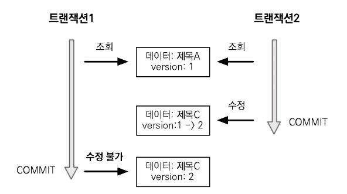
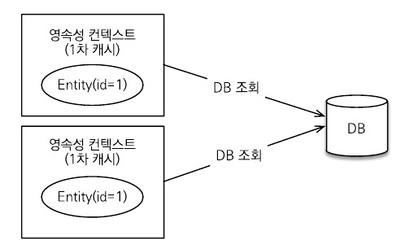
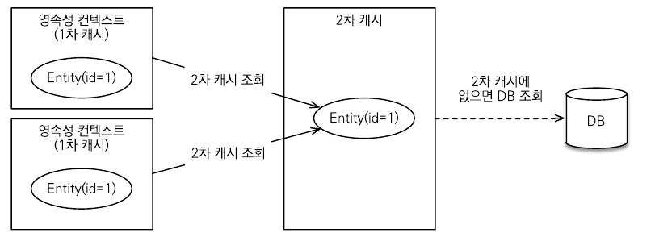
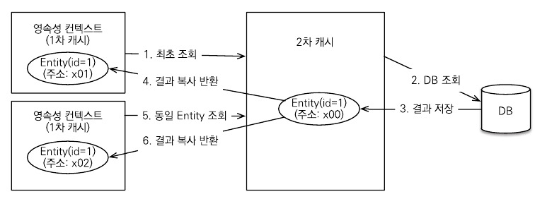

# 16.1  트랜잭션과 락

## 16.1.1 트랜잭션과 격리수준

트랜잭션은 ACID라 하는 원자성, 일관성, 격리성, 지속성을 보장해야 한다.

- 원자성(Atomicity) : 트랜잭션 내에서 실행된 작업들은 마치 하나의 작업처럼 모두 성공하거나 모두 실패해야 한다.
- 일관성(Consistency) : 데이터베이스에서 정한 무결성 제약조건을 항상 만족해야 한다.
- 격리성(Isolation) ****: 동시에 실행되는 트랜잭션들이 서로에게 영향을 미치지 않도록 격리한다. 예를 들어, 동시에 데이터를 수정하지 못하도록 한다.
- 지속성(Durability) : 트랜잭션을 성공적으로 끝내면 그 결과가 항상 기록되어야 한다.

트랜잭션은 원자성,일관성,지속성을 보장한다. 문제는 격리성인데 트랜잭션 간에 격리성을 완벽히 보장하려면 트랜잭션을 거의 차례대로 실행해야 한다. 이렇게 하면 동시성 처리 성능이 매우 나빠진다. 이런 문제로 인해 ANSI 표준은 트랜잭션의 격리 수준을 4단계로 나누어 정의했다.

아래로 갈수록 격리수준이 높아진다. 격리 수준이 낮을수록 동시성은 증가하지만 격리 수준에 따른 다양한 문제가 발생한다.

- READ UNCOMMITED
    - DIRTY READ : 다른 트랜잭션이 수정 중일 때 해당 데이터를 조회할 수 있다.
- READ COMMITED : 다른 사용자가 데이터를 변경하는 동안 사용자는 데이터를 읽을 수 없다.
    - NON-REPEATABLE READ : 선행 트랜잭션이 조회하는 중에 후행 트랜잭션이 수정하고 커밋하면 선행 트랜잭션이 다시 조회했을 때 수정된 데이터가 조회된다.
- REPEATABLE READ : 선행 트랜잭션이 조회한 데이터는 트랜잭션이 종료될때까지 후행 트랜잭션은 수정,삭제가 불가능하다.
    - PHANTOM READ : 반복 조회 시 결과 집합이 달라진다.
- SERIALIZABLE : 동일한 데이터에 대해서 두 개의 트랜잭션이 수행될 수 없다.

애플리케이션 대부분은 동시성 처리가 중요하므로 보통 READ COMMITED를 기본으로 사용한다.

## 16.1.2 낙관적 락과 비관적 락

JPA의 영속성 컨텍스트를 적절히 활용하면 데이터베이스의 격리수준이 READ COMMITED어도 애플리케이션 레벨에서 반복 가능한 읽기가 가능하다.

트랜잭션 격리 수준이 READ COMMITTED일 때 일부 로직에서 더 높은 격리 수준이 필요하면 낙관적 락과 비관적 락 중 하나를 사용해야 한다.

### 낙관적 락

낙관적 락은 이름 그대로 트랜잭션 대부분은 충돌이 발생하지 않는다고 낙관적으로 가정하는 방법이다. 애플리케이션, JPA가 제공하는 버전 관리 기능을 사용한다. 트랜잭션을 커밋하기 전까지는 트랜잭션의 충돌을 알 수 없다.

### 비관적 락

비관적 락은 이름 그대로 트랜잭션의 충돌이 발생한다고 가정하고 우선 락을 걸고 보는 방법이다. 데이터베이스에서 제공하는 락 기능을 사용한다.

### second lost updates problem (두 번의 갱신 분실 문제)

사용자 A,B가 동시에 이름을 수정하는 중에 사용자 A가 먼저 수정완료 버튼을 누르고, 후에 사용자 B가 버튼을 누른다면 A의 수정사항은 사라지고 B의 수정사항만 남게 된다.

두 번의 갱신 분실 문제는 데이터베이스 트랜잭션의 범위를 넘어선다. 따라서 트랜잭션만으로는 문제 해결을 할 수 없고 3가지 선택 방법이 있다.

- 마지막 커밋만 인정하기 : 마지막에 커밋한 사용자 B의 내용만 인정
- 최초 커밋만 인정하기 : 먼저 수정한 사용자 A의 내용이 수정되고 B는 오류가 발생한다.
- 충돌하는 갱신 내용 병합하기 : A,B의 내용을 병합

기본은 마지막 커밋만 인정하기가 사용된다. 하지만 상황에 따라 최초 커밋만 인정하기가 더 합리적일 수 있다.

## 16.1.3 @Version

JPA가 제공하는 낙관적 락을 사용하려면 @Version 어노테이션을 사용해서 버전 관리 기능을 추가해야 한다.

@Version 적용 가능 타입

- Long (long)
- Integer (int)
- Shoort (short)
- Timestamp

다음은 엔티티에 버전 관리를 추가하는 예제이다.

```java
@Entity
public class Board {

	@Id
	private String id;
	private String title;

	@Version
	private Integer version;
}
```

이제부터 엔티티를 수정할 때 마다 버전이 하나씩 자동으로 증가한다. 그리고 엔티티를 수정할 때 조회 시점의 버전과 수정 시점의 버전이 다르면 예외가 발생한다.

다음은 버전 관리 사용 예제이다.

```java
// 트랜잭션 1 조회 title="제목A", version=1
Board board = em.find(Board.class, id);

// 트랜잭션 2에서 해당 게시물을 수정해서 title="제목C", version=2로 증가

board.setTitle("제목B"); // 트랜잭션 1 데이터 수정

save(board);
tx.commit(); //예외 발생, 데이터베이스 version=2, 엔티티 version=1
```

트랜잭션1이 데이터를 제목 B로 변경하고 트랜잭션을 커밋하는 순간 엔티티를 조회할 때 버전과 데이터베이스의 현재 버전 정보가 다르므로 예외가 발생한다. 따라서 버전 정보를 사용하면 최초 커밋만 인정하기가 적용된다.



그림 16.1 Version

@Version으로 추가한 버전 관리 필드는 JPA가 직접 관리하므로 개발자가 임의로 수정하면 안 된다(벌크 연산 제외) 만약 버전 값을 강제로 증가 하려면 특별한 락 옵션을 선택하면 된다.

## 16.1.4 JPA 락 사용

JPA를 사용할 때 추천하는 전략은 READ COMMITTED 트랜잭션 격리 수준 + 낙관적 버전 관리다. (두 번의 갱신 내역 분실 문제 예방)

락은 다음 위치에 적용할 수 있다.

- EntityManager.lock(), EntityManager.find(), EntityManager.refresh()
- Query.setLockMode() (TypeQuery 포함)
- @NamedQuery

JPA가 제공하는 락 옵션은 javax.persistence.LockModeType에 정의되어 있다.

### LcokModeType 속성

| 락모드 | 타입 | 설명 |
| --- | --- | --- |
| 낙관적 락 | OPTIMISTIC | 낙관적 락을 사용한다 |
| 낙관적 락 | OPTIMISTIC_FORCE_INCREMENT | 낙관적 락 + 버전정보를 강제로 증가한다 |
| 비관적 락 | PESSIMISTIC_READ | 비관적 락, 읽기 락을 사용한다 |
| 비관적 락 | PESSIMISTIC_WRITE | 비관적 락, 쓰기 락을 사용한다. |
| 비관적 락 | PESSIMISTIC_FORCE_INCREMENT | 비관적 락 + 버전정보를 강제로 증가한다 |
| 기타 | NONE | 락을 걸지 않는다 |
| 기타 | READ | JPA1.0 호환 기능이다. OPTIMISTIC과 같으므로 OPTIMISTIC을 사용하면 된다. |
| 기타 | WRITE | JPA1.0 호환 기능이다. OPTIMISTIC_FORCE_INCREMENT와 같다 |

## 16.1.5 JPA 낙관적 락

낙관적 락을 사용하려면 버전이 있어야 한다. 낙관적 락은 트랜잭션을 커밋하는 시점에 충돌을 알 수 있다는 특징이 있다. 낙관적 락의 옵션에 따른 효과를 하나씩 알아보자

### NONE

락 옵션을 적용하지 않아도 엔티티에 @Version이 적용된 필드만 있으면 낙관적 락이 적용된다.

- 용도 : 조회한 엔티티를 수정할 때 다른 트랜잭션에 의해 변경(삭제)되지 않아야 한다. 조회 시점부터 수정 시점까지를 보장한다
- 동작 : 엔티티를 수정할 때 버전을 체크하면서 버전을 증가한다.(UPDATE 쿼리 사용)
- 이점 : 두 번의 갱신 분실 문제를 예방한다.

### OPTIMISTIC

@Version만 적용했을 때는 엔티티를 수정해야 버전을 체크하지만 이 옵션을 추가하면 엔티티를 조회만 해도 버전을 체크한다. 한 번 조회한 엔티티는 트랜잭션을 종료할 때까지 다른 트랜잭션에서 변경되지 않음을 보장한다.

- 용도 : 조회 시점부터 트랜잭션이 끝날 때까지 조회한 엔티티가 변경되지 않음을 보장한다
- 동작 : 트랜잭션을 커밋할 때 버전 정보를 조회해서 현재 엔티티의 버전과 같은지 검증한다. 만약 같지 않으면 예외가 발생한다.
- 이점 : OPTIMISTIC 옵션은 DIRTY READ와 NON-REPEATABLE READ를 방지한다.

### OPTIMISTIC_FORCE_INCREMENT

- 용도 : **논리적인 단위의 엔티티 묶음을 관리할 수 있다.** 게시물과 첨부파일이 일대다, 다대일의 양방향 연관관계이고 첨부파일이 연관관계의 주인이다. 게시물을 수정하는 데 단순히 첨부파일만 추가하면 게시물의 버전은 증가하지 않는다. 이때 게시물의 버전도 강제로 증가하려면 OPTIMISTIC_FORCE_INCREMENT를 사용하면 된다.
- 동작 : 트랜잭션을 커밋할 때 UPDATE 쿼리를 사용해서 버전 정보를 강제로 증가시킨다. 추가로 엔티티를 수정하면 수정 시 버전 UPDATE가 발생한다. **따라서 총 2번의 버전 증가가 나타날 수 있다.**
- 이점 : 강제로 버전을 증가해서 논리적인 단위의 엔티티 묶음을 버전 관리할 수 있다.

## 16.1.6JPA 비관적 락

JPA가 제공하는 비관적 락은 데이터베이스 트랜잭션 락 메커니즘에 의존하는 방법이다. 주로 SQL 쿼리에 SELECT FOR UPDATE 구문을 사용하면서 시작하고 버전 정보는 사용하지 않는다.

### 비관적 락은 다음과 같은 특징이 있다.

- 엔티티가 아닌 스칼라 타입을 조회할 때도 사용할 수 있다.
- 데이터를 수정하는 즉시 트랜잭션 충돌을 감지할 수 있다.

### PESSIMISTIC_WRITE

비관적 락이라고 하면 일반적으로 이 옵션을 뜻한다. 데이터베이스에 쓰기 락을 걸 때 사용한다.

- 용도 : 데이터베이스에 쓰기 락을 건다
- 동작 : 데이터베이스 select for update를 사용해서 락을 건다.
- 이점 : NON-REPEATABLE READ를 방지한다. 락이 걸린 로우는 다른 트랜잭션이 수정할 수 없다.

### PESSIMISTIC_READ

- 데이터를 반복 읽기만 하고 수정하지 않는 용도로 락을 걸 때 사용한다. 데이터베이스 대부분은 PESSIMISTIC_WRITE로 동작한다.
- MySQL : lock in share mode
- PostgreSQL : for share

### PESSIMISTIC_FORCE_INCREMENT

비관적 락중 유일하게 버전 정보를 사용한다. 하이버네이트는 nowait를 지원하는 데이터베이스에 대해서 for update nowait 옵션을 적용한다.

- 오라클 : for update nowait
- PostreSQL : for update nowait
- nowait를 지원하지 않으면 for update가 사용된다.

## 16.1.7 비관적 락과 타임아웃

비관적 락을 사용하면 락을 획득할 때까지 트랜잭션이 대기한다. 무한정 기다릴 수는 없으므로 타임아웃 시간을 줄 수 있다. 다음 예제는 10초간 대기해서 응답이 없으면 예외가 발생한다.

```java
Map<String, Object> properties = new HashMap<String, Object>();

properties.put("javax.persistence.lock.timeout", 10000);

Board board = em.find(Board.class, "boardId",
											LockModeType.PESSIMISTIC_WRITE, properties);
```

# 16.2 2차 캐시

## 16.2.1 1차 캐시와 2차 캐시

영속성 컨텍스트로 얻을 수 있는 이점이 많지만, 일반적인 웹 애플리케이션 환경은 트랜잭션을 시작하고 종료할 때까지만 1차 캐시가 유효하다. OSIV를 사용해도 클라이언트의 요청이 들어올 때부터 끝날 때까지만 1차 캐시가 유효하다. 따라서 애플리케이션 전체로 보면 데이터베이스 접근 횟수를 획기적으로 줄이지는 못한다.

하이버네이트를 포함한 대부분의 JPA 구현체들은 애플리케이션 범위의 캐시를 지원하는데 이것을 공유 캐시 또는 2차 캐시라고 한다. 이런 2차 캐시를 활용하면 애플리케이션 조회 성능을 향상할 수 있다.



그림 16.2 2차 캐시 적용 전



그림 16.3 2차 캐시 적용 후

### 1차 캐시

1차 캐시는 영속성 컨텍스트 내부에 있다. 엔티티 매니저로 조회하거나 변경하는 모든 엔티티는 1차 캐시에 저장된다. 트랜잭션을 커밋하거나 플러시를 호출하면 1차 캐시에 있는 엔티티의 변경 내역을 데이터베이스에 동기화 한다. 1차 캐시는 끄고 켤 수 있는 옵션이 아니다. 영속성 컨텍스트 자체가 사실상 1차 캐시이다.

1차 캐시의 특징은 다음과 같다.

- 1차 캐시는 같은 엔티티가 있으면 해당 엔티티를 그대로 반환한다. 따라서 1차 캐시는 객체 동일성을 보장한다.
- 1차 캐시는 기본적으로 영속성 컨텍스트 범위의 캐시이다.

### 2차 캐시

2차 캐시는 애플리케이션 범위의 캐시이다. 따라서 애플리케이션을 종료할 때까지 캐시가 유지된다. 분산 캐시나 클러스터링 환경의 캐시는 애플리케이션보다 더 오래 유지될 수도 있다. 2차 캐시를 적절히 활용하면 데이터베이스 조회 횟수를 획기적으로 줄일 수 있다.



그림 16.4 2차 캐시 동작 방식

2차 캐시는 동시성을 극대화하려고 캐시한 객체를 직접 반환하지 않고 복사본을 만들어서 반환한다. 만약 캐시한 객체를 그대로 반환하면 여러 곳에서 같은 객체를 동시에 수정하는 문제가 발생할 수 있다. 이 문제를 해결하려면 객체에 락을 걸어야 하는데 이렇게 하면 동시성이 떨어질 수 있다.

2차 캐시의 특징은 다음과 같다.

- 2차 캐시는 영속성 유닛 범위의 캐시이다.
- 2차 캐시는 조회한 객체를 그대로 반환하는 것이 아니라 복사본을 만들어서 반환한다.
- 2차 캐시는 데이터베이스 기본 키를 기준으로 캐시하지만 영속성 컨텍스트가 다르면 객체 동일성을 보장하지 않는다.

## 16.2.2 JPA 2차 캐시 기능

### 캐시 모드 설정

2차 캐시를 사용하려면 javax.persistence.Cacheable 어노테이션을 사용하면 된다.

다음은 캐시 모드를 설정하는 예제이다.

```java
@Cacheable
@Entity
public class Member {
	@Id @GeneratedValue
	private Long id;
	...
}
```

다음 예제와 같이 persistence.xml에 shared-cache-mode를 설정해서 애플리케이션 전체에 캐시를 어떻게 적용할지 옵션을 설정해야 한다.

```java
<persistence-unit name="test">
	<shared-cache-mode>ENABLE_SELECTIVE</shared-cache-mode>
</persistence-unit>
```

### 캐시 조회, 저장 방식 설정

캐시를 무시하고 데이터베이스를 직접 조회하거나 캐시를 갱신하려면 캐시 조회 모드와 캐시 보관 모드를 사용하면 된다.

캐시 조회 모드는 다음과 같다.

- USE: 캐시에서 조회한다. 기본값이다.
- BYPASS: 캐시를 무시하고 데이터베이스에 직접 접근한다.

캐시 보관 모드는 다음과 같다.

- USE: 조회한 데이터를 캐시에 저장한다. 조회한 데이터가 이미 캐시에 있으면 캐시 데이터를 최신 상태로 갱신하지는 않는다. 트랜잭션을 커밋하면 등록 수정한 엔티티도 캐시에 저장한다. 기본값이다.
- BYPASS: 캐시에 저장하지 않는다.
- REFRESH: USE 전략에 추가로 데이터베이스에서 조회한 엔티티를 최신 상태로 다시 캐시한다.

### JPA 캐시 관리 API

JPA는 캐시를 관리하기 위한 인터페이스를 제공한다. 

```java
public interface Cache {
	// 해당 엔티티가 캐시에 있는지 여부 확인
	public boolean contains(Class cls, Object primaryKey);
	
	// 해당 엔티티 중 특정 식별자를 가진 엔티티를 캐시에서 제거
	public void evict(Class cls, Object primaryKey);
	
	// 해당 엔티티 전체를 캐시에서 제거
	public void evict(Class cls);
	
	// 모든 캐시 데이터 제거
	public void evictAll();
	
	// JPA Cache 구현체 조회
	public <T> T unwrap(Class<T> cls);
}
```

## 16.2.3 하이버네이트와 EHCACHE 적용

하이버네이트가 지원하는 캐시는 크게 3가지가 있다.

1. 엔티티 캐시 : 엔티티 단위로 캐시한다. 식별자로 엔티티를 조회하거나 컬렉션이 아닌 연관된 엔티티를 로딩할 때 사용한다.
2. 컬렉션 캐시 : 엔티티와 연관된 컬렉션을 캐시한다. 컬렉션이 엔티티를 담고 있으면 식별자 값만 캐시한다(하이버네이트 기능)
3. 쿼리 캐시 : 쿼리와 파라미터 정보를 키로 사용해서 캐시한다. 결과가 엔티티면 식별자 값만 캐시한다.(하이버네이트 기능)

다음은 캐시 적용의 예제이다.

```
@Cacheable
@Cache(usage = CacheConcurrencyStrategy.READ_WRITE)
@Entity
public class ParentMember {

	@Id @GeneratedValue
	private Long id;
	private String name;

	@Cache(usage = CacheConcurrencyStrategy.READ_WRITE)
	@OneToMany(mappedBy = "parentMember", cascade = CascadeType.ALL)
	private List<ChildMember> childMembers;
}
```

### @Cache

다음은 하이버네이트 @Cache의 속성이다.

| 속성 | 설명 |
| --- | --- |
| usage | CacheConcurrencyStrategy를 사용해서 캐시 동시성 전략을 설정한다. |
| region | 캐시 지역 설정 |
| include | 연관 객체를 캐시에 포함할지 선택한다. all, non-lazy 옵션을 선택할 수 있다. |

다음은 CacheConcurrencyStategy의 속성이다.

| 속성 | 설명 |
| --- | --- |
| NONE | 캐시를 설정하지 않는다. |
| READ_ONLY | 읽기 전용으로 설정한다. 등록, 삭제는 가능하지만 수정은 불가능하다. 참고로 읽기 전용인 불변 객체는 수정되지 않으므로 하이버네이트는 2차 캐시를 조회할 때 객체를 복사하지 않고 원본 객체를 반환한다. |
| NONSTRICT_READ_WRITE | 엄격하지 않은 읽고 쓰기 전략이다. 동시에 같은 엔티티를 수정하면 데이터 일관성이 깨질 수 있다. EHCACHE는 데이터를 수정하면 캐시 데이터를 무효화한다. |
| READ_WRITE | 읽기 쓰기가 가능하고 READ COMMITTED 정도의 격리 수준을 보장한다. EHCACHE는 데이터를 수정하면 캐시 데이터도 같이 수정한다. |
| TRANSACTIONAL | 컨테이너 관리 환경에서 사용할 수 있다. 설정에 따라 REPEATABLE READ 정도의 격리 수준을 보장받을 수 있다. |

### 쿼리 캐시

쿼리 캐시는 쿼리와 파라미터 정보를 키로 사용해서 쿼리 결과를 캐시하는 방법이다. 쿼리 캐시를 적용하려면 유닛을 설정에 hibernate.cache.use_query_cache 옵션을 꼭 true로 설정해야 한다.

다음은 쿼리 캐시를 적용한 예제이다.

```java
// 쿼리 캐시 적용
em.createQuery("select i from Item i", Item.class)
		.setHint("org.hibernate.cacheable", true)
		.getResultList();
```

다음은 NamedQuery에 쿼리 캐시를 적용한 예제이다.

```java
// NamedQuery에 쿼리 캐시 적용
@Entity
@NamedQuery(
				hints = @QueryHint(name = "org.hibernate.cacheable",
					value = "true"),
				name = "Member.findByUsername",
				query = "select m.address from Member m where m.name = :username"
)
public class Member {
	...
}
```

### 쿼리 캐시 영역

hibernate.cache.use_query_cache 옵션을 true로 설정해서 쿼리 캐시를 활성화하면 다음 두 캐시 영역이 추가된다.

- org.hibernate.cache.internal.StandardCache: 쿼리 캐시를 저장하는 영역이다. 이곳에는 쿼리, 쿼리 결과 집합, 쿼리를 실행한 시점의 타임스탬프를 보관한다.
- org.hibernate.cache.spi.UpdateTimestampsCache : 쿼리 캐시가 유효한지 확인하기 위해 쿼리 대상 테이블의 가장 퇴근 변경 시간을 저장하는 영역이다.

쿼리 캐시는 캐시한 데이터 집합을 최신 데이터로 유지하려고 쿼리 캐시를 실행하는 시간과 쿼리 캐시가 사용하는 테이블들이 가장 퇴근에 변경된 시간을 비교한다. 쿼리 캐시가 사용하는 테이블에 조금이라도 변경이 있으면 데이터베이스에서 데이터를 읽어 와서 쿼리 결과를 다시 캐시한다.

쿼리 캐시를 잘 활용하면 극적인 성능 향상이 있지만 빈번하게 변경이 있는 테이블에 사용하면 오히려 성능이 더 저하된다. 따라서 수정이 거의 일어나지 않는 테이블에 사용해야 효과를 볼 수 있다.

### **쿼리 캐시와 컬렉션 캐시의 주의점**

엔티티 캐시를 사용해서 엔티티를 캐시하면 엔티티 정보를 모두 캐시 하지만 쿼리 캐시와 컬렉션 캐시는 결과 집합의 식별자 값만 캐시한다. 문제는 쿼리 캐시나 컬렉션 캐시만 사용하고 대상 엔티티에 엔티티 캐시를 적용하지 않으면 성능상 심각한 문제가 발생할 수 있다.

1. select m from Member m 쿼리를 실행 했는데 쿼리 캐시가 적용되어 있다. 결과 집합은 100건이다.
2. 결과 집합에는 식별자만 있으므로 한 건씩 엔티티 캐시 영역에서 조회한다.
3. Member 엔티티는 엔티티 캐시를 사용하지 않으므로 한 건씩 데이터베이스에서 조회한다.
4. 결국 100건의 SQL이 실행된다.

따라서 쿼리 캐시나 컬렉션 캐시를 사용하면 결과 대산 엔티티에는 꼭 엔티티 캐시를 적용해야 한다.

### **정리**

- 트랜잭션의 격리 수준은 4단계가 있다. 격리 수준이 낮을수록 동시성은 증가하지만 격리 수준에 따른 다양한 문제가 발생한다.
- 영속성 컨텍스트는 데이터베이스 트랜잭션이 READ COMMITTED 격리 수준이어도 애플리케이션 레벨에서 반복 가능한 읽기(REPEATABLE READ)를 제공한다.
- JPA는 낙관적 락과 비관적 락을 지원한다. 낙관적 락은 애플리케이션이 지원하는 락이고, 비관적 락은 데이터베이스 트랜잭션 락 메커니즘에 의존한다.
- 2차 캐시를 사용하면 애플리케이션의 조회 성능 극적으로 끌어올릴 수 있다.