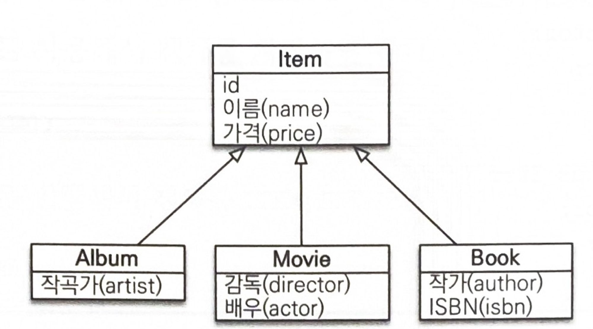
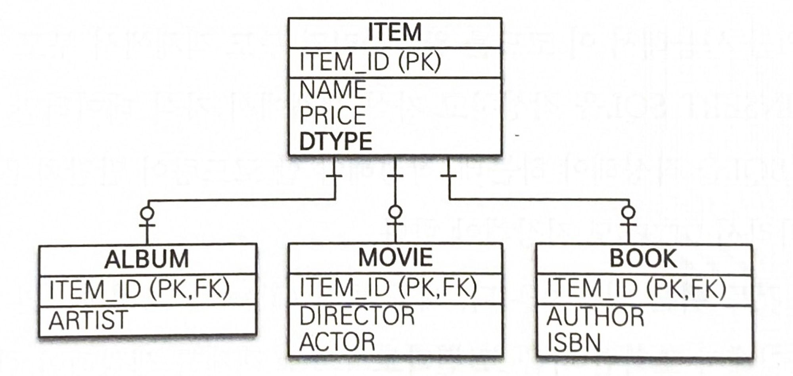
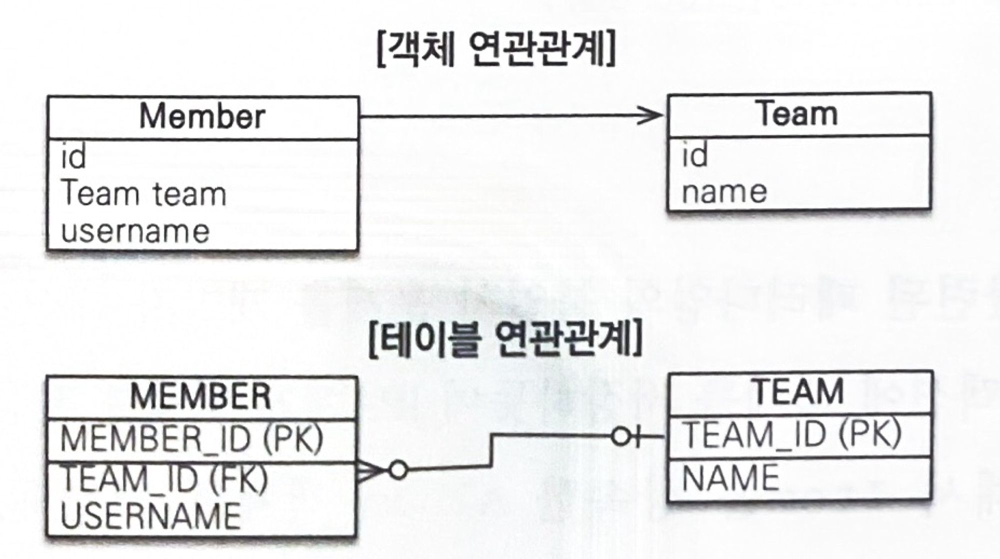
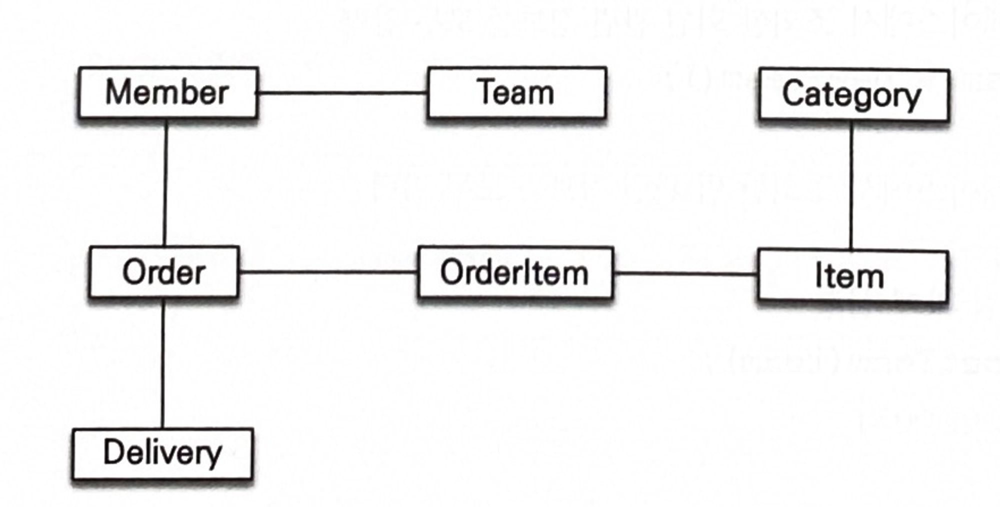
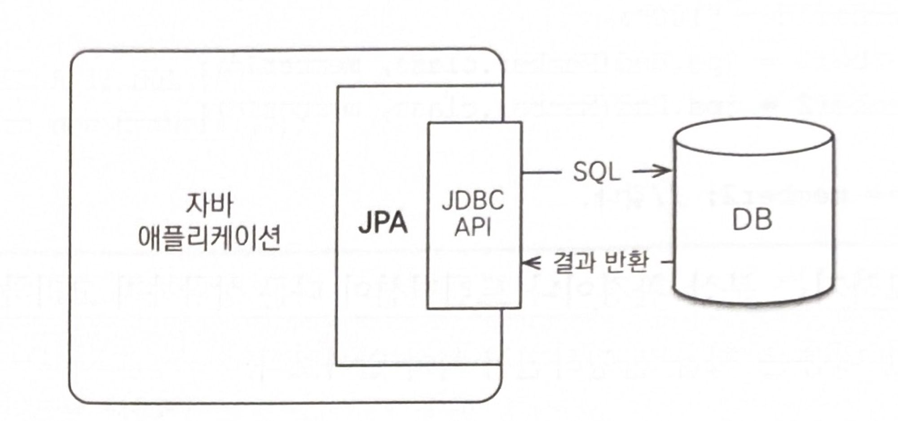
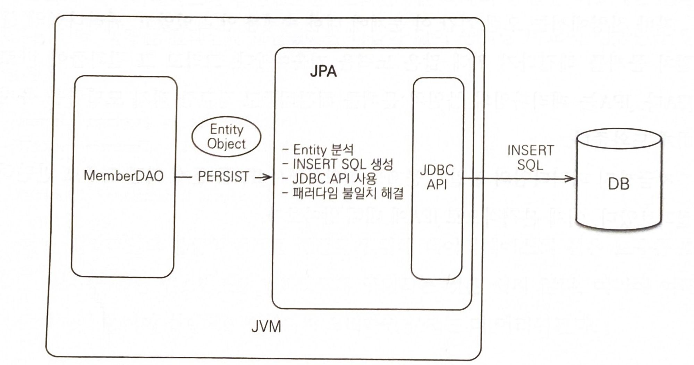

자바 애플리케이션을 개발할 때 개발자들은 일반적으로 관계형 데이터베이스 저장소를 사용한다.  이러한 경우 개발자들은 SQL을 직접 작성하여 관계형 데이터베이스에 데이터를 저장, 수정, 삭제 하는 과정들을 진행한다. 이런 과정은 너무 지루하고 비생산적이다. 또한 객체와 관계형 데이터베이스의 패러다임 불일치로 많은 문제점이 발생한다. 이번 챕터에서는 개발자가 SQL을 직접 다룰 때 어떤 문제가 발생하는지, 객체와 관계형 데이터베이스 사이에는 어떤 차이가 있는지 알아보겠다.

# 1.1 SQL을 직접 다룰 때 발생하는 문제점

관계형 데이터베이스는 가장 대중적이고 신뢰할 만한 안전한 데이터 저장소다. 그래서 자바로 개발하는 애플리케이션은 대부분 관계형 데이터베이스를 저장소로 사용한다.

이러한 데이터베이스에 데이터를 관리하려면 SQL을 사용해야 하는데 자바로 개발하는 애플리케이션은 JDBC API를 사용해서 SQL을 데이터베이스로 전달한다.

하지만 직접 SQL을 사용해서 데이터베이스를 관리하게 되면 많은 문제점이 발생한다. 이번 챕터에서는 이러한 문제점들과 이를 해결해준 JPA에 대해 알아보겠다.

## 1.1.1 끊임없는 반복

SQL을 직접 다룰 때의 문제점을 알아보기 위해 자바와 관계형 데이터베이스를 사용해서 회원 관리 기능을 구현해보았다.

회원을 CRUD하는 기능을 개발하려면 먼저 예제 1.1과 같은 회원 객체가 필요하고 데이터베이스 관리 목적으로 예제 1.2과 같은 회원 DAO가 필요하다.

```java
public class Member {
	private String memberId;
	private String name;
}
```

```java
public calss MemberDAO {
	
	public Member find(String memberId){...}
}
```

### 회원 조회 기능

MemberDAO의 find() 메소드를 완성해서 회원을 조회하는 기능을 개발하려면 다음 순서로 진행된다.

1. 회원 조회용 SQL을 작성한다.
    
    ```java
    String sql = "SELECT MEMBER_ID, NAME FROM MEMBER M WHERE MEMBER_ID = ?";
    ```
    
2. JDBC API를 사용해서 SQL을 실행한다.
    
    ```java
    ResultSet rs = stmt.executeQuery(sql);
    ```
    
3. 조회 결과를 Member 객체로 매핑한다.
    
    ```java
    String memberId = rs.getString("MEMBER_ID");
    String name = rs.getString("NAME");
    
    Member member = new Member();
    member.setMemberId(memberId);
    member.setName(name);
    ```
    

### 회원 등록 기능

예제 1.2에 회원을 등록하는 save() 메소드를 추가하여 만들어보자.

```java
public calss MemberDAO {
		
	public Member find(String memberId){...}
	public void save(Member member){...} //추가
}
```

MemberDAO의 save() 메소드를 완성해서 회원을 조회하는 기능을 개발하려면 다음 순서로 진행된다.

1. 회원 등록용 SQL을 작성한다.
    
    ```java
    String sql = "INSERT INTO MEMBER(MEMBER_ID, NAME) VALUES(?,?)";
    ```
    
2. 회원 객체의 값을 꺼내서 등록 SQL에 전달한다.
    
    ```java
    pstmt.setString(1, member.getMemberId());
    pstmt.setString(2, member.getName());
    ```
    
3. JDBC API를 사용해서 SQL을 실행한다.
    
    ```java
    pstmt.executeUpdate(sql);
    ```
    

직접 SQL을 사용해서 회원을 조회하는 기능과 등록하는 기능을 만들어 보았다. 회원을 수정하고 삭제하는 기능도 이와 비슷하게 SQL을 작성하고 JDBC API를 사용하는 일을 반복해야 할 것이다.

회원 객체를 데이터베이스가 아닌 자바 컬렉션에 보관한다면 다음 한 줄로 객체를 저장할 수 있다.

```java
list.add(member);
```

하지만 데이터베이스는 객체 구조와는 다른 데이터 중심의 구조를 가지므로 객체를 데이터베이스에 직접 저장하거나 조회할 수는 없다. 따라서 개발자가 객체지향 애플리케이션과 데이터베이스 중간에서 SQL과 JDBC API를 사용해서 변환 작업을 직접 해주어야 한다.

문제는 객체를 데이터베이스에 CRUD하려면 너무 많은 SQL과 JDBC API를 코드로 작성해야 한다. 이런 과정을 테이블마다 해주어야 하니 개발자는 무수히 많은 SQL을 작성해야 하고 반복해야 한다. 

## 1.1.2 SQL에 의존적인 개발

앞에서 만든 회원 객체를 관리하는 MemberDAO를 완성하고 애플리케이션의 나머지 개발도 완료했다. 그런데 갑자기 회원의 연락처도 함께 저장해달라는 요구사항이 추가되었다. 개발자는 요구사항에 맞춰 코드를 수정해야 한다.

먼저 회원의 연락처를 추가하려고 예제 1.4와 같이 회원 객체에 연락처 필드를 추가하였다.

```java
public class Member {
	private String memberId;
	private String name;
	private String tel;
}
```

다음은 연락처를 저장할 수 있도록 MemberDAO를 수정해야 한다. 회원 등록 기능만 수정해보겠다.

1. 연락처를 저장할 수 있도록 INSET SQL을 수정한다.
    
    ```java
    String sql = "INSERT INTO MEMBER(MEMBER_ID, NAME, TEL) VALUES(?, ?, ?)";
    ```
    
2. 회원 객체의 연락처 값을 꺼내서 등록 SQL에 전달한다.
    
    ```java
    pstmt.setString(1, member.getMemberId());
    pstmt.setString(2, member.getName());
    pstmt.setString(3, member.getTel()); //추가
    ```
    

다른 기능들도 이와 같이 SQL과 JDBC API를 수정하고 연락처가 잘 저장되는지 테스트해야 한다.

회원 객체에 연락처를 추가하여 개발을 완료하였다. 그런데 예제 1.5와 같이 회원은 어떤 한 팀에 필수로 소속되어야 한다는 요구사항이 추가되었다. 

```java
public class Member {
	private String memberId;
	private String name;
	private String tel;
	private Team team;
}

public class Team {
	private String teamName;
}
```

연관된 팀을 추가한 Member 객체를 조회하면 팀이 제대로 조회되지 않을 것이다. MemberDAO의 find() 메소드의 SQL은 팀을 조회하는 부분이 없기 때문이다. 멤버와 팀을 같이 조회하는 SQL을 사용하는 새로운 메소드를 작성해야 한다.

이와 같이 엔티티의 내용이 변경될 때마다 개발자는 DAO를 열어서 어떤 SQL이 실행되고 어떤 객체들이 함께 조회되는지 일일이 확인해야 한다. 이것은 진정한 의미의 계층 분할이 아니다. 물리적으로 SQL과 JDBC API를 데이터 접근 계층에 숨기는 데 성공했을지는 몰라도 논리적으로는 엔티티와 아주 강한 의존관계를 갖고 있다. 이런 강한 의존관계 때문에 회원을 조회할 때는 물론이고 회원 객체에 필드를 하나 추가할 때도 DAO의 CRUD 코드와 SQL 대부분을 변경해야 하는 문제가 발생한다.

## 1.1.3 JPA와 문제 해결

JPA를 사용하면 객체를 데이터베이스에 저장하고 관리할 때, 개발자가 직접 SQL을 작성하는 것이 아니라 JPA가 제공하는 API를 사용하면 된다. 그러면 JPA가 개발자 대신에 적절한 SQL을 생성해서 데이터베이스에 전달한다.

JPA가 제공하는 CRUD API를 간단히 알아보자.

### 저장 기능

```java
jpa.persist(member); // 저장
```

persist() 메소드는 객체를 데이터베이스에 저장한다. 이 메소드를 호출하면 JPA가 객체와 매핑정보를 보고 적절한 INSERT SQL을 생성해서 데이터베이스에 전달한다.

### 조회 기능

```java
String memberId = "helloId";
Member member = jpa.find(Member.class, memberId); // 조회
```

find() 메소드는 객체 하나를 데이터베이스에서 조회한다. JPA는 객체와 매핑정보를 보고 적절한 SELECT SQL을 생성해서 데이터베이스에 전달하고 그 결과로 Member 객체를 반환한다.

### 수정 기능

```java
Member member = jpa.find(Member.class, memberId);
member.setName("이름변경"); // 수정
```

JPA는 별도의 수정 메소드를 제공하지 않는다. 대신에 객체를 조회해서 값을 변경하면 트랜잭션을 커밋할 때 데이터베이스에 적절한 UPDATE SQL이 전달된다.

### 연관된 객체 조회

```java
Member member = jpa.find(Member.class, memberId);
Team team = member.getTeam(); // 연관된 객체 조회
```

JPA는 연관된 객체를 사용하는 시점에 적절한 SELECT SQL을 실행한다. 따라서 JPA를 사용하면 연관된 객체를 마음껏 조회할 수 있다.

위와 같이 JPA의 CRUD API를 간단히 알아보았는데 개발자가 직접 SQL을 사용한 것보다 매우 간단하고 편리하게 사용할 수 있다.

다음은 객체와 관계형 데이터베이스의 패러다임 차이 때문에 발생하는 다양한 문제를 살펴보고 JPA는 이러한 문제들을 어떻게 해결하는지 알아보자.

# 1.2 패러다임의 불일치

애플리케이션은 발전하면서 그 내부의 복잡성도 점점 커진다. 객체지향 프로그래밍은 추상화, 캡슐화, 정보은닉, 상속, 다형성 등 시스템의 복잡성을 제어할 수 있는 다양한 장치들을 제공한다. 그래서 현대의 애플리케이션들은 객체지향 언어 위주로 발전해왔다.

하지만 관계형 데이터베이스는 데이터 중심으로 구조화되어 있고 집합적인 사고를 요구한다. 그리고 객제지향에서 이야기하는 추상화, 상속, 다형성 같은 개념이 없다.

객체와 관계형 데이터베이스는 지향하는 목적이 서로 달라 둘의 기능과 표현 방법도 다르다. 이것을 객체와 관계형 데이터베이스의 패러다임 불일치 문제라고 한다. 따라서 객체 구조를 테이블 구조에 저장하는 데는 한계가 있다.

애플리케이션은 객체지향 언어로 개발하고 데이터는 관계형 데이터베이스에 저장해야 한다면, 패러다임의 불일치 문제를 개발자가 중간에서 해결해야 한다. 이런 문제를 해결하는 데는 너무 많은 시간과 코드를 소비해야 한다. 그래서 1.2절에서는 패러다임 불일치로 인해 발생하는 문제와 JPA를 통한 해결책을 알아보고자 한다.

## 1.2.1 상속

그림 1.1처럼 객체는 상속이라는 기능을 가지고 있지만 테이블은 상속이라는 기능이 없다.



그림 1.1 객체 상속 모델

그나마 데이터베이스 모델링에서 이야기하는 슈퍼타입 서브타입 관계를 사용하면 객체 상속과 가장 유사한 형태로 테이블을 설계할 수 있다. 그림 1.2에서 ITEM 테이블의 DTYPE 칼럼을 사용해서 어떤 자식 테이블과 관계가 있는지 정의할 수 있다.



그림 1.2 테이블 모델

객체 모델 코드는 예제 1.6과 같다.

```java
abstract class Item {
	Long id;
	String name;
	int price;
}

class Album extends Item {
	String artist;
}

class Movie extends Item {
	String director;
	String actor;
}

class Book extends Item {
	String author;
	Strikng isbn;
}
```

Album 객체를 저장하려면 이 객체를 분해해서 다음 두 SQL을 만들어야 한다.

```sql
INSERT INTO ITEM ...
INSERT INTO ALBUM ...
```

Movie와 Book도 마찬가지다.

JDBC API를 사용해서 이 코드를 완성하려면 부모 객체에서 부모 데이터만 꺼내서 ITEM용 INSERT SQL을 작성하고 자식 객체에서 자식 데이터만 꺼내서 ALBUM용 INSERT SQL을 작성해야 하는데, 작성해야 할 코드량이 만만치 않다. 그리고 자식 타입에 따라서 DTYPE도 지정해야 한다. 조회도 ITEM과 ALBUM 테이블을 조인해서 조회한 다음 그 결과로 Album 객체를 생성해야 한다.

이런 과정이 모두 패러다임 불일치를 해결하려고 소모하는 비용이다. 그러나 JPA는 상속과 관련된 패러다임의 불일치 문제를 개발자 대신 해결해준다. 개발자는 예제 1.7과 같이  JPA에게 객체를 저장하면 된다.

```java
jpa.persist(album);
```

## 1.2.2 연관관계

객체는 참조를 사용해서 다른 객체와 연관관계를 가지고 참조에 접근해서 연관된 객체를 조회한다. 반면에 테이블은 외래 키를 사용해서 다른 테이블과 연관관계를 가지고 조인을 사용해서 연관된 테이블을 조회한다.

참조를 사용하는 객체와 외래 키를 사용하는 관계형 데이터베이스 사이의 패러다임 불일치는 객체지향 모델링을 거의 포기하게 만들 정도로 극복하기 어렵다.

그림 1.3과 예제 1.8을 통해 문제점을 파악해보자.



그림 1.3 연관관계

MEMBER 테이블은 MEMBER.TEAM_ID 외래 키 칼럼을 사용해서 TEAM 테이블과 관계를 맺는다. 이 외래 키를 사용해서 MEMBER 테이블과 TEAM 테이블을 조인하면 MEMBER 테이블과 연관된 팀을 조회할 수 있다.

```java
class Member {
	String id;
	Team team;
	String username;
	
	Team getTeam() {
		return team;
	}
}
```

예제 1.8과 같이 Member 객체는 [Member.team](http://Member.team) 필드에 Team 객체의 참조를 보관해서 Team 객체와 관계를 맺는다. 따라서 이 참조 필드에 접근하면 Member와 연관된 Team을 조회할 수 있다.

객체와 테이블의 차이를 알아보기 위해 예제 1.8을 예제 1.9와 같이 객체를 단순히 테이블에 맞추어 모델링 해보았다.

```java
class Member {
	String id;
	Long teamId;
	String username;
}

class Team {
	Long id;
	String name;
}
```

MEMBER 테이블의 칼럼을 그대로 가져와서 Member 클래스를 만들었다. 이렇게 객체를 테이블에 맞추어 모델링하면 객체를 테이블에 저장하거나 조회할 때는 편리하다. 그런데 여기서 TEAM_ID 외래 키의 값을 그대로 보관하는 teamId 필드에는 문제가 있다. 관계형 데이터베이스는 조인이라는 기능이 있으므로 외래 키의 값을 그대로 보관해도 된다. 하지만 객체는 연관된 객체의 참조를 보관해야 다음처럼 참조를 통해 연관된 객체를 찾을 수 있다.

```java
Team team = member.getTeam();
```

특정 회원이 소속된 팀을 조회하는 가장 객체지향적인 방법은 이처럼 참조를 사용하는 것이다.

Member.teamId 필드처럼 TEAM_ID 외래 키까지 관계형 데이터베이스가 사용하는 방식에 맞추면 Member 객체와 연관된 Team 객체를 참조를 통해서 조회할 수 없다. 이런 방식을 따르면 좋은 객체 모델링은 기대하기 어렵고 결국 객체지향의 특징을 잃어버리게 된다.

따라서 객체는 참조를 사용하도록 모델링해야 한다. 하지만 객체지향 모델링을 사용하면 객체를 테이블에 저장하거나 조회하기가 쉽지 않다. 결국 개발자가 객체 모델과 테이블의 변환 과정을 수행해야 한다.

### JPA와 연관관계

JPA는 연관관계와 관련된 패러다임의 불일치 문제를 해결해준다.

예제 1.10과 같이 개발자는 회원과 팀의 관계를 설정하고 회원 객체를 저장하면 된다. 

```java
member.setTeam(team); // 회원과 팀 연관관계 설정
jpa.persist(member); // 회원과 연관관계 함께 저장
```

JPA는 team의 참조를 외래 키로 변환해서 적절한 INSERT SQL을 데이터베이스에 전달한다. 객체를 조회할 때 외래 키를 참조로 변환하는 일도 JPA가 처리해준다.

## 1.2.3 객체 그래프 탐색

객체에서 회원이 소속된 팀을 조회할 때는 참조를 사용해서 연관된 팀을 찾으면 되는데 이것을 객체 그래프 탐색이라고 한다.

객체 연관관계가 그림 1.4와 같이 설계되어 있다.



그림 1.4 객체 연관관계

다음은 객체 그래프를 탐색하는 코드이다.

```java
member.getOrder().getOrderItem()
```

객체는 이와 같이 마음껏 객체 그래프를 탐색할 수 있어야 한다. 그런데 마음껏 객체 그래프를 탐색할 수 있을까?

예를 들어 MemberDAO에서 member 객체를 조회할 때 다음과 같은 SQL을 실행해서 회원과 팀에 대한 데이터만 조회했다면 member.getTeam()은 성공하지만 member.getOrder()은 데이터가 없으므로 탐색할 수 없다.

```sql
SELECT M.*, T.*
FROM MEMBER M JOIN TEAM T ON M.TEAM_ID = T.TEAM_ID
```

따라서 SQL을 직접 다루면 처음 실행하는 SQL에 따라 객체 그래프를 어디까지 탐색할 수 있는지 정해야 한다. 이것은 객체지향 개발자에겐 너무 큰 제약이다. 왜냐하면 비즈니스 로직에 따라 사용하는 객체 그래프가 다른데 언제 끊어질지 모를 객체 그래프를 함부로 탐색할 수는 없기 때문이다.

그렇다고 member와 연관된 모든 객체 그래프를 데이터베이스에서 조회해서 애플리케이션 메모리에 올려두는 것은 현실성이 없다. 결국 MemberDAO에 회원을 조회하는 메소드를 상황에 따라 여러 개 만들어서 사용해야 한다.

### JPA와 객체 그래프 탐색

JPA를 사용하면 객체 그래프를 마음껏 탐색할 수 있다.

JPA는 연관된 객체를 사용하는 시점에 적절한 SELECT SQL을 실행한다. 따라서 JPA를 사용하면 연관된 객체를 신뢰하고 마음껏 조회할 수 있다. 이 기능은 실제 객체를 사용하는 시점까지 데이터베이스 조회를 미룬다고 해서 지연 로딩이라 한다.

```java
// 처음 조회 시점에 SELECT MEMBER SQL
Member member = jpa.find(Member.class, memberId);

Order order = member.getOrder();
order.getOrderDate() // order을 사용하는 시점에 SELECT ORDER SQL
```

Member를 사용할 때마다 Order를 함께 사용하면 이렇게 한 테이블씩 조회하는 것보다는 Member를 조회하는 시점에 SQL 조인을 사용해서 Member와 Order를 함께 조회하는 것이 효과적이다.

JPA는 연관된 객체를 즉시 함께 조회할지 아니면 실제 사용되는 시점에 지연해서 조외할지를 간단한 설정으로 정의할 수 있다.

## 1.2.4 비교

데이터베이스는 기본 키의 값으로 각 로우를 구분한다. 반면에 객체는 동일성 비교와 동등성 비교라는 두 가지 비교 방법이 있다.

- 동일성 비교는 == 비교이다. 객체 인스턴스의 주소 값을 비교한다.
- 동등성 비교는 equals() 메소드를 사용해서 객체 내부의 값을 비교한다.

따라서 테이블의 로우를 구분하는 방법과 객체를 구분하는 방법에는 차이가 있다.

```java
class MemberDAO {
	public Member getMember(String memberId) {
		String sql = "SELECT * FROM MEMBER WHERE MEMBER_ID = ?";
		...
		// JDBC API, SQL 실행
		return new Member(...);
	}
```

```java
String memberId = "100";
Member member1 = memberDAO.getMember(memberId);
Member member2 = memberDAO.getMember(memberId);

member1 == member2; // 다르다.
```

예제 1.13의 코드를 보면 기본 키 값이 같은 회원 객체를 두 번 조회했다. 그런데 둘을 동일성 비교하면 false가 반환된다. 왜냐하면 member1과 member2는 같은 데이터베이스 로우에서 조회했다. 하지만 반환할 때 new Member()로 새로운 인스턴스를 생성해서 반환하기 때문에 객체 측면에서 볼 때 둘은 다른 인스턴스이기 때문이다. 

따라서 데이터베이스의 같은 로우를 조회했지만 객체의 동일성 비교에는 실패한다. 이런 패러다임의 불일치 문제를 해결하기 위해 데이터베이스의 같은 로우를 조회할 때마다 같은 인스턴스를 반환하도록 구현하는 것은 쉽지 않다. 여기에 여러 트랜잭션이 동시에 실행되는 상황까지 고려하면 문제는 더 어려워진다.

### JPA와 비교

JPA는 같은 트랜잭션일 때 같은 객체가 조회되는 것을 보장한다. 그러므로 다음 코드에서 member1과 member2는 동일성 비교에 성공한다.

```java
String memberId = "100";
Member member1 = memberDAO.getMember(memberId);
Member member2 = memberDAO.getMember(memberId);

member1 == member2; // 같다.
```

## 1.2.5 정리

객체 모델과 관계형 데이터베이스 모델은 지향하는 패러다임이 서로 다르다. 문제는 이 패러다임의 차이를 극복하려고 개발자가 너무 많은 시간과 코드를 소비한다는 점이다.

자바 진영에서는 오랜 기간 이 문제에 대한 숙제를 안고 있었고, 패러다임의 불일치 문제를 해결하기 위해 많은 노력을 기울여왔다. 그리고 그 결과물이 바로 JPA이다. JPA는 패러다임의 불일치 문제를 해결해주고 정교한 객체 모델링을 유지하게 도와준다.

다음으론 JPA에 대해 더 자세히 알아보자.

# 1.3 JPA란 무엇인가?

JPA는 자바 진영의 ORM 기술 표준이다. JPA는 그림1.5처럼 애플리케이션과 JDBC API 사이에서 동작한다.



그림 1.5 JPA

ORM은 Object-Relational Mapping 이름 그대로 객체와 관계형 데이터베이스를 매핑한다는 뜻이다. ORM 프레임워크는 그림 1.6과 그림1.7과 같이 객체와 테이블을 매핑해서 패러다임의 불일치 문제를 개발자 대신 해결해준다. 


그림 1.6 JPA 저장


그림 1.7 JPA 조회

ORM 프레임워크는 단순히 SQL을 개발자 대신 생성해서 데이터베이스에 전달해주는 것뿐만 아니라 앞서 이야기한 다양한 패러다임의 불일치 문제들도 해결해준다. 따라서 객체 측면에서는 정교한 객체 모델링을 할 수 있고 관계형 데이터베이스는 데이터베이스에 맞도록 모델링하면 된다. 그리고 둘을 어떻게 매핑해야 하는지 매핑 방법만 ORM 프레임워크에게 알려주면 된다. 덕분에 개발자는 데이터 중심인 관계형 데이터베이스를 사용해도 객체지향 애플리케이션 개발에 집중할 수 있다.

## 1.3.1 JPA 소개

과거 자바 진영에서는 엔터프라이즈 자바 빈즈(EJB)라는 기술 표준을 만들었는데 그 안에는 엔티티 빈이라는 ORM 기술도 포함되어 있었다. 하지만 너무 복잡하고 기술 성숙도도 떨어졌으며 자바 엔터프라이즈 애플리케이션 서버에서만 동작했다. 이때 하이버네이트라는 오픈소스 ORM 프레임워크가 등장했는데 EJB의 ORM 기술과 비교해서 가볍고 실용적인 데다 기술 성숙도도 높았다. 또한 자바 엔터프라이즈 애플리케이션 서버 없이도 동작해서 많은 개발자가 사용하기 시작했다. 결국 EJB 3.0에서 하이버네이트를 기반으로 새로운 자바 ORM 기술 표준이 만들어졌는데 이것이 바로 JPA이다.


그림 1.8 JPA 표준 인터페이스와 구현체

JPA는 자바 ORM 기술에 대한 API 표준 명세이다. 쉽게 이야기해서 인터페이스를 모두 모아둔 것이다. 따라서 JPA를 사용하려면 구현한 ORM 프레임워크를 선택해야 한다. 그림 1.8과 같이 ORM 프레임워크들이 있는데 가장 대중적인 것은 하이버네이트이다.

## 1.3.2 왜 JPA를 사용해야 하는가?

JPA를 사용해야 하는 이유는 여러 가지이다. 하나씩 살펴보자.

- 생산성
    
    JPA를 사용하면 자바 컬렉션에 객체를 저장하듯이 JPA에게 저장할 객체를 전달만 하면 된다. INSERT SQL을 사용하고 JDBC API를 사용하는 반복적인 일은 JPA가 대신 처리해준다.
    
    따라서 지루하고 반복적인 코드와 CRUD용 SQL을 개발자가 직접 작성하지 않아도 된다. 더 나아가 JPA에는 CREATE TABLE 같은 DDL 문을 자동으로 생성해주는 기능도 있다.
    
- 유지보수
    
    SQL을 직접 다루면 엔티티에 필드를 하나만 추가해도 관련된 등록, 수정, 조회 SQL과 결과를 매핑하기 위한 JDBC API 코드를 모두 변경해야 했다. 반면에 JAP를 사용하면 이런 과정들을 대신해주므로 변경해야 할 코드가 줄어든다. 따라서 유지보수 해야 하는 코드 수가 줄어든다.
    
- 패러다임 불일치 문제 해결
    
    JPA는 상속, 연관관계, 객체 그래프 탐색, 비교하기와 같은 패러다임의 불일치 문제를 해결해준다.
    
- 성능
    
    JPA는 애플리케이션과 데이터베이스 사이에서 다양한 성능 최적화 기회를 제공한다.
    
- 데이터 접근 추상화와 벤더 독립성
    
    관계형 데이터베이스는 같은 기능도 벤더마다 사용법이 다른 경우가 많다. 하지만 JPA를 사용하면 애플리케이션과 데이터베이스 사이에 추상화된 데이터 접근 계층을 제공해서 애플리케이션이 특정 데이터베이스 기술에 종속되지 않도록 한다. 만약 데이터베이스를 변경하면 JPA에게 다른 데이터베이스를 사용한다고 알려주기만 하면 된다.
    
- 표준
    
    JPA는 자바 진영의 ORM 기술 표준이다. 표준을 사용하면 다른 구현 기술로 손쉽게 변경할 수 있다.
    

# 1.4 정리

지금까지 SQL을 직접 다룰 때 발생하는 다양한 문제와 객체지향 언어와 관계형 데이터베이스 사이의 패러다임 불일치 문제를 설명했다. 그리고 JPA가 각 문제를 어떻게 해결하는지 알아보았다. 마지막으로 JPA가 무엇인지 설명하고 JPA의 장점들을 소개했다.