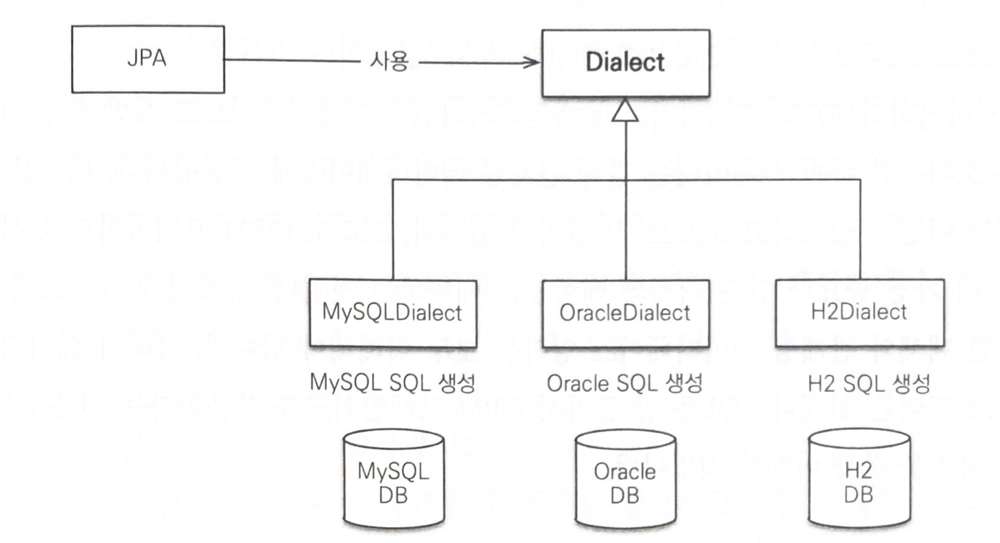

# JPA 시작

## Spring Boot JPA 설정

```yaml
spring:
  datasource:
    url: jdbc:DB드라이버://hostname:port/스키마이름?createDatabaseIfNotExist=true
    username: root
    password: 1234
    driver-class-name: org.mariadb.jdbc.Driver
```

Spring Boot에서 JPA 설정은 위와 같이 해준다.

## 2.5.1 데이터베이스 방언

JPA는 특정 데이터베이스에 종속적이지 않은 기술이다.

그런데 각 데이터베이스가 제공하는 SQL 문법과 함수가 조금씩 다르다는 문제점이 있다.

- 데이터 타입 : 가변 문자 타입으로 MySQL은 VARCHAR, Oracle은 VARCHAR2를 사용한다.
- 다른 함수명 : 문자열을 자르는 함수로 SQL 표준은 SUBSTRING()를 사용하지만 Oracle은 SUBSTR()을 사용한다.
- 페이징 처리 : MySQL은 LIMIT를 사용하지만 오라클은 ROWNUM을 사용한다.

이처럼 SQL 표준을 지키지 않거나 특정 데이터베이스만의 고유한 기능을 JPA에서는 방언(Dialect)이라 한다.

하이버네이트를 포함한 JPA 구현체들은 이런 문제를 해결하려고 다양한 데이터베이스 방언 클래스를 제공한다.

개발자는 JPA가 제공하는 표준 문법에 맞추어 JPA를 사용하면 되고 특정 데이터베이스에 의존적인 SQL은 데이터베이스 방언이 처리해준다.

따라서 데이터베이스가 변경되어도 애플리케이션 코드를 변경할 필요 없이 데이터베이스 방언만 교체하면 된다.



### Spring Data JPA 방언 설정

```yaml
spring:
	jpa:
    hibernate:
      ddl-auto: update
    show-sql: true
    properties:
      hibernate:
				// 방언
        dialect: org.hibernate.dialect.MySQL5InnoDBDialect
```

방언 설정이 가능하지만 보통 자동으로 설정되기 때문에 건드릴 필요가 없다.

## JPQL

JPA는 엔티티 객체를 중심으로 개발하므로 검색을 할때도 테이블이 아닌 엔티티 객체를 대상으로 검색해야 한다.

그런데 테이블이 아닌 엔티티 객체를 대상으로 검색하려면 데이터베이스의 모든 데이터를 애플리케이션으로 불러와서 엔티티 객체로 변경한 다음 검색해야 하는데, 이는 사실상 불가능하다.

애플리케이션이 필요한 데이터만 데이터베이스에서 불러오려면 결국 검색 조건이 포함된 SQL을 사용해야한다.

JPA는 JPQL(Java Persistence Query Language)이라는 쿼리 언어로 이런 문제를 해결한다.

JPA는 SQL을 추상화한 JPQL이라는 객체지향 쿼리 언어를 제공한다.

JPQL은 SQL과 문법이 거의 유사해서 SELECT, FROM, WHERE, GROUP BY, HAVING, JOIN 등을 사용할 수 있다.

### **SQL간의 차이점**

- JPQL은 엔티티 객체를 대상으로 쿼리한다. 쉽게 이야기해서 클래스와 필드를 대상으로 쿼리한다.
- SQL은 데이터베이스 테이블을 대상으로 쿼리한다.

JPQL은 데이터베이스 테이블을 전혀 알지 못한다.