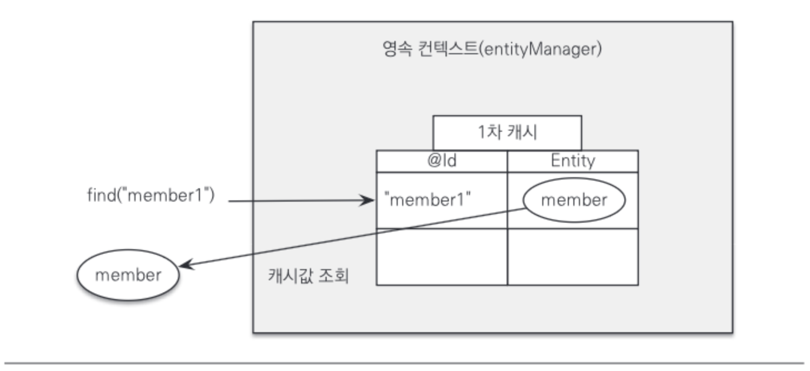
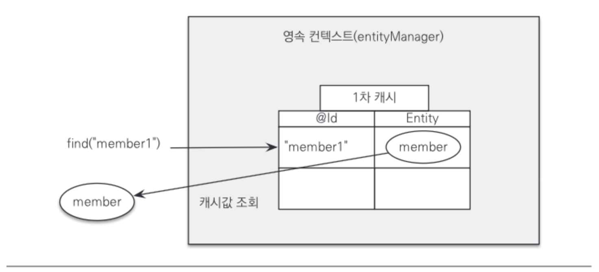
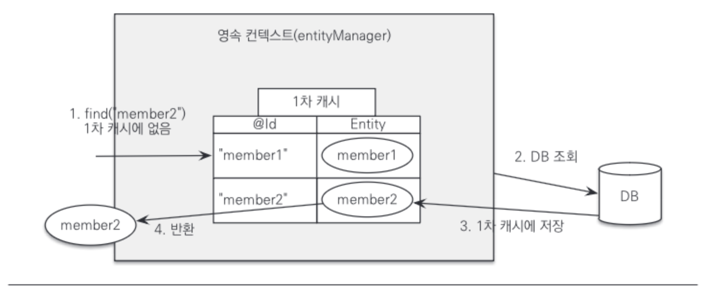
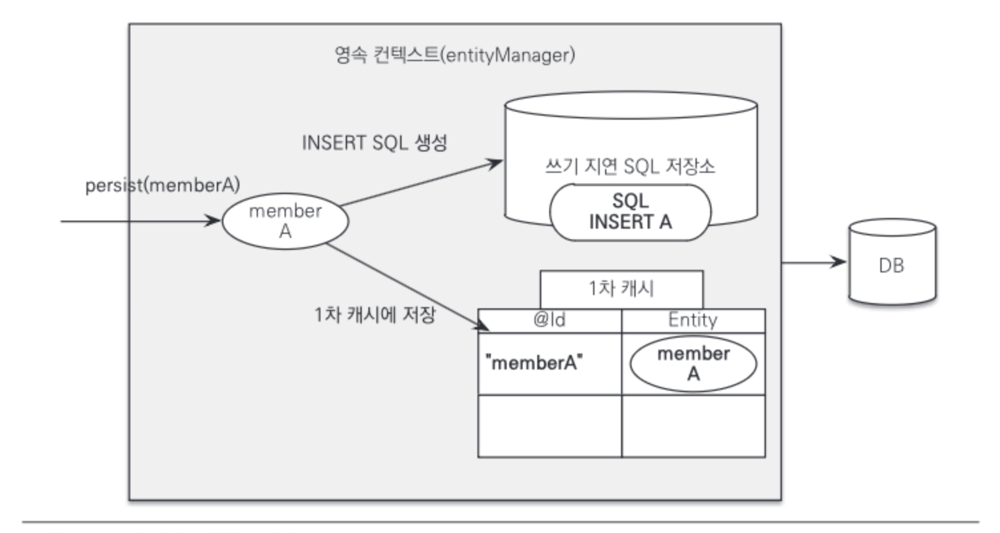
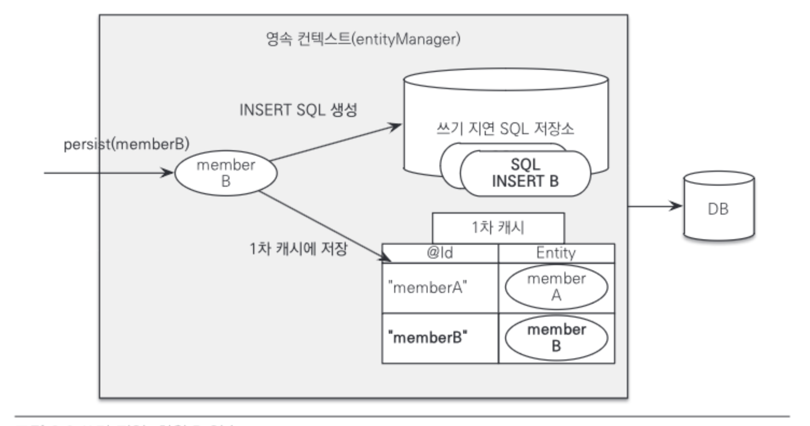
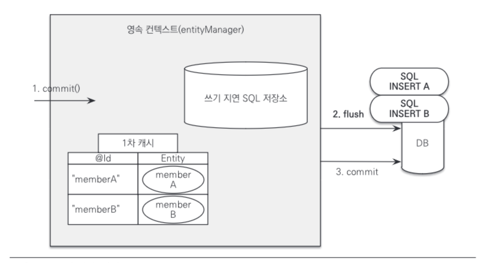
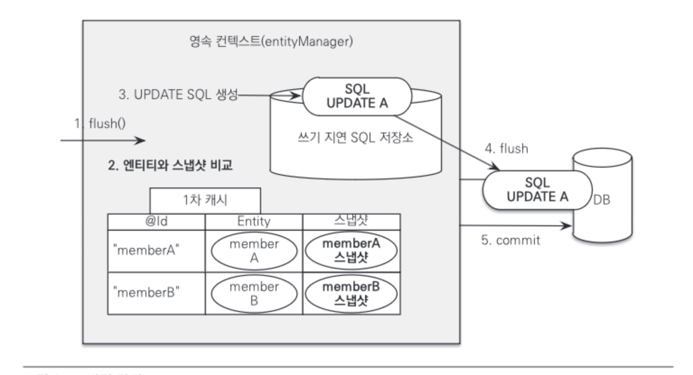

# 3.1 엔티티 매니저 팩토리와 엔티티 매니저

데이터베이스를 하나만 사용하는 애플리케이션은 일반적으로 EntityManagerFactory를 하나만 생성한다. 엔티티 매니저 팩토리는 이름 그대로 엔티티 매니저를 만드는 공장이다. 필요할 때마다 엔티티 매니저 팩토리에서 엔티티 매니저를 생성하여 사용하면 된다.

<aside>
💡 엔티티 매니저 팩토리는 여러 스레드가 동시에 접근해도 안전하므로 다른 스레드 간에 공유해도 되지만, 엔티티 매니저는 여러 스레드가 동시에 접근하면 동시성 문제가 발생하므로 스레드 간에 절대 공유하면 안 된다.

</aside>

# 3.2 영속성 컨텍스트

영속성 컨텍스트는 **엔티티를 영구 저장하는 환경**이다. 엔티티 매니저로 엔티티를 저장하거나 조회하면 엔티티 매니저는 영속성 컨텍스트에 엔티티를 보관하고 관리한다. 

다음 코드가 member 객체를 영속성 컨텍스트에 저장하는 메소드이다.

```java
em.persist(member);
```

기본적으로 하나의 엔티티 매니저에 하나의 영속성 컨텍스트가 주어진다.

# 3.3 엔티티의 생명주기

엔티티에는 **비영속(new), 영속(managed), 준영속(detached), 삭제(removed)** 4가지 상태가 존재한다.


그림 3.1 엔티티의 생명주기

### 비영속(new/transient)

엔티티 인스턴스를 생성한 순수한 객체 상태이며 아직 저장하지 않은 상태이다. 따라서 **영속성 컨텍스트나 데이터베이스와는 전혀 관련이 없는 상태**이다.

### 영속(managed)

엔티티 매니저를 통해 엔티티를 영속성 컨텍스트에 저장한 상태이다. 이렇게 **영속성 컨텍스트가 관리하는 엔티티를 영속 상태**라 한다.

### 준영속(detached)

영속성 컨텍스트가 관리하던 영속 상태의 엔티티를 영속성 컨텍스트가 관리하지 않으면 준영속 상태가 된다. 특정 엔티티를 준영속 상태로 만드는 데는 em.detach(), em.close(), em.clear() 3가지 방법이 있다.

### 삭제(removed)

엔티티를 영속성 컨텍스트와 데이터베이스에서 삭제한 상태이다.

# 3.4 영속성 컨텍스트의 특징

영속성 컨텍스트의 특징은 다음과 같다.

- 영속성 컨텍스트와 식별자 값
- 영속성 컨텍스트와 데이터베이스 저장
- 영속성 컨텍스트가 엔티티를 관리를 통한 다양한 장점
    - 1차 캐시
    - 동일성 보장
    - 트랜잭션을 지원하는 쓰기 지연
    - 변경 감지
    - 지연 로딩

이러한 특징을 엔티티를 CRUD 하면서 그 이유를 하나씩 알아보자.

## 엔티티 조회

영속성 컨텍스트는 내부에 캐시를 가지고 있는데 이것을 1차 캐시라 한다. 영속 상태의 엔티티는 모두 이곳에 저장된다. 

다음 코드를 실행하면 그림 3.2와 같이 1차 캐시에 회원 엔티티를 저장한다.

```java
Member member = new Member(); // 비영속 상태
member.setId("member1");
member.setUsername("회원1");

em.persist(member); // 엔티티 영속화
```



그림 3.2 영속성 컨텍스트 1차 캐시

### 1차 캐시에서 조회

em.find()를 통해 엔티티를 조회하면 우선 1차 캐시에서 식별자 값으로 엔티티를 찾는다. 만약 찾는 엔티티가 있으면 데이터베이스를 조회하지 않고 메모리에 있는 1차 캐시에서 엔티티를 조회한다.



그림 3.3 1차 캐시에서 조회

### 데이터베이스에서 조회

만약 em.find()를 호출했는데 엔티티가 1차 캐시에 없으면 엔티티 매니저는 데이터베이스를 조회해서 엔티티를 생성한다. 그릐고 1차 캐시에 저장한 후에 영속 상태의 엔티티를 반환한다.



그림 3.4 데이터베이스에서 조회

### 엔티티의 동일성 보장

다음 코드를 살펴보면 em.find를 호출해서 식별자 member1을 갖는 엔티티를 조회하였다. 앞에서 살펴봤듯이 엔티티는 영속화 되어 반환되므로 모두 같은 인스턴스를 가리킨다. 따라서 동일성 비교는 참이 된다.

```java
Member a = em.find(Member.class, "member1");
Member b = em.find(Member.class, "member1");

System.out.println(a == b); // 참
```

## 엔티티 등록

다음은 엔티티 매니저를 사용해서 엔티티를 영속성 컨텍스트에 등록해보았다.

```java
EntityManager em = emf.createEntityManager();
EntityTransaction transaction = em.getTransaction();

transaction.begin(); // 트랜잭션 시작

em.persist(memberA);
em.persist(memberB);

// 커밋하는 순간에 데이터베이스에 INSERT SQL을 보낸다.
transaction.commit(); // 트랜잭션 커밋
```

엔티티 매니저는 트랜잭션을 커밋하기 직전까지 데이터베이스에 엔티티를 저장하지 않고 내부 쿼리 저장소에 INSERT SQL을 모아둔다. 그리고 트랜잭션을 커밋할 때 모아둔 쿼리를 데이터베이스에 보내는데 이것을 **트랜잭션을 지원하는 쓰기 지연**이라고 한다.



그림 3.5 쓰기 지연, 회원 A 영속

그림 3.5를 보면 먼저 회원 A를 영속화했다. 영속성 컨텍스트는 1차 캐시에 회원 엔티티를 저장하면서 동시에 회원 엔티티로 등록 쿼리를 만든다. 그리고 만들어진 등록 쿼리를 쓰기 지연 SQL 저장소에 보관한다.



그림 3.6 쓰기 지연, 회원 A 영속

그림 3.6을 보면 다음으로 회원 B를 영속화했다. 마찬가지로 회원 엔티티 정보로 등록 쿼리를 생성해서 쓰기 지연 SQL 저장소에 보관한다.



그림 3.7 쓰기 지연, 커밋

그림 3.7을 보면 마지막으로 트랜잭션을 커밋했다. 트랜잭션을 커밋하면 엔티티 매니저는 영속성 컨텍스트의 변경내용을 데이터베이스에 동기화하는 플러시를 진행한다. 

## 엔티티 수정

SQL을 사용하여 작업을 진행하면 수정 쿼리를 직접 작성해야 한다. 프로젝트가 커지고 요구사항이 늘어날 수록 수정 쿼리도 점점 추가된다. 이렇게 되면 수정 쿼리가 많아질 뿐만 아니라 비즈니스 로직을 분석하기 위해 SQL을 계속 확인해야 하므로 직간접적으로 비즈니스 로직이 SQL에 의존하게 된다. JPA는 이를 해결하기 위해 변경 감지 기능을 제공한다.

### 변경 감지

다음 코드를 보면 em.find()를 호출해서 memberA의 내용을 변경하였다.

```java
EntityManager em = emf.createEntityManager();
EntityTransaction transaction = em.getTransaction();

transaction.begin(); // 트랜잭션 시작

Member memberA = em.find(Member.class, "memberA");

memberA.setUsername("hi");
memberA.setAhe(10);

transaction.commit(); // 트랜잭션 커밋
```

JPA는 사용자가 사용하는 업데이트 기능을 별도로 제공하지 않고 영속화된 엔티티의 내용을 변경하게 되면 이를 자동으로 감지하여 업데이트하는 기능을 제공하고 있다. 이 기능을 어떻게 제공하는지 알아보겠다.



그림 3.8 변경 감지

그림 3.8을 보자. JPA는 엔티티를 영속성 컨텍스트에 보관할 때, 최초 상태를 복사해서 스냅샷을 저장해둔다. 그리고 플러시 시점에 스냅샷과 엔티티를 비교해서 변경된 엔티티를 찾아 업데이트 한다.

**변경 감지는 영속성 컨텍스트가 관리하는 영속 상태의 엔티티에만 적용된다.** 비영속, 준영속처럼 영속성 컨텍스트의 관리를 받지 못하는 엔티티는 값을 변경해도 데이터베이스에 반영되지 않는다.

## 엔티티 삭제

다음 코드를 보자. em.remove()에 삭제 대상 엔티티를 넘겨주면 엔티티를 삭제한다. 물론 엔티티를 즉시 삭제하는 것이 아니라 엔티티 등록과 비슷하게 삭제 쿼리를 쓰기 지연 SQL 저장소에 등록 후 트랜잭션 커밋할 때 삭제된다.

```java
Member memberA = em.find(Member.class, "memberA");
em.remove(memberA);
```

# 3.5 플러시

**플러시는 영속성 컨텍스트의 변경 내용을 데이터베이스에 반영한다.** 플러시를 실행하면 다음과 같은 과정이 진행된다.

1. 변경 감지가 동작해서 영속성 컨텍스트에 있는 모든 엔티티를 스냅샷과 비교해서 수정된 엔티티를 찾는다. 수정된 엔티티는 수정 쿼리를 만들어 쓰기 지연 SQL 저장소에 등록한다.
2. 쓰기 지연 SQL 저장소의 쿼리를 데이터베이스에 전송한다.

영속성 컨텍스트를 플러시하는 방법은 다음 3가지가 있다.

1. em.flush()를 직접 호출한다.
2. 트랜잭션 커밋 시 플러시가 자동 호출된다.
3. JPQL 쿼리 실행 시 플러시가 자동 호출된다.

### 직접 호출

엔티티 매니저의 flush() 메소드를 직접 호출해서 영속성 컨텍스트를 강제로 플러시한다.

### 트랜잭션 커밋 시 플러시 자동 호출

데이터베이스에 변경 내용을 SQL로 전달하지 않고 트랜잭션만 커밋하면 어떤 데이터도 데이터베이스에 반영되지 않는다. 따라서 트랜잭션을 커밋하기 전에 꼭 플러시를 호출해서 영속성 컨텍스트의 변경 내용을 데이터베이스에 반영해야 한다. JPA는 이런 문제를 예방하기 위해 트랜잭션을 커밋할 때 플러시를 자동으로 호출한다.

### JPQL 쿼리 실행 시 플러시 자동 호출

JPQL이나 Criteria 같은 객체지향 쿼리를 호출할 때도 플러시가 실행된다. 

# 3.6 준영속

준영속은 영속성 컨텍스트가 관리하는 영속 상태의 엔티티가 영속성 컨텍스트에서 분리된 것을 준영속 상태라고 한다. 따라서 **준영속 상태의 엔티티는 영소성 컨텍스트가 제공하는 기능을 사용할 수 없다.** 영속 상태의 엔티티를 준영속 상태로 만드는 방법은 크게 **detach(), clear(), close()** 3가지이다.

### detach()

em.detach() 메소드는 특정 엔티티를 준영속 상태로 만든다. 

```java
em.detach(member);
```

### clear()

em.clear() 메소드는 영속성 컨텍스트를 초기화해서 해당 영속성 컨텍스트의 모든 엔티티를 준영속 상태로 만든다.

```java
em.clear();
```

### close()

영속성 컨텍스트를 종료하면 해당 영속성 컨텍스트가 관리하던 영속 상태의 엔티티가 모두 준영속 상태가 된다.

```java
em.close();
```

### 준영속 상태의 특징

- 거의 비영속 상태에 가깝다.
    
    영속성 컨텍스트가 관리하지 않으므로 1차 캐시, 쓰기 지연, 변경 감지, 지연 로딩을 포함한 영속성 컨텍스트가 제공하는 어떠한 기능도 동작하지 않는다.
    
- 식별자 값을 가지고 있다.
    
    비영속 상태는 식별자 값이 없으르 수도 있지만 준영속 상태는 이미 한 번 영속 상태였으므로 반드시 식별자 값을 가지고 있다.
    
- 지연 로딩을 할 수 없다.
    
    지연 로딩은 실제 객체 대신 프록시 객체를 로딩해두고 해당 객체를 실제 사용할 때 영속성 컨텍스트를 통해 데이터를 불러오는 방법이다. 하지만 준영속 상태는 영속성 컨텍스트가 더는 관리하지 않으므로 지연 로딩 시 문제가 발생한다.
    

### 병합: merge()

준영속 상태의 엔티티를 다시 영속 상태로 변경하려면 병합을 사용하면 된다. merge() 메소드는 준영속 상태의 엔티티를 받아서 그 정보로 새로운 영속 상태의 엔티티를 반환한다. 

```java
Member mergeMember = em.merge(member);
```

em.merge에 인자로 넣은 member는 준영속 상태이고 merge후 반환된 엔티티는 영속 상태가 된다.

같은 방법으로 비영속 상태인 엔티티도 병합을 통해 영속 상태로 만들 수 있다.

# 3.7 정리

엔티티 매니저 팩토리와 엔티티 매니저에 대해 알아보았다. 또한 엔티티 매니저가 생성하는 영속성 컨텍스트에 대해 알아보았고 영속성 컨텍스트가 제공하는 다양한 기능들에 대해서도 알아보았다. 지금까지 설명한 엔티티 매니저와 영속성 컨텍스트는 매핑한 엔티티를 실제 사용하는 동적인 부분에 해당한다. 다음 장부터는 엔티티와 테이블을 어떻게 매핑하는지 설계에 해당하는 정적인 부분을 알아보겠다.