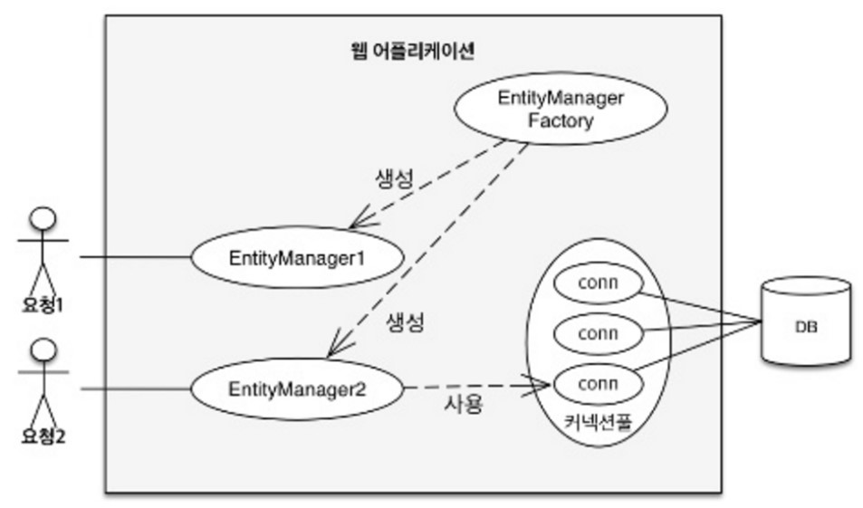
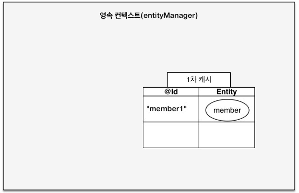
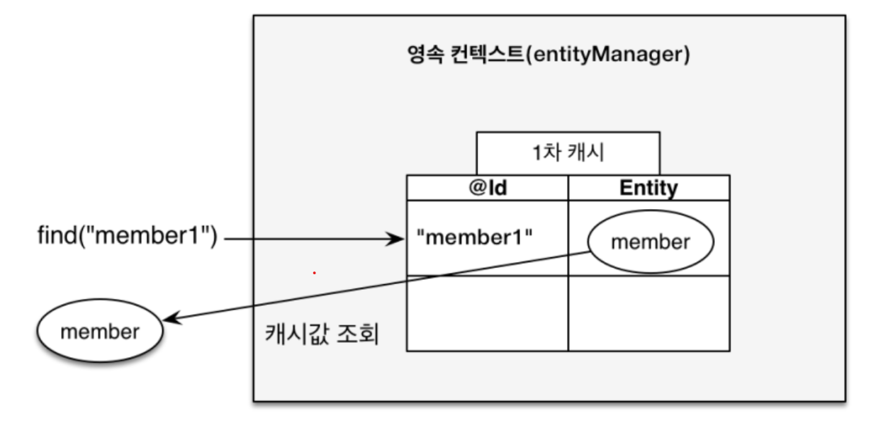
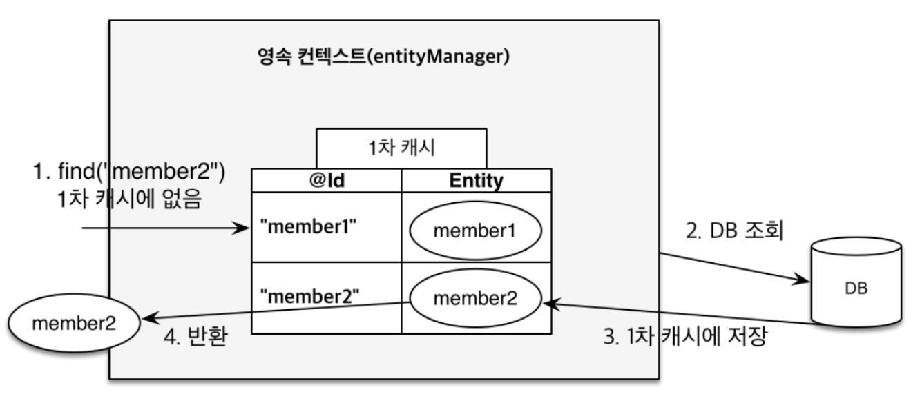
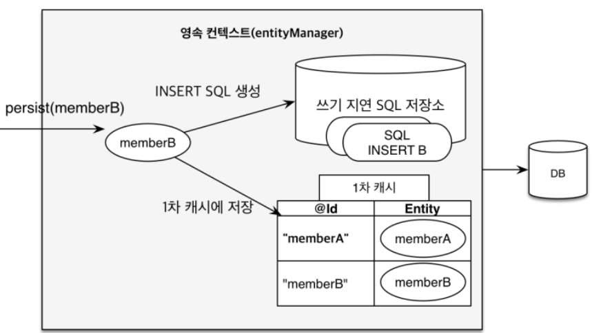
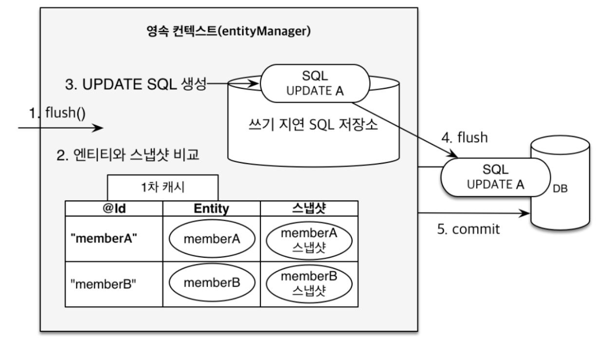

# 3장 연속성 관리

JPA가 제공하는 기능은 엔티티와 테이블을 매핑하는 설계 부분과 매핑한 엔티티를 실제 사용하는 부분으로 나눌 수 있다. 
이 장에서는 매핑한 엔티티를 엔티티 매니저를 통해 어떻게 사용하는지 알아보자.

## 3.1. 엔티티 매니저 팩토리와 엔티티 매니저

DB를 하나만 사용하는 애플리케이션은 일반적으로 EntityManagerFactory를 하나만 생성한다.  

`엔티티 매니저 팩토리`는 엔티티 매니저를 만드는 공장인데, 이 공장을 만드는 비용이 커 한 개만 만들어 애플리케이션 전체에서 공유하도록 설계되어있다. 
반면 엔티티 매니저 팩토리에서 `엔티티 매니저`를 생성하는 비용은 거의 들지 않는다.  

엔티티 매니저 팩토리는 서로 다른 스레드 간에 공유해도 되지만, 엔티티 매니저는 동시접근 시 동시성 문제가 발생하므로 공유하면 안된다.


엔티티 매니저는 `데이터베이스 연결이 꼭 필요한 시점`까지 커넥션을 얻지 않는다. 트랜잭션을 시작할 때 커넥션을 획득한다.

## 3.2. 영속성 컨텍스트란?

`영속성 컨텍스트`란 엔티티를 영구 저장하는 환경이다. 엔티티 매니저로 엔티티를 저장하거나 조회하면 엔티티 매니저는 영속성 컨테스트에
엔티티를 보관하고 관리한다.  

persist() 메소드는 엔티티 매니저를 사용해 회원 엔티티를 영속성 컨텍스트에 저장한다.  
영속성 컨텍스트는 엔티티 매니저를 생성할 때 하나 만들어진다. 엔티티 매니저를 통해 접근할 수 있고 관리할 수 있다.  

## 3.3. 엔티티의 생명주기
엔티티에는 4가지 상태가 존재한다.

1. 비영속(new/transient) : 영속성 컨텍스트와 전혀 관계가 없는 상태
2. 영속(managed) : 영속성 컨텍스트에 저장된 상태
3. 준영속(detached) : 영속성 컨텍스트에 저장되었다가 분리된 상태
4. 삭제(removed) : 삭제된 상태

- 비영속  
엔티티 객체를 생성했다. 순수한 객체 상태이며 아직 저장하지 않았다. 그래서 영속성 컨텍스트나 DB와는 관련이 없다.  
이것을 비영속 상태라 한다.

```java
//객체를 생성한 상태(비영속)
Member member = new Member();
member.setId("member1");
member.setUsername("회원1");
```

- 영속  
엔티티 매니저를 통해서 엔티티를 영속성 컨텍스트에 저장했다. 영속성 컨텍스트가 관리하는 엔티티를 영속 상태라 한다. 결국 영속 상태는 `영속성 컨텍스트에 의해 관리된다`는 뜻이다.

```java
///객체를 저장한 상태(영속)
em.persist(member);
```

- 준영속  
영속 상태의 엔티티를 영속성 컨텍스트가 `관리하지 않으면` 준영속 상태가 된다. 특정 엔티티를 준영속 상태로 만들려면 em.detach()를 호출하면 된다. 
em.close()로 영속성 컨텍스트를 닫거나, em.clear()로 영속성 컨텍스트를 초기화해도 준영속 상태가 된다.  

- 삭제  
엔티티를 영속성 컨텍스트와 DB에서 삭제한다.  
em.remove() 활용.

## 3.4. 영속성 컨텍스트의 특징

1. 영속성 컨텍스트와 식별자 값 : 영속성 컨텍스트는 엔티티를 식별자 값으로 구분해 영속 상태는 식별자 값이 반드시 있어야 한다. 
2. 영속성 컨텍스트와 데이터베이스 저장 : JPA는 트랜잭션을 커밋하는 순간 영속성 컨텍스트에 저장된 엔티티를 DB에 반영하는데 이를 플러시라 한다.
3. 영속성 컨텍스트가 엔티티를 관리했을 때 장점
- 1차 캐시
- 동일성 보장
- 쓰기 지연
- 변경 감지
- 지연 로딩

### 3.4.1. 엔티티 조회

영속성 컨텍스트는 내부에 캐시를 가지고 있는데 이것을 1차 캐시라 한다. 영속 상태의 엔티티는 모두 이곳에 저장된다.  
영속성 컨텍스트 내부에 Map이 있는데 키는 @Id로 매핑한 식별자고 값은 엔티티 인스턴스다.  

회원 엔티티 객체를 persist()를 호출해 영속 상태로 변경하면 1차 캐시에 회원 엔티티를 저장한다. 아직 DB에 저장되지 않은 상태다.



영속성 컨텍스트에 데이터를 저장하고 조회하는 모든 기준은 DB 기본 키 값이다.  

엔티티를 조회할 때 em.find()를 호출하면 먼저 1차 캐시에서 엔티티를 찾고 만약 1차 캐시에 없다면 DB에서 조회한다.  

#### 1차 캐시에서 조회


#### DB에서 조회
em.find()를 호출했는데 엔티티가 1차 캐시에 없으면 엔티티 매니저는 DB를 조회해 엔티티를 생성한다. 이를 1차 캐시에 저장한 후에 영속 상태의 엔티티를 반환한다.  

  

#### 영속 엔티티의 동일성 보장

식별자가 같은 엔티티 인스턴스를 조회해서 비교해보자.
```java
Member a = em.find(Member.class, "member1");
Member b = em.find(Member.class, "member1");

System.out.println(a == b); //동일성 비교
```

a == b의 결과는 참이다.  
em.find(Member.class, "member1")를 반복해서 호출해도 영속성 컨텍스트는 1차 캐시에 있는 같은 엔티티 인스턴스를 반환한다.  
따라서 영속성 컨텍스트는 성능상 이점과 엔티티의 동일성을 보장한다.  

### 3.4.2. 엔티티 등록
엔티티 매니저는 트랜잭션 커밋 직전까지 DB에 엔티티를 저장하지 않고 내부 쿼리 저장소에 INSERT SQL을 모아둔다. 
그리고 트랜잭션을 커밋할 때 모아둔 쿼리를 DB에 보내는데 이를 트랜잭션을 지원하는 `쓰기 지연`이라 한다.



영속성 컨텍스트는 1차 캐시에 회원 엔티티를 저장하면서 동시에 회원 엔티티 정보로 등록 쿼리를 만든다. 그리고 이를 쓰기 지연 SQL 저장소에 보관한다.  

트랜잭션을 커밋하면 엔티티 매니저는 영속성 컨텍스트를 `플러시` 한다. 플러시는 영속성 컨텍스트의 변경 내용을 DB에 동기화하는 작업이다. 
이 때 쓰기 지연 SQL 저장소에 모인 쿼리를 DB에 보낸다.  

#### 트랜잭션을 지원하는 쓰기 지연이 가능한 이유

```java
begin(); //트랜잭션 시작

save(A);
save(B);
save(C);

commit(); //트랜잭션 커밋
```

다음 로직을 2가지 경우로 생각해보자.  

1. 데이터를 저장하는 즉시 등록 쿼리를 DB에 보낸다. 그리고 마지막에 트랜잭션을 커밋한다.
2. 데이터를 저장하면 등록 쿼리를 메모리에 모아둔다. 그리고 트랜잭션을 커밋할 때 등록 쿼리를 DB에 보낸 후 커밋한다.  

트랜잭션 범위 안에서 실행되므로 둘의 결과는 같다. 등록 쿼리를 바로 DB에 전달해도 트랜잭션을 커밋하지 않으면 소용이 없다. 
어떻게든 커밋 직전에만 SQL을 전달하면 된다. 이것이 트랜잭션을 지원하는 쓰기 지연이 가능한 이유다.

### 3.4.3. 엔티티 수정

#### SQL 수정 쿼리의 문제점
SQL을 사용하면 수정 쿼리를 직접 작성해야 한다. 요구사항이 늘어나면서 수정 쿼리도 점점 추가된다. 이런 개발 방식은 수정 쿼리가 많아지는 것은 물론이고
 비즈니스 로직을 분석하기 위해 SQL을 계속 확인해야 해 비즈니스 로직이 SQL에 의존하게 된다.

#### 변경 감지
JPA로 엔티티를 수정할 때는 단순이 엔티티를 조회해서 데이터만 변경하면 된다. 엔티티의 데이터를 변경하면 DB에 자동으로 반영하게 되는데 이를 변경 감지라고 한다.  



변경 감지는 영속성 컨텍스트가 관리하는 영속 상태의 엔티티에만 적용된다.  

JPA의 기본 전략은 엔티티의 모든 필드를 업데이트한다. 한 필드만 수정했다고 한 필드만 업데이트하는 SQL문을 작성하지 않는다.  

모든 필드를 사용하면 DB에 보내는 데이터 전송량이 증가하는 단점이 있지만 2가지 장점이 있다.

1. 수정 쿼리가 항상 같다. 그래서 재사용할 수 있다.
2. DB에 동일한 쿼리를 보내면 DB는 한 번 파싱된 쿼리를 재사용할 수 있다.

필드가 많거나 저장되는 내용이 크면 수정된 데이터만 사용해 UPDATE SQL을 생성하는 전략을 선택하면 된다. 이 때는 하이버네이트 확장 기능을 사용해야 한다.

`@org.hibernate.annotations.DynamicUpdate` 어노테이션을 사용하면 수정된 데이터만 사용해 UPDATE SQL을 생성한다.
`@DynamicInsert`를 사용해 데이터를 저장할 때 null이 아닌 필드만으로 INSERT SQL을 생성할수도 있다.

### 3.4.4. 엔티티 삭제

엔티티를 삭제하려면 먼저 삭제 대상 엔티티를 조회하고, em.remove()에 대상 엔티티를 넘겨주면 엔티티를 삭제한다. 
물론 즉시 삭제하는 것이 아니라 삭제 쿼리를 쓰기 지연 SQL 저장소에 등록한다. 이후 트랜잭션을 커밋해서 플러시를 호출하면 DB에 삭제 쿼리를 전달한다.  
em.remove()를 호출하는 순간 엔티티는 영속성 컨텍스트에서 제거된다.

## 3.5. 플러시
`플러시`는 영속성 컨텍스트의 변경 내용을 DB에 반영한다. 플러시를 실행하면 다음과 같은 일이 일어난다.

1. 변경 감지가 동작해 영속성 컨텍스트의 모든 엔티티를 스냅샷과 비교해 수정된 엔티티를 찾아 수정 쿼리를 쓰기 지연 SQL 저장소에 등록한다.
2. 쓰기 지연 SQL 저장소의 쿼리를 DB에 전송한다.

영속성 컨텍스트를 플러시하는 방법
1. em.flush() 호출
2. 트랜잭션 커밋
3. JPQL 쿼리 실행

- 직접 호출
영속성 컨텍스트를 강제로 플러시. 테스트나 다른 프레임워크와 JPA를 함께 사용할 때를 제외하고 거의 사용 X

- 트랜잭션 커밋 시 플러시 자동 호출
DB에 변경 내용을 SQL로 전달하지 않고 트랜잭션만 커밋하면 어떤 데이터도 DB에 반영되지 않는다. JPA는 트랜잭션을 커밋할 때 플러시를 자동으로 호출한다.

- JPQL 쿼리 실행 시 플러시 자동 호출
```java
em.persist(memberA);
em.persist(memberB);
em.persist(memberC);

//JPQL 중간에 실행
query = em.createQuery("select m from Member m", Member.class );
List<Member> member = query.getResultList();
```
memberA, B, C를 영속 상태로 만들었다. 아직 DB에는 반영되지 않았다. 이 때 JPQL을 실행하면 JPQL은 SQL로 변환되어 DB에서 엔티티를 조회한다.  
그런데 memberA, B, C는 아직 DB에 없어 조회할 수 없다. 따라서 쿼리 실행 전 영속성 컨텍스트를 플러시해서 변경 내용을 DB에 반영해야 한다.

### 3.5.1. 플러시 모드 옵션
엔티티 매니저에 플러시 모드를 직접 지정하려면 javax.persistence.FlushModeType을 사용하면 된다.

- FlushModeType.AUTO : 커밋이나 쿼리를 실행할 때 플러시(기본값)
- FlushModeType.COMMIT : 커밋할 때만 플러시

## 3.6. 준영속

영속 -> 준영속 상태 변화를 알아보자.  
영속 상태의 엔티티가 영속성 컨텍스트에서 분리된 상태를 준영속 상태라고 한다. 영속성 컨텍스트가 제공하는 기능을 사용할 수 없다.  
영속 상태의 엔티티를 준영속 상태로 만드는 방법은 크게 3가지다.  

1. em.detach(entity) : 특정 엔티티만 준영속 상태로 전환한다.
2. em.clear() : 영속성 컨텍스트를 초기화한다.
3. em.close() : 영속성 컨텍스트를 종료한다.

### 3.6.1. detach()

특정 엔티티를 준영속 상태로 만든다. em.detach()를 호출하는 순간 1차 캐시부터 쓰기 지연 SQL 저장소까지 해당 엔티티를 관리하기 위한 모든 정보가 제거된다.  
쓰기 지연 SQL 저장소의 INSERT SQL도 제거되어서 DB에 저장되지도 않는다.

### 3.6.2. clear()

영속성 컨텍스트를 초기화해서 해당 컨텍스트의 모든 엔티티를 준영속 상태로 만든다.

### 3.6.3. close()
영속성 컨텍스트를 종료하면 해당 컨텍스트가 관리하던 영속 상태의 엔티티가 모두 준영속 상태가 된다. 영속성 컨텍스트 내부가 텅 비게된다.  

### 3.6.4. 준영속 상태의 특징

준영속 상태인 회원 엔티티는 어떻게 되는 걸까?

- 비영속 상태에 가깝다.  
영속성 컨텍스트가 제공하는 어떠한 기능도 동작하지 않는다.  

- 식별자 값을 가지고 있다.  
이미 한 번 영속 상태였으므로 식별자 값을 가지고 있다.  

- 지연 로딩을 할 수 없다.  
지연 로딩(LAZY LOADING)은 실제 객체 대신 프록시 객체를 로딩해두고 해당 객체를 사용할 때 영속성 컨텍스트를 통해 데이터를 불러오는 방법이다.
하지만 준영속 상태는 영속성 컨텍스트가 관리하지 않으므로 지연 로딩 시 문제가 발생한다.  

### 3.6.5. 병합:merge()

준영속 상태를 다시 영속 상태로 변경하려면 병합을 사용하면 된다.  
merge() 메소드는 준영속 상태의 엔티티를 받아 그 정보로 새로운 영속 상태의 엔티티를 반환한다.
다만 파라미터로 넘어온 준영속 상태의 엔티티는 병합 후에도 준영속 상태로 남아있다.

#### 비영속 병합
병합은 비영속 엔티티도 영속 상태로 만들 수 있다.  
병합은 파라미터로 넘어온 엔티티의 식별자 값으로 영속성 컨텍스트를 조회하고 없으면 DB에서 조회한다. DB에서도 없다면 새로운 엔티티를 생성해 병합한다.  
병합은 준영속, 비영속을 신경쓰지 않는다. 병합은 save or update 기능을 수행한다.

## 3.7. 정리

1. 엔티티 매니저는 엔티티 매니저 팩토리에서 생성한다.
2. 영속성 컨텍스트는 애플리 케이션과 데이터베이스 사이에서 객체를 보관하는 가상의 DB 역할을 한다. 덕분에 1차 캐시, 동일성 보장, 쓰기 지연, 변경 감지, 지연 로딩 기능을 사용할 수 있다.
3. 영속성 컨텍스트에 저장된 엔티티는 플러시 시점에 DB에 반영되는데 일반적으로 트랜잭션 커밋 시 플러시된다.
4. 준영속 상태의 엔티티는 영속성 컨텍스트가 제공하는 기능들을 사용할 수 없다.