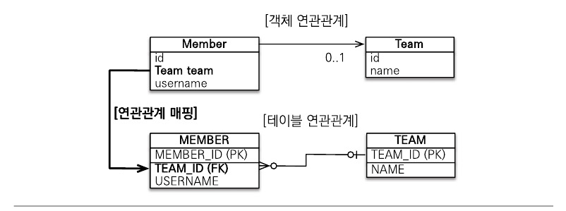
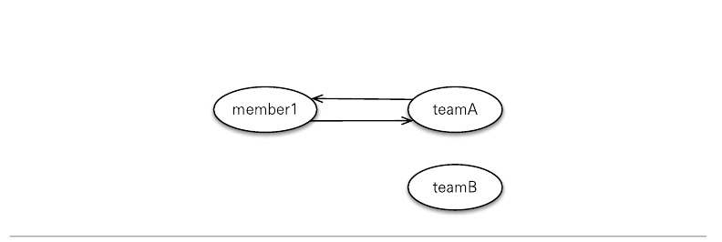

엔티티들은 대부분 다른 엔티티와 연간관계가 있다. 객체는 참조를 사용해서 관계를 맺고 테이블을 외래 키를 사용해서 관계를 맺는다. 객체의 참조와 테이블의 외래 키를 매핑하는 것이 이 장의 목표이다.

# 5.1 단방향 연관관계

연관관계 중에서는 다대일(N:1) 단방향 관계를 먼저 이해해야 한다. 회원과 팀의 관계를 통해 다대일 단방향 관계를 알아보자.

- 회원과 팀이 있다.
- 회원은 하나의 팀에만 소속될 수 있다.
- 회원과 팀은 다대일 관계이다.


그림 5.1 다대일 연관관계

### 객체 연관관계

회원 객체는 Member.team 필드로 팀 객체와 연관관계를 맺는다.

회원 객체와 팀 객체는 단방향 관계이다. 회원은 Member.team 필드를 통해서 팀을 알 수 있지만 반대로 팀은 회원을 알 수 없다.

### 테이블 연관관계

회원 테이블은 TEAM_ID 외래 키로 팀 테이블과 연관관계를 맺는다.

회원 테이블과 팀 테이블은 양방향 관계이다. 회원 테이블의 TEAM_ID 외래 키를 통해서 회원과 팀을 조인할 수 있고 반대로 팀과 회원도 조인할 수 있다.

### 객체 연관관계와 테이블 연관관계의 가장 큰 차이

참조를 통한 연관관계는 언제나 단방향이다. 객체 간에 연관관계를 양방향으로 만들고 싶으면 반대쪽에도 필드를 추가해서 참조를 보관해야 한다. 이렇게 양쪽에서 참조하는 것을 양방향 연관관계라고 한다. **정확히는 단방향 연관관계 2개**이지만 논리적으로 양방향 연관관계로 생각할 수 있다.

## 5.1.1 순수한 객체 연관관계

순수하게 객체만 사용한 연관관계를 살펴보자. 다음 코드는 JPA를 사용하지 않은 순수한 회원과 팀 클래스의 코드이다.

```java
public class Member {
	private String id;
	private String username;
	
	private Team team;
	
	public void setTeam(Team team){
		this.team = team;
	}
}

public class Team {
	private String id;
	private String name;
}
```

다음은 회원1과 회원2를 팀1에 소속시키는 예제이다.

```java
public static void main(String[] args){
	Member member1 = new Member("member1", "회원1");
	Member member2 = new Member("member2", "회원2");
	Team team = new Team("team1", "팀1");
	
	member1.setTeam(team);
	member2.setTeam(team);
}
```

다음 그림은 클래스와 인스턴스 관계를 나타낸다.


그림 5.2 순수한 객체 단방향, 다대일 클래스


그림 5.3 순수한 객체 단방향, 다대일 인스턴스

다음은 회원1이 속한 팀1을 조회하는 코드이다.

```java
Team findTeam = member1.getTeam();
```

이처럼 객체는 참조를 통해서 연관관계를 탐색할 수 있는데 이것을 객체 그래프 탐색이라고 한다.

## 5.1.2 테이블 연관관계

데이터베이스 테이블의 회원과 팀의 관계를 살펴보자. 다음은 회원 테이블과 팀 테이블의 DDL이다.

```sql
CREATE TABLE MEMBER (
	MEMBER_ID VARCHAR(255) NOT NULL,
	TEAM_ID VARCHAR(255),
	USERNAME VARCHAR(255),
	PRIMARY KEY (MEMBER_ID)
)

CREATE TABLE TEAM (
	TEAM_ID VARCHAR(255) NOT NULL,
	NAME VARCHAR(255),
	PRIMARY KEY (TEAM_ID)
)

ALTER TABLE MEMBER ADD CONSTRAINT FK_MEMBER_TEAM
	FOREIGN (TEAM_ID)
	REFERENCES TEAM
```

다음은 회원1과 회원2를 팀1에 소속시키는 SQL이다.

```sql
INSERT INTO TEAM(TEAM_ID, NAME) VALUES ('team1', '팀1');
INSERT INTO MEMBER(MEMBER_ID, TEAM_ID, USERNAME)
	VALUES('member1', 'team1', '회원1');
INSERT INTO MEMBER(MEMBER_ID, TEAM_ID, USERNAME)
	VALUES('member2', 'team1', '회원2');
```

다음은 회원1이 소속된 팀을 조사하는 SQL이다.

```sql
SELECT T.*
FROM MEMBER M JOIN TEAM T ON M.TEAM_ID = T.ID
WHERE M.MEMBER_ID = 'member1';
```

이처럼 데이터베이스는 외래 키를 사용해서 연관관계를 탐색할 수 있는데 이것을 조인이라고 한다.

## 5.1.3 객체 관계 매핑

지금까지 객체만 사용한 연관관계와 테이블만 사용한 연관관계를 각각 알아보았는데 이제 JPA를 사용해서 둘을 매핑하는 방법을 알아보겠다.


그림 5.4 다대일 연관관계

다음은 회원 엔티티를 매핑한 코드이다.

```java
@Entity
public class Member {
	@Id
	@Column(name = "MEMBER_ID")
	private String id;
	
	private String username;
	
	@ManyToOne // 다대일 연관관계 매핑
	@JoinColumn(name = "TEMA_ID")
	private Team team;
	
	public void setTeam(Team team){
		this.team = team;
	}
}
```

다음은 팀 엔티티를 매핑한 코드이다.

```java
@Entity
public class Team { 
	@Id
	@Column(name = "TEAM_ID")
	private String id;
	
	private String name;
}
```

@ManyToOne과 @JoinColumn 어노테이션을 사용해 연관관계를 매핑하였다.

- @ManyToOne: 이름 그대로 다대일 관계라는 매핑 정보이다. 연관관계를 매핑할 때 이렇게 다중성을 나타내는 어노테이션을 필수로 사용해야 한다.
- @JoinColumn: 조인 칼럼은 외래 키를 매핑할 때 사용한다. name 속성에는 매핑할 외래 키 이름을 지정한다.

## 5.1.4 @JoinColumn

@JoinColumn은 외래 키를 매핑할 때 사용한다.

다음 표는 @JoinColumn의 주요 속성들이다.

| 속성  | 기능 | 기본값 |
| --- | --- | --- |
| name | 매핑 할 외래 키 이름 | 필드명+_+참조하는 테이블의 기본 키 칼럼명 |
| referencedColumnName | 외래 키가 참조하는 대상 테이블의 칼럼명 | 참조하는 테이블의 기본키 칼럼명 |
| foreignKey(DDL) | 외래 키 제약조건을 직접 지정할 수 있다. 이 속성은 테이블을 생성할 때만 사용한다. |  |
| unique
nullable
insertable
updatable
columnDefinitiontable | @Column의 속성과 같다. |  |

## 5.1.5 @ManyToOne

@ManyToOne 어노테이션은 다대일 관계에서 사용한다. 

다음 표는 @ManyToOne의 주요 속성들이다.

| 속성  | 기능 | 기본값 |
| --- | --- | --- |
| optional | false로 설정하면 연관된 엔티티가 항상 있어야 한다. | true |
| fetch | 글로벌 패치 전략을 설정한다.  | @ManyToOne=FetchType.EAGER
@OneToMany=FetchType.LAZY |
| cascade | 영속성 전이 기능을 사용한다. |  |

# 5.2 연관관계 사용

연관관계를 등록, 수정, 삭제, 조회하는 예제를 통해 어떻게 사용하는지 알아보겠다.

## 5.2.1 저장

다음은 연관관계를 매핑한 엔티티를 저장하는 예제이다.

```java
public void testSave() {
	// 팀1 저장
	Team team1 = new Team("team1", "팀1");
	em.persist(team1);
	
	// 회원1 저장
	Member member1 = new Member("member1", "회원1");
	member1.setTeam(team1); // 연관관계 설정 member1->team1
	em.persist(member1);
	
	// 회원2 저장
	Member member2 = new Member("member2", "회원2");
	member2.setTeam(team1); // 연관관계 설정 member2->team1
	em.persist(member2);
}
```

회원 엔티티는 팀 엔티티를 참조하고 저장했다. JPA는 참조한 팀의 식별자를 외래 키로 사용해서 적절한 등록 쿼리를 생성한다. 이때 실행된 SQL은 다음과 같다.

```sql
INSERT INTO TEAM(TEAM_ID, NAME) VALUES ('team1', '팀1');
INSERT INTO MEMBER(MEMBER_ID, USERNAME, TEAM_ID)
	VALUES('member1', '회원1', 'team1');
INSERT INTO MEMBER(MEMBER_ID, USERNAME, TEAM_ID)
	VALUES('member2', '회원2', 'team1');
```

## 5.2.2 조회

연관관계가 있는 엔티티를 조회하는 방법은 크게 2가지이다.

- 객체 그래프 탐색(객체 연관관계를 사용한 조회)
- 객체지향 쿼리 사용(JPQL)

### 객체 그래프 탐색

다음은 member와 연관된 team을 조회하는 예제이다.

```java
Member member = em.find(Member.class, "member1");
Team team = member.getTeam(); // 객체 그래프 탐색
```

이처럼 객체를 통해 연관된 엔티티를 조회하는 것을 객체 그래프 탐색이라고 한다.

## 5.2.3 수정

다음은 팀1 소속이던 회원을 새로운 팀2에 소속하도록 수정한 예제이다.

```java
private static void updateRelation(EntityManager em) {
	Team team2 = new Team("team2", "팀2");
	em.persist(team2);
	
	Member member = em.find(Member.class, "member1");
	member.setTeam(team2);
}
```

앞에서 설명했듯이 수정은 em.update() 같은 메소드가 없다. 단순히 엔티티의 값만 변경해두면 트랜잭션을 커밋할 때 플러시가 일어나면서 변경 감지 기능이 작동한다. 그리고 변경사항을 데이터베이스에 자동으로 반영한다.

### 5.2.4 연관관계 제거

다음은 회원1을 팀에 소속되지 않도록 변경하는 예제이다.

```java
Member member1 = em.find(Member.class, "member1");
member1.setTeam(null) // 연관관계 제거
```

member1의 team 참조를 null로 설정하여 연관관계를 제거하였다.

### 5.2.5 연관된 엔티티 삭제

연관된 엔티티를 삭제하려면 기존에 있던 연관관계를 먼저 제거하고 삭제해야 한다. 그렇지 않으면 외래 키 제약조건으로 인해, 데이터베이스에서 오류가 발생한다. 팀1에는 회원1과 회원2가 소속되어 있다. 이때 팀1을 삭제하려면 연관관계를 먼저 끊어야 한다.

```java
member1.setTeam(null); // 회원1 연관관계 제거 
member2.setTeam(null); // 회원2 연관관계 제거
em.remove(team); // 팀 삭제
```

# 5.3 양방향 연관관계

양방향 연관관계는 단방향 연관관계 2개로 구현할 수 있다.

## 5.3.1 양방향 연관관계 매핑

다음은 회원→ 팀의 단방향 연관관계 매핑의 코드이다.

```java
@Entity
public class Member {
	@Id
	@Column(name = "MEMBER_ID")
	private String id;
	
	private String username;
	
	@ManyToOne
	@JoinColumn(name = "TEAM_ID")
	private Team team;
	
	public void setTeam(Team team){
		this.team = team;
	}
}
```

회원과 팀은 다대일 관계기 때문에 @ManyToOne을 사용하여 매핑해주었다.

다음은 팀→회원의 단방향 연관관계 매핑의 코드이다.

```java
@Entity
public class Team {
	@Id
	@Column(name = "TEAM_ID")
	private String id;
	
	private String name;
	
	@OneToMany(mappedBy = "team")
	private List<Member> members = new ArrayList<Member>();
}
```

팀과 회원은 일대다 관계기 때문에 @OneToMany를 사용하여 매핑해주었다. mappedBy 속성은 양방향 매핑일 때 사용하는데 반대쪽 매핑의 필드 이름을 값으로 주면 된다. 

## 5.3.2 일대다 컬렉션 조회

```java
Team team = em.find(Team.class, "team1");
List<Member> members = team.getMembers();
```

# 5.4 연관관계의 주인

객체에는 엄밀히 말하면 양방향 연관관계는 없다. 서로 다른 단방향 연관관계 2개를 애플리케이션 로직으로 잘 묶어서 양방향 연관관계인 것처럼 보이게 하는 것이다. 반면에 데이터베이스 테이블은 외래 키 하나로 양쪽이 서로 조인할 수 있다. 따라서 테이블은 외래 키 하나만으로 양방향 연관관계를 맺는다.

엔티티를 단방향으로 매핑하면 참조를 하나만 사용하므로 이 참조로 외래 키를 관리하면 되지만 양방향으로 연결하는 경우 객체의 참조는 둘인데 외래 키는 하나가 된다. 따라서 둘 사이에 차이가 발생하고 둘 중 하나를 정해서 테이블의 외래키를 관리해야 한다. 이것을 연관관계의 주인이라고 부른다.

## 5.4.1 양방향 매핑의 규칙: 연관관계의 주인

양방향 연관관계 매핑 시 지켜야 할 규칙이 있는데 두 연관관계 중 하나를 연관관계의 주인으로 정해야 한다. 연관관계의 주인만이 데이터베이스 연관관계와 매핑되고 외래 키를 관리할 수 있다. 반면에 주인이 아닌 쪽은 읽기만 할 수 있다. 어떤 연관관계를 주인으로 정할지는 mappedBy 속성을 사용하면 된다.

## 5.4.2 연관관계의 주인은 외래 키가 있는 곳

연관관계의 주인은 테이블에 외래 키가 있는 곳으로 정해야 한다. 여기서는 회원 테이블이 외래 키를 가지고 있으므로 Member.team이 주인이 된다. 주인이 아닌 Team.members에는 mappedBy 속성을 사용하여 주인이 아님을 설정한다. 속성의 값으로는 연관관계의 주인인 team을 주면 된다.

# 5.5 양방향 연관관계 저장

다음은 양방향 연관관계를 사용해서 팀1, 회원1, 회원2를 저장하는 예제이다.

```java
public void testSave() {
	Team team1 = new Team("team1", "팀1");
	em.persist(team1);
	
	Member member1 = new Member("member1", "회원1");
	member1.setTeam(team1);
	em.persist(member1);
	
	Member member2 = new Member("member2", "회원2");
	member2.setTeam(team1);
	em.persist(member2);
}
```

팀1을 저장하고 회원1, 회원2에 연관관계의 주인인 [Member.team] 필드를 통해서 회원과 연관관계를 설정하고 저장했다. 이 코드는 단방향 연관관계에서 살펴본 코드와 완전히 같다.

양방향 연관관계는 연관관계의 주인이 외래 키를 관리한다. 따라서 주인이 아닌 방향은 값을 설정하지 않아도 데이터베이스에 외래 키 값이 정상 입력된다.

# 5.6 양방향 연관관계의 주의점

양방향 연관관계를 설정하고 가장 흔히 하는 실수는 연관관계의 주인에는 값을 입력하지 않고 주인이 아닌 곳에만 값을 입력하는 것이다. 

```java
Member member1 = new Member("member1", "회원1");
em.persist(member1);

Member member2 = new Member("member2", "회원2");
em.persist(member2);

// 주인이 아닌 곳만 연관관계 설정
team1.getmembers().add(member1);
team1.getmembers().add(member2);
```

코드를 보면 회원1, 회원2를 저장하고 팀의 컬렉션에 담은 후에 팀을 저장했다. 하지만 데이터베이스에서 회원 테이블을 조회하면 TEAM_ID는 null로 뜬다. 연관관계의 주인이 아닌 Team.members에만 값을 저장했기 때문이다. 연관관계의 주인만이 외래 키의 값을 변경할 수 있으므로 Member.team에 값을 저장해주어야 한다.

## 5.6.1 순수한 객체까지 고려한 양방향 연관관계

양방향 연관관계를 설정할 때 연관관계의 주인만 값을 변경해주면 데이터베이스에 외래 키의 값이 변경된다고 하였다. 하지만  양쪽 방향 모두 값을 입력하지 않으면 JPA를 사용하지 않는 순수한 객체 상태에서 심각한 문제가 발생할 수 있다. 따라서 객체 관점에서 볼 때 양쪽 방향에 모두 값을 입력해주는 것이 가장 안전하다. 

## 5.6.2 연관관계 편의 메소드

양방향 연관관계는 결국 양쪽 다 신경 써야 한다. 연관관계를 설정할 때 메소드를 이용해 편리하게 사용할 수 있다.

```java
public class Member {
	private Team team;
	
	public void setTeam(Team team) { 
		this.team = team;
		team.getMembers().add(this);
	}
}
```

## 5.6.3 연관관계 편의 메소드 작성 시 주의사항

setTeam() 메소드를 사용할 때 처음 team을 설정해줄 때는 문제가 없겠지만 이미 team이 있을 때 다른 team으로 옮기는 경우 문제가 발생한다.



그림 5.5 삭제되지 않은 관계1

그림 5.5를 보면 member1과 teamA가 양방향 연관관계가 설정되어 있다.


그림 5.6 삭제되지 않은 관계2

그림 5.6을 보면 member1이 팀을 이동하여 teamB와 양방향 연관관계가 설정되어 있다. 하지만 teamA→member1로 향하는 단방향 연관관계는 지워지지 않고 여전히 유지되고 있다.

따라서 기존 관계를 제거해주는 로직을 추가해야 한다.

```java
public class Member {
	private Team team;
	
	public void setTeam(Team team) { 
		// 기존 팀과 관계를 제거
		if(this.team != null){
			this.team.getMembers().remove(this);
		}
	
		this.team = team;
		team.getMembers().add(this);
	}
}
```

이 코드는 객체에서 서로 다른 단방향 연관관계 2개를 양방향인 것처럼 보이게 하려고 얼마나 많은 수고를 해야하는지 보여준다. 반면에 관계형 데이터베이스는 외래 키 하나로 문제를 단순하게 해결한다. 정리하면 객체에서 양방향 연관관계를 사용하려면 로직을 견고하게 작성해야 한다.

# 5.7 정리

단방향 매핑과 비교해서 양방향 매핑은 복잡하다. 연관관계의 주인도 정해야 하고, 두 개의 단방향 연관관계를 양방향으로 만들기 위해 로직도 잘 관리해야 한다.