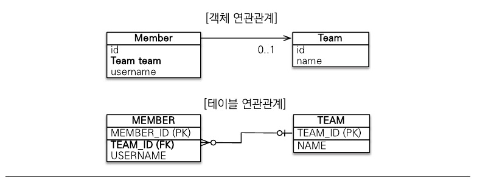

# 5장 연관관계 매핑 기초

객체는 참조(주소)를 사용해서 관계를 맺고 테이블은 외래 키를 사용해서 관계를 맺는다. 
객체 관계 매핑에서 가장 어려운 부분이 객체 연관관계와 테이블 연관관계를 매핑하는 일이다.  

연관관계 매핑을 이해하기 위한 핵심 키워드를 먼저 알아보자. 
- 방향 : [단방향, 양방향]이 있다. 두 관계가 있을 때 둘 중 한 쪽만 참조하는 것을 단방향 관계, 양쪽 모두
참여하는 것을 양방향 관계라 한다. 방향은 객체 관계만 존재하고 테이블은 항상 양방향 관계다.

- 다중성 : [다대일, 일대다, 일대일, 다대다] 다중성이 있다.

- 연관관계의 주인 : 객체를 양방향 연관관계로 만들면 연관관계의 주인을 정해야 한다.

## 5.1. 단방향 연관관계

회원과 팀의 관계를 통해 다대일 단방향 관계를 먼저 이해해보자.  

회원은 하나의 팀에만 소속될 수 있고 다대일 관계다.


- 객체 연관관계  

회원 객체는 Member.team(멤버변수)로 팀 객체와 연관관계를 맺는다.  

회원 객체와 팀 객체는 단방향 관계다. member -> team 조회는 가능하지만 team -> member는 불가능하다. 

- 테이블 연관관계  

회원 테이블은 TEAM_ID 외래키로 팀 테이블과 연관관계를 맺는다.  

회원과 팀 테이블은 양방향 관계다. 외래키로 양방향 조인이 가능하다.

- 객체 연관관계와 테이블 연관관계의 가장 큰 차이  

객체 연관관계는 언제나 단방향이다. 양방향으로 만들고 싶으면 반대쪽에도 필드를 추가해서 참조를 보관해야 한다.  

하지만 이것은 정확하게는 양방향 관계가 아닌 서로 다른 단방향 관계 2개다.

```java
// 객체 양방향 연관관계
class A{
    B b;
}
class B{
    A a;
}
```

- 객체 연관관계 vs 테이블 연관관계 정리  

객체는 참조(주소)로, 테이블은 외래 키로 연관관계를 맺는다.  

다시 정리하면 객체의 연관관계는 단방향, 테이블의 연관관계는 양방향이다.  

이제 둘을 매핑해보자.

### 5.1.1. 순수한 객체 연관관계

JPA를 사용하지 않은 회원과 팀 클래스 코드다.
```java
public class Member{
    
    private String id;
    private String username;
    
    private Team team;
    
    public void setTeam(Team team){
        this.team = team;
    }
    
    //Getter, Setter ...
}

public class Team{
    
    priavte String id;
    priavte String name;
    
    //Getter, Setter ...
}
```


동작 코드로 회원 1과 회원 2를 팀 1에 소속시키자.
```java
public static void main(String[] args){
    
    Member member1 = new Member("member1", "회원1");
    Member member2 = new Member("member2", "회원2");
    
    member1.setTeam(team1);
    member2.setTeam(team1);
    
    Team findTeam = member1.getTeam();
}
```

회원1과 2는 팀1에 소속했다. 그리고 `Team findTeam = member1.getTeam();` 코드로 회원1이 속한 팀을 알 수 있다.  

이처럼 객체는 참조를 사용해 연관관계 탐색이 가능한데 이를 객체 그래프 탐색이라 한다.

### 5.1.2. 테이블 연관관계

다음은 회원 테이블과 팀 테이블의 DDL이다.
```mysql
CREATE TABLE MEMBER{
	MEMBER_ID VARCHAR(255) NOT NULL,
	TEAM_ID VARCHAR(255),
	USERNAME VARCHAR(255),
	PRIMARY KEY (MEMBER_ID)
}

CREATE TABLE TEAM{
	TEAM_ID VARCHAR(255) NOT NULL,
	NAME VARCHAR(255),
	PRIMARY KEY (TEAM_ID)
}

ALTER TABLE MEMBER ADD CONSTRAINT FK_MEMBER_TEAM
	FOREIGN KEY (TEAM_ID)
	REFERENCES TEAM
```

SQL을 실행해 회원 1과 회원 2를 팀 1에 소속시키자.
```mysql
INSERT INTO TEAM VALUES('team1', '팀1');
INSERT INTO MEMBER VALUES('member1', 'team1', '회원1');
INSERT INTO MEMBER VALUES('member2', 'team1', '회원2');
```

SQL을 실행해 회원 1이 소속된 팀을 조회해보자.
```mysql
SELECT T.*
FROM MEMBER JOIN TEAM
ON MEMBER.TEAM_ID = TEAM.TEAM_ID
WHERE MEMBER.MEMBER_ID = 'member1'
```

이처럼 DB는 외래키를 사용해 연관관계 탐색이 가능한데 이것을 조인이라 한다.  

### 5.1.3. 객체 관계 매핑

이제 JPA를 사용해서 둘을 매핑해보자.  

```java
@Entity
public class Member{

		@Id 
        @Column(name = "MEMBER_ID")
		private String id;
		
		private String username;
		
		@ManyToOne // 연관관계 매핑
		@JoinColumn(name="TEAM_ID")
		private Team team;
		
		// Getter, Setter ...
}
```

```java
@Entity
public class Team{
		
		@Id @Column(name = "TEAM_ID")
		private String id;
		private String name;
		
		// Getter, Setter ...
}
```

- 객체 연관관계 : 회원 객체의 Member.team 필드 사용
- 테이블 연관관계 : 회원 테이블의 MEMBER.TEAM_ID 외래키 컬럼 사용

Member.team과 MEMBER.TEAM_ID를 매핑하는 것이 연관관계 매핑이다.  

- @ManyToOne : 이름 그대로 다대일 관계라는 매핑 정보다. 연관관계 매핑시 다중성을 나타내는 어노테이션은 필수다.
- @JoinColumn(name="TEAM_ID") : 조인 컬럼은 외래키를 매핑할 때 사용한다. name 속성에는 매핑할 외래키 이름을 지정한다. 생략 가능


### 5.1.4. @JoinColumn

| 속성                                                                              | 기능                          | 기본값                        |
|---------------------------------------------------------------------------------|-----------------------------|----------------------------|
| name                                                                            | 매핑할 외래키 이름                  | 필드명 + _ + 참조하는 테이블 기본키 컬럼명 |
| referencedColumnName                                                            | 외래키가 참조하는 대상 테이블 컬럼 명       | 참조하는 테이블의 기본키 컬럼명          |
| foreignKey(DDL)                                                                 | 외래키 제약조건 직접 지정. 테이블 생성시만 가능 |                            |
| unique<br/>nullable<br/>insertable<br/>updatable<br/>columnDefinition<br/>table | @Column의 속성과 같다.            |                            |


- @JoinColumn 생략 시 기본 전략 : 필드명 + _ + 참조하는 테이블의 컬럼명  

ex) 필드명(team) + _(밑줄) + 참조하는 테이블의 컬럼명(TEAM_ID) = team_TEAM_ID

### 5.1.5. @ManyToOne

다대일 관계에서 사용

| 속성           | 기능                             | 기본값                                                     |
|--------------|--------------------------------|---------------------------------------------------------|
| optional     | false로 설정 시 연관된 엔티티 항상 존재해야 함. | true                                                    |
| fetch        | 글로벌 페치 전략 설정                   | @ManyToOne=FetchType.EAGER<br/>@OneToMany=FetchType.LAZY |
| cascade      | 영속성 전이 기능                      |                                                         |
| targetEntity | 연관된 엔티티 타입 정보 설정. 거의 사용 X      |                                               |

