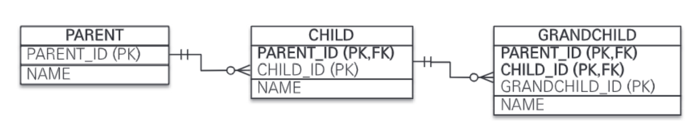
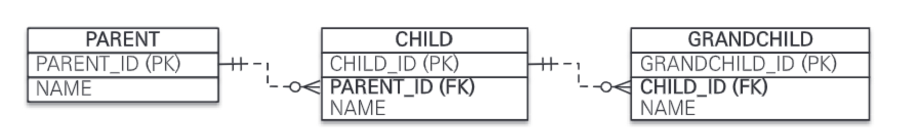
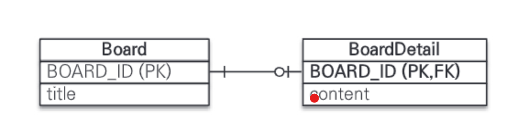

이 장에서 다룰 고급 매핑은 다음과 같다.

- 상속 관계 매핑: 객체의 상속 관계를 데이터베이스에 어떻게 매핑하는지 다룬다.
- @MappedSuperclass: 등록일, 수정일 같이 여러 엔티티에서 공통으로 사용하는 매핑 정보만 상속받고 싶으면 이 기능을 사용하면 된다.
- 복합 키와 식별 관계 매핑: 데이터베이스의 식별자가 하나 이상일 때 매핑하는 방법을 다룬다. 그리고 데이터베이스 설계에서 이야기하는 식별 관계와 비식별 관계에 대해서도 다룬다.
- 조인 테이블: 테이블은 외래 키 하나로 연관관계를 맺을 수 있지만 연관관계를 관리하는 연결 테이블을 두는 방법도 있다. 여기서는 이 연결 테이블을 매핑하는 방법을 다룬다.
- 엔티티 하나에 여러 테이블 매핑하기: 보통 엔티티 하나에 테이블 하나를 매핑하지만 엔티티 하나에 여러 테이블을 매핑하는 방법도 있다. 여기서는 이 매핑 방법을 다룬다.

# 7.1 상속 관계 매핑

관계형 데이터베이스에는 객체지향 언어에서 다루는 상속이라는 개념이 없다. 대신에 슈퍼타이 ㅂ서브타입 관계라는 모델링 기법이 객체의 상속 개념과 가장 유사하다. ORM에서 상속 관계 매핑은 객체의 상속 구조와 데이터베이스의 슈퍼타입 서브타입 관계를 매핑하는 것이다.

슈퍼타입 서브타입 논리 모델을 물리 모델인 테이블로 구현할 때는 3가지 방법을 선택할 수 있다.

- 각각의 테이블로 변환: 각각을 모두 테이블로 만들고 조회할 때 조인을 사용한다. JPA에서는 조인 전략이라고 한다.
- 통합 테이블로 변환: 테이블을 하나만 사용해서 통합한다. JPA에서는 단일 테이블 전략이라고 한다.
- 서브타입 테이블로 변환: 서브 타입마다 하나의 테이블을 만든다. JPA에서는 구현 클래스마다 테이블 전략이라고 한다.

## 7.1.1 조인 전략

조인 전략은 엔티티 각각을 모두 테이블로 만들고 자식 테이블이 부모 테이블의 기본 키를 받아서 기본 키+외래 키로 사용하는 전략이다. 따라서 조회할 때 조인을 자주 사용한다. 이 전략을 사용할 때 주의할 점이 객체는 타입으로 구분할 수 있지만 테이블은 타입 개념이 없다. 따라서 타입을 구분하는 칼럼을 DTYPE 추가해야 한다. 

다음은 조인 전략을 사용한 예제이다.

```java
@Entity
@Inheritance(strategy = InheritanceType.JOINED)
@DiscriminatorColumn(name = "DTYPE")
public abstract class Item {
	@Id @GeneratedValue
	@Column(name = "ITEM_ID")
	private Long id;
	
	private String name;
	private int price;
	
}

@Entity
@DiscriminatorValue("A")
public Class Album extends Item {
	private String artist;
}

@Entity
@DiscriminatorValue("M")
public Class Moive extends Item {
	private String director;
	private String actor;
}
```

매핑 정보를 분석해보자.

- @Inheritance(strategy = InheritanceType.JOINED): 상속 매핑은 부모 클래스에 @Inheritanc를 사용해야 한다. 그리고 매핑 전략을 지정해야 하는데 여기서는 조인 전략을 사용하므로 InheritanceType.JOINED를 사용했다.
- @DiscriminatorColumn(name = "DTYPE"): 부모 클래스에 구분 칼럼을 추가한다. 이 칼럼으로 저장된 자식 테이블을 구분할 수 있다. 기본값이 DTYPE이므로 @DiscriminatorColumn으로 줄여 사용해도 된다.
- @DiscriminatorValue("M"): 엔티티를 저장할 때 구분 칼럼에 입력할 값을 지정한다. 만약 영화 엔티티를 저장하면 구분 칼럼인 DTYPE에 값 M이 저장된다.

기본값으로 자식 테이블은 부모 테이블의 ID 칼럼명을 그대로 사용하는데 만약 자식 테이블의 기본 키 칼럼명을 변경하고 싶으면 @PrimaryKeyJoinColumn을 사용하면 된다.

```java
@Entity
@DiscriminatorValue("B")
@PrimaryKeyJoinColumn(name = "BOOK_ID")
public Class Book extends Item {
	private String author;
	private String isbn;
}
```

다음은 조인 전략을 정리한 것이다.

**장점**

- 테이블이 정규화된다.
- 외래 키 참조 무결성 제약조건을 활용할 수 있다.
- 저장공간을 효율적으로 사용한다.

**단점**

- 조회할 때 조인이 많이 사용되므로 성능이 저하될 수 있다.
- 조회 쿼리가 복잡하다.
- 데이터를 등록할 INSERT SQL을 두 번 실행한다.

**특징**

- JPA 표준 명세는 구분 칼럼을 사용하도록 하지만 하이버네이트를 포함한 몇몇 구현체는 구분 칼럼 없이도 동작한다.

## 7.1.2 단일 테이블 전략

단일 테이블 전략은 이름 그대로 테이블 하나만 사용한다. 그리고 구분 칼럼으로 어떤 자식 데이터가 저장되었는지 구분한다. 조회할 때 조인을 사용하지 않으므로 일반적으로 가장 빠르다.

다음은 단일 테이블 전략을 매핑하는 예제이다.

```java
@Entity
@Inheritance(strategy = InheritanceType.SINGLE_TABLE)
@DiscriminatorColumn(name = "DTYPE")
public abstract class Item {
	@Id @GeneratedValue
	@Column(name = "ITEM_ID")
	private Long id;
	
	private String name;
	private int price;
	
}

@Entity
@DiscriminatorValue("A")
public Class Album extends Item { ... }

@Entity
@DiscriminatorValue("M")
public Class Moive extends Item { ... }

@Entity
@DiscriminatorValue("M")
public Class Book extends Item { ... }
```

InheritanceType.SINGLE_TABLE로 지정하면 단일 테이블 전략을 사용한다. 테이블 하나에 모든 것을 통합하므로 구분 칼럼을 필수로 사용해야 한다.

다음은 단일 테이블 전략을 정리한 것이다.

**장점**

- 조인이 필요 없으므로 일반적으로 조회 성능이 빠르다.
- 조회 쿼리가 단순하다.

**단점**

- 자식 엔티티가 매핑한 칼럼은 모두 null을 허용해야 한다.
- 단일 테이블에 모든 것을 저장하므로 테이블이 커질 수 있다. 그러므로 상황에 따라서는 조회 성능이 오히려 느려질 수 있다.

**특징**

- 구분 칼럼을 꼭 사용해야 한다. 따라서 @DiscriminatorColumn을 꼭 설정해야 한다.
- @DiscriminatorValue를 지정하지 않으면 기본으로 엔티티 이름을 사용한다.

## 7.1.3 구현 클래스마다 테이블 전략

구현 클래스마다 테이블 전략은 자식 엔티티마다 테이블을 만든다. 그리고 자식 테이블 각각에 필요한 칼럼이 모두 있다.

다음은 구현 클래스마다 테이블 전략을 매핑한 예제이다.

```java
@Entity
@Inheritance(strategy = InheritanceType.TABLE_PER_CLASS)
public abstract class Item {
	@Id @GeneratedValue
	@Column(name = "ITEM_ID")
	private Long id;
	
	private String name;
	private int price;
	
}

@Entity
public Class Album extends Item { ... }

@Entity
public Class Moive extends Item { ... }

@Entity
public Class Book extends Item { ... }
```

InheritanceType.TABLE_PER_CLASS를 설정하면 구현 클래스마다 테이블 전략을 사용한다. 이 전략을 자식 엔티티마다 테이블을 만든다. 일반적으로 추천하지 않는 전략이다.

다음은 구현 클래스마다 테이블 전략을 정리한 것이다.

**장점**

- 서브 타입을 구분해서 처리할 때 효과적이다.
- not null 제약조건을 사용할 수 있다.

**단점**

- 여러 자식 테이블을 함께 조회할 때 성능이 느리다.
- 자식 테이블을 통합해서 쿼리하기 어렵다.

**특징**

- 구분 칼럼을 사용하지 않는다.

# 7.2 @MappedSuperclass

지금까지 상속 매핑은 부모 클래스와 자식 클래스를 모두 데이터베이스 테이블과 매핑했다. 부모 클래스는 테이블과 매핑하지 않고 부모 클래스를 상속받는 자식 클래스에게 매핑 정보만 제공하고 싶으면 @MappedSuperclass를 사용하면 된다.

@MappedSuperclass는 추상 클래스와 비슷한데 @Entity는 실제 테이블과 매핑되지만 @MappedSuperclass는 실제 테이블과는 매핑되지 않는다. 단순히 매핑 정보를 상속할 목적으로만 사용된다.

다음은 @MappedSuperclass를 매핑한 예제이다.

```java
@MappedSuperclass
public abstract class BaseEntity {
	@Id @GeneratedValue
	private Long id;
	private String name;
}

@Entity
public class Member extends BaseEntity {
	private String email;
}

@entity
public class Selller extends BaseEntity {
	private String shopName;
}
```

BaseEntity에는 객체들이 주로 사용하는 공통 매핑 정보를 정의했다. 그리고 자식 엔티티들은 상속을 통해 BaseEntity의 매핑 정보를 물려받았다. 여기서 BaseEntity는 테이블과 매핑할 필요가 없고 자식 엔티티에게 공통으로 사용되는 매핑 정보만 제공하면 된다. 따라서 @MappedSuperclass를 사용했다.

부모로부터 물려받은 매핑 정보를 재정의 하려면 @AttributeOverrides나 @AttributeOverride를 사용하고, 연관관계를 재정의 하려면 @AssociationOverrids나 @AssociationOverrid를 사용하면 된다.

다음은 @MappedSuperclass의 특징이다.

- 테이블과 매핑되지 않고 자식 클래스에 엔티티의 매핑 정보를 상속하기 위해 사용한다.
- @MappedSuperclass로 지정한 클래스는 엔티티가 아니므로 em.find()나 JPQL에서 사용할 수 없다.
- 이 클래스를 직접 생성해서 사용할 일은 거의 없으므로 추상 클래스로 만드는 것을 권장한다.

# 7.3 복합 키와 식별 관계 매핑

복합 키를 매핑하는 방법과 식별 관계, 비식별 관계를 매핑하는 방법을 알아보겠다.

## 7.3.1 식별 관계 vs 비식별 관계

데이터베이스 테이블 사이에 관계는 외래 키가 기본 키에 포함되는지 여부에 따라 식별 관계와 비식별 관계로 구분한다.

### 식별 관계

식별 관계는 부모 테이블의 기본 키를 내려받아서 자식 테이블의 기본 키+외래 키로 사용하는 관계이다.

### 비식별 관계

비식별 관계는 부모 테이블의 기본 키를 받아서 자식 테이블의 외래 키로만 사용하는 관계이다.

비식별 관계는 외래 키에 NULL을 허용하는지에 따라 필수적 비식별 관계와 선택적 비식별 관계로 나누어진다.

- 필수적 비식별 관계: 외래 키에 NULL을 허용하지 않는다. 연관관계를 필수적으로 맺어야 한다.
- 선택적 비식별 관계: 외래 키에 NULL을 허용한다. 연관관계를 맺을지 말지 선택할 수 있다.

최근에는 데이터베이스 테이블을 설계할 때 비식별 관계를 주로 사용하고 꼭 필요한 곳에만 식별 관계를 사용하는 추세이다.

## 7.3.2 복합 키: 비식별 관계 매핑

JPA에서 식별자를 둘 이상 사용하는 복합 키를 사용할 경우 별도의 식별자 클래스를 만들어야 한다.

JPA는 복합 키를 지원하기 위해 @IdClass와 @EmbeddedId 2가지 방법을 제공한다. @IdClass는 관계형 데이터베이스에 가까운 방법이고 @EmbeddedId는 좀 더 객체지향에 가까운 방법이다.

### @IdClass


그림 7.1 복합 키 테이블

다음 그림 7.1을 매핑해보겠다.

다음은 @IdClass를 사용한 예제이다.

```java
@Entity
@IdClass(ParentId.class)
public class Parent {
	@Id
	@Column(name = "PARENT_ID1")
	private String id1;
	
	@Id
	@Column(name = "PARENT_ID2")
	private String id2;
	
	private String name;
}

public class ParentId implements Serializable {
	private String id1;
	private String id2;
	
	// 생성자, hashCode and equals
}
```

@IdClass를 사용할 때 식별자 클래스는 다음 조건을 만족해야 한다.

- 식별자 클래스의 속성명과 엔티티에서 사용하는 식별자의 속성명이 같아야 한다.
- Serializable 인터페이스를 구현해야 한다.
- equals, hashCode를 구현해야 한다.
- 기본 생성자가 있어야 한다.
- 식별자 클래스는 public이어야 한다.

다음은 복합 키를 사용한 엔티티를 저장하는 방법이다.

```java
Parent parent = new Parent();
parent.setId1("myId1");
parent.setId2("myId2");
parent.setName("parentName");
em.persist(parent);
```

저장 코드를 보면 식별자 클래스인 ParentId가 보이지 않는데 em.persist()를 호출하면 영속성 컨텍스트에 엔티티를 등록하기 직전에 내부에서 Parent.id1, Parent.id2 값을 사용해서 식별자 클래스인 ParentId를 생성하고 영속성 컨텍스트의 키로 사용한다.

다음은 복합 키로 조회하는 방법이다.

```java
ParentId parentId = new ParentId("myId1", "myId2");
Parent parent = em.find(Parent.class, parentId);
```

식별자 클래스인 ParentId를 사용해서 엔티티를 조회한다.

다음은 자식 클래스를 추가한 코드이다.

```java
@Entity
public class Child {
	@Id
	private String id;
	
	@ManyToOne
	@JoinColumns({
							@JoinColumn(name = "PARENT_ID1",
									referencedColumnName = "PARENT_ID1"),
							@JoinColumn(name = "PARENT_ID2",
									referencedColumnName = "PARENT_ID2")
	})
	private Parent parent;
}
```

부모 테이블의 기본 키 칼럼이 복합 키이므로 자식 테이블의 외래 키도 복합 키다. 따라서 외래 키 매핑 시 여러 칼럼을 매핑해야 하므로 @JoinColumns 어노테이션을 사용하고 각각의 외래 키 칼럼을 @JoinColumn으로 매핑한다.

### @EmbeddedId

@IdClass가 데이터베이스에 맞춘 방법이라면 @EmbeddedId는 좀 더 객체지향적인 방법이다.

다음은 @EmbeddedId를 사용한 예제이다.

```java
@Entity
public class Parent {
	@EmbeddedId
	private ParentId id;
	
	private String name;
}

@Embeddable
public class ParentId implements Serializable {
	@Column(name = "PARENT_ID1")
	private String id1;
	@Column(name = "PARENT_ID2")
	private String id2;
	
	// 생성자, hashCode and equals
}
```

@IdClass와는 다르게 @EmbeddedId를 적용한 식별자 클래스는 식별자 클래스에 기본 키를 직접 매핑한다.

@EmbeddedId를 적용한 식별자 클래스는 다음 조건을 만족해야 한다.

- @Embeddable 어노테이션을 붙여주어야 한다.
- Serializable 인터페이스를 구현해야 한다.
- equals, hashCode를 구현해야 한다.
- 기본 생성자가 있어야 한다.
- 식별자 클래스는 public이어야 한다.

다음은 엔티티를 저장하는 방법이다.

```java
Parent parent = new Parent();
ParentId parentId = new ParentId("myId1", "myId2");
parent.setId(parentId);
parent.setName("parentName");
em.persist(parent);
```

다음은 엔티티를 조회하는 방법이다.

```java
ParentId parentId = new ParentId("myId1", "myId2");
Parent parent = em.find(Parent.class, parentId);
```

## 7.3.3 복합 키: 식별 관계 매핑



그림 7.2 식별 관계 구현

그림 7.2를 보면 부모, 자식, 손자까지 계속 기본 키를 전달하는 식별 관계이다. 식별 관계에서 자식 테이블은 부모 테이블의 기본 키를 포함해서 복합 키를 구성해야 하므로 @IdClass나 @EmbeddedId를 사용해서 식별자를 매핑해야 한다.

### @IdClass

다음은 @IdClass를 사용해서 식별 관계를 매핑하는 예제이다.

```java
// 부모
@Entity
public class Parent {
	@Id @Column(name = "PARENT_ID")
	private String id;
	
	private String name;
}

// 자식
@Entity
@IdClass(ChildId.class)
public class Child {
	@Id
	@ManyToOne
	@JoinColumn(name = "PARENT_ID")
	public Parent parent;
	
	@Id @Column(name = "CHILD_ID")
	private String childId;
	
	private String name;
]

// 자식 ID
public class ChildId implements Serializable {
	private String parent;
	private String childId;
	
	// equals, hashCode
}

// 손자
@Entity
@IdClass(GrandChildId.class)
public class GrandChild {
	@Id
	@ManyToOne
	@JoinColumns({
					@JoinColumn(name = "PARENT_ID"),
					@JoinColumn(name = "CHILD_ID")
	})
	public Child child;
	
	@Id @Column(name = "GRANDCHILD_ID")
	private String id;
	
	private String name;
}

// 손자 ID
public class GrandChildId implements Serializable {
	private ChildId child;
	private String id;
	
	// equals, hashCode
}
```

식별 관계는 기본 키와 외래 키를 같이 매핑해야 한다. 따라서 식별자 매핑인 @Id와 연관관계 매핑인 @ManyToOne을 같이 사용하면 된다.

### @EmbeddedId

@EmbeddedId로 식별 관계를 구성할 때는 @MapsId를 사용해야 한다.

다음은 @EmbeddedId를 사용해서 식별 관계를 매핑하는 예제이다.

```java
@Entity
public class Parent {
	@Id @Column(name = "PARENT_ID")
	private String id;
	private String name;
}

@Entity
public class Child {
	@EmbeddedId
	private ChildId id;
	
	@MapsId("parentId")
	@ManyToOne
	@JoinColumn(name = "PARENT_ID")
	public Parent parent;
	
	private String name;
}

@Embeddable
public class ChildId implements Serializable {
	private String parentId;
	
	@Column(name = "CHILD_ID")	
	private String id;
	
	// equals, hashCode
}

@Entity
public class GrandChild {
	@EmbeddedId
	private GrandChildId id;
	
	@MapsId("childId")
	@ManyToOne
		@JoinColumns({
					@JoinColumn(name = "PARENT_ID"),
					@JoinColumn(name = "CHILD_ID")
	})
	private Child child;
	
	private String name;
}

@Embeddable
public class GrandChildId implements Serializable {
	private ChildId childId;
	
	@Column(name = "GRANDCHILD_ID")
	private String id;
	
	// equals, hashCode
}
```

@EmbeddedId는 식별 관계로 사용할 연관관계의 속성에 @MapsId를 사용하면 된다. @MapsId는 외래 키와 매핑한 연관관계를 기본 키에도 매핑하겠다는 뜻이다.

## 7.3.4 비식별 관계로 구현

방금의 예시였던 식별 관계 테이블을 다음 그림과 같이 비식별 관계로 변경해보자.



그림 7.3 비식별 관계로 변경

다음은 비식별 관계로 변경한 코드이다.

```java
@Entity
public class Parent {
	@Id @GeneratedValue
	@Column(name = "PARENT_ID")
	private Long id;
	private String name;
}

@Entity
public class Child {
	@Id @GeneratedValue
	@Column(name = "CHILD_ID")
	private Long id;
	private String name;
	
	@ManyToOne
	@JoinColumn(name = "PARENT_ID")
	public Parent parent;
}

@Entity
public class GrandChild {
	@Id @GeneratedValue
	@Column(name = "GRANDCHILD_ID")
	private GrandChildId id;
	private String name;

	@ManyToOne
	@JoinColumn(name = "CHILD_ID")
	private Child child;
}
```

식별 관계의 복합 키를 사용한 코드와 비교하면 매핑도 쉽고 코드도 단순하다. 그리고 복합 키가 없으므로 복합 키 클래스를 만들지 않아도 된다.

## 7.3.5 일대일 식별 관계



그림 7.4 식별 관계 일대일

그림 7.4를 보면 일대일 식별 관계는 자식 테이블의 기본 키 값으로 부모 테이블의 기본 키 값만 사용한다. 그래서 부모 테이블의 기본 키가 복합 키가 아니면 자식 테이블의 기본 키는 복합 키로 구성하지 않아도 된다.

다음은 일대일 식별 관계의 예제이다.

```java
@Entity
public class Board {
	@Id @GeneratedValue
	@Column(name = "BOARD_ID")
	private Long id;
	
	private String title;
	
	@OneToOne(mappedBy = "board")
	private BoardDetail boardDetail;
}

@Entity
public class BoardDetail {
	@Id
	private Long boardId;
	
	@MapsId
	@OneToOne
	@JoingColumn(name = "BOARD_ID")
	private Board board;
	
	private String content;
}
```

BoardDetail처럼 식별자가 단순히 칼럼 하나면 @MapsId를 사용하고 속성 값은 비워두면 된다. 이때 @MpasId는 @Id를 사용해서 식별자로 지정한 BoardDetail.boardId와 매핑된다.

## 7.3.6 식별과 비식별 관계의 장단점

- 식별 관계는 부모 테이블의 기본 키를 자식 테이블로 전파하면서 자식 테이블의 기본 키 카럶이 점점 늘어난다. 결국 조인할 때 SQL이 복잡해지고 기본 키 인덱스가 불필요하게 커질 수 있다.
- 식별 관계는 2개 이상의 칼럼을 합해서 복합 기본 키를 만들어야 하는 경우가 많다.
- 식별 관계를 사용할 때 기본 키로 비즈니스 의미가 있는 자연 키 칼럼을 조합하는 경우가 많다. 반면에 비식별 관계의 기본 키는 비즈니스와 전혀 관계없는 대리 키를 주로 사용한다. 비즈니스 요구사항은 시간이 지남에 따라 언젠가는 변한다. 식별 관계의 자연 키 칼럼들이 자식에 손자까지 전파되면 변경하기 힘들다.
- 식별 관계는 부모 테이블의 기본 키를 자식 테이블의 기본 키로 사용하므로 비식별 관계보다 테이블 구조가 유연하지 못하다.
- 일대일 관계를 제외하고 식별 관계는 2개 이상의 칼럼을 묶은 복합 키를 사용한다. JPA는 별도의 복합 키 클래스를 만들어서 사용해야 한다. 따라서 칼럼이 하나인 기본 키를 매핑하는 것보다 많은 노력이 필요하다.
- 비식별 관계의 기본 키는 주로 대리 키를 사용하는데 JPA는 @GeneratedValue처럼 대리 키를 생성하기 위한 편리한 방법을 제공한다.

내용을 정리하면 추천하는 방법은 비식별 관계를 사용하고 기본 키는 Long 타입의 대리 키를 사용하는 것이다.

# 7.4 조인 테이블

데이터베이스 테이블의 연관관계를 설정하는 방법은 크게 2가지이다.

- 조인 칼럼 사용
- 조인 테이블 사용

이번에는 조인 테이블을 사용하는 방법에 대해 알아보겠다.

## 7.4.1 일대일 조인 테이블

다음은 일대일 조인 테이블을 매핑한 예제이다.

```java
@Entity
public class Parent {
	@Id @GeneratedValue
	@Column(name = "PARENT_ID")
	private Long id;
	private String name;
	
	@OneToOne
	@JoinTable(name = "PARENT_CHILD",
						joinColumns = @JoinColumn(name = "PARENT_ID"),
						inverseJoinColumns = @JoinColumn(name = "CHILD_ID")
	)
	private Child child;
}

@Entity
public class Child {
	@Id @GeneratedValue
	@Column(name = "CHILD_ID")
	private Long id;
	private String name;
}
```

부모 엔티티를 보면 @JoinColumn 대신에 @JoinTable을 사용했다.

## 7.4.2 일대다 조인 테이블

다음은 일대다 조인 테이블을 매핑한 예제이다.

```java
@Entity
public class Parent {
	@Id @GeneratedValue
	@Column(name = "PARENT_ID")
	private Long id;
	private String name;
	
	@OneToMany
	@JoinTable(name = "PARENT_CHILD",
						joinColumns = @JoinColumn(name = "PARENT_ID"),
						inverseJoinColumns = @JoinColumn(name = "CHILD_ID")
	)
	private List<Child> child = new ArrayList<Child>();
}

@Entity
public class Child {
	@Id @GeneratedValue
	@Column(name = "CHILD_ID")
	private Long id;
	private String name;
}
```

## 7.4.3 다대일 조인 테이블

다음은 다대일 조인 테이블을 사용한 예제이다.

```java
@Entity
public class Parent {
	@Id @GeneratedValue
	@Column(name = "PARENT_ID")
	private Long id;
	private String name;
	
	@OneToMany(mappedBy = "parent")
	private List<Child> child = new ArrayList<Child>();
}

@Entity
public class Child {
	@Id @GeneratedValue
	@Column(name = "CHILD_ID")
	private Long id;
	private String name;
	
	@ManyToOne(optional = false)
	@JoinTable(name = "PARENT_CHILD",
						joinColumns = @JoinColumn(name = "CHILD_ID"),
						inverseJoinColumns = @JoinColumn(name = "PARENT_ID")
	)
	private Parent parent;
}
```

## 7.4.4 다대다 조인 테이블

다대다 관계를 만들려면 조인 테이블의 두 칼럼을 합해서 복합 유니크 제약조건을 걸어야 한다.

다음은 다대다 조인 테이블을 사용한 예제이다.

```java
@Entity
public class Parent {
	@Id @GeneratedValue
	@Column(name = "PARENT_ID")
	private Long id;
	private String name;
	
	@ManyToMany
	@JoinTable(name = "PARENT_CHILD",
						joinColumns = @JoinColumn(name = "PARENT_ID"),
						inverseJoinColumns = @JoinColumn(name = "CHILD_ID")
	)
	private List<Child> child = new ArrayList<Child>();
}

@Entity
public class Child {
	@Id @GeneratedValue
	@Column(name = "CHILD_ID")
	private Long id;
	private String name;
}
```

# 7.5 엔티티 하나에 여러 테이블 매핑

잘 사용하지는 않지만 @SecondaryTable을 사용하면 한 엔티티에 여러 테이블을 매핑할 수 있다.

다음은 한 엔티티에 여러 테이블을 매핑한 예제이다.

```java
@Entity
@Table(name = "BOARD")
@SecondaryTable(name = "BOARD_DETAIL",
			pkJoinColumns = @PrimaryKeyJoinColumn(name = "BOARD_DETAIL_ID"))
public class Board {
	@Id @GeneratedValue
	@Column(name = "BOARD_ID")
	private Long id;
	private String title;
	
	@Column(table = "BOARD_DETAIL")
	private String content;
}
```

Baord 엔티티는 @Table을 사용해서 BOARD 테이블과 매핑했다. 그리고 @SecondaryTable을 사용해서 BOARD_DETAL 테이블을 추가로 매핑했다.

content 필드는 @Column(table = "BOARD_DETAIL")을 사용해서 BOARD_DETAIL 테이블의 칼럼에 매핑했다.

# 7.6 정리

지금까지 다양한 고급 매핑을 다루었다. 먼저 객체의 상속 관계를 데이터베이스에 매핑하는 방법을 알아보았고, 다음으로 매핑 정보만 상속하는 @MappedSuperclass를 알아보았다. 복합 키를 매핑하는 방법을 학습하면서 데이터베이스의 식별 관계와 비식별 관계도 알아보았다. 테이블은 보통 외래 키로 연관관계를 맺는데, 조금 더 복잡하지만 유연한 연결 테이블을 두고 매핑하는 조인 테이블을 알아보았다. 마지막으로 한 엔티티에 여러 테이블을 연결하는 @SecondaryTable에 대해 알아보았다.