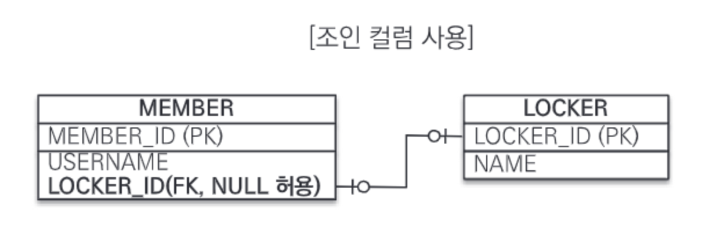
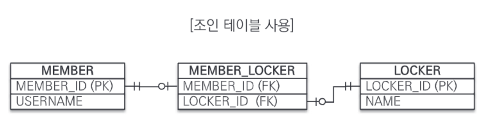
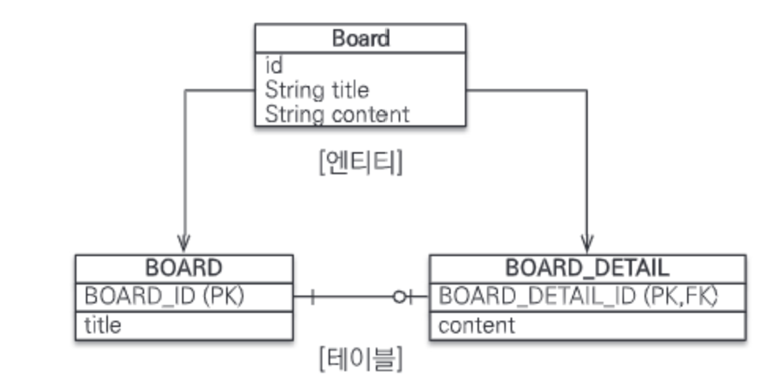

# 7장 고급 매핑

## 7.1. 상속 관계 매핑

관계형 데이터베이스에는 슈퍼타입 서브타입 관계 모델링 기법이 객체의 상속 개념과 유사하다. ORM에서 이야기하는 상속 관계 매핑은 
상속 구조와 슈퍼타입 서브타입 관계를 매핑하는 것이다.  

슈퍼타입 서브타입 논리 모델을 테이블로 구현할 떄는 3가지 방법을 선택할 수 있다.

1. 각각의 테이블로 변환 : 각각을 모두 테이블로 만들고 조회할 때 조인을 사용한다 . JPA에서는 조인 전략이라 한다.
2. 통합 테이블로 변환 : 테이블을 하나만 사용해서 통합한다. JPA에서는 단일 테이블 전략이라 한다.
3. 서브타입 테이블로 변환 : 서브 타입마다 하나의 테이블을 만든다. JPA에서는 구현 클래스마다 테이블 전략이라 한다.


### 7.1.1. 조인 전략

엔티티 각각을 모두 테이블로 만들고 자식 테이블이 부모 테이블의 기본키를 받아서 기본키 + 외래키로 사용하는 전략이다. 따라서 조회할 때 조인을 자주 사용한다.  

주의할 점은 테이블은 타입의 개념이 없어 타입을 구분하는 컬럼을 추가해야 한다. DTYPE 컬럼을 구분 컬럼으로 사용한다.  

```java
@Entity
@Inheritance(strategy = InheritanceType.JOINED)
@DiscriminatorColumn(name = "DTYPE")
public abstract class Item {
    
    @Id @GeneratedValue
    @Column(name = "ITEM_ID")
    private Long id;
    
    private String name;
    private int price;
}

@Entity
@DiscriminatorValue("A")
public class Album extends Item{
    private String article;
}

@Entity
@DiscriminatorValue("M")
public class Movie extends Item{
    private String director;
    private String actor;
}
```

1. @Inheritance(strategy = InheritanceType.JOINED) : 상속 매핑은 부모 클래스에 Inheritance를 사용해야 한다. 매핑 전략은 조인 전략이므로 JOINED를 사용했다.
2. @DiscriminatorColumn(name = "DTYPE) : 부모 클래스에 구분 컬럼을 지정한다. 이 컬럼으로 자식 테이블을 구분할 수 있다. 기본값은 DTYPE이다.
3. @DiscriminatorValue("M") : 엔티티를 저장할 때 구분 컬럼에 입력할 값을 지정한다. 영화 엔티티를 저장하면 구분 컬럼인 DTYPE에 M이 저장된다.

자식 테이블은 기본값으로 부모 테이블의 ID 컬럼명을 그대로 사용하는데 자식 테이블의 기본키 컬럼명을 변경하고 싶으면 @PrimaryKeyJoinColumn을 사용하면 된다.

ex) `@PrimaryKeyJoinColumn(name = "BOOK_ID")`

- 조인 전략의 장점  
1. 테이블의 정규화
2. 외래키 참조 무결성 제약조건 활용가능
3. 효율적인 저장공간 사용

- 조인 전략의 단점
1. 조회시 많은 조인 사용으로 성능 저하
2. 조회 쿼리 복잡
3. 데이터 등록 시 INSERT SQL 두 번 실행

- 특징  
JPA 표준 명세는 구분 컬럼을 사용하도록 하지만 하이버네이트 포함 몇몇 구현체는 구분 컬럼 없이도 동작한다.(@DiscriminatorColumn)

- 관련 어노테이션
@PrimaryKeyJoinColumn, @DiscriminatorColumn, @DiscriminatorValue

### 7.1.2. 단일 테이블 전략

테이블을 하나만 사용한다. 구분 컬럼(DTYPE)으로 어떤 자식 데이터가 저장되었는지 구분한다. 조인을 사용하지 않아 가장 빠르다.  

전략 사용 시 주의점은 자식 엔티티가 매핑한 컬럼은 모두 null을 허용해야 한다는 점이다.

```java
@Entity
@Inheritance(strategy = InheritanceType.SINGLE_TABLE)
@DiscriminatorColumn(name = "DTYPE")
public abstract class Item {
    
    @Id @GeneratedValue
    @Column(name = "ITEM_ID")
    private Long id;
    
    private String name;
    private int price;
}

@Entity
@DiscriminatorValue("A")
public class Album extends Item{
    ...
}

@Entity
@DiscriminatorValue("M")
public class Movie extends Item{
    ...
}
@Entity
@DiscriminatorVAlue("B")
public class Book extends Item {
    ...
}
}
```

SINGLE_TABLE로 지정시 단일 테이블 전략을 사용한다. 테이블 하나에 모든 것을 통합해 구분 컬럼을 필수로 사용해야 한다.  

- 단일 테이블 전략의 장점
1. 조인이 필요없어 조회 성능이 빠르다.
2. 조회 쿼리가 단순하다.

- 단일 테이블 전략의 단점
1. 자식 엔티티가 매핑한 컬럼은 모두 null을 허용해야 한다.
2. 단일 테이블에 모든 것을 저장해 테이블이 커질 수 있다. 그래서 상황에 따라 조회 성능이 느려질 수 있다.

- 특징  
1. 구분 컬럼을 꼭 사용해야 한다(@DiscriminatorColumn).
2. @DiscriminatorValue를 지정하지 않으면 기본값으로 엔티티 이름을 사용한다.

### 7.1.3. 구현 클래스마다 테이블 전략

자식 엔티티마다 테이블을 만든다. 자식 테이블 각각에 필요한 컬럼이 모두 있다.

```java
@Entity
@Inheritance(strategy = InheritanceType.TABLE_PER_CLASS)
public abstract class Item {

    @Id @GeneratedValue
    @Column(name = "ITEM_ID")
    private Long id;

    private String name;
    private int price;
}

@Entity
public class Album extends Item{
    ...
}

@Entity
public class Movie extends Item{
    ...
}
@Entity
public class Book extends Item {
    ...
}
}
```

일반적으로 추천하지 않는 방식이다.

- 구현 클래스마다 테이블 전략의 장점
1. 서브 타입을 구분해서 처리할 때 효과적이다.
2. not null 제약조건을 사용할 수 있다.

- 구현 클래스마다 테이블 전략의 단점.
1. 여러 자식 테이블을 함께 조회할 때 성능이 느리다.(UNION 사용으로)
2. 자식 테이블을 통합해서 쿼리하기 어렵다.

- 특징  
구분 컬럼을 사용하지 않는다.

## 7.2. @MappedSuperClass

부모 클래스는 테이블과 매핑하지 않고 부모 클래스를 상속받는 자식 클래스에게 매핑 정보만 제공하고 싶으면 
@MappedSuperClass를 사용하면 된다.  
@MappedSuperClass는 추상 클래스와 비슷한데 @Entity는 실제 테이블과 매핑되지만 @MappedSuperClass는 매핑되지 않는다. 매핑 정보 상속 목적으로만 사용된다.  

여기 서로 관계가 없는 회원, 판매자 테이블과 엔티티가 있다. 테이블은 그대로 두고 id, name 두 공통 속성을 부모 클래스로 모으고 객체 상속 관계로 만들어보자.
```java
@MappedSuperClass
public abstract class BaseEntity {

    @Id @GeneratedValue
    private Long id;
    private String name;
}

@Entity
public class Member extends BaseEntity{
    private String email;
}

@Entity
public class Seller extends BaseEntity{
    private String shopName;
}
}
```

BaseEntity에는 객체들의 공통 매핑 정보를 정의했다. BaseEntity는 테이블과 매핑할 필요가 없고 자식 엔티티에게 공통으로 
사용되는 매핑 정보만 제공하면 된다.  

부모로부터 물려받은 매핑 정보를 재정의하려면 @AttributeOverride나 @AttributeOverrides를 사용하고 연관관계를 재정의하려면 
@AssociationOverrides나 @AssociationOverride를 사용한다. 

```java
@Entity
@AttributeOverride(name = "id", column = @Column (name = "MEMBER_ID"))
public class Member extends BaseEntity{...}
```
부모에게 상속받은 id 속성의 컬럼명을 MEMBER_ID로 재정의했다.  
둘 이상 재정의시 @AttributeOverrides를 사용한다.

```java
@Entity
@AttributeOverrides ({
        @AttributeOverride(name = "id"}, column = @Column (name = "MEMBER_ID")),
        @AttributeOverride(name = "name"}, column = @Column (name = "MEMBER_NAME"))
})
public class Member extends BaseEntity{...}
```

- @MappedSuperClass의 특징
1. 테이블과 매핑되지 않고 자식 클래스에 엔티티의 매핑 정보를 상속하기 위해 사용된다.
2. 엔티티가 아니므로 em.find()나 JPQL에서 사용할 수 없다.
3. 추상 클래스로 만드는 것을 권장한다.

## 7.3. 복합 키와 식별 관계매핑

### 7.3.1. 식별 관계 vs 비식별 관계

DB 테이블 사이에 관계는 외래키가 기본키에 포함되는지에 따라 식별 관계와 비식별 관계로 구분한다.  

- 식별 관계  
부모 테이블의 기본키를 내려받아서 자식 테이블의 기본키 + 외래키로 사용하는 관계(외래키가 기본키에 포함).

- 비식별 관계  
부모 테이블의 기본키를 받아서 자식 테이블의 외래키로만 사용하는 관계.  

비식별 관계는 외래키에 NULL을 허용하는지에 따라 필수적 비식별 관계와 선택적 비식별 관계로 나뉜다.  

1. 필수적 비식별 관계 : 외래키에 NULL을 허용하지 않는다. 연관관계를 필수적으로 맺어야 한다.
2. 선택적 비식별 관계 : 외래키에 NULL을 허용한다. 연관관계를 맺을지 말지 선택할 수 있다.

최근에는 비식별 관계를 주로 사용하고 꼭 필요한 곳에만 식별 관계를 사용하는 추세다.

### 7.3.2. 복합 키 : 비식별 관계 매핑

JPA는 영속성 컨텍스트에 엔티티를 보관할 때 엔티티의 식별자를 키로 사용한다. 그리고 식별자 구분을 위해 equals와 hashCoide를 사용해서 동등성 비교를 한다. 
식별자 필드가 하나일 때는 자바 기본 타입을 사용하므로 문제가 없지만, 2개 이상이면 별도의 식별자 클래스를 만들고 그곳에 equals와 hashCode를 구현해야 한다.  

JPA는 복합키를 지원하기 위해 @IdClass와 @EmbeddedId 2가지 방법을 제공한다.  

@IdClass는 관계형 DB에 가까운 방법이고 @EmbeddedId는 객체지향에 가까운 방법이다.

#### @IdClass


그림의 복합키 테이블은 비식별 관걔고 PARENT는 복합 기본키를 사용한다. 여기의 부모, 자식은 객체 상속과는 무관하다. 
테이블의 키를 내려받은 것을 강조하려고 이름을 이렇게 지었다.  

PARENT 테이블은 복합키를 구성했다. 따라서 복합키를 매핑하기 위해 식별자 클래스를 별도로 만들어야 한다.

```java
@Entity
@IdClass(ParentId.Class)
public class Parent{
    @Id
    @Column(name = "PARENT_ID1")
    private String id1; //ParentId.id1과 연결
    
    @Id
    @Column(name = "PARENT_ID2")
    private String id1; //ParentId,id2와 연결
    
    private String name;
}
```
각각의 기본키 컬럼을 @Id로 매핑했다. 그리고 @IdClass를 사용해서 ParentId 클래스를 식별자 클래스로 지정했다.

```java
//식별자 클래스
public class ParentId implements Serializable{
    
    private String id1; //Parent.id1 매핑
    prviate String id2; //Parent.id2 매핑
    
    public ParentId(){
    }
    
    public ParentId(String id1, String id2){
        this.id1 = id1;
        this.id2 = id2;
    }
    
    @Override
    public boolean equals(Object o){ ... }
    
    @Override
    public int hashCode(){ ... }
}
```

@IdClass를 사용할 때 식별자 클래스는 다음 조건을 만족해야 한다.

1. 식별자 클래스의 속성명과 엔티티에서 사용하는 식별자의 속성명이 같아야 한다.
2. Serializable 인터페이스를 구현해야 한다.
3. equals, hashCode를 구현해야 한다.
4. 기본 생성자가 있어야 한다.
5. 식별자 클래스는 public이어야 한다.

복합키를 사용하는 엔티티를 저장해보자.
```java
Parent parent = new Parent();
parent.setId1("myId1"); //식별자
parent.setId2("myId2"); //식별자
parent.setName("parentName");
em.persist(parent);
```

식별자 클래스인 ParentId가 보이지 않는다.  

em.persist()를 호출하면 영속성 컨텍스트에 엔티티 등록 전 내부에서 Parent.id1, Parent.id2 값을 사용해 
식별자 클래스인 ParentId를 생성하고 영속성 컨텍스트의 키로 사용하기 때문이다.  

복합키로 조회해보자.
```java
ParentId parentId = new ParentId("myId1", "myId2");
Parent parent = em.find(Parent.class, parentId);
```

ParentId 식별자 클래스를 사용해서 엔티티를 조회한다.  

자식 클래스를 추가해보자.
```java
@Entity
public class Childe{
    @Id
    private String id;
    
    @ManyToOne
    @JoinColumns({
            @JoinColumn(name = "PARENT_ID1",
            referencedColumnName = "PARENT_ID1"),
            @JoinColumn(name = "PARENT_ID2"),
            referencedColumnName = "PARENT_ID2")
    })
    private Parent parent;    
}
```

부모 테이블의 기본키가 복합키이므로 자식 테이블의 외래키도 복합키다. 그래서 외래키를 여러컬럼 매핑해야 하므로 @JoinColumn 어노테이션을 
사용하고 각각의 외래키 컬럼을 @JoinColumn으로 매핑한다.  

@JoinColumn의 name 속성과 referencedColumnName 속성의 값이 같으면 referencedColumnName은 생략해도 된다.

#### @EmbeddedId

객체지향적인 방법이다.

```java
@Entity
public class Parent{
    @EmbeddedId
    private ParentId id;
    
    private String name;
}
```

Parent 엔티티에서 식별자 클래스를 직접 사용하고 @EmbeddedId 어노테이션을 적어주면 된다.  

식별자 클래스를 보자.
```java
@Embeddable
public class ParentId implements Serializable{
    @Column(name = "PARNET_ID1")
    private String id1;
    @COlumn(name = "PARENT_ID@")
    private String id2;
    
    //equals, hashCode 구현
}
```

@EmbeddedId를 적용한 식별자 클래스는 식별자 클래스에 기본키를 직접 매핑한다.  

@EmbeddedId를 적용한 식별자 클래스는 다음 조건을 만족해야 한다.
1. @Embeddable 어노테이션을 붙여주어야 한다.
2. Serializable 인터페이스를 구현해야 한다.
3. equals, hashCode를 구현해야 한다.
4. 기본 생성자가 있어야 한다.
5. 식별자 클래스는 public이어야 한다.

엔티티를 저장해보자.
```java
Parent parent = new Parent();
ParentId parentId = new ParentId("myId1", "myId2");
parent.setId(parentId);
parent.setName("parentName");
em.persist(parent);
```

식별자 클래스 parentId를 직접 생성해서 사용한다.  

엔티티를 조회해보자.
```java
ParentId parentId = new ParentId("myId1", "myId2");
Parent parent = em.find(Parent.class,parentId);
```

조회 코드도 식별자 클래스 parentId를 직접 사용한다.

#### 복합키와 equals(), hashCode()

복합키는 eqauls와 hashCode를 필수로 구현해야 한다. 다음 코드를 보자.
```java
ParentId id1 = new ParentId();
id1.setId1("myId1");
id1.setId2("myId2");

ParentId id2 = new ParentId();
id2.setId1("myId1");
id2.setId2("myId2");

id1.equals(id2) -> ?
```

순수 자바 코드다. id1과 id2는 같은 값을 가지고 있지만 인스턴스는 다르다.  
위 equals를 적절히 오버라이딩 했다면 참이 나오겠지만 오버라이딩하지 않았다면 거짓이다. 
자바의 모든 클래스는 기본적으로 Object 클래스를 상속받는데 이 클래스가 제공하는 기본 equals는 인스터스 참조값 비교인 
==(동일성 비교)를 하기 때문이다.  
영속성 컨텍스트는 엔티티의 식별자를 키로 사용해서 엔티티를 관리하고 식별자를 비교할 때 equals와 hashCode를 사용한다. 
따라서 식별자 객체의 동등성이 지켜지지 않으면 엔티티를 찾을 수 없는 등 문제가 발생한다. 따라서 복합키는 equals와 hashCode를
 필수로 구현해야 한다. 

#### @IdClass vs @EmbeddedId

각자 장단점이 있으므로 취향에 맞는 것을 일관성있게 사용하면 된다.  
@EmbeddedId가 객체지향적이고 중복도 없지만 상황에 따라 JPQL이 더 길어질 수 있다.

ex)
```java
em.createQuery("select p.id.id1, p.id.id2 from Parent p"); // EmbeddedId
em.createQuery("select p.id1, p.id2 from Parent p"); // IdClass
```

- 참고  
복합키에는 @GenerateValue를 사용할 수 없다.

### 7.3.3. 복합 키 : 식별 관계 매핑


그림을 보면 부모, 자식, 손자까지 계속 기본키를 전달하는 식별 관계다. 식별 관계에서 자식 테이블은 부모 테이블의 기본키를 
포함해서 복합키를 구성해야 하므로 @IdClass나 @EmbeddedId를 사용해서 식별자를 매핑해야 한다.

#### @IdClass와 식별 관계
```java
//부모
@Entity
public class Parent{
    @Id @Column(name = "PARENT_ID")
    private String id;
    private String name;
    ...
}

//자식
@Entity
@IdClass(ChildId.class)
public class Child{
    @Id
    @ManyToOne
    @JoinColumn(name = "PARENT_ID")
    public Parent parent;
    
    @Id @Column(name= "CHILD_ID")
    private String childId;
    
    private String name;
    ...
}

//자식ID
public class ChildId implements Serializable {
    private String parent; //Child.parent 매핑
    private String childId; //Child.childId 매핑
 
    //equals, hashCode
}
//손자
@Entity
@IdClass(GrandChild.Class)
public class GrandChild{
    @Id
    @ManyToOne
    @JoinColumns({
            @JoinColumn(name = "PARENT_ID"),
            @JoinColumn(name = "CHILD_ID")
    })
    private Child child;
    
    @Id @Column(name = "GRANDCHILD_ID")
    private String id;
    prviate String name;
}
//손자ID
public class GrandChildId implements Serializable {
    private String childId; //GrandChild.childId 매핑
    private String id; //GrandChild.Id 매핑

    //equals, hashCode
}
```

식별 관계는 기본키와 외래키를 같이 매핑해야 한다. Child 엔티티의 parent 필드를 보면 @Id로 기본키 매핑, @ManyToOne과 @JoinColumn
으로 외래키를 같이 매핑한다.

#### @EmbeddedId와 식별 관계

@EmbeddedId로 식별 관계를 구성할 때는 @MapsId를 사용해야 한다.
```java
//부모
@Entity
public class Parent{
    @Id @Column(name = "PARENT_ID")
    private String id;
    private String name;
    ...
}

//자식
@Entity
public class Child{
    @EmbeddedId
    private ChildId childId;
    
    @MapsId("parentId") //ChildId.parentId 매핑
    @ManyToOne
    @JoinColumn(name = "PARENT_ID")
    public Parent parent;
    
    private String name;
    ...
}

//자식ID
@Embeddable
public class ChildId implements Serializable {
    
    private String parent; //@MapsId("parentID")로 매핑
    
    @Column(name = "CHILD_ID")
    private String id;
 
    //equals, hashCode
}
//손자
@Entity
public class GrandChild{
    
    @EmbeddedId
    private GrandChildId id;
    
    @MapsId("childId") //GrandChild.childId 매핑
    @ManyToOne
    @JoinColumns({
            @JoinColumn(name = "PARENT_ID"),
            @JoinColumn(name = "CHILD_ID")
    })
    private Child child;
    
    prviate String name;
}
//손자ID
@Embeddable
public class GrandChildId implements Serializable {
    private ChildId childId; //@MapsId("childId")로 매핑
 
    @Column(name = "GRANDCHILD_ID")
    private String id;

    //equals, hashCode
}
```

@EmbeddedID는 식별 관계로 사용할 연관관계의 속성에 @MapsId를 사용하면 된다.  

Child 엔티티의 parent 필드를 보면 @Id 대신 @MapsId를 사용하였다. @MapsId는 외래키와 매핑한 연관관계를 기본키에도 매핑하겠다는 뜻이다.
@MapsId의 속성값은 @EmbeddedId를 사용한 식별자 클래스의 기본키 필드를 지정하면 된다.

### 7.3.4. 비식별 관계로 구현


비식별 관계의 테이블을 매핑해보자.

```java
//부모
@Entity
public class Parent{
    @Id @GeneratedValue
    @Column(name = "PARENT_ID")
    private Long id;
    private String name;
}

//자식
@Entity
public class Child{
    @Id @GeneratedValue
    @Column(name = "CHILD_ID")
    private Long id;
    private String name;
    
    @ManyToOne
    @JoinColumn(name = "PARENT_ID")
    private Parent parent;
}

//손자
@Entity
public class GrandChild {
    @Id @GeneratedValue
    @Column(name = "GRANDCHILD_ID")
    private Long id;
    private String name;

    @ManyToOne
    @JoinColumn(name = "CHILD_ID")
    private Child child;
}
```

매핑이 쉽고 코드도 단순하다. 복합키가 없으므로 복합키 클래스를 만들지 않아도 된다.

### 7.3.5. 일대일 식별 관계


자식 테이블의 기본키 값으로 부모 테이블의 기본키 값만 사용한다. 부모 테이블이 복합키가 아니면 자식 테이블도 복합키로 구성하지 않아도 된다.

```java
//부모
@Entity
public class Board{
    @Id @GeneratedValue
    @Column(name = "BOARD_ID")
    private Long id;
    
    private String title;
    
    @OneToOne(mappedBy = "board")
    private BoardDetail boardDetail;
}

//자식
@Entity
public class BoardDetail{
    @Id
    private Long boardid;
    
    @MapsId //BaordDetail.boardId와 매핑
    @OneToOne
    @JoinColumn(name = "BOARD_ID")
    private Board board;
    
    private String content;
}

```

식별자가 컬럼 하나면 @MapsId를 사용하고 속성 값은 비워두면 된다.  

코드의 @MapsID는 @Id를 사용해 식별자로 지정한 BoardDetail.boardId와 매핑된다.

### 7.3.6. 식별, 비식별 관계의 장단점

다음과 같은 이유로 비식별 관계를 선호한다.

- 식별관계  
1. 부모 테이블의 기본키를 자식 테이블로 전파하면서 자식 테이블의 기본키 컬럼이 점점 늘어나 조인 시 
SQL이 복잡해지고 기본키 인덱스가 커질 수 있다.
2. 2개 이상의 컬럼을 합해서 복합 기본키를 만들어야 하는 경우가 많다.
3. 비즈니스 요구사항은 시간이 지나면서 변한다. 식별 관계는 기본키로 비즈니스 의미가 있는
자연키 컬럼을 조합하는 경우가 많은데 자연키 컬럼들이 자식, 손자까지 전파되면 변경이 힘들다.
4. 부모 테이블의 기본키를 자식 테이블의 기본키로 사용하므로 테이블 구조가 비식별 관계보다 유연하지 못하다.

객체 관계 매핑의 관점에서 다음과 같은 이유로 비식별 관계를 선호한다.

1. 식별 관계는 2개 이상의 컬럼을 묶은 복합 기본키를 사용한다. JPA에서 복합키는 별도 복합키 클래스를 만들어서 사용해야 한다. 
컬럼이 하나인 기본키를 매핑하는 것보다 많은 시간이 든다.
2. 비식별 관계의 기본키는 주로 대리키를 사용하는데 JPA는 @GenerateValue같은 대리키를 생성하는 편리한 방법을 제공한다.

하지만 식별 관계는 기본키 인덱스를 활용하기 좋고, 
부모 테이블의 기본키를 자식, 손자도 갖고 있어 조인 없이 하위 테이블만으로 검색을 완료할 수 있다는 장점이 있다.  

정리하자면 프로젝트 시 추천방법은 가능한 비식별 관계를 사용하고 기본키는 Long 타입의 대리키를 사용하는 것이다.  

대리키는 비즈니스와 관련이 없어 비즈니스가 변경되어도 유연한 대처가 가능하다.  

JPA는 @GenerateValue를 통해 간편하게 대리키를 생성할 수 있다.  

선택적 비식별 관계는 NULL을 허용하므로 외부조인을 사용해야 한다. 하지만 필수적 관계는 NOT NULL로 항상 관계가 있다는 것을 보장해 
내부 조인만 사용해도 된다. 그래서 필수적 비식별 관계를 사용하는 것이 좋다.

## 7.4. 조인 테이블
DB 테이블의 연관관계를 설계하는 방법은 크게 2가지이다.

1. 조인 컬럼 사용(외래키)
2. 조인 테이블 사용(테이블 사용)

#### 조인 컬럼 사용
테이블 간 관계는 조인 컬럼이라 부르는 외래키 컬럼을 사용해 관리.  



#### 조인 테이블 사용


조인 컬럼은 외래키 컬럼만 추가해 연관관계를 맺지만 조인 테이블은 연관관계를 관리하는 조인 테이블을 추가해 두 테이블의 외래키로 연관관계를 관리한다.  

그래서 MEMBER와 LOCKER에는 연관관계 관리를 위한 외래키 컬럼이 없다. 회원이 원할 때 사물함을 선택하면 MEBMER_LOCEKR 테이블에만 값을 추가하면 된다.  

조인 테이블의 단점은 테이블을 하나 추가해야 한다는 점이다 관리하는 테이블이 늘어나고 회원과 사물함 두 테이블을 조인하려면 MEMBER_LOCKER
까지 추가로 조인해야 한다.  

따라서 기본은 조인 컬럼을 사용하고 필요하다고 판단되면 조인 테이블을 사용하자.

### 7.4.1. 일대일 조인 테이블
일대일 관계를 만들려면 조인 테이블의 외래키 컬럼 각각에 총 2개의 유니크 제약조건을 걸어야 한다.

```java
//부모
@Entity
public class Parent{
    @Id @GeneratedValue
    @Column(name = "PARENT_ID")
    private Long id;
    private String name;
    
    @OneToOne
    @JoinTable(name = "PARENT_CHILD",
    joinColumns = @JoinColumn(name = "PARENT_ID"),
    inverseJoinColumns = @JoinColumn(name = "CHILD_ID")
    )
    priavte Child child;
}

//자식
@Entity
public class Child{
    @Id @GeneratedValue
    @Column(name = "CHILD_ID")
    private Long id;
    private String name;
}
```

- @JoinTable의 속성
1. name : 매핑할 조인 테이블 이름
2. joinColumns : 현재 엔티티를 참조하는 외래키
3. inverseJoinColumns : 반대방향 엔티티를 참조하는 외래키

### 7.4.2. 일대다 조인 테이블
조인 테이블의 컬럼 중 다와 관련된 컬럼에 유니크 제약조건을 걸어야 한다.

```java
// 일대다 단방향 조인 테이블 매핑
//부모
@Entity
public class Parent{
    @Id @GeneratedValue
    @Column(name = "PARENT_ID")
    private Long id;
    private String name;
    
    @OneToMany
    @JoinTable(name = "PARENT_CHILD",
    joinColumns = @JoinColumn(name = "PARENT_ID"),
    inverseJoinColumns = @JoinColumn(name = "CHILD_ID")
    )
    private List<Child> child = new ArrayList<Child>();
}

//자식
@Entity
public class Child{
    @Id @GeneratedValue
    @Column(name = "CHILD_ID")
    private Long id;
    private String name;
}
```

### 7.4.3. 다대일 조인 테이블

```java
// 다대일 양방향 조인 테이블 매핑
//부모
@Entity
public class Parent{
    @Id @GeneratedValue
    @Column(name = "PARENT_ID")
    private Long id;
    private String name;

    @OneToMany(mappedBy = "parent")
    private List<Child> child = new ArrayList<Child>();
}

//자식
@Entity
public class Child{
    @Id @GeneratedValue
    @Column(name = "CHILD_ID")
    private Long id;
    private String name;

    @ManyToOne(optional = false)
    @JoinTable(name = "PARENT_CHILD",
         joinColumns = @JoinColumn(name = "CHILD_ID"),
         inverseJoinColumns = @JoinColumn(name = "PARENT_ID")
    )
    private Parent parent;
}
```

### 7.4.4. 다대다 조인 테이블

조인 테이블의 두 컬럼을 합해서 하나의 복합 유니크 제약조건을 걸어야 한다.
```java
//부모
@Entity
public class Parent{
    @Id @GeneratedValue
    @Column(name = "PARENT_ID")
    private Long id;
    private String name;

    @ManyToMany
    @JoinTable(name = "PARENT_CHILD",
         joinColumns = @JoinColumn(name = "PARENT_ID"),
         inverseJoinColumns = @JoinColumn(name = "CHILD_ID")
    )
    private List<Child> child = new ArrayList<Child>();
}

//자식
@Entity
public class Child{
    @Id @GeneratedValue
    @Column(name = "CHILD_ID")
    private Long id;
    private String name;
}
```

## 7.5. 엔티티 하나에 여러 테이블 매핑
잘 사용하지는 않지만 @SecondaryTable을 사용해 한 엔티티에 여러 테이블을 매핑할 수 있다.


```java
@Entity
@Table(name = "BOARD")
@SecondaryTable(name = "BOARD_DETAIL",
    pkjoinColumns = @PrimaryKeyJoinColumn(name = "BOARD_DETAIL_ID"))
public class Board{
    @Id @GeneratedValue
    @Column(name = "BOARD_ID")
    private Long id;
    
    private String title;
    
    @Column(table = "BOARD_DETAIL")
    private String content;
}
```
- @SecondaryTable 속성
1. name : 매핑할 다른 테이블의 이름
2. pkJoinColumns : 매핑할 다른 테이블의 기본키 컬럼 속성

content 필드는 @Column을 사용해서 BOARD_DETAIL 테이블 컬럼에 매핑했다. 
테이블을 지정하지 않으면 기본 테이블인 BOARD에 매핑된다.  

@SecondaryTable을 사용해 두 테이블을 하나의 엔티티에 매핑하는 방법보다는 테이블당 엔티티를 각각 만들어 
일대일 매핑하는 것을 권장한다.  

이 방법은 항상 두 테이블을 조회해 최적화가 어렵다. 실무에는 상속 관계 매핑과 @MappedSuperClass만 거의 사용한다.