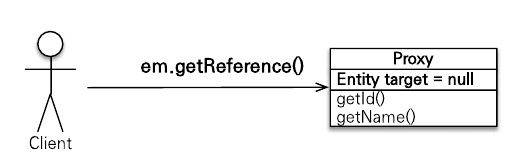
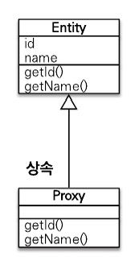
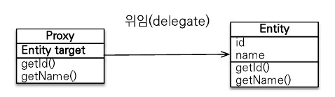
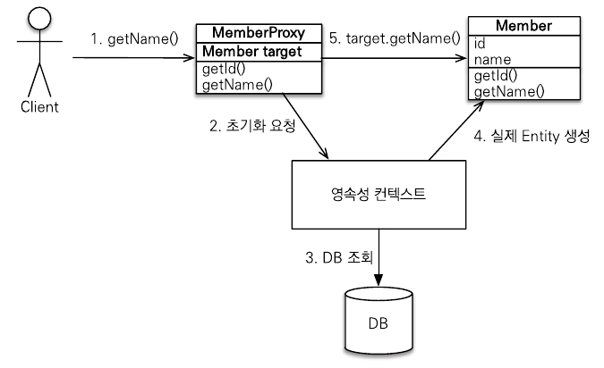
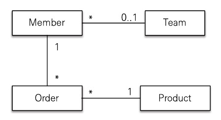
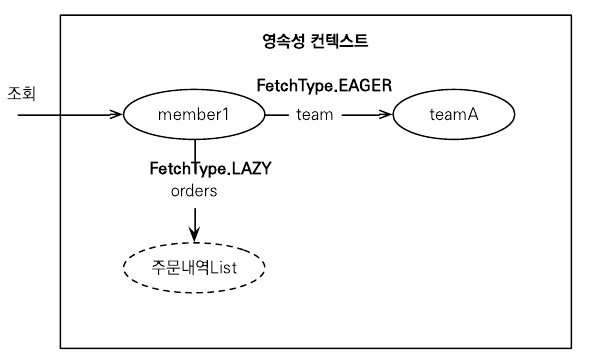

# 8.1 프록시

엔티티를 조회할 때 연관된 엔티티들이 항상 사용되는 것은 아니다. 비즈니스 로직에 따라 사용될 때도 있지만 그렇지 않을 때도 있다. 따라서 엔티티를 조회할 때 연관된 엔티티까지 함께 조회해 두는 것은 효율적이지 않다.

JPA는 이런 문제를 해결하려고 엔티티가 실제 사용될 때까지 데이터베이스 조회를 지연하는 방법을 제공하는데 이것을 지연 로딩이라고 한다. 그런데 지연 로딩 기능을 사용하려면 실제 엔티티 객체 대신에 데이터베이스 조회를 지연할 수 있는 가짜 객체가 필요한데 이것을 프록시 객체라고 한다.

## 8.1.1 프록시 기초

JPA에서 식별자로 엔티티 하나를 조회할 때는 EntityManager.find()를 사용한다. 이 메소드는 영속성 컨텍스트에 엔티티가 없으면 데이터베이스를 조회한다. 이렇게 엔티티를 직접 조회면 조회한 엔티티를 실제 사용하든 사용하지 않든 데이터베이스를 조회하게 된다. 엔티티를 실제 사용하는 시점까지 데이터베이스 조회를 미루고 싶으면 EntityManager.getReference() 메소드를 사용하면 된다.

아래는 예제 코드이다.

```java
Member member = em.getReference(Member.class, "member1");
```



그림 8.1 프록시 조회

이 메소드는 호출할 때 JPA는 데이터베이스를 조회하지 않고 실제 엔티티 객체도 생성하지 않는다. 대신에 데이터베이스 접근을 위임한 프록시 객체를 반환한다.



그림 8.2 프록시 구조

그림 8.2를 보면 프록시 클래스는 실제 클래스를 상속 받아서 만들어지므로 실제 클래스와 겉 모양이 같다. 따라서 사용하는 입장에서는 이것이 진짜 객체인지 프록시 객체인지 구분하지 않고 사용하면 된다.



그림 8.3 프록시 위임

그림 8.3을 보면 프록시 객체는 실제 객체에 대한 참조를 보관한다. 그리고 프록시 객체의 메소드를 호출하면 프록시 객체는 실제 객체의 메소드를 호출한다.

프록시 객체는 member.getName()처럼 실제 사용될 때 데이터베이스를 조회해서 실제 엔티티 객체를 생성하는데 이것을 프록시 객체의 초기화라 한다.

```java
Member member = em.getReference(Member.class, "id1");
member.getName(); // 프록시 객체 초기화
```



그림 8.4 프록시 초기화

그림 8.4는 프록시 객체의  초기화 과정이다.

프록시의 특징은 다음과 같다.

- 프록시 객체는 처음 사용할 때 한 번만 초기화한다.
- 프록시 객체를 초기화한다고 프록시 객체가 실제 엔티티로 바뀌는 것은 아니다.
- 프록시 객체는 원본 데이터를 상속받은 객체이므로 타입 체크 시에 주의해서 사용해야 한다.
- 영속성 컨텍스트에 찾는 엔티티가 이미 있으면 프록시가 아닌 실제 엔티티를 반환한다.
- 초기화는 영속성 컨텍스트의 도움을 받아야 가능하다. 따라서 준영속 상태의 프록시를 초기화하면 문제가 발생한다.

## 8.1.2 프록시와 식별자

엔티티를 프록시로 조회할 때 식별자 값을 파라미터로 전달하는데 프록시 객체는 이 식별자 값을 보관한다.

```java
Team team = em.getReference(Team.class, "team1");
team.getId();
```

프록시 객체는 식별자 값을 가지고 있으므로 식별자 값을 조회하는 team.getId()를 호출해도 프록시를 초기화하지 않는다. 단 엔티티 접근 방식을 프로퍼티(@Access(AccessType.PROPERTY))로 설정한 경우에만 초기화하지 않는다.

엔티티 접근 방식을 필드(@Access(AccessType.FIELD))로 설정하면 JPA는 getId() 메소드가 id만 조회하는 메소드인지 다른 필드까지 활용해서 어떤 일을 하는 메소드인지 알지 못하므로 프록시 객체를 초기화한다.

연관관계를 설정할 때는 식별자 값만 사용하므로 프록시를 사용하면 데이터베이스 접근 횟수를 줄일 수 있다. 참고로 연관관계를 설정할 때는 엔티티 접근 방식을 필드로 설정해도 프록시를 초기화하지 않는다.

## 8.1.3 프록시 확인

JPA가 제공하는 PersistenceUnitUtil.isLoaded(Object entity) 메소드를 사용하면 프록시 인스턴스의 초기화 여부를 확인할 수 있다. 아직 초기화되지 않은 프록시 인스턴스는 false를 반환한다. 이미 초기화되었거나 프록시 인스턴스가 아니면 true를 반환한다.

```java
boolean isLoad = em.getEntityMangerFactory()
										.getPersistenceUnitUtil.isLoaded(entity);
// 또는
boolean isLoad = emf.getPersistenceUnitUtil.isLoaded(entity);
```

# 8.2 즉시 로딩과 지연 로딩

JPA는 개발자가 연관된 엔티티의 조회 시점을 선택할 수 있도록 다음 두 가지 방법을 제공한다.

- 즉시 로딩: 엔티티를 조회할 때 연관된 엔티티도 함께 조회한다.
설정 방법: @ManyToOne(fetch = FetchType.EAGER)
- 지연 로딩: 연과된 엔티티를 실제 사용할 때 조회한다.
설정 방법: @ManyToOne(fetch = FetchType.LAZY)

프록시 객체는 주로 연관된 엔티티를 지연 로딩할 때 사용한다. 

## 8.2.1 즉시 로딩

즉시 로딩을 사용하려면 @ManyToOnw의 fetch 속성을 FetchType.EAGER로 지정한다.

다음은 즉시 로딩을 사용하기 위해 fetch 속성을 지정해준 예시이다.

```java
@Entity
public class Member {
	@ManyToOne(fetch = FetchType.EAGER)
	@JoinColumn(name = "TEAM_ID")
	private Team team;
	// ...
}
```

다음은 즉시 로딩을 실행하는 코드이다.

```java
Member member = em.find(Member.class, "member1");
Team team= member.getTeam();
```

위의 예제를 보면 회원과 팀을 즉시 로딩으로 설정했다. 따라서 em.find()로 조회하는 순간 팀도 함께 조회한다. 이때 회원과 팀 두 테이블을 조회해야 하므로 쿼리를 2번 실행할 것 같지만 대부분의 JPA 구현체는 즉시 로딩을 최적화하기 위해 가능하면 조인 쿼리를 사용한다.

## 8.2.2 지연 로딩

지연 로딩을 사용하려면 @ManyToOne의 fetch 속성을 FetchType.LAZY로 지정한다.

다음은 지연 로딩을 사용하기 위해 fetch 속성을 지정해준 예시이다.

```java
@Entity
public class Member {
	@ManyToOne(fetch = FetchType.LAZY)
	@JoinColumn(name = "TEAM_ID")
	private Team team;
	// ...
}
```

다음은 지연 로딩을 실행한 코드이다.

```java
Member member = em.find(Member.class, "member1");
Team team= member.getTeam();
team.getName(); // 팀 객체 실제 사용
```


그림 8.5 지연 로딩, 회원을 조회할 때 팀 지연 로딩

위의 예제를 보면 회원과 팀을 지연 로딩으로 설정했다. 따라서 em.find()를 호출하면 회원만 조회하고 팀은 조회하지 않는다. 대신 그림 8.5와 같이 조회한 회원의 team 멤버변수에 프록시 객체를 넣어둔다. 이 프록시 객체는 실제 사용될 때까지 데이터 로딩을 미룬다. 그래서 지연 로딩이라고 한다.

# 8.3 지연 로딩 활용

사내 주문 관리 시스템을 개발한다고 가정한다.



그림 8.6 클래스 모델

그림 8.6을 보고 예제에 사용할 모델을 분석해보자.

- 회원은 팀 하나에만 소속할 수 있다.
- 회원은 여러 주문내역을 가진다.
- 주문내역을 상품정보를 가진다.

애플리케이션 로직을 분석해보니 다음과 같았다.

- Member와 연관된 Team은 자주 함께 사용된다. 그래서 Member와 Team은 즉시 로딩으로 설정했다.
- Member와 연관된 Order는 가끔 사용되었다. 그래서 Member와 Order는 지연 로딩으로 설정했다.
- Order와 연관된 Product는 자주 함께 사용되었다. 그래서 Order와 Product는 즉시 로딩으로 설정했다.

다음은 회원 엔티티의 코드이다.

```java
@Entity
public class Member {
	@Id
	private String id;
	private String username;
	private Integer age;
	
	@ManyToOne(fetch = FetchType.EAGER)
	private Team team;
	
	@OneToMany(mappedBy = "member", fetch = FetchType.LAZY)
	private List<Order> orders;
	
	// ...
}
```

회원과 팀의 연관관계를 FetchType.EAGER로 설정했다. 따라서 회원 엔티티를 조회하면 연관된 팀 엔티티로 즉시 조회한다. 회원과 주문내역의 연관관계를 FetchType.LAZY로 설정했다. 따라서 회원 엔티티를 조회하면 연관된 주문내역 엔티티는 프록시로 조회해서 실제 사용될 때까지 로딩을 지연한다.



그림 8.7 회원 조회

회원 엔티티를 조회하면 그림 8.7처럼 엔티티를 로딩한다.

## 8.3.1 프록시와 컬렉션 래퍼

그림 8.7을 보면 즉시 로딩한 teamA는 실선으로 표현했고 지연 로딩한 주문내역은 점선으로 표현했다. 이렇게 지연 로딩으로 설정하면 실제 엔티티 대신에 프록시 객체를 사용한다. 프록시 객체는 실제 자신이 사용될 때까지 데이터베이스를 조회하지 않는다.

하이버네이트는 엔티티를 영속 상태로 만들 때 엔티티에 컬렉션이 있으면 컬렉션을 추적하고 관리할 목적으로 원본 컬렉션을 하이버네이트가 제공하는 내장 컬렉션으로 변경하는데 이를 컬렉션 래퍼라고 한다.

엔티티를 지연 로딩하면 프록시 객체를 사용해서 지연 로딩을 수행하지만 주문 내역 같은 컬렉션은 컬렉션 래퍼가 지연 로딩을 처리해준다. 컬렉션 래퍼도 컬렉션에 대한 프록시 역할을 한다.

## 8.3.2 JPA 기본 페치 전략

fetch 속성의 기본 설정값은 다음과 같다.

- @ManyToOne, @OneToOne: 즉시 로딩(FetchType.EAGER)
- @OneToMany, @ManyToMany: 지연 로딩(FetchType.LAZY)

JPA는 기본 페치 전략은 연관된 엔티티가 하나면 즉시 로딩을, 컬렉션이면 지연 로딩을 사용한다. 컬렉션을 로딩하는 것은 비용이 너무 많이 들고 잘못하면 너무 많은 데이터를 로딩할 수 있기 때문이다. 

## 8.3.3 컬렉션에 FetchType.EAGER 사용 시 주의점

컬렉션에 FetchType.EAGER를 사용할 경우에 주의할 점은 다음과 같다.

- 컬렉션을 하나 이상 즉시 로딩하는 것은 권장하지 않는다. 컬렉션과 조인한다는 것은 데이터베이스 테이블로 보면 일대다 조인이다. 일대다 조인은 결과 데이터가 다 쪽에 있는 수만큼 증가하게 된다. 문제는 서로 다른 컬렉션을 2개 이상 조인할 때 너무 많은 데이터를 반환하게 되고 결과적으로 애플리케이션 성능이 저하될 수 있다.
- 컬렉션 즉시 로딩은 항상 외부 조인을 사용한다. 예를 들어 다대일 관계인 회원 테이블과 팀 테이블을 조인할 때 회원 테이블의 외래 키에 not null 제약조건을 걸어두면 모든 회원은 팀에 소속되므로 항상 내부 조인을 사용해도 된다. 하지만 팀 테이블에서 회원 테이블로 일대다 관계를 조인할 때 회원이 한 명도 없는 팀을 내부 조인하면 팀까지 조회되지 않는 문제가 발생한다. 데이터베이스 제약조건으로 이런 상황을 막을 수 없어서 JPA는 일대다 관계를 즉시 로딩할 때 외부 조인을 사용한다.

# 8.4 영속성 전이: CASCADE

특정 엔티티를 영속 상태로 만들 때 연관된 엔티티도 함께 영속 상태로 만들고 싶으면 영속성 전이 기능을 사용하면 된다. JPA는 CASCADE 옵션으로 영속성 전이를 제공한다. 쉽게 말해서 영속성 전이를 사용하면 부모 엔티티를 저장할 때 자식 엔티티도 함께 저장할 수 있다.

다음은 부모 엔티티와 자식 엔티티의 코드이다.

```java
@Entity
public class Parent {
	@Id @GeneratedValue
	private Long id;
	
	@OneToMany(mappedBy = "parent")
	private List<Child> children = new ArrayList<Child>();
}

@Entity
public class Child {
	@Id @GeneratedValue
	private Long id;
	
	@ManyToOne
	private Parent parent;
}
```

다음은 부모 자식을 저장하는 코드이다.

```java
Parent parent = new Parent();
em.persist(parent);

Child child1 = new Child();
child1.setParent(parent);
parent.getChildren().add(child1);
em.persist(child1);

Child child2 = new Child();
child2.setParent(parent);
parent.getChildren().add(child2);
em.persist(child2);
```

JPA에서 엔티티를 저장할 때 연관된 모든 엔티티는 영속 상태여야 한다. 따라서 예제를 보면 부모 엔티티를 영속 상태로 만들고 자식 엔티티도 각각 영속 상태로 만든다. 이럴 때 영속성 전이를 사용하면 부모만 영속 상태로 만들면 연관된 자식까지 한 번에 영속 상태로 만들 수 있다.

## 8.4.1 영속성 전이: 저장

다음은 영속성 전이를 활성화하는 CASCADE 옵션을 적용하는 코드이다.

```java
@Entity
public class Parent {
	@OneToMany(mappedBy = "parent", cascade = CascadeType.PERSIST)
	private List<Child> children = new ArrayList<Child>();
}
```

부모를 영속화할 때 연관된 자식들도 함께 영속화하라고 cascade = CascadeType.PERSIST 옵션을 설정했다. 이 옵션을 적용하면 간편하게 부모와 자식 엔티티를 한번에 영속화할 수 있다.

다음은 CASCADE를 사용한 저장 코드이다.

```java
Child child1 = new Child();
Child child2 = new Child();

Parent parent = new Parent();
child1.setParent(parent);
child2.setParent(parent);
parent.getChildren().add(child1);
parent.getChildren().add(child2);

// 부모 엔티티와 연관된 자식 엔티티들 저장
em.persist(parent);

```

부모만 영속화하면 CascadeType.PERSIST로 설정한 자식 엔티티까지 함께 영속화해서 저장한다.

영속성 전이는 연관관계를 매핑하는 것과는 아무 관련이 없다. 단지 엔티티를 영속화할 때 연관된 엔티티도 같이 영속화하는 편리함을 제공할 뿐이다. 그래서 예제를 보면 양방향 연관관계를 추가한 다음 영속 상태로 만든 것을 확인할 수 있다.

## 8.4.2 영속성 전이: 삭제

저장된 부모와 자식 엔티티를 모두 제거하려면 다음 코드와 같이 각각의 엔티티를 하나씩 제거해야 한다.

```java
Parent findParent = em.find(Parent.class, 1L);
Child findChild1 = em.find(Parent.class, 1L);
Child findChild2 = em.find(Parent.class, 2L);

em.remove(findChild1);
em.remove(findChild2);
em.remove(findParent);
```

영속성 전이는 엔티티를 삭제할 때도 사용할 수 있다. CascadeType.REMOVE로 설정하고 다음 코드처럼 부모 엔티티만 삭제하면 연관된 자식 엔티티도 함께 삭제된다.

```java
Parent findParent = em.find(Parent.class, 1L);
em.remove(findParent);
```

코드를 실행하면 DELETE SQL을 3번 실행하고 부모는 물론 연관된 자식도 모두 삭제한다. 삭제 순서는 외래 키 제약 조건을 고려해서 자식을 먼저 삭제하고 부모를 삭제한다.

## 8.4.3 CASCADE 종류

다음은 CascadeType의 다양한 옵션들을 보여주는 예제이다.

```java
public enum CascadeType {
	ALL, // 모두 적용
	PERSIST, // 영속
	MERGE, // 병합
	REMOVE, // 삭제
	REFRESH, // REFRESH
	DETACH // DETACH
}
```

다음 처럼 여러 속성을 같이 사용할 수 있다.

# 8.5 고아 객체

JPA는 부모 엔티티와 연관관계가 끊어진 자식 엔티티를 자동으로 삭제하는 기능을 제공하는데 이것을 고아 객체 제거라고 한다. 이 기능을 사용해서 부모 엔티티의 컬렉션에서 자식 엔티티의 참조만 제거하면 자식 엔티티가 자동으로 삭제된다.

```java
@Entity
public class Parent {
	@Id @GeneratedValue
	private Long id;
	
	@OneToMany(mappedBy = "parent", orphanRemoval = true)
	private List<Child> children = new ArrayList<Child>();
}
```

예제를 보면 고아 객체 제거 기능을 활성화하기 위해 컬렉션에 orphanRemoval = true를 설정하였다. 이 컬렉션에서 제거한 엔티티는 자동으로 삭제된다.

고아 객체 제거는 참조가 제거된 엔티티는 다른 곳에서 참조하지 않는 고아 객체로 보고 삭제하는 기능이다. 따라서 이 기능은 참조하는 곳이 하나일 때만 사용해야 한다. 쉽게 이야기해서 특정 엔티티가 개인 소유하는 엔티티에만 이 기능을 적용해야 한다.

# 8.6 영속성 전이+고아 객체, 생명주기

일반적으로 엔티티는 EntityManager.persist()를 통해 영속화되고 EntityManger.remove()를 통해 제거된다. 이것은 엔티티 스스로 생명주기를 관리한다는 뜻이다. 그런데 CascadeType.ALL + orphanRemoval = true 두 옵션을 모두 활성화하면 부모 엔티티를 통해서 자식의 생명주기를 관리할 수 있다.

자식을 저장하려면 부모에 등록만 하면 된다.(CASCADE)

```java
Parent parent = em.find(Parent.class, parentId);
parent.addChild(child);
```

자식을 삭제하려면 부모에서 제거하면 된다.(orphanRemoval)

```java
Parent parent = em.find(Parent.class, parentId);
parent.getChildren().remove(revmoveObject);
```

# 8.7 정리

지금까지 프록시의 동작 원리에 대해 알아보고 즉시 로딩과 지연 로딩에 관해서도 알아보았다. 그리고 영속성 전이와 고아 객체 제거 기능도 알아보았다. 다음은 이 장의 주요 내용이다.

- JPA 구현체들은 객체 그래프를 마음껏 탐색할 수 있도록 지원하는데 이때 프록시 기술을 사용한다.
- 객체를 조회할 때 연관된 객체를 즉시 로딩하는 방법을 즉시 로딩이라고 하고, 연관된 객체를 지연해서 로딩하는 방법을 지연 로딩이라고 한다.
- 객체를 저장하거나 삭제할 때 연관된 객체도 함께 저장하거나 삭제할 수 있는데 이것을 영속성 전이라고 한다.
- 부모 엔티티와 연관관계가 끊어진 자식 엔티티를 자동으로 삭제하려면 고아 객체 제거 기능을 사용하면 된다.