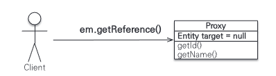
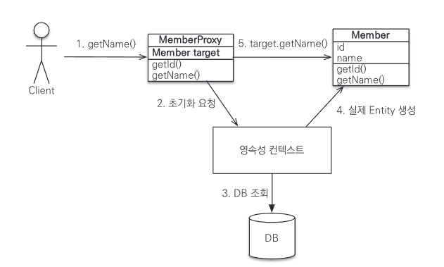
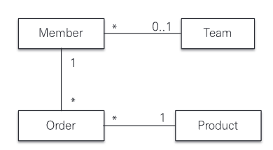

# 8장 프록시와 연관관계 관리

## 8.1. 프록시
엔티티를 조회할 때 연관된 엔티티들이 항상 사용되는 것은 아니다. 회원 엔티티와 팀 엔티티를 보자.

```java
@Entity
public class Member{
    
    private String username;
    
    @ManyToOne
    private Team team;
    ...
}

@Entity
public class Team{
    
    priavte String name;
}
```
```java
//회원과 팀 정보 출력

 public void printUserAndTeam(String memberId){
    Member member = em.find(Member.class, memberId);
    Team team = member.getTeam();
    System.out.println("회원 이름:" + member.getUsername());
    System.out.println("소속팀: " + team.getnName());
        }
```

```java
//회원 정보만 출력
public String printUser(String memberId){
    Member member = em.find(Member.class, memberId);
    System.out.println("회원 이름: " + member.getUsername());
        }
```

printUserAndTeam 메소드는 회원 엔티티를 찾아서 회원과 연관된 팀의 이름도 출력한다.  

printUser 메소드는 회원 엔티티만 출력에 사용하고 회원과 연관된 팀 엔티티는 전혀 사용하지 않는다.  

printUser 메소드는 회원 엔티티만 사용해 회원 엔티티를 조회할 때 팀 엔티티까지 DB에서 함께 조회하는 것은 효율적이지 않다.  

JPA는 이런 문제를 해결하기 위해 엔티티가 실제 사용될 때까지 DB 조회를 지연하는 방법을 제공하는데 이를 지연 로딩이라 한다. 
엔티티의 값을 실제 사용하는 시점에 DB에서 팀 엔티티에 필요한 데이터를 조회하는 것이다.  

지연 로딩 기능을 사용하려면 실제 엔티티 객체 대신 DB 조회를 지연할 수 있는 가짜 객체가 필요한데 이것을 `프록시 객체`라 한다.

### 8.1.1. 프록시 기초
JPA에서 식별자로 엔티티 조회시 find()를 사용한다. 이 메소드는 영속성 컨텍스트에 엔티티가 없으면 DB를 조회한다.  

`Member member = em.find(Member.class, "member1")`  
엔티티를 직접 조회하면 조회한 엔티티를 실제 사용하든 사용하지 않든 DB를 조회하게 된다. 엔티티를 실제 사용 시점까지 조회를 미루고 싶으면 
EntityManager.getReference() 메소드를 사용하면 된다.  
`Member member = em.getReference(Member.class, "member1")`  
이 메소드를 호출할 때 JPA는 DB를 조회하지 않고 실제 엔티티 객체도 생성하지 않는다. 대신 DB 접근을 위임한 프록시 객체를 반환한다.



#### 프록시의 특징

프록시 클래스는 실제 클래스를 상속 받아서 만들어져 실제 클래스와 겉 모양이 같다. 사용하는 입장에서는 진자 객체인지 프록시 객체인지 구분하지 않고
 사용하면 된다.  

프록시 객체는 실제 객체에 대한 참조를 보관한다. 그리고 프록시 객체의 메소드를 호출하면 프록시 객체는 실제 객체의 메소드를 호출한다. 

#### 프록시 객체의 초기화
프록시 객체는 member.getName()처럼 실제 사용될 때 DB를 조회해서 실제 엔티티 객체를 생성하는데 이를 프록시 객체의 초기화라 한다.  

```java
//MemberProxy 반환. 프록시 초기화 예제
Member member = em.getReference(Member.class, "id1");
member.getName(); //1. getName();
```

```java
//프록시 클래스 예상 코드
class MemberProxy extends Member{
    Member target = null; // 실제 엔티티 참조
    
    public string getName(){
        if(target == null){
            
            //2. 초기화 요청
            //3. DB 조회
            //4. 실제 엔티티 생성 및 참조 보관
            this.target = ...;
        }
        
        //5. target.getName();
        return target.getName();
    }

}
```


1. 프록시 객체에 member.getName()을 호출해서 실제 데이터를 조회한다.
2. 실제 엔티티가 생성되어 있지 않으면 영속성 컨텍스트에 실제 엔티티 생성을 요청하는데 이것이 초기화다.
3. 영속성 컨텍스트는 DB를 조회해 실제 엔티티 객체를 생성한다.
4. 프록시 객체는 생성된 실제 엔티티 객체의 참조를 Member target 멤버변수에 보관한다.
5. 프록시 객체는 실제 엔티티 객체의 getName()을 호출해서 결과를 반환한다.

#### 프록시의 특징
1. 처음 사용할 때 한번만 초기화된다.
2. 초기화한다고 프록시 객체가 실제 엔티티로 바뀌는 것은 아니다. 초기화되면 프록시 객체를 통해 실제 엔티티에 접근할 수 있다.
3. 원본 엔티티를 상속받은 객체이므로 타입 체크시에 주의해야 한다.
4. 영속성 컨텍스트에 찾는 엔티티가 이미 있으면 DB를 조회할 필요가 없으므로 em.getReference()를 호출해도 프록시가 아닌 실제 엔티티를 반환한다.
5. 초기화는 영속성 컨텍스트의 도움을 받아야 가능하다. 도움을 받을 수 없는 준영속 상태의 프록시를 초기화하면 문제가 발생한다.

#### 준영속 상태와 초기화
```java
Member member = em.getReference(Member.class, "id1");
transaction.commit();
em.close(); //영속성 컨텍스트 종료

member.getName(); // 준영속 상태 초기화 시도. 예외 발생
```
em.close 로 영속성 컨텍스트를 종료해서 member는 준영속 상태다. member.getName()을 호출하면 프록시를 초기화해야 하는데 
영속성 컨텍스트가 없으므로 예외가 발생한다.

### 8.1.2. 프록시와 식별자
엔티티를 프록시로 조회할 때 식별자(기본키) 값을 파라미터로 전달하는데 프록시 객체는 이 식별자 값을 보관한다. 
프록시 객체는 조회 후에는 식별자 값을 가지고 있어 식별자 값을 조회하는 team.getId()를 호출해도 프록시를 초기화하지 않는다.  

단 엔티티 접근 방식을 @Access(AccessType.PROPERTY)로 설정한 경우에만 초기화하지 않는다.  

접근 방식을 @Access(AccessType.FIELD)로 설정하면 JPA는 getId() 메소드가 id만 조회하는 메소드인지 다른 필드도 활용해서 
어떤 일을 하는 메소드인지 알지 못해 프록시 객체를 초기화한다. 

### 8.1.3. 프록시 확인
JPA가 제공하는 PersistenceUniUtil.isLoaded(Object entity) 메소드를 사용하면 프록시 인스턴스의 초기화 여부를 알 수 있다. 
아직 초기화되지 않은 프록시 인스턴스는 false를 반환한다. 초기화되었거나 프록시 인스턴스가 아니면 true를 반환한다.  

조회한 엔티티가 실제 엔티티인지 프록시로 조회한 것인지 확인하려면 클래스 명을 직접 출력해보면 된다. 클래스 명 뒤 javassist라 되어 있으면 프록시이다. 

## 8.2. 즉시 로딩과 지연 로딩
프록시 객체는 주로 연관된 엔티티를 지연 로딩할 때 사용한다.  

member 1이 team 1에 속해 있다고 가정하자.

```java
Member member = em.find(Member.class, "member1");
Team team = member.getTeam(); //객체 그래프 탐색
System.out.println(team.getName()); // 팀 엔티티 사용
```

JPA는 개발자가 연관된 엔티티의 조회 시점을 선택할 수 있도록 2가지 방법을 제공한다.  

1. 즉시 로딩 : 엔티티 조회 시 연관 엔티티도 함께 조회한다.  
@ManyToOne(fetch = FetchType.EAGER) 사용
2. 지연 로딩 : 연관된 엔티티를 실제 사용할때 조회.  
@ManyToOne(fetch = FetchType.LAZY) 사용

### 8.2.1. 즉시 로딩
```java
@Entity
public class Member{
    
    @ManyToOne(fetch = FetchType.EAGER)
    @JoinCoulmn(name = "TEAM_ID")
    private team team;
    ...
}
```

`em.find(Member.class, "member1")`로 회원을 조회하는 순간 팀도 함께 조회한다.  

이 때 JPA 구현체는 즉시 로딩을 최적화하기 위해 가능한 조인 쿼리를 사용한다. 이후 member.getTeam()을 호출하면 이미 로딩된 팀1 엔티티를 반환한다.

#### 참고

외래키를 가지고 있는 테이블에서 외래키가 NULL 값을 허용하고 있으면 외래키의 값이 없는 테이블이 있을 수 있다. 이 때 내부조인을 하게 되면 
두 데이터 모두 조회할 수 없게 된다.  

JPA는 이런 상황을 고려해 즉시 로딩 조인 시 외부조인을 사용한다. 하지만 내부조인을 하는 것이 성능, 최적화에 유리하다.  

내부 조인을 사용하려면 외래키에 NOT NULL 제약 조건을 설정하면 값이 있는 것을 보장하니 내부 조인을 사용할 수 있다.  

JPA에게도 @JoinColumn에 nullable = false 설정을 해줘 NOT NULL이라고 알려주면 JPA는 내부 조인을 사용한다.  

- nullable 설정에 따른 조인 전략  
1. @JoinColumn(nullable = true): NULL 허용(기본값). 외부 조인 사용
2. @JoinColumn(nullable = false): NOT NULL. 내부 조인 사용
3. 또는 @ManyToOne.optional = false로 설정해도 내부 조인을 사용한다. 

### 8.2.2. 지연 로딩
```java
@Entity
public class Member{
    
    @ManyToOne(fetch = FetchType.LAZY)
    @JoinCoulmn(name = "TEAM_ID")
    private team team;
    ...
}
```

`em.find(Member.class, "member1"`을 호출하면 회원만 조회하고 팀은 조회하지 않는다. 대신 회원의 team 멤버변수에 프록시 객체를 넣어둔다.  

`Team team = member.getTeam(); //프록시 객체`  

반환된 팀 객체는 프록시 객체다. 이 프록시 객체는 실제 사용될 때까지 데이터 로딩을 미뤄둔다. 그래서 지연 로딩이다. 
실제 데이터가 필요한 순간이 되서야 DB를 조회해서 프록시 객체를 초기화한다. 

- 참고 : 조회 대상이 영속성 컨텍스트에 있으면 프록시 객체가 아닌 실제 객체를 사용한다.

### 8.2.3. 즉시 로딩, 지연 로딩 정리

1. 지연 로딩(LAZY) : 연관된 엔티티를 프록시로 조회한다. 프록시를 실제 사용할 때 초기화하면서 DB를 조회한다.
2. 즉시 로딩(EAGER) : 연관된 엔티티를 즉시 조회한다. 하이버네이트는 가능하면 SQL 조인을 사용해 한 번에 조회한다.

## 8.2. 지연 로딩 활용
사내 주문 관리 시스템을 개발한다고 가정해보자.


- 회원은 팀 하나에만 소속할 수 있다.(N:1)
- 회원은 여러 주문내역을 가진다. (1:N)
- 주문내역은 상품정보를 가진다. (N:1)

애플리케이션 로직을 분석해보니 다음과 같았다.

- Member와 연관된 Team은 함께 자주 사용해 즉시 로딩으로 설정
- Member와 연관된 Order는 가끔 사용해 지연 로딩으로 설정
- Order와 연관된 Product는 함께 자주 사용해 즉시 로딩으로 설정.

```java
@Entity
public class Member{
    
    @Id 
    private String id;
    private String username;
    private Integer age;
    
    @ManyToOne(fetch = FetchType.EAGER)
    private Team team;
    
    @OneToMany(mappedBy = "member", fetch = FetchType.LAZY)
    private List<Order> orders;
    ...
}
```

회원과 팀의 연관관계는 즉시 로딩이다. 회원 엔티티를 조회하면 팀 엔티티도 즉시 조회한다.  

회원과 주문내역은 지연 로딩이다. 회원 엔티티를 조회하면 연관된 주문내역 엔티티는 프록시로 조회해서 실사용 될 때까지 로딩을 지연한다.

### 8.3.1. 프록시와 컬렉션 래퍼

프록시 객체는 실제 자신이 사용될 때까지 DB를 조회하지 않는다. 이제 주문내역을 조회해보자.

```java
Member member = em.find(Member.class, "member1");
List<Order> orders = member.getOrders();
System.out.println("orders = " + orders.getClass().getName());
// 결과: orders = org.hibernate.colletion.internal.PersistentBag
```

하이버네이트는 엔티티를 영속 상태로 만들 때 엔티티에 컬렉션이 있으면 컬렉션을 추적하고 관리 목적으로 원본 컬렉션을 하이버네이트가 제공하는 내장 컬렉션으로 
변경하는데 이를 컬렉션 래퍼라 한다. 출력 결과에 컬랙션 래퍼가 반환된 것을 확인할 수 있다.  

주문 내역 같은 컬렉션은 컬렉션 래퍼가 지연 로딩을 처리해준다.  

`member.getOrders()`를 호출해도 컬렉션은 초기화되지 않는다. 컬렉션은 `member.getOrders().get(0)`처럼 실제 데이터를 
조회할 때 DB를 조회해서 초기화한다.  

`member.getOrders().get(0)`을 호출해서 연관된 주문내역을 조회하면 어떻게 될까?  
주문 내역과 상품의 로딩 방법은 즉시 로딩이다. 따라서 지연 로딩 상태인 주문 내역을 초기화할 때 연관된 상품도 함꼐 로딩된다.  

### 8.3.2. JPA 기본 페치 전략
fetch 속성의 기본 설정값은 다음과 같다. 
- @ManyToOne, @OneToOne : 즉시 로딩(EAGER)
- @OneToMany, @ManyToMany : 지연 로딩(LAZY)  

JPA의 기본 페치 전략은 연관된 엔티티가 하나면 즉시 로딩, 컬렉션이면 지연 로딩을 사용한다. 컬렉션 로딩은 비용이 많이 들고 너무 많은 데이터를 로딩할 수 있기 때문이다.  
추천 방법은 모든 연관관계에 지연 로딩을 사용하는 것이다. 그리고 개발이 어느 정도 완료 단계에 왔을 때 실제 사용하는 상황을 보고 필요한 곳에만 즉시 로딩을 사용하도록 최적화한다.  

SQL을 사용하면 이런 최적화가 어렵다. SQL로 각각 테이블을 조회해서 처리하다가 조인으로 한 번에 조회하도록 변경하려면 많은 SQL과 애플리케이션 코드를 수정해야 한다. 

### 8.3.3. 컬렉션에 FetchType.EAGER 사용 시 주의점

1. 컬렉션을 하나 이상 즉시 로딩하는 것은 권장하지 않는다.  
컬렉션과 조인한다는 것은 DB 테이블로 보면 일대다 조건이다. 일대다 조인은 결과 데이터가 다 쪽에 있는 수만큼 증가하게 된다. 문제는 다른 컬렉션을 2개 이상 조인할 때 발생한다. 
A 테이블을 N, M 두 테이블과 일대다 조인하면 SQL 실행 결과가 N 곱하기 M이 되면서 많은 데이터를 반환해 애플리케이션 성능이 저하될 수 있다.
2. 컬렉션 즉시 로딩은 항상 외부 조인을 사용한다.  
예를 들어 다대일 관계인 회원 테이블과 팀 테이블을 조인할 때 회원 테이블의 외래키에 not null 제약조건을 걸어두면 모든 회원은 팀에 소속되므로 항상 내부 조인을 사용해도 된다. 
팀 테이블에서 회원 테이블로 일대다 관계를 조인할 때 회원이 한 명도 없는 팀을 내부 조인하면 팀까지 조회되지 않는 문제가 발생한다. 
따라서 JPA는 일대다 관계를 즉시로딩할 때 항상 외부조인을 사용한다.

FetchType.EAGER 설정과 조인 전략 정리
1. @ManyToOne, @OneToOne
- (optional = false) : 내부 조인
- (optional = true) : 외부 조인

2. @OneToMany, @ManyToMany
- (optional = false) : 외부 조인
- (optional = true) : 내부 조인

## 8.4. 영속성 전이 : CASCADE
특정 엔티티를 영속 상태로 만들 때 연관된 엔티티도 함께 영속 상태로 만들고 싶으면 영속성 전이 기능을 사용한다. JPA는 CASCADE 옵션을 제공한다.  
영속성 전이를 사용하면 부모 엔티티를 저장할 때 자식 엔티티도 함께 저장할 수 있다. 

```java
//부모 엔티티
@Entity
public class Parent{
    
    @Id @GeneratedValue
    private Long id;
    
    @OneToMany(mappedBy = "parent")
    private List<Child> children = new ArrayList<Child>();
}
```

```java
//자식 엔티티
@Entity
public class Child{
    @Id @GeneratedValue
    private Long id;
    
    @ManyToOne
    private Parent parent;
}
```

부모 1명에 자식 2명을 저장한다면 다음과 같은 코드를 작성할 것이다.

```java
Parent parent = new Parent();
em.persist(parent); //부모 저장

Child child1 = new Child();
child1.setParent(parent); // 자식 -> 부모 연관관계 설정
parent.getChildren().add(child1); // 부모 -> 자식
em.persist(child1);

Child child2 = new Child();
child2.setParent(parent); // 자식 -> 부모 연관관계 설정
parent.getChildren().add(child2); // 부모 -> 자식
em.persist(child2);
```

JPA에서 엔티티를 저장할 때 연관된 모든 엔티티는 영속 상태여야 한다. 이럴 때 영속성 전이를 사용하면 부모만 영속 상태로 만들면 
연관된 자식까지 한 번에 영속 상태로 만들 수 있다. 

### 8.4.1. 영속성 전이 : 저장
```java
@Entity
public class Parent{
    @OneToMany(mappedBy = "parent", cascade = CascadeType.PERSIST)
    private List<Child> children = new ArrayList<Child>();
}
```

부모를 영속화할 때 연관된 자식들도 함께 영속화하라고 영속성 옵션을 설정했다. 

```java
// cascade 저장 코드

Child child1 = new Child();
Child child2 = new Child();

Parent parent = new Parent();
child1.setParent(parent);
child2.setParent(parent);
Parent.getChildren().add(child1);
Parent.getChildren().add(child2);

em.persist(parent); 
//부모 저장, 연관된 자식들 저장
```

부모만 영속화하면 설정한 자식 엔티티까지 함께 영속화해서 저장한다.  

영속성 전이는 엔티티를 영속화할 때 연관된 엔티티도 같이 영속화하는 편리함을 제공한다.

### 8.4.2. 영속성 전이 : 삭제

영속성 전이는 엔티티 삭제에도 사용할 수 있다. CascadeType.REMOVE로 설정하고 부모 엔티티만 삭제하면 연관된 자식 엔티티도 함께 삭제된다.  

CascadeType.REMOVE를 설정하지 않고 코드를 실행하면 부모 엔티티만 삭제된다. 하지만 DB의 부모 로우를 삭제하는 순간 자식 테이블에 걸려 있는 외래키 제약조건으로 인해
 DB에서 외래키 무결성 예외가 발생한다.

### 8.4.3. CASCADE의 종류
```java
public enum CascadeType {
    ALL,
    PERSIST,
    MERGE,
    REMOVE, 
    REFRSH,
    DETACH 
}
```

`cascade = {CascadeType.PERSIST, CascadeType.REMOVE`와 같이 여러 속성을 같이 사용할 수도 있다.  

참고로 PERSIST, REMOVE는 em.persist(), em.remove()를 실행할 때 전이가 발생하지 않고 플러시 호출 시 전이가 발생한다.

## 8.5. 고아 객체
JPA는 부모 엔티티와 연관관계가 끊어진 자식 엔티티를 자동으로 삭제하는 기능을 제공하는데 이를 고아 객체 제거라 한다.  

이 기능을 사용해 부모 엔티티의 컬렉션에서 자식 엔티티의 참조만 제거하면 자식 엔티티가 자동으로 삭제되도록 해보자.

```java
@Entity
public class Parent{
    
    @Id @GeneratedValue
    priavte Long id;
    
    @OneToMany(mappedBy = "parent", orphanRemoval = true)
    private List<Child> children = new ArrayList<Child>();
}
```

이제 컬렉션에서 제거한 엔티티는 자동으로 삭제된다. 
```java
Parent parent1 = em.find(Parent.class, id);
parent1.getChildren().remove(0); //자식 엔티티를 컬렉션에서 제거
```

컬렉션에서 엔티티를 제거하면 DB의 데이터도 함께 삭제된다. 고아 객체 제거 기능은 영속성 컨텍스트를 플러시할 때 적용되므로 플러시 시점에 DELETE SQL이 실행된다.  

고아 객체 제거는 참조가 제거된 엔티티는 다른곳에서 참조하지 않는 고아 객체로 보고 삭제하는 기능이다. 따라서 이 기능은 참조하는 곳이 하나일 때만 사용해야 한다.  

쉽게 이야기해 특정 엔티티가 개인 소유하는 엔티티에만 이 기능을 적용해야 한다. 삭제한 엔티티를 다른 곳에서도 참조한다면 문제가 발생할 수 있다.  

이러한 이유로 orphanRemoval은 @OneToOne, @OneToMany에만 사용할 수 있다.  

부모를 제거하면 자식도 같이 제거된다. 

## 8.6. 영속성 전이 + 고아 객체, 생명주기
CascadeType.ALL + orphanRemoval = true를 동시에 사용하면 어떻게 될까?  

두 옵션을 모두 활성화하면 부모 엔티티를 통해서 자식의 생명주기를 관리할 수 있다.  

자식을 저장하려면 부모에 등록만 하면 된다(CASCADE).  
```java
Parent parent = em.find(Parent.class, parentId);
parent.addChild(child1);
```
자식을 삭제하려면 부모에서 제거하면 된다(orphanRemoval).
```java
Parent parent = em.find(Parent.class, parentId);
parent.getChildren().remove(removeObject);
```