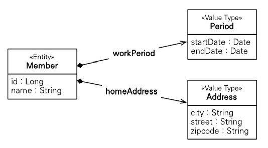
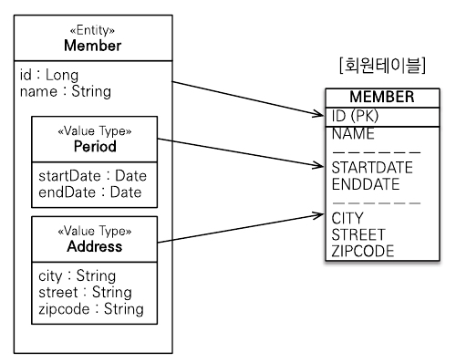
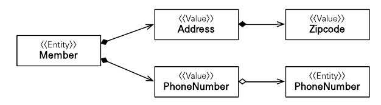
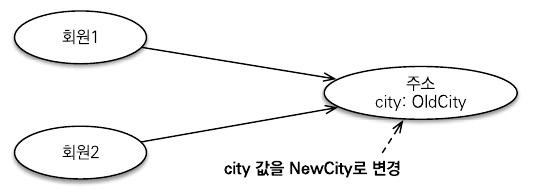
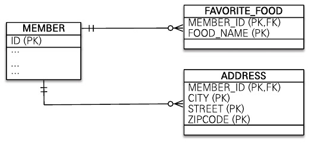

JPA의 데이터 타입을 가장 크게 분류하면 엔티티 타입과 값 타입으로 나눌 수 있다. 엔티티 타입은 @Entity로 정의하는 객체이고, 값 타입은 int, Integer, String처럼 단순히 값으로 사용하는 자바 기본 타입이나 객체를 말한다. 엔티티 타입은 식별자를 통해 지속해서 추적할 수 있지만, 값 타입은 식별자가 없고 숫자나 문자같은 속성만 있으므로 추적할 수 없다.

값 타입은 다음 3가지로 나눌 수 있다.

- 기본값 타입
    - 자바 기본 타입(예: int, double)
    - 래퍼 클래스(예: Integer)
    - String
- 임베디드 타입(복합 값 타입)
- 컬렉션 값 타입

# 9.1 기본값 타입

다음은 기본값 타입의 예제이다.

```java
@Entity
public class Member {
	@Id @GeneratedValue
	private Long id;
	private String name;
	private int age;
}
```

다음 예제의 Member에서 String, int가 값 타입이다. Member 엔티티는 id라는 식별자 값도 가지고 생명주기도 있지만 값 타입인 name, age 속성은 식별자 값도 없고 생명주기도 회원 엔티티에 의존한다.

# 9.2 임베디드 타입(복합 값 타입)

새로운 값 타입을 직접 정의해서 사용할 수 있는데, JPA에서 이것을 임베디드 타입이라고 한다. 임베디드 타입도 int, String처럼 값 타입이다. 

다음은 기본 회원 엔티티의 코드이다.

```java
@Entity
public class Member {
	@Id @GeneratedValue
	private Long id;
	private String name;
	
	@Temporal (TemporalType.DATE) java.util.Date startDate;
	@Temporal (TemporalType.DATE) java.util.Date endDate;
	
	private String city;
	private String street;
	private String zipcode;
}
```

다음 예제는 이름, 근무 시작일, 근무 종료일, 주소 도시, 주소 번지, 주소 우편번호를 가지는 평범한 회원 엔티티다. 이런 설명은 단순히 정보를 풀어둔 것 뿐이다.

회원이 상세한 데이터를 그대로 가지고 있는 것은 객체지향적이지 않으며 응집력만 떨어뜨린다. 대신에 근무 기간, 주소 같은 타입이 있다면 코드가 더 명확해질 것이다. 이때 임베디드 타입을 사용해서 직접 정의하면 된다.

다음은 임베디드 타입을 사용한 예제이다.



그림 9.1 회원-컴포지션 관계 UML

```java
@Entity
public class Member {
	@Id @GeneratedValue
	private Long id;
	private String name;
	
	@Embedded Period workPeriod;
	@Embedded Address homeAddress;
}

@Embeddable
public class Period {
	@Temporal (TemporalType.DATE) java.util.Date startDate;
	@Temporal (TemporalType.DATE) java.util.Date endDate;
	
	public boolean isWork(Date date){
		// .. 값 타입을 위한 메소드를 정의할 수 있다.
	}
}

@Embeddable
public class Address {
	@Column(name = "city") // 매핑할 칼럼 정의 가능
	private String city;
	private String street;
	private String zipcode;
}
```

다음 예제를 보면 회원 엔티티가 더욱 의미 이고 응집력 있게 변한 것을 알 수 있다. 새로 정의한 값 타입들은 재사용할 수 있고 응집도도 아주 높다. 또한 Period.isWork()처럼 해당 값 타입만 사용하는 의미 있는 메소드도 만들 수 있다. 임베디드 타입을 사용하려면 다음 2가지 어노테이션이 필요하다.

- @Embeddable: 값 타입을 정의하는 곳에 표시
- @Embedded: 값 타입을 사용하는 곳에 표시

그리고 임베디드 타입은 기본 생성자가 필수이다.

## 9.2.1 임베디드 타입과 테이블 매핑

그림 9.2를 보면 임베디드 타입을 데이터베이스 테이블에 어떻게 매핑하는지 알 수 있다.



그림 9.2 회원-테이블 매핑

임베디드 타입은 엔티티의 값일 뿐이다. 따라서 값이 속한 엔티티의 테이블에 매핑한다. 위의 예제에서 임베디드 타입을 사용하기 전과 후에 매핑하는 테이블은 같다. 임베디드 타입 덕분에 객체와 테이블을 아주 세밀하게 매핑하는 것이 가능하다. 

## 9.2.2 임베디드 타입과 연관관계

임베디드 타입은 값 타입을 포함하거나 엔티티를 참조할 수 있다.

다음은 임베디드 타입과 연관관계에 대한 그림과 예제 코드이다.



그림 9.3 임베디드 타입과 연관관계

```java
@Entity
public class Member {
	@Embedded Address address;
	@Embedded PhoneNumber phoneNumber;
}

@Embeddable
public class Address {
	String street;
	String city;
	String state;
	@Embedded Zipcode zipcode;
}

@Embeddable
public class Zipcode {
	String zip;
	String plusFour;
}

@Embeddable
public class PhoneNumber {
	String areaCode;
	String localNumber;
	@ManyToOne PhoneServiceProvider provider;
}

@Entity
public class PhoneServiceProvider {
	@Id String name;
}
```

예제를 보면 값 타입인 Address가 값 타입인 Zipcode를 포함하고, 값 타입인 PhoneNumber가 엔티티 타입인 PhoneServiceProvider를 참조한다.

## 9.2.3 @AttributeOverride: 속성 재정의

임베디드 타입에 정의한 매핑정보를 재정의하려면 엔티티에 @AttributeOverride를 사용하면 된다.

회원에게 회사 주소가 하나 더 추가된 예제를 통해 알아보겠다.

```java
@Entity
public class Member {
	@Id @GeneratedValue
	private Long id;
	private String name;

	@Embedded Address address;
	
	@Embedded
	@AttributeOverrides((
				@AttributeOverride(name = "city",
														column = @Column(name = "COMPANY_CITY")),
				@AttributeOverride(name = "street",
														column = @Column(name = "COMPANY_STREET")),
				@AttributeOverride(name = "zipcode",
														column = @Column(name = "COMPANY_ZIPCODE"))														
	)) 
	private Address companyAddress;
}
```

다음 예제처럼 임베디드 타입에 정의한 매핑 정보를 재정의하여 사용할 수 있다.

## 9.2.4 임베디드 타입과 null

임베디드 타입이 null이면 매핑한 칼럼 값은 모두 null이 된다.

```java
member.setAddress(null);
em.persist(member);
```

다음 예제와 같이 ADDRESS 칼럼을 null로 지정하면 주소와 관련된 CITY, STREET, ZIPCODE 칼럼 값은 모두 null이 된다.

# 9.3 값 타입과 불변 객체

## 9.3.1 값 타입 공유 참조

임베디드 타입은 같은 값 타입을 여러 엔티티에서 공유하면 위험하다. 



그림 9.4 값 타입 공유 참조

```java
member1.setHomeAddress(new Address("OldCity"));
Address address = member.getHomeAddress();

address.setCity("NewCity");
member2.setHomeAddress(address);
```

그림 9.4를 보면 회원2에 새로운 주소를 할당하려고 회원1의 주소를 그대로 참조해서 사용했다. 이 코드를 실행하면 회원 2의 주소만 “NewCity”로 변경되길 기대했지만 회원1의 주소도 “NewCity”로 변경된다. 회원1과 회원2가 같은 인스턴스를 참조하기 때문이다. 이런 공유 참조로 인해 발생하는 버그는 정말 찾아내기 어렵다. 따라서 이런 부작용을 막으려면 값을 복사해서 사용하면 된다.

## 9.3.2 값 타입 복사

값 타입의 실제 인스턴스인 값을 공유하는 것은 위험하다. 대신에 값을 복사해서 사용해야 한다.

다음은 값을 복사해서 사용하는 예제이다.

```java
member1.setHomeAddress(new Address("OldCity"));
Address address = member.getHomeAddress();

Address newAddress = address.clone();

newAddress.setCity("NewCity");
member2.setHomeAddress(newAddress);
```

다음 예제처럼 값 자체를 복사해서 사용하면 공유 참조로 인해 발생하는 문제를 피할 수 있다.

## 9.3.3 불변 객체

값 타입은 부작용 걱정 없이 사용할 수 있어야 한다. 부작용이 일어나면 값 타입이라 할 수 없다. 객체를 불변하게 만들면 값을 수정할 수 없으므로 부작용을 원천 차단할 수 있다. 따라서 값 타입은 될 수 있으면 불변 객체로 설계해야 한다.

한 번 만들면 절대 변경할 수 없는 객체를 불변 객체라고 한다. 불변 객체의 값은 조회할 수 있지만 수정할 수 없다. 불변 객체를 구현하는 다양한 방법이 있지만 가장 간단한 방법은 생성자로만 값을 설정하고 수정자를 만들지 않으면 된다.

```java
@Embeddable
public class Address {
	private String city;
	
	protected Address() {}
	
	public Address(String city) {this.city = city;}
	
	public String getCity(){return city;}
	
	// 수정자(Setter)는 만들지 않는다.
}
```

다음 예제를 보면 Address는 수정자가 없는 불변 객체이다. 값을 수정할 수 없으므로 공유해도 부작용이 발생하지 않는다.

# 9.4 값 타입의 비교

다음은 값 타입을 비교하는 예제이다.

```java
int a = 10;
int b = 10;

Address a = new Address("서울시", "종로구", "1번지");
Address b = new Address("서울시", "종로구", "1번지");
```

int a의 숫자 10과 int b의 숫자 10은 같다고 표현한다.

Address a와 Addrsss b는 같다고 표현한다.

자바가 제공하는 객체 비교는 2가지이다.

- 동일성 비교: 인스턴스의 참조 값을 비교, == 사용
- 동등성 비교: 인스턴스의 값을 비교, equals() tkdyd

Address 값 타입을 a == b로 동일성 비교하면 둘은 서로 다른 인스턴스이므로 결과는 거짓이다. 하지만 이것은 기대한 결과가 아니다. 값 타입은 인스턴스가 달라도 안의 내용이 같으면 같은 것으로 봐야 한다. 따라서 값 타입을 비교할 때는 equals() 메소드를 사용해서 동등성 비교를 해야 한다.

# 9.5 값 타입 컬렉션

값 타입을 하나 이상 저장하려면 컬렉션에 보관하고 @ElementCollection, @CollectionTable 어노테이션을 사용하면 된다.



그림 9.5 값 타입 컬렉션 ERD

```java
@Entity
public class Member {
	@Id @GeneratedValue
	private Long id;
	
	@Embedded
	private Address homeAddress;
	
	@ElementCollection
	@CollectionTable(name = "FAVORITE_FOODS",
										joinColumns = @JoinColumn(name = "MEMBER_ID"))
	@Column(name = "FOOD_NAME")
	private Set<String> favoriteFoods = new HashSet<String>();
	
	@ElementCollection
	@CollectionTable(name = "Address",
										joinColumns = @JoinColumn(name = "MEMBER_ID"))
	private List<Address> addressHistory = new ArrayList<Address>();
}

@Embeddable
public class Address {
	@Column
	private String city;
	private String street;
	private String zipcode;
}
```

다음 예제를 보면 값 타입 컬렉션을 사용하는 favoriteFoods, addressHistory에 @ElementCollection을 지정했다. favoriteFoods는 기본값 타입인 String을 컬렉션으로 가진다. 이것을 데이터베이스 테이블로 매핑해야 하는데 관계형 데이터베이스의 테이블은 컬럼안에 컬렉션을 포함할 수 없다. 따라서 그림 9.5처럼 별도의 테이블을 추가하고 @CollectionTable를 사용해서 추가한 테이블에 매핑해야 한다.

## 9.5.1 값 타입 컬렉션 사용

다음은 값 타입 컬렉션을 사용하는 예제이다.

```java
Member member = new Member();

member.setHomeAddress(new Address("서울", "강서", "333-333"));

member.getFavoriteFoods().add("짬뽕");
member.getFavoriteFoods().add("짜장");
member.getFavoriteFoods().add("탕수육");

member.getAddressHistory().add(new Address("서울", "강남", "123-123"));
member.getAddressHistory().add(new Address("서울", "강북", "222-222"));

em.persist(member);
```

등록하는 코드를 보면 마지막에 member 엔티티만 영속화했다. JPA는 이때 엔티티의 값 타입도 함께 저장한다. 실제 데이터베이스에 실행되는 INSERT SQL은 다음과 같다.

- member: INSERT SQL 1번
- member.homeAddress: 컬렉션이 아닌 임베디드 값이므로 회원테이블을 저장하는 SQL에 포함된다.
- member.favoriteFoods: INSERT SQL 3번
- member.addressHistory: INSERT SQL 2번

따라서 em.persist(member) 한번 호출로 총 6번의 INSERT SQL을 실행한다.

값 타입 컬렉션도 조회할 때 페치 전략을 사용할 수 있는데 LAZY가 기본이다.

다음은 값 타입 컬렉션을 수정하는 예제이다.

```java
Member member = em.find(Member.class, 1L);

// 1. 임베디드 값 타입 수정
member.setHomeAddrss(new Address("새로운 도시", "신도시1", "123456"));

// 2. 기본값 타입 컬렉션 수정
Set<String> favoriteFoods = member.getFavoriteFoods();
favoriteFoods.remove("탕수육");
favoriteFoods.add("치킨");

// 3. 임베디드 값 타입 컬렉션 수정
List<Addrss> addressHistory = member.getAddressHistory();
addressHistory.remove(new Address("서울", "기존 주소", "123-123"));
addressHistory.add(new Address("새로운 도시", "새로운 주소", "123-456"));
```

1. 임베디드 값 타입 수정: homeAddress 임베디드 값 타입은 MEMBER 테이블과 매핑했으므로 MEMBER 테이블만 UPDATE한다.
2. 기본 값 타입 컬렉션 수정: 탕수육을 치킨으로 변경하려면 탕수육을 제거하고 치킨을 추가해야 한다. 
3. 임베디드 값 타입 컬렉션 수정: 값 타입은 불변해야 한다. 따라서 컬렉션에서 기존 주소를 삭제하고 새로운 주소를 등록했다.

## 9.5.2 값 타입 컬렉션의 제약사항

엔티티는 식별자가 있으므로 엔티티의 값을 변경해도 식별자로 데이터베이스에 저장된 원본 데이터를 쉽게 찾아서 변경할 수 있다. 반면에 값 타입은 식별자라는 개념이 없고 단순한 값들의 모음이므로 값을 변경해버리면 데이터베이스에 저장된 원본 데이터를 찾기는 어렵다.

이런 문제로 인해 JPA 구현체들은 값 타입 컬렉션에 변경 사항이 발생하면 값 타입 컬렉션이 매핑된 테이블의 연관된 모든 데이터를 삭제하고, 현재 값 타입 컬렉션 객체에 있는 모든 값을 데이터베이스에 다시 저장한다.

이는 값 타입 컬렉션에 데이터가 많아질수록 성능이 저하될 수 있어서 실무에서는 매핑된 테이블에 데이터가 많다면 값 타입 컬렉션 대신에 일대다 관계를 고려해야 한다.

# 9.6 정리

엔티티 타입과 값 타입의 특징은 다음과 같다.

### 엔티티 타입의 특징

- 식별자가 있다.
    - 엔티티 타입은 식별자가 있고 식별자로 구별할 수 있다.
- 생명 주기가 있다.
    - 생성하고, 영속화하고, 소멸하는 생명 주기가 있다.
    - em.persist()로 영속화한다.
    - em.remove()로 제거한다.
- 공유할 수 있다.
    - 참조 값을 공유할 수 있다.

### 값 타입의 특징

- 식별자가 없다.
- 생명 주기를 엔티티에 의존한다.
    - 스스로 생명 주기를 가지지 않고 엔티티에 의존한다. 의존하는 엔티티를 제거하면 같이 제거된다.
- 공유하지 않는 것이 안전하다.
    - 공유하지 않고 값을 복사해서 사용해야 한다.
    - 오직 하나의 주인만이 관리해야 한다.
    - 불변 객체로 만드는 것이 안전하다.