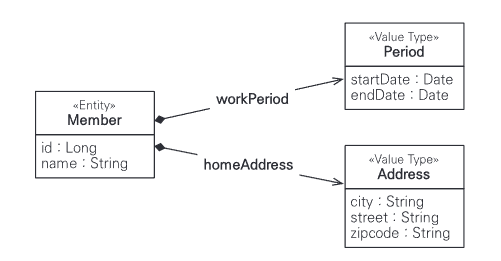
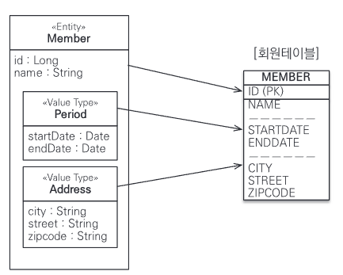
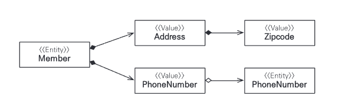
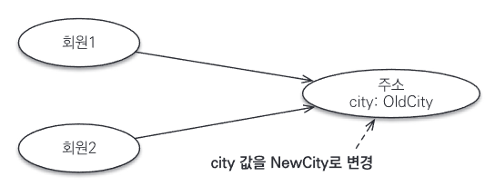
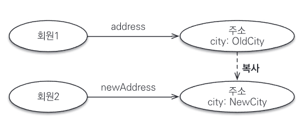
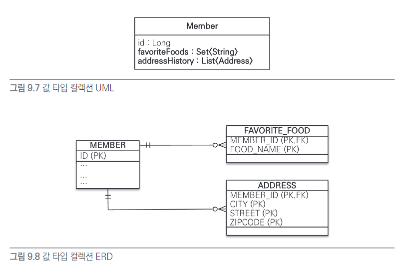

# 9장 값 타입

## 9.1. 기본 값 타입

```java
@Entity
public class Member {
    @Id @GeneratedValue
    private Long id;
    private String name;
    private int age;
}
```
Member에서 String, int가 값 타입이다. Member 엔티티는 id라는 식별자 값도 가지고 생명주기도 잇지만 값 타입인 name, age 속성은 식별자 값도 없고 
생명주기도 회원 엔티티에 의존한다. 따라서 회원 엔티티 인스턴스를 제거하면 name, age 값도 제거된다. 그리고 값 타입은 공유하면 안된다. 다른 회원 엔티티의 이름을 변경한다고 
나의 이름까지 변경되는 것은 상상할 수 없다.

## 9.2. 임베디드 타입(복합 값 타입)

새로운 값 타입을 직접 정의해서 사용할 수 있는데 JPA에서 이를 임베디드 타입이라 한다. 중요한 것은 직접 정의한 임베디드 타입도 int, String처럼 값 타입이라는 것이다. 


```java
@Entity
public class Member {
    @Id @GeneratedValue
    private Long id;
    private String name;
    
    // 근무 기간
    @Temporal(TemporalType.DATE) java.util.Date startDate;
    @Temporal(TemporalType.DATE) java.util.Date endDate;
    
    // 집 주소 표현
    private String city;
    private String street;
    private String zipcode;
}
```

여기서 회원 엔티티는 이름, 근무 기간, 집 주소를 가진다. 하지만 회원이 상세 데이터를 그대로 가지고 있는 것은 객체지향적이지 않으며 응집력만 떨어뜨린다.  

대신 근무 기간, 주소 같은 타입이 있다면 코드가 더 명확해질 것이다. [근무기간, 집 주소]를 가지도록 임베디드 타입을 사용해보자.

```java
    @Id @GeneratedValue
    private Long id;
    private String name;
    
    @Embedded Period workPeriod; // 근무 기간
    @Embedded Address homeAddress; // 집 주소
}
```

```java
// 기간 임베디드 타입
@Embeddable
public class Period{
    @Temporal(TemporalType.DATE) java.util.Date startDate;
    @Temporal(TemporalType.DATE) java.util.Date endDate;
    
    public boolean isWork(Date date){
        // .. 값 타입을 위한 메소드 정의.
    }
}
```

```java
//주소 임베디드 타입
@Embeddable
public class Address{
    
    @Column(name ="city") // 매핑할 컬럼 정의 가능
    private String city;
    private String street;
    private String zipcode;
}
```



startDate, endDate를 합해서 Period 클래스를 만들고 city, street, zipcode를 합해서 Address 클래스를 만들었다.  

새로 정의한 값 타입들은 재사용할 수 있고 응집도도 높다. 또 Period.isWork() 처럼 해당 값 타입만 사용하는 의미 있는 메소드도 만들 수 있다.  

임베디드 타입을 사용하려면 2가지 어노테이션이 필요하다. 둘 중 하나는 생략해도 된다. 또 임베디드 타입은 기본 생성자가 필수다.

1. @Embeddable : 값 타입을 정의하는 곳에 표시
2. @Embedded : 값 타입을 사용하는 곳에 표시

임베디드 타입을 포함한 모든 값 타입은 엔티티의 생명주기에 의존하므로 엔티티와 임베디드 타입의 관계를 UML로 표현하면 컴포지션 관계가 된다.

### 9.2.1. 임베디드 타입과 테이블 매핑
임베디드 타입을 DB 테이블에 어떻게 매핑하는지 알아보자.  
  
임베디드 타입은 엔티티의 값일 뿐이다. 따라서 값이 속한 엔티티의 테이블에 매핑한다. 임베디드 타입 사용 전과 후 매핑 테이블은 같다.  

임베디드 타입 덕분에 객체와 테이블의 세밀한 매핑이 가능하다. 잘 설계한 ORM 애플리케이션은 매핑한 테이블 수보다 클래스 수가 더 많다.

### 9.2.2. 임베디드 타입과 연관관계

임베디드 타입은 값 타입을 포함하거나 엔티티를 참조할 수 있다. JPA 표준 명세가 제공하는 임베디드 타입과 연관관계를 알아보자.



```java
@Entity
public class Member{
    
    @Embedded Address address;
    @Embedded PhoneNumber phoneNumber;
}

@Embeddable
public class Address{
    
    private String city;
    private String street;
    private String state;
    @Embedded Zipcode zipcode;
}

@Embeddable
public class Zipcode {
    String zip;
    String plusFour;
}

@Embeddable
public class PhoneNumber{
    String areaCode;
    String localNumber;
    @ManyToOne PhoneServiceProvider provider; //엔티티 참조
}

@Entity
public class PhoneServiceProvider{
    @Id String name;
}
```

값 타입인 Address가 값 타입인 Zipcode를 포함하고, 값 타입인 PhoneNumber가 엔티티 타입인 PhonServiceProvider를 참조한다.

- 참고  
엔티티는 공유될 수 있어 참조한다고 표현하고, 값 타입은 특정 주인에 소속되고 논리적인 개념상 공유되지 않으므로 포함한다고 표현했다.

### 9.2.3. @AttributeOverride: 속성 재정의

임베디드 타입에 정의한 매핑정보를 재정의하려면 @AttributeOverride를 사용한다. 회원에게 주소가 하나 더 필요하다면 어떻게 할까?
```java
@Entity
public class Member{
    @Id @GeneratedValue
    private Long id;
    private String name;
    
    @Embedded Address homeAddress;
    @Embedded Address companyAddress;
}
```

집 주소에 회사 주소를 추가했다. 문제는 테이블에 매핑하는 컬럼명이 중복되는 것이다. 이 때는 @AttributeOverrides를 사용해 매핑정보를 재정의해야 한다.

```java
@Entity
public class Member{
    @Id @GeneratedValue
    private Long id;
    private String name;
    
    @Embedded Address homeAddress;
    
    @Embedded
    @AttributeOverrides ({
            @AttributeOverride(name="city", column=@Column(name 
            = "COMPANY_CITY")),
            @AttributeOverride(name="street", column=@Column(name 
            = "COMPANY_STREET")),
            @AttributeOverride(name="zipcode", column=@Column(name
            = "COMPANY_ZIPCODE"))
    })
    Address companyAddress;
}
```

생성한 테이블은 재정의한대로 변경되어 있다.
```java
CREATE TABLE MEMBER{
    COMPANY_CITY varchar(255),
    COMPANY_STREET varchar(255),
    COMPANY_ZIPCODE varchar(255),
    city varchar(255),
    street varchar(255),
    zipcode varchar(255),
        ...    
}
```
@AttributeOverride 는 임베디드 타입이 임베디드 타입을 가지고 있어도 엔티티에 설정해야 한다.
### 9.2.4. 임베디드 타입과 null

임베디드 타입이 null이면 매핑한 컬럼 값은 모두 null이 된다.

```java
member.setAddress(null);
em.persist(member);
```

회원 테이블의 주소와 관련된 CITY, STREET, ZIPCODE 컬럼 값은 모두 null이 된다.

## 9.3. 값 타입과 불변 객체

### 9.3.1. 값 타입 공유 참조
임베디드 타입 같은 값 타입을 여러 엔티티에서 공유하면 위험하다. 어떤 문제가 발생할까?


그림의 상황을 코드로 나타내면 다음과 같다.
```java
member1.setHomeAddress(new Address("OldCity"));
Address address = member1.getHomeAddress();

address.setCity("NewCity"); //회원 1의 address 값을 공유해서 사용
member2.setHomeAddress(address);
```

이 경우 회원 2의 주소를 NewCity로 변경하면 회원 1의 주소도 똑같이 바뀐다. 둘 다 같은 address 인스턴스를 참조하기 때문이다.  

영속성 컨텍스트는 회원1과 회원2 둘 다 city 속성이 변경된 것으로 판단해 각각 UPDATE SQL을 실행한다.  

이렇게 뭔가를 수정했는데 예상치 못한 곳에서 문제가 발생하는 것을 부작용이라 한다.  

부작용을 막으려며 값을 복사해서 사용하면 된다.

### 9.3.2. 값 타입 복사


```java
member1.setHomeAddress(new Address("OldCity"));
Address address = member1.getHomeAddress();

Address newAddress = address.clone(); // 회원1의 address 값 복사.
        
newAddress.setCity("NewCity"); //회원 1의 address 값을 공유해서 사용
member2.setHomeAddress(newAddress);
```

이처럼 항상 값을 복사해서 사용하면 공유 참조로 발생하는 부작용을 피할 수 있다. 문제는 임베디드 타입처럼 직접 정의한 값 타입은 자바 기본 타입이 아니라 `객체 타입` 이라는 것이다.  

자바의 기본 타입에 값을 대입하면 값을 복사해서 전달한다.

```java
int a = 10;
int b = a; //기본 타입은 항상 값을 복사
b = 4;
```

이 코드의 결과는 a = 10, b = 4이다. b = a에서 a의 값을 복사해 b에 넘겨준다. 따라서 완전히 독립된 값을 가지고 부작용도 없다.  

Address같은 객체 타입은 항상 참조값을 전달한다.  

객체를 대입할 때마다 인스턴스를 복사해 대입하면 공유 참조를 피할수 있다. 문제는 복사하지 않으면 원본 참조 값을 직접 넘기는 것을 막을 방법이 없다는 것이다.  

객체의 공유 참조는 피할 수 없다. 가장 단순한 해결책은 객체의 값을 수정하지 못하게 막으면 된다. 예를 들어 Address 객체의 setCity() 같은 수정자 메소드를 모두 제거해 공유 참조를 해도 
값을 변경하지 못하게 만드는 것이다.

### 9.3.3. 불변 객체
객체를 불변하게 만들면 값을 수정할 수 없으므로 부작용을 완전 차단할 수 있다. 따라서 값 타입은 될 수 있으면 불변 객체로 설계해야 한다.  

불변 객체의 값은 조회할 수 있지만 수정할 수 없다. 참조 값을 공유해도 인스턴스의 값을 수정할 수 없다.

```java
@Embeddable
public class Address{
    private String city;
    
    protected Address() {} //기본 생성자
    
    //생성자로 초기값 설정
    public Address(String city) {this.city =city}
    
    //접근자는 노출
    public String getCity(){
        return city;
    }
    
    //수정자는 만들지 않음.
}
```

Integer, String은 자바가 제공하는 대표적인 불변 객체다.

## 9.4. 값 타입의 비교

동일성 비교 : 인스턴스의 참조 값을 비교. == 사용  
동등성 비교 : 인스턴스의 값을 비교. equals 사용  

값 타입은 인스턴스가 달라도 그 안에 값이 같으면 같은 것으로 봐야 한다. 따라서 값 타입을 비교할 때는 a.equals(b)를 사용해서 동등성 비교를 해야한다. 물론 재정의는 필요하다.  

값 타입의 equals() 메소드를 재정의할 때는 보통 모든 필드 값을 비교하도록 구현한다.

- 참고 : equals를 재정의하면 hashCode도 재정의하는 것이 안전하다. 그렇지 않으면 해시를 사용하는 컬렉션이 정상동작하지 않는다.

## 9.5. 값 타입 컬렉션
값 타입을 하나 이상 저장하려면 컬렉션에 보관하고 @ElementCollection, @CollectiionTable 어노테이션을 사용하면 된다.

```java
@Entity
public class Member{
    @Id @GeneratedValue
    private Long id;
    
    @Embedded
    private Address homeAddres;
    
    @ElementCollection
    @CollectionTable(name = "FAVORITE_FOODS",
        joinColumns = @JoinColumn(name = "MEMBER_ID"))
    @Column(name="FOOD_NAME")
    private Set<String> favoriteFoods = new HashSet<String>();

    @ElementCollection
    @CollectionTable(name = "ADDRESS",
            joinColumns = @JoinColumn(name = "MEMBER_ID"))
    @Column(name="MEMBER_ID")
    private Set<String> addressHistory = new ArrayList<Address>();
}

@Embeddable
public class Address{
    
    @Column
    private String city;
    private String street;
    private String zipcode;
}
```



Member 엔티티는 값 타입 컬렉션을 사용하면 favoriteFoods, addressHistory에 @ElementCollection을 지정했다.  

관계형 DB의 테이블은 컬럼 안에 컬렉션을 포함할 수 없다. 따라서 별도의 테이블을 추가하고 @CollectionTable을 사용해 추가한 테이블을 매핑해야 한다.
favoriteFoods처럼 값으로 사용되는 컬럼이 하나면 @Column을 사용해서 컬럼명을 지정할 수 있다.

- 참고 : @CollectionTable을 생략하면 기본값인 {엔티티이름}_{컬렉션 속성 이름}으로 매핑한다. 예를 들어 addressHistory는 Member_addressHistory 테이블과 매핑한다.  
### 9.5.1. 값 타입 컬렉션 사용

```java
Member member = new Member();

// 임베디드 값 타입
member.setHomeAddress(new Address("통영", "몽돌해수욕장", "660-123"));

// 기본값 타입 컬렉션
member.getFavoriteFoods().add("짬뽕") ;
member.getravoriteroods().add("짜장") ;
member.getravoriteroods().add("탕수육") ;

// 임베디드 값 타입 컬렉션
member.getaddressHistory().add(new Address ("서울", "강남", "123-123"));
member.getAddressHistory().add(new Address ("서울", "강북", "000-000")):
em.persist(member) ;
```

JPA는 마지막 member 엔티티를 영속화할 때 member 엔티티의 값 타입도 함께 저장한다. 실제 데이터베이스에 실행되는 INSERT SQL은 다음과 같다.  

- member : 1번
- member.homeAddress : 컬렉션이 아닌 임베디드 값 타입이므로 회원테이블을 저장하는 SQL에 포함
- member.favoriteFoods : 3번
- member.addressHistory: 2번

persist 한 번 호출로 6번의 INSER SQL을 실행한다. 값 타입 컬렉션은 영속성 전이 + 고아 객체 제거 기능을 필수로 가진다.  

값 타입 컬렉션도 조회할 때 페치 전략을 선택할 수 있는데 LAZY가 기본값이다.  

지연 로딩으로 모두 설정했다고 가정하고 member를 조회하면 임베디드 값 타입인 homeAddress도 함께 조회한다.  
값 타입 컬렉션을 조회해야 해서 실제 사용할 때는 추가로 SELECT SQL을 호출한다.  

값 타입 컬렉션을 수정해보자.  
```java
Member member = em.find (Member.class, 1L) ;
// 1. 임베디드 값 타입 수정
member.setHomeAddress(new Address("새로운도시", "신도시1", "123456)):
        
// 2. 기본값 타입 컬렉션 수정
Set<String> favoriteFoods = member.getFavoriteFoods();
favoriteFoods.remove("탕수육");
ravoriteFoods.add（”치킨");
        
// 3. 임베디드 값 타입 컬렉션 수정
List<Address> addressHistory = member.getAddressHistory();
addressHistory.remove(new Address("서울", "기존 주소", "123-123)):
addressHistory.add(new Address("새로운도시", 새로운 주소", "123-4561));
```
1. 임베디드 값 타입 수정 : 임베디드 값 타입은 MEMBER 테이블과 매핑했으므로 MEMBER 테이블만 UPDATE한다.
2. 기본값 타입 컬렉션 수정 : 탕수육을 치킨으로 변경하려면 탕수육을 제거하고 치킨을 추가해야 한다. 자바의 String 타입은 수정할 수 없다.
3. 임베디드 값 타입 컬렉션 수정 : 값 타입은 불변해야 한다. 따라서 컬렉션에서 기존 주소를 삭제하고 새로운 주소를 등록했다. 값 타입은 equals, hashCode를 꼭 구현해야 한다.

### 9.5.2. 값 타입 컬렉션의 제약사항.

값 타입은 식별자라는 개념이 없고 단순한 값들의 모음이므로 값을 수정하면 DB에 저장된 원본 데이터를 찾기는 어렵다.  

특정 엔티티 하나에 소속된 값 타입은 값이 변경되어도 자신이 소속된 엔티티를 찾아 값을 수정하면 된다. 문제는 값 타입 컬렉션이다. 값 타입 컬렉션은 별도의 테이블에 보관돼 
여기 보관된 값 타입의 값이 수정되면 DB에 있는 원본 데이터를 찾기 어렵다.  

그래서 JPA 구현체들은 값 타입 컬렉션에 변경 사항이 발생하면 관련된 모든 데이터를 삭제하고 현재 값 타입 컬렉션에 있는 값을 다시 저장한다.  

그래서 실무에서는 값 타입 컬렉션이 매핑된 테이블에 데이터가 많다면 값 타입 컬렉션 대신 일대다 관계를 고려해야 한다.  

추가로 값 타입 컬렉션을 매핑하는 테이블은 모든 컬럼을 묶어 기본키를 구성해야 해 Not NULL이고 같은 값을 중복저장할 수도 없다.  

문제를 해결하려면 새로운 엔티티를 만들어서 일대다 관계로 설정하면 된다. CASCADE + ORPHAN REMOVE 기능을 적용하면 값 타입 컬렉션과 똑같이 사용할 수 있다.

## 9.6. 정리

### 엔티티 타입의 특징
- 식별자(@Id)가 있다.
- 생명 주기가 있다.
- em.persist로 영속화한다.
- em.remove로 제거한다.
- 공유할 수 있다. 참조 값을 공유할 수 있다.

### 값 타입의 특징
- 식별자가 없다
- 생명 주기를 엔티티에 의존한다.
- 공유하지 않는 것이 안전하다. 값을 복사해서 사용해야 하고 불변 객체로 만드는 것이 안전하다.