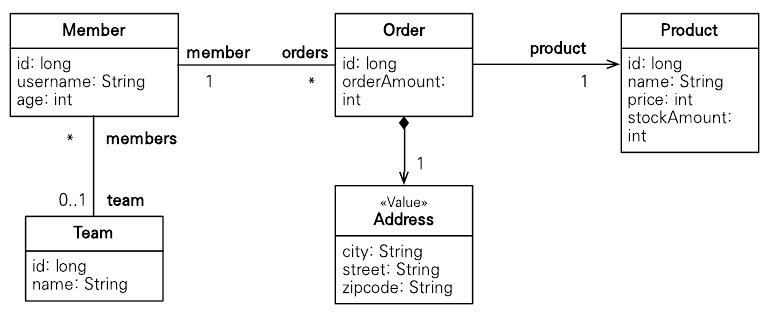
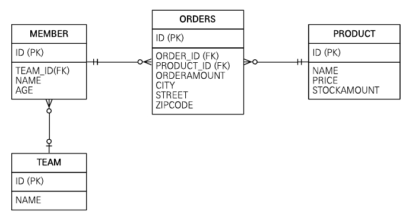
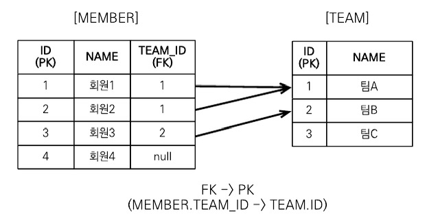
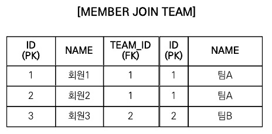
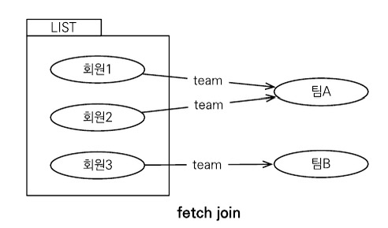
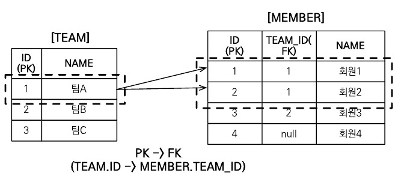
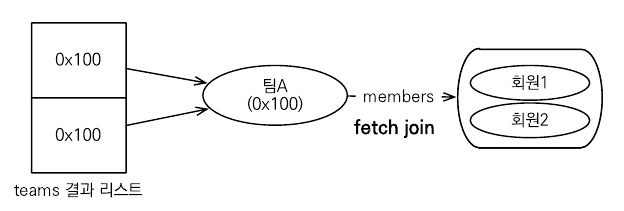
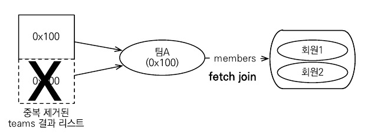
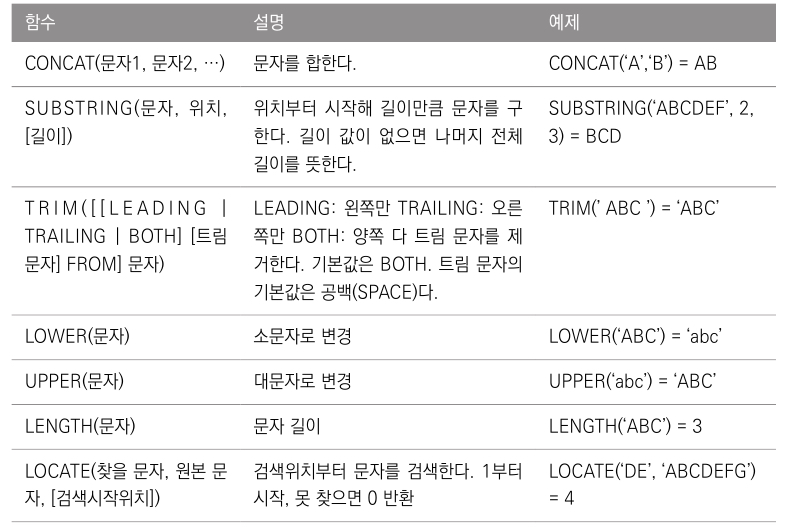
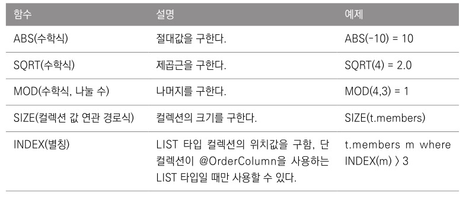

# 10.1 객체지향 쿼리 소개

EntityManager.find() 메소드를 사용하면 식별자로 엔티티 하나를 조회할 수 있다. 이렇게 조회한 엔티티에 객체 그래프 탐색을 사용하면 연관된 엔티티들을 찾을 수 있다.

하지만 이 기능만으로 애플리케이션을 개발하기는 어렵다. 예를 들어 나이가 30살 이상인 회원들을 모두 검색하고 싶다면 좀 더 현실적이고 복잡한 검색 방법이 필요하다. 그렇다고 모든 회원 엔티티를 메모리에 올려두고 애플리케이션에서 30살 이상인 회원을 검색하는 것은 현실성이 없다.

결국 데이터베이스에서 SQL로 필요한 내용을 최대한 걸러서 조회해야 한다. 하지만 ORM을 사용하면 데이터베이스 테이블이 아닌 엔티티 객체를 대상으로 개발하므로 검색도 테이블이 아닌 엔티티 객체를 대상으로 하는 방법이 필요하다.

JPQL은 이런 문제를 해결하기 위해 만들어졌고 다음과 같은 특징이 있다.

- 테이블이 아닌 객체를 대상으로 검색하는 객체지향 쿼리다.
- SQL을 추상화해서 특정 데이터베이스 SQL에 의존하지 않는다.

SQL이 데이터베이스 테이블을 대상으로 하는 데이터 중심의 쿼리라면 JPQL은 엔티티 객체를 대상으로 하는 객체지향 쿼리다. JPQL을 사용하면 JPA는 이 JPQL을 분석한 다음 적절한 SQL을 만들어 데이터베이스를 조회한다. 그리고 조회한 결과로 엔티티 객체를 생성해서 반환한다.

## 10.1.1 JPQL 소개

JPQL은 엔티티 객체를 조회하는 객체지향 쿼리다. 문법은 SQL과 비슷하고 ANSI 표준 SQL이 제공하는 기능을 유사하게 지원한다. JPQL은 SQL을 추상화해서 특정 데이터베이스에 의존하지 않는다. 그리고 데이터베이스 방언만 변경하면 JPQL을 수정하지 않아도 데이터베이스를 변경할 수 있다.

다음은 회원 엔티티를 대상으로 JPQL을 사용하는 간단한 예제이다.

```java
@Entity(name = "Member")
public class Member {
	@Column(name = "name")
	private String username;
	//...
}
```

```java
// 쿼리 생성
String jpql = "select m from Member as m where m.username = 'kim'";
List<Member> resultList = em.createQuery(jpql, Member.class).getResultList();
```

다음 예제는 회원이름이 kim인 엔티티를 조회한다. JPQL에서 Member는 엔티티이름이다. 그리고 m.username은 테이블 칼럼명이 아니라 엔티티 객체의 필드명이다.

em.createQuery() 메소드에 실행할 JPQL과 반환할 엔티티의 클래스 타입인 Member.class를 넘겨주고 getResultList() 메소드를 실행하면 JPA는 JPQL을 SQL로 변환해서 데이터베이스를 조회한다. 그리고 조회한 결과로 Member 엔티티를 생성해서 반환한다.

실제 실행된 SQL은 다음과 같다.

```sql
select 
	member.id as id
	member.age as age
	member.team_id as team
	member.name as name
from
	Member member
where
	member.name = 'kim';
```

## 10.1.2 Criteria 쿼리 소개

Criteria는 JPQL을 생성하는 빌더 클래스이다. Criteria의 장점은 문자가 아닌 query.select(m).where(..)처럼 프로그래밍 코드로 JPQL을 작성할 수 있다는 점이다. 

JPQL에 오타가 있는 경우 그래도 컴파일은 성공하고 애플리케이션을 서버에 배포할 수 있다. 문제는 해당 쿼리가 실행되는 런타임 시점에 오류가 발생한다. 이것이 문자기반 쿼리의 단점이다. 반면에 Criteria는 문자가 아닌 코드로 JPQL을 작성한다. 따라서 컴파일 시점에 오류를 발견할 수 있다.

문자로 작성한 JPQL보다 코드로 작성한 Criteria의 장점은 다음과 같다.

- 컴파일 시점에 오류를 발견할 수 있다.
- IDE를 사용하면 코드 자동완성을 지원한다.
- 동적 쿼리를 작성하기 편하다.

다음은 방금 작성한 JPQL을 Criteria로 작성한 예제이다. 

```java
// Criteria 사용 준비
CriteriaBuilder cb = em.getCriteriaBuilder();
CriteriaQuery<Member> query = cb.createQuery(Member.class);

// 루트 클래스(조회를 시작할 클래스)
Root<Member> m = query.from(Member.class);

// 쿼리 생성
CriteriaQuery<Member> cq =
						query.select(m).where(cb.equl(m.get("username"), "kim"));
List<Member> resultList = em.createQuery(cq).getResultList();
```

Criteria를 사용하면 다음 예제처럼 쿼리를 문자가 아닌 코드로 작성할 수 있다.

하지만 Criteria가 가진 장점이 많지만 모든 장점을 상쇄할 정도로 복잡하고 장황하다. 따라서 사용하기 불편한 건 물론이고 Criteria로 작성한 코드도 한눈에 들어오지 않는다는 단점이 있다.

## 10.1.3 QueryDSL 소개

QueryDSL도 Criteria처럼 JPQL 빌더 역할을 한다. QueryDSL의 장점은 코드 기반이면서 단순하고 사용하기 쉽다. 그리고 작성한 코드도 JPQL과 비슷해서 한눈에 들어온다. QueryDSL과 Criteria를 비교하면 Criteria는 너무 복잡하다.

다음은 QueryDSL로 작성한 예제이다.

```java
// 준비
JPAQuery query = new JPAQuery(em);
QMember member = Qmember.member;

// 쿼리, 결과 조히
List<Member> members =
			query.from(member)
			.where(member.username.eq("kim"))
			.list(member);
```

다음 예제는 특별한 설명을 하지 않아도 코드만으로 대부분 이해가 될 것이다.

QueryDSL도 어노테이션 프로세서를 사용해서 쿼리 전용 클래스를 만들어야 한다. QMember는 Member 엔티티 클래스를 기반으로 생성한 QueryDSL 전용 클래스이다.

## 10.1.4 네이티브 SQL 소개

JPA는 SQL을 직접 사용할 수 있는 네이티브 SQL을 제공한다. JPQL을 사용해도 가끔은 특정 데이터베이스에 의존하는 기능을 사용해야 할 때가 있다. 이런 기능들은 표준화되어 있지 않으므로 JPQL에서 사용할 수 없다. 그리고 SQL은 지원하지만 JPQL이 지원하지 않는 기능도 있다. 이때는 네이티브 SQL을 사용하면 된다.

다음은 네이티브 SQL을 사용한 예제이다.

```java
String sql = "SELECT ID, AGE, TEAM_ID, NAME FROM MEMBER WHERE NAME = 'kim'";
List<Member> resultList = 
				em.createNativeQuery(sql, Member,class).getResultList();
```

다음 코드를 실행하면 직접 작성한 SQL을 데이터베이스에 전달한다.

## 10.1.5 JDBC 직접 사용, SQL 매퍼 프레임워크 사용

JDBC 커넥션에 직접 접근하고 싶으면 JPA는 JDBC 커넥션을 획득하는 API를 제공하지 않으므로 JPA 구현체가 제공하는 방법을 사용해야 한다. 하이버네이트에서 직접 JDBC Connection을 획득하는 방법은 다음과 같다.

```java
Session session = entityManager.unwrap(Session.class);
session.doWork(new Work()) {

	@Override
	public void execute(Connection connection) throws SQLException {
		// work...
	}
}
```

먼저 JPA EntityManager에서 하이버네이트 세션을 구한다. 그리고 Session의 doWork() 메소드를 호출하면 된다.

JDBC나 마이바티스를 JPA와 함께 사용하면 영속성 컨텍스트를 적절한 시점에 강제로 플러시해야 한다. JDBC나 SQL 매퍼를 사용하면 모두 JPA를 우회해서 데이터베이스에 접근한다. 하지만 JPA는 우회하는 SQL에 대해서는 전혀 인식하지 못한다. 이런 이슈를 해결하는 방법은 JPA를 우회해서 SQL을 실행하기 직전에 영속성 컨테스트를 수동으로 플러시해서 데이터베이스와 영속성 컨텍스트를 동기화해줘야 한다.

# 10.2 JPQL

이번 절에서는 JPQL의 사용 방법에 대해 자세히 알아보겠다.

JPQL의 특징으로는 다음과 같다.

- JPQL은 객체지향 쿼리 언어이다. 따라서 테이블 대상으로 쿼리하는 것이 아닌 엔티티 대상으로 쿼리한다.
- JPQL은 SQL을 추상화해서 특정 데이터베이스 SQL에 의존하지 않는다.
- JPQL은 결국 SQL로 변환된다.

다음은 이번 절에서 예제로 사용할 도메인 모델이다.



그림 10.1 샘플 모델 UML



그림 10.2 샘플 모델 ERD

## 10.2.1 기본 문법과 쿼리 API

JPQL도 SQL과 비슷하게 SELECT, UPDATE, DELETE 문을 사용할 수 있다. 엔티티를 저장할 때는 persist() 메소드를 사용하면 되므로 INSERT 문은 없다.

다음은 JPQL의 문법이다.

```java
select_문 :: =
	select_절
	from_절
	[where_절]
	[groupby_절]
	[having_절]
	[orderby_절]

update_문 :: = update_절 [where_절]
delete_문 :: = delete_절 [where_절]
```

JPQL의 문법을 보면 전체 구조는 SQL과 비슷하다.

JPQL에서 UPDATE, DELETE 문은 벌크 연산이라 하는데 10.6절에서 설명하고 지금부터 SELECT문을 알아보겠다.

### SELECT 문

SELECT 문은 다음과 같이 사용한다.

```java
SELECT m FROM Member AS m where m.username = 'Hello'
```

- 대소문자 구분
    - 엔티티와 속성은 대소문자를 구분한다. 예를 들어 Member, username은 대소문자를 구분한다. 반면에 SELECT, FROM, AS같은 키워드는 대소문자를 구분하지 않는다.
- 엔티티 이름
    - JPQL에서 사용한 Member는 클래스 명이 아니라 엔티티 명이다. 엔티티 명은 @Entity(name = “XXX”)로 지정할 수 있다. 엔티티 명을 지정하지 않으면 클래스명을 기본값으로 사용한다.
- 별칭은 필수
    - Member AS m을 보면 Member에 m이라는 별칭을 주었다. JPQL은 별칭을 필수로 사용해야 한다.

### TypeQuery, Query

작성한 JPQL을 실행하려면 쿼리 객체를 만들어야 한다. 쿼리 객체는 TypeQuery와 Query가 있는데 반환할 타입을 정확하게 지정할 수 있으면 TypeQuery 객체를 사용하고, 반환 타입을 명확하게 지정할 수 없으면 Query를 사용한다.

다음은 TypeQuery를 사용한 예제이다.

```java
TypedQuery<Member> query = 
				em.createQuery("SELECT m FROM Member m", Member.class);
				
List<Member> resultList = query.getResultList();
for(Member member : resultList) {
	System.out.println("member = " + member);
}
```

em.createQuery() 메소드의 두 번째 파라미터에 반환할 타입을 지정하면 TypeQuery를 반환하고 지정하지 않으면 Query를 반환한다.

다음은 Query를 사용한 예제이다.

```java
Query query = 
				em.createQuery("SELECT m.username, m.age FROM Member m");
				
List resultList = query.getResultList();

for(Obejct o : resultList) {
	Object[] result = (Object[]) o; // 결과가 둘 이상이면 Object[] 반환
	System.out.println("username = " + result[0]);
	System.out.println("age = " + result[1]);
}
```

다음 예제는 조회 대상이 String타입인 회원 이름과 Integer타입인 나이이므로 조회 대상 타입이 명확하지 않다. 이처럼 SELECT 절에서 여러 엔티티나 칼럼을 선택할 때는 반환할 타입이 명확하지 않으므로 Query 객체를 사용해야 한다.

### 결과 조회

다음 메소드들을 호출하면 실제 쿼리를 실행해서 데이터베이스를 조회한다.

- query.getResultList(): 결과를 컬렉션으로 반환한다. 만약 결과가 없으면 빈 컬렉션을 반환한다.
- query.getSingleResult(): 결과가 정확히 하나일 때 사용한다.
    - 결과가 없으면 NoResultException 예외가 발생한다.
    - 결과가 1개보다 많으면 NonUniqueResultException 예외가 발생한다.

## 10.2.2 파라미터 바인딩

JDBC는 위치 기준 파라미터 바인딩만 지원하지만 JPQL은 이름 기준 파라미터 바인딩도 지원한다.

### 이름 기준 파라미터

다음은 이름 기준 파라미터를 사용한 예제이다. 이름 기준 파라미터는 앞에 :를 사용한다.

```java
String usernameParam = "User1";

TypedQuery<Member> query = 
				em.createQuery("SELECT m FROM Member m where m.username = :username",
Member.class);

query.setParameter("username", usernameParam);
List<Member> resultList = query.getResultList();
```

다음 예제를 보면 :username이라는 이름 기준 파라미터를 정의하고 query.setParameter()에서 파라미터를 바인딩한다.

JPQL API는 대부분 메소드 체인 방식을 설계되어 있어서 다음과 같이 연속해서 작성할 수도 있다.

```java
List<Member> members =
				em.createQuery("SELECT m FROM Member m where m.username = :username",
Member.class)
				.setParameter("username", usernameParam)
				.getResultList();
```

다음은 위치 기준 파라미터를 사용한 예제이다. 위치 기준 파라미터는 ? 다음에 위치 값을 주면 된다.

```java
List<Member> members =
				em.createQuery("SELECT m FROM Member m where m.username = ?1",
Member.class)
				.setParameter(1, usernameParam)
				.getResultList();
```

위치 기준 파라미터 방식보다는 이름 기준 파라미터 바인딩 방식을 사용하는 것이 더 명확하다.

## 10.2.3 프로젝션

SELECT 절에 조회할 대상을 지정하는 것을 프로젝션이라고 한다. [SELECT {프로젝션 대상} FROM]으로 대상을 선택한다. 프로젝션 대상은 엔티티, 임베디드 타입, 스칼라 타입이 있다. 스칼라 타입은 숫자, 문자 등 기본 데이터 타입을 뜻한다.

### 엔티티 프로젝션

다음은 엔티티 프로젝션을 사용한 예제이다.

```sql
SELECT m FROM Member m
SELECT m.team FROM Member m
```

둘 다 엔티티를 프로젝션 대상으로 사용했다. 이렇게 조회한 엔티티는 영속성 컨텍스트에서 관리된다.

### 임베디드 타입 프로젝션

JPQL에서 임베디드 타입은 엔티티와 거의 비슷하게 사용된다. 

다음은 임베디드 타입 프로젝션을 사용한 예제이다.

```java
String query = "SELECT o.address FROM Order o";
List<Address> addresses = em.createQuery(query, Address.class).getResultList();
```

실행된 SQL은 다음과 같다.

```sql
select
	order.city,
	order.street,
	order.zipcode
from
	Orders order
```

임베디드 타입은 엔티티 타입이 아닌 값 타입이다. 따라서 이렇게 직접 조회한 임베디드 타입은 영속성 컨텍스트에서 관리되지 않는다.

### 스칼라 타입 프로젝션

숫자, 문자, 날짜와 같은 기본 데이터 타입들을 스칼라 타입이라고 한다.

다음은 스칼라 타입 프로젝션의 예제이다.

```java
List<String> username = em.createQuery("SELECT username FROM Member m",
			String.class).getResultList();
```

중복 데이터를 제거하려면 DISTINCT를 사용한다.

```sql
SELECT DISTINCT username FROM Member m
```

### 여러 값 조회

엔티티를 대상으로 조회하면 편리하겠지만, 꼭 필요한 데이터들만 선택해서 조회해야 할 때도 있다. 프로젝션에 여러 값을 선택하면 TypeQuery를 사용할 수 없고 대신에 Query를 사용해야 한다.

다음은 여러 값을 조회하는 예제이다.

```java
Query query =
			em.createQuery("SELECT m.username, m.age FROM Member m");
List resultList = query.getResultList();

Iterater iterator = resultList.iterator();
while (iterator.hasNext()) {
	Object[] row = (Object[]) iterator.next();
	String username = (String) row[0];
	Integer age = (Integer) row[1];
}
```

제네릭에 Object[]를 사용하면 다음 코드처럼 조금 더 간결하게 개발할 수 있다.

```java
List<Object[]> resultList =
			em.createQuery("SELECT m.username, m.age FROM Member m")
			.getResultList();
			
for (Object[] row : resultList) {
	String username = (String) row[0];
	Integer age = (Integer) row[1];
}
```

### NEW 명령어

여러 값을 조회하면 두 필드를 프로젝션해서 타입을 지정할 수 없으므로 TypeQuery를 사용할 수 없어서 Object[]를 반환받았다. Object[]를 사용하지 않고 DTO처럼 의미 있는 객체로 변환해서 사용하는 방법도 있다.

다음은 username, age를 담기 위한 UserDTO의 코드이다.

```java
public class UserDTO {
	private String username;
	private int age;
	
	public UserDTO(String username, int age) {
		this.username = username;
		this.age = age;
	}
}
```

```java
List<Object[]> resultList =
			em.createQuery("SELECT m.username, m.age FROM Member m")
			.getResultList();
			
List<UserDTO> userDTOs = new ArrayList<UserDTO>();
for (Object[] row : resultList) {
	UserDTO userDTO = new UserDTO((String) row[0], (String) row[1]);
	userDTOs.add(userDTO);
}
```

이런 객체 변환 작업은 지루하고 코드도 길어진다. NEW 명령어를 사용하면 쉽게 해결할 수 있다.

```java
TypedQuery<UserDTO> query = em.createQuery(
		"SELECT new jpabook.jpql.UserDTO(m.username, m.age) FROM Member m",
		UserDTO.class);
		
List<UserDTO> resultList = query.getResultList();
```

SELECT 다음에 NEW 명령어를 사용하면 반환받을 클래스를 지정할 수 있는데 이 클래스의 생성자에 JPQL 조회 결과를 넘겨줄 수 있다.

NEW 명령어를 사용할 때는 다음 2가지를 주의해야 한다.

1. 패키지 명을 포함한 전체 클래스 명을 입력해야 한다.
2. 순서와 타입이 일치하는 생성자가 필요하다.

## 10.2.4 페이징 API

페이징 처리용 SQL을 작성하는 일은 지루하고 반복적이다. 더 큰 문제는 데이터베이스마다 페이징을 처리하는 SQL 문법이 다르다는 점이다. JPA는 페이징을 다음 두 API로 추상화했다.

- setFirstResult(int startPosition): 조회 시작 위치(0부터 시작)
- setMaxResult(int maxResult): 조회할 데이터 수

다음은 페이징을 사용한 예제이다.

```java
TypedQuery(Member) query = 
		em.createQuery("SELECT m FROM Member m ORDER BY m.username DESC",
		Member.class);
		
query.setFirstResult(10);
query.setMaxResults(20);
query.getResultList();
```

다음 예제는 11번째부터 시작해서 총 20건의 데이터를 조회한다. 따라서 11~30의 데이터를 조회한다.

데이터베이스 방언 덕분에 데이터베이스마다 다른 페이징 처리를 같은 API로 처리할 수 있다.

## 10.2.5 집합과 정렬

집합은 집합함수와 함께 통계 정보를 구할 때 사용한다.

### 집합 함수

집합 함수는 다음 표에 정리했다.

| 함수 | 설명 |
| --- | --- |
| COUNT | 결과 수를 구한다. 반환 타입 Long |
| MAX, MIN | 최대, 최소 값을 구한다. 문자, 숫자, 날짜 등에 사용한다. |
| AVG | 평균값을 구한다. 숫자 타입만 사용할 수 있다. 반환 타입: Double |
| SUM | 합을 구한다. 숫자 타입만 사용할 수 있다. 반환 타입: Long, Double, BigInteger, BigDecimal |

### 집합 함수 사용 시 참고사항

- NULL 값은 무시하므로 통계에 잡히지 않는다.
- 만약 값이 없는데 SUM, AVG, MAX, MIN 함수를 사용하면 NULL 값이 된다. 단 카운트는 0이 된다.
- DISTINCT를 집합 함수 안에 사용해서 중복된 값을 제거하고 나서 집합을 구할 수 있다.
- DISTINCT를 COUNT에서 사용할 때 임베디드 타입은 지원하지 않는다.

### GROUP BY, HAVING

GROUP BY는 통계 데이터를 구할 때 특정 그룹끼리 묶어준다.

문법은 다음과 같다.

```sql
groupby_절 ::= GROUP BY {단읿값 경로 | 별칭} +
having_절 ::= HAVING 조건식
```

다음은 GROUP BY를 사용한 예제이다.

```sql
select t.name, COUNT(m.age), SUM(m.age), AVG(m.age), MAX(m.age), MIN(m.age)
from Member m LEFT JOIN m.team t
GROUP BY t.name
```

다음은 HAVING을 사용한 예제이다.

```sql
select t.name, COUNT(m.age), SUM(m.age), AVG(m.age), MAX(m.age), MIN(m.age)
from Member m LEFT JOIN m.team t
GROUP BY t.name
HAVING AVG(m.age) >= 10
```

### 정렬(ORDER BY)

ORDER BY는 결과를 정렬할 때 사용한다.

문법은 다음과 같다.

```sql
orderby_절 ::= ORDER BY {상태필드 경로 | 결과 변수 [ASC | DESC]} +
```

- ASC: 오름차순(기본값)
- DESC: 내림차순

## 10.2.6 JPQL 조인

### 내부 조인

내부 조인은 INNER JOIN을 사용한다. INNER는 생략할 수 있다.

다음은 내부 조인을 사용한 예제이다.

```java
String teamName = "팀A";
String query = "SELECT m FROM Member m INNER JOIN m.team t"
								+ "WHERE t.name = :teamName";
								
List<Member> members = em.createQuery(query, Member.class)
												.setParameter("teamName", teamName);
												.getResultList();
```

위의 예제를 보면 m.team이라는 member와 연관된 필드를 사용하여 내부 조인을 진행한다. JPQL 조인을 진행할 때 SQL 조인처럼 사용하면 문법 오류가 발생한다. 따라서 JPQL은 JOIN 명령어 다음에 조인할 객체의 연관 필드를 사용해야 한다.

### 외부 조인

다음은 외부 조인을 사용한 예제이다.

```sql
SELECT m
FROM Member m LEFT {OUTER} JOIN m.team t
```

외부 조인은 기능상 SQL의 외부 조인과 같다. OUTER는 생략 가능해서 보통 LEFT JOIN으로 사용한다.

### 컬렉션 조인

일대다 관계나 다대다 관계처럼 컬렉션을 사용하는 곳에 조인하는 것을 컬렉션 조인이라고 한다.

- [회원→팀]으로의 조인은 다대일 조건이면서 단일 값 연관 필드를 사용한다.
- [팀→회원]은 반대로 일대다 조건이면서 컬렉션 값 연관 필드를 사용한다.

다음은 컬렉션 조인을 사용한 예제이다.

```sql
SELECT t, m
FROM Team t LEFT JOIN t.members m
```

### 세타 조인

WHERE 절을 사용해서 세타 조인을 할 수 있다. 세타 조인은 내부 조인만 지원한다. 세타 조인을 사용하면 전혀 관계없는 엔티티도 조회할 수 있다.

다음은 세타 조인을 사용한 예제이다.

```sql
// JPQL
select count(m)
from Member m, Team t
where m.username = t.name

// SQL
SELECT COUNT(M.ID)
FROM MEMBER M CROSS JOIN TEAM T
WHERE M.USERNAME = T.NAME
```

### JOIN ON 절

JPA 2.1부터 조인할 때 ON 절을 지원한다. ON 절을 사용하면 조인 대상을 필터링하고 조인할 수 있다.

다음은 JOIN ON을 사용한 예제이다.

```sql
// JPQL
select m, t
from Member m left join m.team t on t.name = 'A'

// SQL
SELECT m.*, t.*
FROM MEMBER m LEFT JOIN TEAM t ON m.TEAM_ID = t.id and t.name = 'A'
```

## 10.2.7 페치 조인

페치 조인은 JPQL에서 성능 최적화를 위해 제공하는 기능이다. 이것은 연관된 엔티티나 컬렉션을 한번에 같이 조회하는 기능인데 join fetch 명령어로 사용할 수 있다.

페치 조인의 문법은 다음과 같다.

```sql
페치 조인 ::= [LEFT [OUTER] | INNER] JOIN FETCH 조인경로
```

### 엔티티 페치 조인

다음은 엔티티 페치 조인을 사용한 예제이다.

```sql
// JPQL
select m
from Member m join fetch m.team

// SQL
SELECT M.*, T.*
FROM MEMBER M INNER JOIN TEAM T ON M.TEAM_ID = T.ID
```

일반적인 JPQL 조인과는 다르게 m.team 다음에 별칭이 없는데 페치 조인은 별칭을 사용할 수 없다.

엔티티 페치 조인 JPQL에서 select m으로 회원 엔티티만 선택했는데 실행된 SQL을 보면 SELECT M.*, T.*로 회원과 연관된 팀도 함께 조회된 것을 확인할 수 있다.

페치 조인으로 회원과 팀을 함께 조회해서 지연로딩이 발생하지 않는다.



그림 10.3 엔티티 페치 조인 시도



그림 10.4 엔티티 페치 조인 결과 테이블



그림 10.5 엔티티 페치 조인 결과 객체

### 컬렉션 페치 조인

다음은 일대다 관계인 컬렉션을 페치 조인한 예제이다.

```sql
// JPQL
select t
from Team t join fetch t.members
where t.name = '팀A'

// SQL
SELECT T.*, M.*
FROm TEAM T INNER JOIN MEMBER M ON T.ID = M.TEAM_ID
WHERE T.NAME = '팀A'
```

위의 예제는 팀을 조회하면서 페치 조인을 사용해서 연관된 회원 컬렉션도 함께 조회하였다. 



그림 10.6 컬렉션 페치 조인 시도


그림 10.7 컬렉션 페치 조인 결과 테이블



그림 10.8 컬레션 페치 조인 결과 객체

그림 10.6을 보면 TEAM 테이블에서 ‘팀A’는 하나지만 MEMBER 테이블과 조인하면서 결과가 증가해서 그림 10.7의 조인 결과 테이블을 보면 같은 ‘팀A’가 2건 조회되었다. 따라서 그림 10.8의 컬렉션 페치 조인 결과 객체에서 teams 결과 예제를 보면 주소가 0x100으로 같은 ‘팀A’를 2건 가지게 된다.

### 페치 조인과 DISTINCT

SQL의 DISTINCT는 중복된 결과를 제거하는 명령어다. JPQL의 DISTINCT 명령어는 SQL에 DISTINCT를 추가하는 것은 물론이고 애플리케이션에서 한 번 더 중복을 제거한다. 직전에 한 컬렉션 페치 조인은 팀A가 중복으로 조회되었다. 이때 DISTINCT를 사용해서 중복을 제거할 수 있다.

다음은 DISTINCT를 사용한 예제이다.

```sql
select distinct t
from Team t join fetch t.members
where t.name = '팀A'
```



그림 10.9 페치 조인 DISTINCT 결과

그림 10.9처럼 중복을 제거하고 팀A는 하나만 조회된다.

### 페치 조인과 일반 조인의 차이

JPQL은 결과를 반환할 때 연관관계까지 고려하지 않는다. 단지 SELECT 절에 지정한 엔티티만 조회한다. 따라서 일반 조인을 사용하면 SELECT 절에 지정한 엔티티만 조회된다. 반면에 페치 조인을 사용하면 연관된 엔티티도 함께 조회한다.

### 페치 조인의 특징과 한계

페치 조인을 사용하면 SQL 한번으로 연관된 엔티티들을 함께 조회할 수 있어서 SQL 호출 횟수를 줄여 성능을 최적화할 수 있다.

페치 조인은 글로벌 로딩 전략보다 우선한다. 따라서 글로벌 로딩 전략을 지연 로딩으로 설정해도 JPQL에서 페치 조인을 사용하면 페치 조인을 적용해서 함께 조회한다.

최적화를 위해 글로벌 로딩 전략을 즉시 로딩으로 설정하면 애플리케이션 전체에 항상 즉시 로딩이 일어난다. 물론 일부는 빠를 수 있지만 전체로 보면 사용하지 않는 엔티티를 자주 로딩하므로 오히려 성능에 악영향을 미칠 수 있다. 따라서 글로벌 로딩 전략은 지연 로딩을 사용하고 최적화가 필요하면 페치 조인을 적용하는 것이 효과적이다.

하지만 페치 조인에는 한계가 있다.

- 페치 조인 대상에는 별칭을 줄 수 없다.
- 둘 이상의 컬렉션을 페치할 수 없다.
- 컬렉션을 페치 조인하면 페이징 API를 사용할 수 없다.

페치 조인은 유용하지만 모든 것을 페치 조인으로 해결할 수 없으므로 잘 고려해서 사용해야 한다.

## 10.2.8 경로 표현식

경로 표현식은 .(점)을 찍어 객체 그래프를 탐색하는 것이다.

다음 예제를 보자

```sql
select m.username
from Member m join m.team t join m.orders o
where t.name = '팀A'
```

여기서 m.username, m.team, m.orders 등이 모두 경로 표현식을 사용한 것이다.

### 경로 표현식의 용어 정리

다음은 경로 표현식에 대한 용어들이다.

- 상태 필드: 단순히 값을 저장하기 위한 필드
- 연관 필드: 연관관계를 위한 필드, 임베디드 타입 포함
    - 단일 값 연관 필드: 대상이 엔티티
    - 컬렉션 값 연관 필드: 대상이 컬렉션

다음 예제는 상태 필드, 연관 필드에 대한 예제이다.

```java
@Entity
public class Member {
	@Id @GeneratedValue
	private Long id;
	
	@Column(name = "name")
	private String username; // 상태 필드
	private Integer age; // 상태 필드
	
	@ManyToOne(...)
	private Team team; // 연관 필드(단일 값 연관 필드)
	
	@OneToMany(...)
	private List<Order> orders // 연관 필드(컬렉션 값 연관 필드)
}
```

### 경로 표현식과 특징

JPQL에서 경로 표현식을 사용해서 경로 탐색을 하려면 다음 3가지 경로에 따라 어떤 특징이 있는지 이해해야 한다

- 상태 필드 경로: 경로 탐색의 끝이다. 더는 탐색할 수 없다.
- 단일 값 연관 필드 경로: 묵시적으로 내부 조인이 일어난다. 단일 값 연관 경로는 계속 탐색할 수 있다.
- 컬렉션 값 연관 필드 경로: 묵시적으로 내부 조인이 일어난다. 더는 탐색할 수 없다. 단 FROM 절에서 조인을 통해 별칭을 얻으면 별칭으로 탐색할 수 있다.

다음은 상태 필드 경로 탐색의 예제이다.

```sql
// JPQL
select m.username, m.age
from Member m

// SQL
SELECT M.NAME, M.AGE
FROM MEMBER M
```

다음은 단일 값 연관 경로 탐색의 예제이다.

```sql
// JPQL
select o.member 
from Order o

// SQL
SELECT M.*
FROM ORDERS O INNER JOIN MEMBER M ON O.MEMBER_ID = M_ID
```

JPQL을 보면 o.member를 통해 주문에서 회원으로 단일 값 연관 필드 경로 탐색을 했다. 단일 값 연관 필드로 경로 탐색을 하면 SQL에서 내부 조인이 일어나는데 이것을 묵시적 조인이라고 한다.

다음은 더 복잡합 단일 값 연관 경로 탐색의 예제이다.

```sql
// JPQL
select o.member.team
from Order o
where o.product.name = 'productA' and o.address.city = 'JINJU'

// SQL
SELECT t.*
FROM ORDERS O
INNER JOIN MEMBER M ON O.MEMBER_ID = M_ID
INNER JOIN TEAM T ON M.TEAM_ID = T_ID
INNER JOIN PRODUCT P ON O.PRODUCT_ID = P_ID
WHERE P.NAME = 'productA' AND O.CITY = 'JINJU'
```

위의 예제의 SQL을 보면 총 3번의 조인이 발생했다.

### 컬렉션 값 연관 경로 탐색

JPQL을 다루면서 많이 하는 실수 중 하나는 컬렉션 값에서 경로 탐색을 시도하는 것이다. 컬렉션에서 경로 탐색을 하고 싶으면 조인을 사용해서 새로운 별칭을 획득해야 한다.

디음은 컬렉션 값 연관 경로 탐색의 예제이다.

```sql
select m.username from Team t join t.members m
```

### 경로 탐색을 사용한 묵시적 조인 시 주의사항

- 항상 내부 조인이다.
- 컬렉션은 경로 탐색의 끝이다. 컬렉션에서 경로 탐색을 하려면 명시적으로 조인해서 별칭을 얻어야 한다.
- 경로 탐색은 주로 SELECT, WHERE절에서 사용하지만 묵시적 조인으로 인해 SQL에 FROM 절에 영향을 준다.

조인이 성능상 차지하는 부분은 아주 크다. 묵시적 조인은 조인이 일어나는 상황을 한눈에 파악하기 어렵다. 따라서 단순하고 성능에 이슈가 없으면 크게 문제가 되지 않지만 중요하면 분석하기 쉽도록 명시적 조인을 사용하는 것이 바람직하다.

## 10.2.9 서브쿼리

JPQL도 SQL처럼 서브 쿼리를 지원한다. 서브쿼리는 WHERE, HAVING 절에만 사용할 수 있고 SELECT, FROM 절에는 사용할 수 없다.

다음은 서브쿼리를 사용한 예제이다.

```sql
select m
from Member m
where m.age > (select avg(m2.age) from Member m2)
```

### 서브 쿼리 함수

서브쿼리는 다음 함수들과 같이 사용할 수 있다.

- [NOT] EXISTS
- {ALL | ANY | SOME}
- [NOT] IN

### EXISTS

문법은 다음과 같다.

```sql
[NOT] EXISTS (subquery)
```

다음은 EXISTS를 사용한 예제이다.

```sql
select m
from Member m
where exists (select t from m.team t where t.name = '팀A')
```

### {ALL | ANY | SOME}

문법은 다음과 같다.

```sql
{ALL | ANY | SOME} (subquery)
```

- ALL: 조건을 만족하면 참이다.
- ANY 혹은 SOME: 둘은 같은 의미이다. 조건을 하나라도 만족하면 참이다.

다음은 ALL을 사용한 예제이다.

```sql
select o
from Order o
where o.orderAmount > ALL (select p.stockAmount from Product p)
```

다음은 ANY를 사용한 예제이다.

```sql
select m
from Member m
where m.team = ANY (select t from Team t)
```

### IN

문법은 다음과 같다.

```sql
[NOT] IN (subquery)
```

다음은 IN을 사용한 예제이다.

```sql
select t
from Team t
where t IN (select t2 from Team t2 join t2.members m2 where m2.age >= 20)
```

## 10.2.10 조건식

### 타입 표현

JPQL에서 사용하는 타입은 다음과 같이 표시한다.

| 종류 | 설명 | 예제 |
| --- | --- | --- |
| 문자 | 작은 따옴표 사이에 표현
작은 따옴표를 표현하고 싶으면 작은 따옴표 연속 두개 사용 | ‘HELLO’
’She’’s’ |
| 숫자 | L(Long)
D(Double)
F(Float) | 10L
10D
10F |
| 날짜 | DATE {d ‘yyyy-mm-dd}
TIME {t ‘hh-mm-ss’}
DATETIME {ts ‘yyyy-mm-dd hh:mm:ss.f} | {d ‘2012-03-24’}
{t ‘10-11-11’}
{ts 2012-03-24 10:11:11.123} |
| Boolean | TRUT, FALSE |  |
| Enum | 패키지명을 포함한 전체 이름을 사용해야 한다. | jpabook.MemberType.Admin |
| 엔티티 타입 | 엔티티의 타입을 표현한다. 주로 상속과 관련해서 사용한다. | TYPE(m)=Member |

### 연산자 우선 순위

연산자 우선 순위는 다음과 같다.

1. 경로 탐색 연산 (.)
2. 수학 연산: +, -(단항 연산자), *, /, +, -
3. 비교 연산: =, >, ≥, <, ≤, <>, [NOT] BETWEEN, [NOT] LIKE, [NOT] IN, IS [NOT] NULL,
IS [NOT] EMPTY, [NOT] MEMBER [OF], [NOT] EXISTS
4. 논리 연산: NOT, AND, OR

### BETWEEN

문법은 다음과 같다.

```sql
X [NOT] BETWEEN A AND B
```

다음은 BETWEEN을 사용한 예제이다.

```sql
select m
from Member m
where m.age between 10 and 20
```

### LIKE

문법은 다음과 같다.

```sql
문자표현식 [NOT] LIKE 패턴값 [ESCAPE 이스케이프문자]
```

- %: 아무 값들이 입력되어도 된다.(값이 없어도 된다.)
- _: 한 글자는 아무 값이 입력되어도 되지만 값이 있어야 한다.

다음은 LIKE를 사용한 예제이다.

```sql
// 중간에 원이라는 단어가 들어간 회원(좋은회원, 회원, 원 등)
select m
from Member m
where m.username like '%원%'

// 처음에 회원이라는 단어가 포함(회원1, 회원ABC)
select m
from Member m
where m.username like '회원%'

// 마지막에 회원이라는 단어가 포함(좋은 회원, A회원)
select m
from Member m
where m.username like '%회원'

// 회원A, 회원1
select m
from Member m
where m.username like '회원_'

// 회원3
select m
from Member m
where m.username like '__3'

// 회원%
select m
from Member m
where m.username like '회원\%' ESCAPE '\'
```

### NULL

문법은 다음과 같다.

```sql
{단일값 경로 | 입력 파라미터} IS [NOT] NULL
```

다음은 NULL을 사용한 예제이다.

```sql
where m.username is null
```

### 컬렉션 식

컬렉션 식은 컬렉션에만 사용하는 특별한 기능이다.

컬렉션 비교 식 문법은 다음과 같다.

```sql
{컬렉션 값 연관 경로} IS [NOT] EMPTY
```

다음은 컬렉션 비교 식을 사용한 예제이다.

```sql
select m
from Member m
where m.orders is not empty
```

컬렉션 멤버 식 문법은 다음과 같다.

```sql
{엔티티나 값} [NOT] MEMBER [OF] {컬렉션 값 연관 경로}
```

다음은 컬렉션 멤버 식을 사용한 예제이다.

```sql
select t
from Team t
where :memberParam member of t.members
```

### 스칼라 식

스칼라는 숫자, 문자, 날짜, case, 엔티티 타입 같은 가장 기본적인 타입들을 말한다.

- 수학 식
    - +, -: 단항 연산자
    - *, /, +, -: 사칙연산
- 문자 함수
    
    
    
    그림 10.10 문자 함수
    
- 수학함수
    
    
    
    그림 10.11 수학 함수
    
- 날짜 함수
    - CURRENT_DATE: 현재 날짜
    - CURRENT_TIME: 현재 시간
    - CURRENT_TIMESTAMP: 현재 날짜 시간

### CASE 식

특정 조건에 따라 분기할 때 CASE 식을 사용한다. CASE 식은 4가지가 있다.

- 기본 CASE
- 심플 CASE
- COALECE
- NULLIF

### 기본 CASE

문법은 다음과 같다.

```sql
CASE
	{WHEN <조건식> THEN <스칼라식>} +
	ELSE <스칼라식>
END
```

다음은 기본 CASE를 사용한 예제이다.

```sql
select
	case
		when m.age <= 10 then '학생요금'
		when m.age >= 60 then '노인요금'
		else '일반요금'
	end
from Member m
```

### 심플 CASE

문법은 다음과 같다.

```sql
CASE <조건대상>
	{WHEN <스칼라식1> THEN <스칼라식2>} +
	ELSE <스칼라식>
END
```

다음은 심플 CASE를 사용한 예제이다.

```sql
select
	case t.name
		when '팀A' then '인센티브110%'
		when '팀B' then '인센티브120%'
		else '인센티브105%'
	end
from Team t
```

### COALESCE

문법은 다음과 같다. 스칼라식1을 차례대로 조회해서 null이 아니면 반환한다. null인 경우 스칼라식2를 반환한다.

```sql
COALESCE (<스칼라식1>, {<스칼라식2>}+)
```

다음은 COALESCE를 사용한 예제이다.

```sql
select coalesce(m.username, '이름 없는 회원')
from Member m
```

### NULLIF

문법은 다음과 같다. 두 값이 같으면 null을 반환하고 다르면 첫번째 값을 반환한다.

```sql
NULLIF (<스칼라식>, <스칼라식>)
```

다음은 NULLIF를 사용한 예제이다.

```sql
select NULLIF(m.username, '관리자')
from Member m
```

## 10.2.11 다형성 쿼리

JPQL로 부모 엔티티를 조회하면 그 자식 엔티티도 함께 조회된다.

다음은 다형성 쿼리 엔티티의 예제이다.

```java
@Entity
@Inheritance(...)
@DiscriminatorColumn(...)
public abstract class Item {...}

@Entity
@DiscriminatorValue(...)
publicc class Book extends Item {...}

// Album, Movie 생략
```

위의 예제와 같이 엔티티가 구성되어 있을 때 다음과 같이 조회하면 Item의 자식도 함께 조회된다.

```java
List resultList = em.createQuery("select i from Item i").getResultList();
```

단일 테이블 전략을 사용할 때 실행되는 SQL은 다음과 같다.

```sql
SELECT * FROM ITEM
```

조인 전략을 사용할 때 실행되는 SQL은 다음과 같다.

```sql
SELECT
	i.ITEM_ID, i.DTYPE ...,
	b.author, b.isbn,
	a.artist, a.etc,
	m.actor, m.director
FROM Item i
	left outer join Book b on i.ITEM_ID = b.ITEM_ID
	left outer join Album a on i.ITEM_Id = a.ITEM_ID
	left outer join Movie m on i.ITEM_ID = m.ITEM_ID
```

### TYPE

TYPE은 엔티티의 상속 구조에서 조회 대상을 특정 자식 타입으로 한정할 때 주로 사용한다.

다음은 TYPE을 사용한 예제이다.

```sql
select i
from Item i
where type(i) IN (Book, Moive)
```

### TREAT

TREAT는 자바의 타입 캐스팅과 비슷하다. 상속 구조에서 부모 타입을 특정 자식 타입으로 다룰 때 사용한다.

다음은 TREAT를 사용한 예제이다.

```sql
select i
from Item i
where treat(i as Book).author = 'kim'
```

## 10.2.12 사용자 정의 함수 호출

JPA 2.1부터 사용자 정의 함수를 지원한다.

문법은 다음과 같다.

```sql
function_invocation::= FUNCTION(function_name {, function_arg}*)
```

다음은 사용자 정의 함수 호출을 사용한 예제이다.

```sql
select function('group_concat', i.name)
from Item i
```

## 10.2.13 기타 정리

- enum은 = 비교 연산만 지원한다.
- 임베디드 타입은 비교를 지원하지 않는다.

### EMPTY HAVING

JPA 표준은 “을 길이 0인 Empty String으로 정했지만 데이터베이스에 따라 “를 NULL로 사용하는 데이터베이스도 있으므로 확인하고 사용해야 한다.

### NULL 정의

- 조건을 만족하는 데이터가 하나도 없으면 NULL이다.
- NULL은 알 수 없는 값이다. NULL과의 모든 수학적 계산 결과는 NULL이 된다.
- NULL==NULL은 알수 없는 값이다.
- NULL IS NULL은 참이다.

## 10.2.14 엔티티 직접 사용

### 기본 키 값

객체 인스턴스는 참조 값으로 식별하고 테이블 로우는 기본 키 값으로 식별한다. 따라서 JPQL에서 엔티티 객체를 직접 사용하면 SQL에서는 해당 엔티티의 기본 키 값을 사용한다.

다음 JPQL의 예제를 보자.

```sql
select count(m.id) from Member m
select count(m) from Member m
```

두번째의 count(m)을 보면 엔티티의 별칭을 넘겨주었다. 이렇게 엔티티를 직접 사용하면 JPQL이 SQL로 변환될 때 해당 엔티티의 기본 키를 사용한다.

따라서 다음 실제 실행된 SQL은 둘 다 같다.

```sql
select count(m.id) as cnt
from Member m
```

### 외래 키 값

다음은 외래 키를 사용하는 예제이다.

```java
Team team = em.find(Team.calss 1L);

String query "select m from Memeber m where m.team = :team";
List resultList = em.createQuery(query)
										.setParameter("team", team)
										.getResultList();
```

위의 예제는 기본 키 값인 1L인 팀 엔티티를 파라미터로 사용하고 있다. m.team은 현재 team_id라는 외래 키와 매핑되어 있다. 따라서 다음과 같은 SQL이 실행된다.

```sql
select m.*
from Member m
where m.team_id=?(팀 파라미터의 ID 값)
```

MEMBER 테이블이 team_id 외래 키를 가지고 있으므로 파라미터로 1L이라는 식별자를 직접 사용하여도 생성되는 SQL은 같다.

## 10.2.15 Named 쿼리: 정적 쿼리

JPQL 쿼리는 크게 동적 쿼리와 정적 쿼리로 나눌 수 있다.

- 동적 쿼리: em.createQuery(…)처럼 JPQL을 문자로 완성해서 직접 넘기는 것을 동적 쿼리라고 한다. 런타임에 특정 조건에 따라 JPQL을 동적으로 구성할 수 있다.
- 정적 쿼리: 미리 정의한 쿼리에 이름을 부여해서 필요할 때 사용할 수 있는데 이를 Named 쿼리라고 한다. Named 쿼리는 한번 정의하면 변경할 수 없는 정적인 쿼리이다.

Named 쿼리는 애플리케이션 로딩 시점에 JPQL 문법을 체크하고 미리 파싱해둔다. 따라서 오류를 빨리 확인할 수 있고, 사용하는 시점에 파싱된 결과를 재사용하므로 성능상 이점도 있다. 그리고 Named 쿼리는 변하지 않는 정적 SQL이 생성되므로 데이터베이스의 조회 성능 최적화에도 도움이 된다.

Named 쿼리는 @NamedQuery 어노테이션을 사용하거나 XML 문서에 작성할 수 있다.

### Named 쿼리를 어노테이션에 정의

Named 쿼리는 이름 그대로 쿼리에 이름을 부여해서 사용하는 방법이다.

다음은 Named 쿼리를 사용한 예제이다.

```java
@Entity
@NamedQuery(
	name = "Member.findByUsername",
	query = "select m from Member m where m.username = :username")
public class Member {...}

List<member> resultList = em.createNamedQuery("Member.findByUsername",
		Member.class).setParameter("username", '회원1')
									.getResultList();
```

Named 쿼리를 사용할 때는 다음과 같이 em.createNamedQuery() 메소드에 Named 쿼리 메소드를 입력하면 된다. 하나의 엔티티에 2개 이상의 Named 쿼리를 사용하려면 @NamedQueries 어노테이션을 사용하면 된다.

다음은 @NamedQueries를 사용한 예제이다.

```java
@Entity
@NamedQueries({
	@NamedQuery(
		name = "Member.findByUsername",
		query = "select m from Member m where m.username = :username"),
	@NamedQuery(
		name = "Member.count"
		query = "select count(m) from Member m")
})
public class Member {...}

```