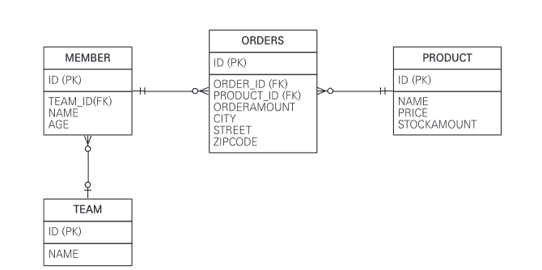
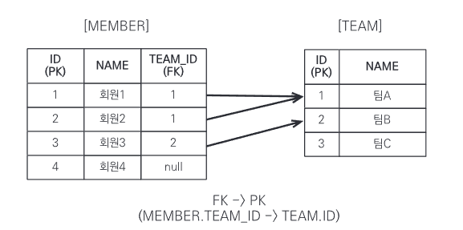
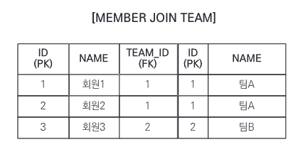
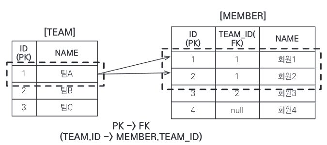
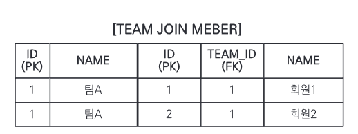
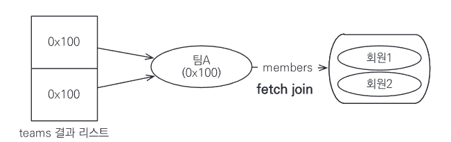
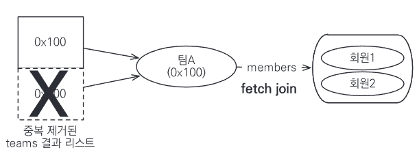
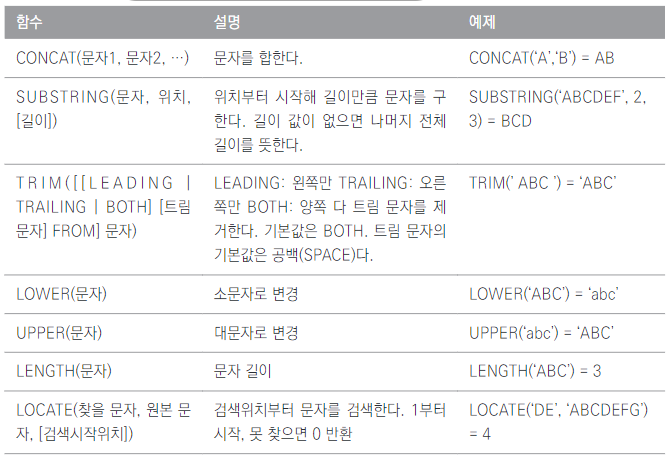
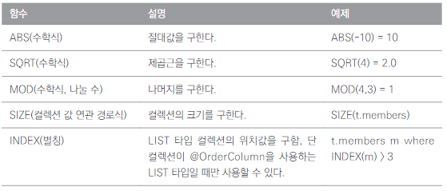
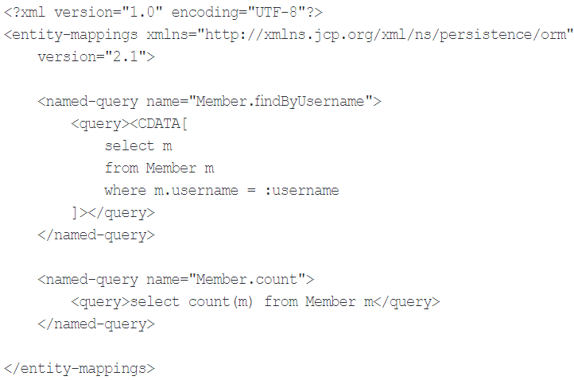

# 10.1 객체지향 쿼리 소개

find() 메소드를 사용하면 식별자로 엔티티 하나를 조회할 수 있다. 하지만 이것만으로 애플리케이션을 개발하기는 어렵다.  

나이가 30살 이상인 회원을 모두 검색하고 싶다면 더 복잡한 검색 방법이 필요할 것이다. SQL에서 필요한 내용을 최대한 걸러서 조회해야 한다.  

하지만 ORM을 사용하면 DB 테이블이 아닌 엔티티 객체를 대상으로 개발하므로 검색도 테이블이 아닌 엔티티 객체를 대상으로 하는 방법이 필요하다.  

`JPQL`은 이런 문제를 해결하기 위해 만들어졌는데 두 가지 특징이 있다.

1. 테이블이 아닌 객체를 대상으로 검색하는 객체지향 쿼리다.
2. SQL을 추상화해서 특정 DB SQL에 의존하지 않는다.

SQL이 DB 테이블을 대상으로 하는 데이터 중심 쿼리라면 JPQL은 엔티티 객체를 대상으로 하는 객체지향 쿼리다.  

JPQL을 사용하면 JPA는 이 JPQL을 분석해 적절한 SQL을 만들어 DB를 조회한다. 조회한 결과로 엔티티 객체를 생성해서 반환한다.  

JPA는 JPQL뿐 아니라 다양한 검색 방법을 제공한다.

1. JPQL(Java Persistence Query Language)
2. Criteria 쿼리 : JPQL을 편하게 작성하도록 도와주는 API, 빌더 클래스 모음
3. 네이티브 SQL : JPA에서 JPQL 대신 직접 SQL을 사용할 수 있다.

JPA가 공식 지원하는 기능은 아니지만 알아둘 가치가 있는 것들. 가장 중요한 것은 JPQL이다.

1. QueryDSL : Criteria 쿼리처럼 JPQL을 편하게 작성하도록 도와주는 빌더 클래스 모 음
2. JDBC 직접 사용, MyBatis 같은 SQL 매퍼 프레임워크 사용 : 필요하면 JDBC를 직접 사용할 수 있다.

## 10.1.1. JPQL 소개

`JPQL`은 엔티티 객체를 조회하는 객체지향 쿼리다.  

SQL을 추상화해서 특정 DB에 의존하지 않고 DB 방언만 변경하면 JPQL을 수정하지 않고 DB를 변경할 수 있다.  

회원 엔티티를 대상으로 JPQL을 사용하는 간단한 예제를 보자.

```java
@Entity(name="MEMBER")
public class Member{
    
    @Column(name = "name")
    private String username;
}
```

```java
//쿼리 생성
String jpql = "select m from Member as m where m.username = 'kim'";
List<Member> resultList = em.createQuery(jpql, Member.class).getResultList();
```

m.username은 테이블 컬럼명이 아닌 `엔티티 객체 필드명`이다.  
createQuery 메소드에 실행할 JPQL과 반환할 엔티티 클래스 타입인 Member.class를 넘겨주고 getResultList 메소드를 실행하면 JPA는 JPQL을 
SQL로 변환해서 DB를 조회한다. 그리고 조회한 결과로 Member 엔티티를 생성해서 반환한다.

## 10.1.2. Criteria 쿼리 소개

`Criteria`는 JPQL을 생성하는 빌더 클래스다.  

Criteria의 장점은 문자가 아닌 `query.select(m).where(...)`처럼 프로그래밍 코드로 JPQL을 작성할 수 있다는 것이다.  

`JPQL에서 select m from MEmbeeee m` 처럼 오타가 있다고 가정해보자. 해당 쿼리가 실행되는 런타임 시점에는 오류가 발생한다. 이것이 문자기반 쿼리의 단점이다.  

Criteria는 코드로 JPQL을 작성한다. 따라서 컴파일 시점에 오류를 발견할 수 있다.  

Criteria의 장점
1. 컴파일 시점에 오류 발견 가능.
2. IDE 사용 시 코드 자동완성 지원.
3. 동적 쿼리를 작성하기 편함.

JPA 2.0부터 Criteria를 지원한다. 간단한 Criteria 사용 코드를 보자.

```java
//Criteria 사용 준비
CriteriaBuilder cb = em.getCriteriaBuilder();
CriteriaQuery<Member> query = cb.createQuery(Member.class);

//루트 클래스(조회를 시작할 클래스)
Root<Member> m = query.from(Member.class);

//쿼리 생성
CriteriaQuery<Member> cq = query.select(m).where(cb.equal(m.get("username"), "kim"));
List<Member> resultList = em.createQuery(cq).getResultList();
```
Criteria는 가진 장점이 많지만 모든 장점을 상쇄할 정도로 복잡하고 장황하다. 사용하기 불편하고 작성한 코드도 한눈에 들어오지 않는다.

## 10.1.3. QueryDSL 소개

`QueryDSL`도 Criteria처럼 JPQL 빌더 역할을 한다. 장점은 코드 기반이면서 단순하고 사용하기 쉽다. 작성 코드도 JPQL과 비슷해 한눈에 들어온다.  

QueryDSL로 작성한 코드를 보자.
```java
//준비
JPAQuery query = new JPAQuery(em);
QMember member = QMember.member;

//쿼리, 결과조회
List<Member> members = query.from(member).where(member.username.eq("kim").list(member));

```
QueryDSL도 어노테이션 프로세서를 사용해서 쿼리 전용 클래스를 만들어야 한다. QMember는 Member 엔티티 클래스 기반으로 생성한 QueryDSL 쿼리 전용 클래스다. 

## 10.1.4. 네이티브 DSL 소개

JPA는 SQL을 직접 사용할 수 있는 기능을 지원하는데 이것을 `네이티브 SQL` 이라 한다.  

JPQL을 사용해도 특정 DB에 의존하는 기능을 사용해야할 때가 있다. 오라클의 CONNECT BY 기능 같은 것들이다.  

이런 기능들은 표준화되어 있지 않으므로 JPQL에서 사용할 수 없다. 그리고 SQL은 지원하지만 JPQL이 지원하지 않는 기능도 있다. 이 경우 네이티브 SQL을 사용한다.  

네이티브 SQL의 단점은 특정 DB에 의존하는 SQL을 작성해야 한다는 것이다. DB를 변경하면 네이티브 SQL도 수정해야 한다.  

네이티브 SQL은 em.creativeQuery()를 사용하면 도니다. 나머지 API 는 JPQL과 같다.  

## 10.1.5. JDBC 직접 사용, 마이바티스 같은 SQL 매퍼 프레임워크 사용

드물지만 JDCB 커넥션에 직접 접근하고 싶으면 JPA는 JDBC 커넥션을 획득하는 API를 제공하지 않으므로 JPA 구현체가 제공하는 방법을 사용해야 한다.  

하이버네이트에서 직접 JDCB Connection을 획득하는 방법은 다음과 같다.
```java
Session session = entityManager.unwrap(Session.class);
session.doWork(new Work() {
    
    @Override
    public void execute(Connection connection) throws SQLException{
        //work...
        }
        });
```

JPA EntityManager에서 하이버네이트 Session을 구현하고 Session의 doWork 메소드를 호출하면 된다.  

JDBC나 마이바티스를 JPA와 함께 사용하면 영속성 컨텍스트를 적절한 시점에 강제로 플러시해야 한다. 

영속성 컨텍스트와 데이터베이스를 불일치 상태로 만들어 데이터 무결성을 훼손하는 최악의 상황을 방지하기 위해서이다. JPA를 우회하는 SQL은 JPA가 전혀 인식하지 못한다.  

데이터 무결성 훼손 이슈를 해결하는 방법은 JPA를 우회해서 SQL 실행 전 영속성 컨텍스틑 수동 플러시해 DB와 영속성 컨텍스를 동기화하는 것이다.  

# 10.2. JPQL

여기서는 JPQL의 사용 방법 위주로 설명하겠다. 우선 JPQL의 특징을 다시 정리해보자.

1. 객체지향 쿼리 언어로 엔티티 객체를 대상으로 쿼리한다.
2. SQL을 추상화해서 특정 DB SQL에 의존하지 않는다.
3. 결국 SQL로 변환된다.

이번 절에서 예제로 사용할 도메인 모델이다.  


회원이 상품을 주문하는 다대다 관계라는 것을 주의해서 보자. Address(city, street, zipcode)는 임베디드 타입이다.

## 10.2.1. 기본 문법과 쿼리 API

JPQL도 SQL과 비슷하게 SELECT, UPDATE, DELETE 문을 사용할 수 있다. 엔티티 저장시에는 persist 메소드를 사용하면 되므로 INSERT 문은 없다.  

JPQL에서 UPDATE, DELETE 문은 벌크 연산이라 하는데 10.6절에서 알아보자.

### SELECT 문

SELECT 문은 다음과 같이 사용한다.  
`select m FROM Member AS m where m.username = 'Hello`  

- 대소문자 구분  
엔티티와 속성은 대소문자를 구분한다. Member, username은 대소문자를 구분하지만 SELECT, FROM 같은 JPQL 키워드는 구분하지 않는다.
- 엔티티 이름  
JPQL에서 사용한 Member는 클래스 명이 아니라 엔티티 명이다.
- 별칭은 필수  
Member에 m이라는 별칭을 주었다. 이처럼 JPQL은 별칭을 필수로 사용해야 한다. 없이 작성 시 잘못된 문법이라는 오류가 발생한다.

### TypeQuery, Query
작성한 JPQL을 실행하려면 쿼리 객체를 만들어야 한다. 반환 타입을 명확하게 지정할 수 있으면 TypeQuery 객체, 지정할 수 없으면 Query 객체를 사용한다.
```java
//TypeQuery 사용
TypedQuery<Member> query = em.createQuery("SELECT m FROM Member m", Member.class);

List<Member> resultList = query.getResultList();
for (Member member : resultList) {
    System.out.println("member =" + member);
        }
```

em.createQuery()의 두 번째 파라미터에 반환할 타입을 지정하면 TypeQuery를 반환하고 지정하지 않으면 Query를 반환한다.  
조회 대상이 Member 엔티티로 명확하므로 TypeQuery를 사용할 수 있다.

```java
//Query 사용
Query query = em.createQuery("SELECT m.username, m.age FROM Member m");
List resultList = query.getResultList();

for(Object o : resultList) {
    Object[] result = (Object[]) o; //결과가 둘 이상이면 Object[] 반환
    System.out.println("username = " + result[0]);
    System.out.println("age =" + result[1]);
}
```
조회 대상이 회원 이름과 나이이므로 조회 대상 타입이 명확하지 않다. SELECT 절에서 여러 엔티티나 컬럼 선택 시 Query 객체를 사용해야 한다.  

SELECT 절 조회 대상이 둘 이상이면 Object[]를 반환하고 하나면 Object를 반환한다. 
```SQL
SELECT m.username FROM Member m -> Object 반환
SELECT m.username, m.age FROM Member m -> Object[] 반환
```
타입을 반환할 필요가 없는 TypeQuery를 사용하는 것이 더 편리하다.

### 결과 조회

다음 메소드들을 호출하면 실제 쿼리를 실행해서 DB를 조회한다.

- query.getResultList() : 결과를 예제로 반환한다. 결과가 없으면 빈 컬렉션을 반환한다.
- query.getSingleResult() : 결과가 정확히 `하나`일 때 사용한다.  
결과가 1개보다 많으면 NonUniqueResultException 예외가 발생한다.

## 파라미터 바인딩

JPQL은 이름 기준 파라미터 바인딩도 지원한다.

### 이름 기준 파라미터

파라미터를 이름으로 구분하는 방법이다. 앞에 `:` 를 사용한다. 
```java
String usernameParam = "User1";

TypedQuery<Member> query = 
    em.createQuery("SELECT m FROM Member m WHERE m.username = :username", Member.class);

query.setParameter("username", usernameParam);
List<Member> resultList = query.getResultList();
```

`:username`이라는 이름 기준 파라미터를 정의하고 `query.setParameter()`에서 `username`이라는 이름으로 파라미터를 바인딩한다.

### 위치 기준 파라미터

`?`다음 위치 값을 주면 된다. 위치 값은 1부터 시작한다.
```java
List<Member> members = 
    em.createQuery("SELECT m FROM Member m WHERE m.username = ?1", Membe.class)
        .setParameter(1, usernameParam)
        .getResultList();
```
위치 기준 파라미터 방식보다 이름 기준 파라미터 바인딩 방식을 사용하는 것이 더 명확하다.  

> 참고  
> `SELECT m FROM Member m WHERE m.username = '" + usernameParam + "'"`
> 
> 위와 같이 파라미터 바인딩 방식을 사용하지 않고 직접 JPQL을 만들면 SQL 인젝션 공격을 당할 수 있다.  
> 또 파라미터 방식을 사용하면 파라미터 값이 달라도 같은 쿼리로 인식해서 JPA는 JPQL을 SQL로 파싱한 결과를 재사용할 수 있다.  
> DB도 내부에서 실행한 SQL을 파싱해서 사용하는데 같은 쿼리는 파싱 결과를 재사용할 수 있다. 결과적으로 전체 성능이 향상된다.
 

## 10.2.3. 프로젝션

SELECT 절에 조회할 대상을 지정하는 것을 `프로젝션(Projection)`이라 하고 `SELECT {프로젝션 대상} FROM`으로 대상을 선택한다.  

### 엔티티 프로젝션

```SQL
SELECT m FROM Member m // 회원
SELECT m.team FROM Member m //팀
```
둘 다 엔티티를 프로젝션 대상으로 사용했다.  

쉽게 생각해 원하는 객체를 바로 조회한 것으로 컬럼을 나열해서 조회하는 SQL과는 차이가 있다.  

이렇게 조회한 엔티티는 영속성 컨텍스트에서 관리된다.  

### 임베디드 타입 프로젝션

JPQL에서 임베디드 타입은 엔티티와 거의 비슷하게 사용된다. 임베디드 타입은 조회의 시작점이 될 수 없다는 제약이 있다.  

다음은 임베디드 타입인 Address를 조회의 시작점으로 사용해서 잘못된 쿼리다.
```java
String query = "SELECT a FROM Address a";
```

다음 코드를 통해 임베디드 타입을 조회할 수 있다.
```java
String query = "SELECT o.address FROM Order o";
List<Address> addresses = em.createQuery(query, Address.class).getResultList();
```

임베디드 타입은 엔티티 타입이 아닌 값 타입으로 직접 조회한 임베디드 타입은 영속성 컨텍스트에서 관리되지 않는다.

### 스칼라 타입 프로젝션

숫자, 문자, 날짜와 같은 기본 데이터 타입들을 스칼라 타입이라 한다. 통계 쿼리도 주로 스칼라 타입으로 조회한다.  

전체 회원의 이름을 조회하려면 다음처럼 쿼리한다.
```java
List<String> usernames = 
    em.createQuery("SELECT username FROM Member m", String.class).getResultList();
```

### 여러 값 조회
꼭 필요한 데이터들만 선택해서 조회해야 할 때가 있다. 프로젝션에 여러 값을 선택하면 TypeQuery를 사용할 수 없고 Query를 사용해야 한다.  

코드는 이전 절 Query 코드와 유사하므로 따로 입력하지 않겠다.

엔티티 타입 역시 여러 값을 함께 조회할 수 있다.
```java
List<Object[]> resultList =
    em.createQuery("SELECT o.member, o.product, o.orderAmount FROM Order o").getResultList();

for(Object[] row : resultList){
    Member member = (Member) row[0]; //엔티티
    Product product = (Product) row[1]; //엔티티
    int orderAmount = (Integer) rowp[2]; //스칼라    
}
```

### NEW 명령어

실제 애플리케이션 개발시에는 Object[]를 사용하지 않고 UserDTO 처럼 의미 있는 객체로 변환해서 사용할 것이다. 
```java
public class UserDTO {
    private String username;
    private int age;
    
    //Setter, Getter...
}
```

```java
//NEW 명령어 사용
TypedQuery<UserDTO> query =
    em.createQuery("SELECT new jpabook.jpql.UserDTO(m.username, m.age) FROM MEMBER m", UserDTO.class);
```

SELECT 다음 NEW 명령어를 사용하면 반환받을 클래스를 지정할 수 있는데 이 클래스의 생성자에 JPQL 조회 결과를 넘겨줄 수 있다.

NEW 명렁어 사용시 주의점.
1. 패키지 명을 포함한 전체 클래스 명을 입력해야 한다.
2. 순서와 타입이 일치하는 생성자가 필요하다.

### 페이징 API
페이징 처리용 SQL을 작성하는 일은 반복적이다. 또 DB마다 페이징을 처리하는 SQL문법이 다르다.  

JPA는 페이징을 두 API로 추상화했다.

1. setFirstResult(int startPosition): 조회 시작 위치(0부터 시작한다)
2. setMaxResults(int maxResult) : 조회할 데이터 수

```java
TypedQuery<Member> query = 
    em.createQuery("SELECT m FROM Membe m ORDER BY m.username DESC", Member.class);

query.setFirstResult(10);
query.setMaxResults(20);
query.getResultList();
```

FirstResult의 시작은 10이므로 11번째부터 시작해서 20건의 데이터를 조회한다(11~30).  

DB마다 다른 페이징 처리를 같은 API로 처리할 수 있는 것은 DB 방언(Dialect) 덕분이다.  

페이징 SQL을 더 최적화하고 싶다면 JPA가 제공하는 페이징 API가 아닌 네이티브 SQL을 직접 사용해야 한다.

## 10.2.5. 집합과 정렬

`집합`은 집함함수와 함께 통계 정보를 구할 때 사용한다.

### 집합 함수

| 함수       | 설명                              |
|----------|---------------------------------|
| COUNT    | 결과 수를 구한다. 반환 타입 : Long         |
| MAX, MIN | 최대, 최소 값을 구한다. 문자, 숫자, 날짜 등에 사용 |
| AVG      | 평균값을 구한다. 숫자타입만 사용할 수 있다. 반환 타입 : Double |
| SUM      | 합을 구한다. 숫자타입만 사용할 수 있다.         |

### 집함 함수 사용 시 참고사항

1. NULL 값은 통계에 잡히지 않는다.(DISTINCT가 정의되어 있어도 무시)
2. 만약 값이 없는데 SUM, AVG, MAX, MIN 함수 사용 시 NULL 값이 된다. COUNT는 0이 된다.
3. DISTINCT를 집함 함수 안에 사용해 중복된 값을 제거하고 집합을 구할 수 있다.
4. DISTINCT를 COUNT에서 사용할 때 임베디드 타입은 지원하지 않는다.

### GROUP BY, HAVING

`GROUP BY`는 통계 데이터를 구할 때 특정 그룹끼리 묶어준다. 다음은 팀 이름을 기준으로 그룹별로 묶어서 통계 데이터를 구한다.

```SQL
SELECT t.name, COUNT(m.age), SUM(m.age), AVG(m.age), MAX(m.age), MIN(m.age)
FROM Member m LEFT JOIN m.team t GROUP BY t.name
```

`HAVING`은 GROUP BY와 함께 사용되며 GROUP BY로 그룹화한 통계 데이터를 기준으로 필터링한다.  

위 코드에서 `HAVING AVG(m.age) >= 10`을 최하단에 추가시 그룹별 통계 데이터 중 평균나이가 10살 이상인 그룹을 조회한다.  

이런 쿼리들을 리포팅 쿼리나 통계 쿼리라 한다.

### 정렬(ORDER BY)

결과를 정렬할 때 사용한다. 

다음은 나이를 기준으로 내림차순, 나이가 같으면 이름을 기준으로 오름차순 정렬한다. 
```SQL
SELECT m FROM Member m ORDER BY m.age DESC, m.usernmae ASC
```

- ASC : 오름차순(기본값)
- DESC : 내림차순

## 10.2.6. JPQL 조인

JPQL도 조인을 지원하는데 SQL 조인과 기능은 같고 문법만 약간 다르다.

### 내부 조인
`INNER JOIN`을 사용한다. 참고로 INNER는 생략 가능하다.

```java
String teamName = "팀A";
String query = "SELECT m FROM Member m INNER JOIN m.team t WHERE t.name = :teamName";
```

생성된 내부 조인 SQL은 다음과 같다.
```SQL
SELECT
    M.ID AS ID,
    M.AGE AS AGE,
    M.TEAM_ID AS TEAM_ID,
    M.NAME AS NAME
FROM
    MEMBER M INNER JOIN TEAM T ON M.TEAM_ID = T_ID
WHERE
    T.NAME = ?
```

SQL의 조인과 JPQL의 조인 구문은 약간 다르다.  

JPQL 조인은 연관 필드(m.team)를 사용한다. 연관 필드는 다른 엔티티와 연관관계를 가지기 위해 사용하는 필드를 말한다.  

JPQL 조인을 SQL 조인처럼 사용하면 문법 오류가 발생한다. JPQL은 JOIN 명령어 다음 조인할 객체의 연관 필드를 사용한다.  

`FROM Member m JOIN Team t // 잘못된 JPQL 조인`  

### 외부 조인

JPQL의 외부 조인은 다음과 같이 사용한다.
```java
SELECT m
FROM Member m LEFT [OUTER] JOIN m.team t
```

외부 조인은 기능상 SQL의 외부 조인과 같다. OUTER는 생략 가능해서 보통 LEFT JOIN으로 사용한다. 이 JPQL을 실행하면 다음 SQL이 실행된다.
```SQL
SELECT
    M.ID AS ID,
    M.AGE AS AGE,
    M.TEAM_ID AS TEAM_ID,
    M.NAME AS NAME
FROM
    MEMBER M LEFT OUTER JOIN TEAM T ON M.TEAM_ID = T_ID
WHERE
    T.NAME = ?
```

### 컬렉션 조인

일대다 관계나 다대다 관계처럼 컬렉션을 사용하는 곳에 조인하는 것을 `컬렉션 조인`이라 한다.  

- [회원 -> 팀]으로의 조인은 다대일 조인이면서 단일 값 연관 필드(m.team)를 사용한다.
- [팀 -> 회원]은 반대로 일대다 조인이면서 컬렉션 값 연관 필드(m.members)를 사용한다.

`SELECT t, m FROM Team t LEFT JOIN t.members m`  

여기서 `t LEFT JOIN t.members`는 팀과 팀이 보유한 회원목록을 `컬렉션 값 연관 필드`로 외부 조인했다.  

### 세타 조인

WHERE 절을 사용해서 `세타 조인`을 할 수 있다. 세타 조인은 `내부 조인`만 지원한다.  

세타 조인을 사용하면 전혀 관계없는 엔티티도 조인할 수 있다.

```java
//회원 이름이 팀 이름과 똑같은 사람 수를 구하는 예
//JPQL
select count(m) from Member m, Team t
where m.username = t.name

//SQL
SELECT COUNT(M, ID)
FROM
    MEMBER M CROSS JOIN TEAM T
WHERE
    M.USERNAME=T.NAME
```

### JOIN ON절 (JPA2.1)

JPA 2.1부터 조인할 때 `ON` 절을 지원한다. ON 절을 사용하면 조인 대상을 필터링하고 조인할 수 있다.  

내부 조인의 ON 절은 WHERE 절을 사용할 때와 결과가 같아 보통 ON 절은 외부 조인에서만 사용한다.  

모든 회원을 조회하면서 회원과 연관된 팀도 조회하고 팀은 이름이 A인 팀만 조회해보자.
```java
//JPQL
select m, t from Member m
left join m.team t on t.name = 'A'

//SQL
SELECT m.*, t.* FROM Member m
LEFT JOIN Team t ON m.TEAM_ID=t.id and t.name = 'A'
```

## 10.2.7. 페치 조인

`페치 조인`은 SQL의 조인 종류가 아니고 JPQL에서 성능 최적화를 위해 제공하는 기능이다.  

연관된 엔티티나 컬렉션을 한 번에 같이 조회하는 기능으로 join fetch 명령어로 사용할 수 있다.  

### 엔티티 페치 조인

회원 엔티티를 조회하면서 연관된 팀 엔티티도 함께 조회하는 JPQL을 보자.
```SQL
select m
from Memer m join fetch m.team
```

join fetch를 사용해 회원과 팀을 함께 조회한다.  

페치 조인은 별칭을 사용할 수 없다. 그래서 m.team 다음 별칭이 없다.  

실행된 SQL은 다음과 같다.

```SQL
SELECT 
    M.*, T.*
FROM MEMBER M
INNER JOIN TEAM T ON M.TEAM_ID=T.ID
```

페치 조인을 사용하면 다음 그림처럼 SQL 조인을 시도한다.  
  

조인의 결과는 이렇게 된다.  

  

```java
//페치 조인 사용
String jpql = "select m from Member m join fetch m.team";

List<Member members = em.createQuery(jpql, Member.class).getResultList();

for (Member member : members) {
    //페치 조인으로 회원과 팀 함께 조인해서 지연 로딩 발생 X
    System.out.println("username = " + member.getUsername() + ", ") +
        "teamname = " + member.getTeam().name());    
        }
```

출력 결과는 다음과 같다.  
> username = 회원1, teamname = 팀A  
> username = 회원2, teamname = 팀A  
> username = 회원3, teamname = 팀B  

회원과 팀을 지연로딩으로 설정했다고 가정해보자.  

회원 조회 시 페치 조인으로 팀도 함께 조회했으므로 팀 엔티티는 프록시가 아닌 실제 엔티티다. 그래서 회원 엔티티가 영속성 컨텍스트에서 분리되어 준영속 상태가 
되어도 연관된 팀을 조회할 수 있다. 

### 컬렉션 페치 조인
```java
select t
from Team t join fetch t.members
where t.name = '팀A'
```

팀(t)을 조회하면서 페치 조인을 사용해서 연관된 회원 컬렉션(t.members)도 함께 조회한다.  
```SQL
//실행된 SQL
SELECT
    T.*, M.*
FROM TEAM T 
INNER JOIN MEMBER M ON T.ID = M.TEAM_ID
WHERE T.NAME = '팀A'
```

  

  

  
컬렉션 페치 조인 결과 객체에서 team 결과는 주소가 같은 '팀A'를 2건 가지게 된다.  

### 페치 조인과 DISTINCT

JPQL의 DISTINCT 명령어는 SQL에 DISTINCT를 추가하고 애플리케이션에서 한 번 더 중복을 제거한다.  

이전 절 컬렉션 페치 조인은 팀 A가 중복 조회된다. DISTINCT를 추가해보자.
```java
select distinct t
from Team t join fetch t.members
where t.name = '팀A'
```

지금은 각 로우의 데이터가 다르므로 SQL의 DISTINCT는 효과가 없다. 회원1과 회원2가 다르기 때문이다.  

이제 애플리케이션에서 중복된 데이터를 걸러낸다. 따라서 중복인 팀 A는 하나만 조회된다.
  

### 페치 조인과 일반 조인의 차이

페치 조인을 사용하지 않고 조인만 사용한다면?
```java
//JPQL
select t
from Team t join t.members m
where t.name = '팀A'

//실행된 SQL
SELECT
    T.*
FROM TEAM T
INNER JOIN MEMBER M ON T.ID = M.TEAM_ID
WHERE T.NAME = '팀A'
```
실행된 SQL의 SELECT 절을 보면 팀만 조회하고 조인했던 회원은 전혀 조회하지 않는다.  

JPQL은 결과를 반환할 때 연관관계까지 고려하지 않는다. SELECT 절에 지정한 엔티티만 조회할 뿐이다.  

회원 컬렉션을 지연 로딩으로 설정하면 프록시나 초기화되지 않은 컬렉션 래퍼를 반환하고, 즉시 로딩으로 설정하면 회원 컬렉션을 즉시 로딩하기 위해 쿼리를 한 번 더 실행한다.  

반면 페치 조인을 사용하면 연관된 엔티티도 함께 조회한다.

### 페치 조인의 특징과 한계

페치 조인을 사용하면 SQL 한 번으로 연관된 엔티티들을 함께 조회할 수 있어서 SQL 호출 횟수를 줄여 성능을 최적화할 수 있다.  

엔티티에 직접 적용하는 로딩 전략은 애플리케이션 전체에 영향을 미쳐 `글로벌 로딩 전략`이라 한다. 페치 조인은 글로벌 로딩 전략보다 우선한다.  

글로벌 로딩 전략을 지연 로딩으로 설정해도 JPQL에서 페치 조인을 사용하면 페치 조인을 적용해서 함께 조회한다.  

최적화를 위해 글로벌 로딩 전략을 즉시 로딩으로 설정하면 애플리케이션 전체에서 항상 즉시 로딩이 일어나 사용하지 않는 엔티티를 자주 로딩해 성능에 악영향을 미칠 수 있다.  

따라서 되도록 지연 로딩을 사용하고 최적화가 필요하면 페치 조인을 적용하는 것이 효과적이다.

`@OneToMany(fetch = FetchType.LAZY) // 글로벌 로딩 전략`  

페치 조인의 한계점

1. 페치 조인 대상에는 별칭을 줄 수 없다.
2. 둘 이상의 컬렉션을 페치할 수 없다.
3. 컬렉션을 페치 조인하면 페이징 API를 사용할 수 없다.  

페치 조인은 객체 그래프를 유지할 때 사용하면 효과적이다.  

반면 여러 테이블을 조인해서 엔티티가 가진 모양이 아닌 전혀 다른 결과를 내야 한다면 여러 테이블에서 필요한 필드들만 조회해서 DTO로 반환하는 것이 더 효과적일 수도 있다.

## 10.2.8. 경로 표현식

이번에는 JPQL에서 사용하는 `경로 표현식`을 알아보고 경료 표현식을 통한 묵시적 조인도 알아보자.  

경로 표현식은 쉽게 말해 .(점)을 찍어 객체 그래프를 탐색하는 것이다.
```java
select m.username
from Member m
    join m.team t
    join m.orders o
where t.name =  '팀A'
```

여기서 m.username, m.team, m.orders, t.name이 모두 경료 표현식을 사용한 것이다.

### 경료 표현식의 용어 정리

- 상태 필드 : 값을 저장하기 위한 필드
- 연관 필드 : 연관관계를 위한 필드, 임베디드 타입 포함  
단일값 연관 필드 : @ManyToOne, @OneToOne, 대상이 엔티티  
컬렉션 값 연관 필드 : @OneToMany, @ManyToMany, 대상이 컬렉션

```java
@Entity
public class Member{
    
    @Id @GeneratedValue
    private Long id;
    
    @Column(name = "name")
    private String username; //상태 필드
    priavte Integer age; //상태 필드
    
    @ManyToOne(..)
    private Team team; //연관 필드(단일 값)
    
    @OneToMany(..)
    private List<Order> orders; //연관 필드(컬렉션 값)
}
```

- 상태 필드 : t.username, t.age
- 단일 값 연관 필드 : m.team
- 컬렉션 값 연관 필드 : m.orders


### 경로 표현식과 특징

- 상태 필드 경로 : 경로 탐색의 끝으로 더 탐색할 수 없다.
- 단일 값 연관 경로: `묵시적 내부 조인`이 일어난다. 계속 탐색할 수 있다.
- 컬렉션 값 연관 경로 : `묵시적 내부 조인`이 일어난다. 더 탐색할 수 없다. 단 FROM 절에서 조인으로 별칭을 얻으면 별칭으로 탐색 가능하다.

### 상태 필드 경로 탐색

JPQL은 다음과 같다.

`select m.username, m.age from Member m`  

실행 결과 SQL은 다음과 같다.
```SQL
SELECT M.NAME, M.AGE
FROM MEMBER M
```

### 단일 값 연관 경로 탐색

JPQL은 다음과 같다.  

`select o.member from Order o`

실행 결과 SQL은 다음과 같다.
```SQL
SELECT M.*
FROM ORDERS O 
    INNER JOIN MEMBER M ON O.MEMBER_ID = M.ID
```

단일 값 연관 필드로 경로 탐색을 하면 SQL에서 내부 조인이 일어나는데 이것을 `묵시적 조인`이라 한다. 묵시적 조인은 모두 내부 조인이다.  

외부 조인은 명시적으로 JOIN 키워드를 사용해야 한다.  

- 명시적 조인 : JOIN을 직접 적어주는 것
- 묵시적 조인 : 경로 표현식에 의해 묵시적으로 조인이 일어나는 것. 내부조인만 할 수 있다.  

### 컬렉션 값 연관 경로 탐색

JPQL을 다루면서 많이 하는 실수 중 하나는 컬렉션 값에서 경로 탐색을 시도하는 것이다.

```SQL
select t.members from Team t //성공
select t.members.username from Team t //실패
```

t.members 처럼 컬렉션까지는 경로 탐색이 가능하다. 하지만 컬렉션에서 경로 탐색을 시작하는 것은 불가능하다.  

컬렉션에서 경로 탐색을 하고 싶으면 조인을 사용해서 새로운 별칭을 획득해야 한다.  

`select m.username from Team t join t.members m`  

컬렉션은 컬렉션의 크기를 구할 수 있는 size를 사용하면 COUNT 함수를 사용하는 SQL로 변환된다.  

### 경로 탐색을 사용한 묵시적 조인 시 주의 사항

- 항상 내부 조인이다.
- 컬렉션은 경로 탐색의 끝이다. 컬렉션에서 경로 탐색 시 명시적으로 조인해서 별칭을 얻어야 한다.
- 경로 탐색은 주로 SELECT, WHERE절에서 사용하지만 묵시적 조인으로 SQL의 FROM 절에 영향을 준다.

묵시적 조인은 조인이 일어나는 상황을 한눈에 파악하기 어렵다. 성능이 중요하다면 분석이 쉽도록 명시적 조인을 사용하자.

## 10.20.9. 서브 쿼리

JPQL은 서브쿼리를 WHERE, HAVING 절에만 사용할 수 있꼬 SELECT, FROM 절에는 사용할 수 없다. 

### 서브 쿼리 함수

1. EXISTS  
문법 : [NOT] EXISTS (subquery)  
설명 : 서브쿼리에 결과가 존재하면 참이다. NOT은 반대  
ex ) 팀 A 소속인 회원  
```java
select m from Member m
where exists (select t from m.team t where t.name = '팀A')
```

2. {ALL | ANY | SOME}  
문법 : {ALL | ANY | SOME} (subquery)  
설명 : 비교 연산자와 같이 사용한다. {= | > | >= | < | <= | <>}  
ALL은 조건을 모두 만족하면 참이다.  
ANY | SOME은 조건을 하나라도 만족하면 참이다.

3. IN  
문법 : [NOT] INT (subquery)  
설명 : 서브쿼리의 결과 중 하나라도 같은 것이 있으면 참이다. IN 은 서브쿼리가 아닌 곳에서도 사용된다.  

## 10.2.10. 조건식

### 타입 표현

| 함수      | 설명                                                                                | 예제                                                                     |
|---------|-----------------------------------------------------------------------------------|------------------------------------------------------------------------|
| 문자      | 작은 따옴표 사인에 표현<br/>작은 따옴표를 표현하고 싶으면 작은 따옴표 연속 두개 사용                                | 'HELLO'<br/>'She''s'                                                   |
| 숫자      | L(Long 타입 지정)<br/>D(Double 타입 지정)<br/> F(Float 타입 지정)                             | 10L<br/>10D<br/>10F                                                    |
| 날짜      | DATE{d'yyyy-mm-dd'}<br/>TIME{t'hh-mm-ss'}<br/>DATETIME{ts'yyyy-mm-dd hh:mm:ss.f'} | {d '2012-03-24'}<br/>{t '10-11-11'}<br/>{ts '2012-03-24 10-11-11.123'} |
| Boolean | TRUE, FALSE                                                                       |                                                                        |
| Enum    | 패키지명을 포함한 전체 이름을 사용해야 한다.                                                         | jpabook.MemberType.Admin                                               |
| 엔티티 타입  | 엔티티의 타입을 표현한다. 주로 상속과 관련해서 사용한다.                                                  | TYPE(m) = Member                                                       |

### 연산자 우선 순위

1. 경로 탐색 연산 (.)
2. 수학 연산 : +, -(단항 연산자), *, /, +, _
3. 비교 연산 : =, >, >=, <, <=, <>(다름), [NOT] BETWEEN .....
4. 논리 연산 : NOT, AND, OR

### 논리 연산과 비교식

- 논리 연산  
AND : 둘 다 만족하면 참  
OR : 둘 중 하나만 만족해도 참  
NOT : 조건식의 결과 반대

- 비교식  
= | > | >= | < | <= | <>

### Between, IN, LIKE, NULL 비교

- Between 식  
문법 : X [NOT] BETWEEN A AND B  
설명 : X는 A ~ B 사이의 값이면 참(A, B 값 포함)  


- IN 식  
문법 : [NOT] INT (subquery)  
설명 : X와 같은 값이 예제에 하나라도 있으면 참이다.


- Like 식  
문법 : 문자표현식 [NOT] LIKE 패턴값 [ESCAPE 이스케이프문자]  
설명 : 문자표현식과 패턴값을 비교한다.  
% : 아무 값들이 입력되어도 된다. (값이 없어도 됨)  
_ : 한 글자는 아무 값이 입력되어도 되지만 값이 있어야 한다.   


- NULL 비교식  
문법 : {단일값 경로 | 입력 파라미터 | IS [NOT] NULL  
설명 : NULL 인지 비교한다. NULL은 = 으로 비교하면 안되고 IS NULL을 사용해야 한다.  

### 컬렉션 식

컬렉션은 컬렉션 식 이외에 다른 식은 사용할 수 없다. 

- 빈 컬렉션 비교 식  
문법 : {컬렉션 값 연관 경로} IS [NOT] EMPTY  
설명 : 컬렉션에 값이 비었으면 참  

```java
//JPQL : 주문이 하나라도 있는 회원 조회
select m from Member m
where m.orders is not empty

//실행된 SQL
select m.* from Member m
where
    exists (
            select o.id
            from Orders o
            where m.id = o.member_id
        )
```  

IS NULL  같은 컬렉션 식이 아닌 것은 사용하면 오류가 발생한다. 

- 컬렉션의 멤버 식  
문법 : {엔티티나 값} [NOT] MEMBER [OF] {컬렉션 값 연관 경로}  
설명 : 엔티티나 값이 컬렉션에 포함되어 있으면 참  

```java
select t from Team t
where :memberParam member of t.members
```

### 스칼라 식

스칼라는 숫자, 문자, 날짜, case, 엔티티 타입 같은 가장 기본적인 타입들을 말한다.  

- 수학 식  
+, - : 단항 연산자  
*, /, +, - : 사칙연산  


- 문자함수  



- 수학함수  



- 날짜 함수  
날짜 함수는 데이터베이스의 현재 시간을 조회한다.  
CURRENT_DATE : 현재 날짜  
CURRENT_TIME : 현재 시간  
CURRENT_TIMESTAMP : 현재 날짜 시간  

### CASE 식

특정 조건에 따라 분기할 때 CASE 식을 사용한다. CASE 식은 4가지 종류가 있다.  

1. 기본 CASE  
문법 :  
```SQL
CASE
    {WHEN <조건식> THEN <스칼라식>}+
    ELSE <스칼라식>
END
```
예 :
```sql
SELECT
    CASE WHEN M.AGE <= 10 THEN '학생요금'
         WHEN M.AGE >= 60 THEN '경로요금'
         ELSE '일반요금'
END
```

2. 심플 CASE  
심플 CASE는 조건식을 사용할 수 없지만 문법이 단순하다. 자바의 switch case 문과 비슷하다.  
문법 :  
```SQL
CASE <조건대상>
    {WHEN <스칼라식1> THEN <스칼라식2>}+
    ELSE <스칼라식>
END
FROM MEMBER M
```
예 :  
```sql
SELECT
    CASE T.NAME
        WHEN '팀A' THEN '인센티브110%'
        WHEN '팀B' THEN '인센티브120%'
        ELSE '인센티브105%'
END
FROM T
```

3. COALESCE  
문법 : COALESCE(<스칼라식> {,<스칼라식>}+)  
스칼라식을 차례대로 조회해서 NULL이 아니면 반환한다.  
예 : m.username이 null이면 '이름 없는 회원'을 반환하라.
```sql
select coalesce(m.username,'이름 없는 회원`) from Member m
```  

4. NULLIF  
문법 : NULLIF{<스칼라식>, <스칼라식>}  
설명 : 두 값이 같으면 null을 반환하고 다르면 첫 번째 값을 반환한다.  
예 : 사용자 이름이 관리자면 null을 반환하고 나머지는 본인의 이름을 반환하라.  
```sql
select NULLIF(m.username, '관리자') from Member m
```

## 10.2.11. 다형성 쿼리

JPQL로 부모 엔티티를 조회하면 그 자식 엔티티도 함께 조회한다.  

### TYPE

`TYPE`은 엔티티의 상속 구조에서 조회 대상을 특정 자식 타입으로 한정할 때 사용한다.  

예 : Item 중에 Book, Moovie를 조회하라.
```java
//JPQL
select i from Item i
where type(i) IN (Book, Moovie)

//SQL
SELECT i FROM Item i
WHERE i.DTYPE in('B', 'M')
```

## TREAT (JPA2.1)

TREAT는 자바의 타입 캐스팅과 비슷하다. 상속 구조에서 부모 타입을 특정 자식 타입으로 다룰 때 사용한다.  

JPA 표준은 FROM, WHERE 절에서 사용할 수 있다.  

예 : 부모인 Item과 자식인 Book이 있다.

```java
//JPQL
select i from Item i where treat(i as Book).author = 'kim'

//SQL
select i.* from Item i
where
    i.DTYPE = 'B'
    and i.author = 'kim'
```

treat를 사용해 부모 타입인 Item을 자식 타입인 Book으로 다룬다. 그렇게 author 필드에 접근할 수 있다.  

## 10.2.12. 사용자 정의 함수 호출 (JPA2.1)

문법 : `function_innovation::= FUNCTION(function_name {, function_arg}*`  

예 : `select function('group_concat', i.name) from Item i`

## 10.2.13. 기타 정리

- enum은 = 비교 연산만 지원한다.
- 임베디드 타입은 비교를 지원하지 않는다. 

### EMPTY STRING

JPA 표준은 '`을 길이 0인 Empty String으로 정했지만 DB에 따라 '`를 NULL로 사용하는 DB도 있으므로 확인하고 사용해야 함.

### NULL 정의

- 조건을 만족하는 데이터가 하나도 없으면 `NULL`이다. 
- NULL 은 알 수 없는 값이다. NULL 과의 모든 수학적 계산 결과는 `NULL`이다.
- NULL == NULL 은 `알 수 없는 값`이다.
- NULL IS NULL 은 참이다.

## 10.2.14 엔티티 직접 사용

### 기본 키 값

객체 인스턴스는 참조 값으로 식별하고 테이블 로우는 기본 키 값으로 식별한다.  

JPQL에서 엔티티 객체를 직접 사용하면 SQL에서는 해당 엔티티의 기본 키 값을 사용한다. 

```java
select count(m.id) from Member m //엔티티 아이디 사용
select count(m) from Member m //엔티티 직접 사용
```

두 번째 count(m)에서 엔티티 별칭을 직접 넘겨줬다. 엔티티를 직접 사용하면 JPQL이 SQL로 변환될 때 엔티티의 기본키를 사용한다.  

실제 실행된 SQL은 둘 다 같다.  

```java
//엔티티를 파라미터로 직접 받는 코드
String qlString = "select m from Member m where m = :member"
List resultList = em.createQuery(qlString)
        .setParameter("member", member)
        .getResultList();
```

실행된 SQL은 다음과 같다.
```sql
select m.*
from Member m
where m.id = ?
```

JPQL에서 `where m = :member`로 엔티티를 직접 사용하는 부분이 SQL에서 `where m.id = ?`로 기본키 값을 사용하도록 변환되었다.

### 외래 키 값

특정 팀에 소속된 회원을 찾아보자.
```java
Team team = em.find(Team.class, 1L);

String qlString = "select m from Member m where m.team = :team";
List resultList = em.createQuery(qlString)
        .setParameter("team",team)
        .getResultList();
```

기본 키 값이 1L인 팀 엔티티를 파라미터로 사용하고 있다. m.team은 team_id라는 외래키와 매핑되어 있다.  

실행된 SQL은 다음과 같다.
```sql
select m.*
from Member m
where m.team_id=? (팀 파라미터의 id값)
```

## 10.2.15. Named 쿼리 : 정적 쿼리

동적 쿼리 : em.createQuery처럼 JPQL을 문자로 완성해서 직접 넘기는 것을 동적 쿼리라 한다.  

정적 쿼리 : 미리 정의한 쿼리에 이름을 부여해서 필요할 때 사용할 수 있는데 이것을 Named 쿼리라 한다. 한 번 정의하면 변경할 수 없는 정적 쿼리다.  

Named 쿼리는 애플리케이션 로딩 시점에 JPQL 문법을 체크하고 미리 파싱해둔다. 따라서 오류 확인이 빠르고, 사용 시점에는 파싱 결과를 재사욯해 성능상 이점이 있다.  

또 Named 쿼리는 변하지 않는 정적 SQL이 생성되므로 DB 조회 성능 최적화에도 도움이 된다. 

Named 쿼리는 @NamedQuery 어노테이션을 사용해서 자바 코드에 작성하거나 XML 문서에 작성할 수 있다.  

### Named 쿼리를 어노테이션에 정의
```java
@Entity
@NamedQuery{
    name = "Member.findByUsername",
    query = "select m from Member m where m.username = :username")
public class Member{
    ...
}
}
```

@NamedQuery.name에 쿼리 이름을 부여하고 @NamedQuery.query에 사용할 쿼리를 입력한다.  

```java
List<Member> resultList = em.createNamedQuery("Member.findByUsername",Member.class)
        .setParameter("username", "회원1")
        .getResultList();
```

Named 쿼리를 사용할 때는 em.createdNamedQuery() 메소드에 Named 쿼리 이름을 입력하면 된다.  

> 참고  
> Named 쿼리는 영속성 유닛 단위로 관리되므로 충돌을 방지하기 위해 쿼리 이름에 엔티티 이름을 앞에 주었다.

하나의 엔티티에 2개 이상의 NamedQuery를 정의하려면 @NamedQueries 어노테이션을 사용하면 된다.

@NamedQuery의 어노테이션에 대해 알아보자.  

1. lockMode : 쿼리 실행 시 락을 건다. 자세한 내용은 16.1절에서...
2. hints: SQL 힌트가 아니라 JPA 구현체에게 제공하는 힌트다. 예를 들어 2차 캐시를 다룰 때 사용한다.

### Named 쿼리를 XML에 정의

어노테이션을 사용하는 것이 직관적이고 편리하지만 Named 쿼리를 작성할 때는 XML을 사용하는 것이 편리하다.   


META-INF/ormMember.xml, XML에 정의한 Named 쿼리   


그리고 정의한 ormMember.xml을 인식하도록 META-INF/persistence.xml에 다음 코드를 추가해야 한다.
```java
<persistence-unit name="jpabook">
    <maaping-file>META-INF/ormMember.xml/</mapping-file>
```
### 환경에 따른 설정

XML과 어노테이션에 같은 설정이 있으면 XML이 우선권을 가진다.  

애플리케이션이 운영 환경에 따라 다른 쿼리를 실행해야 한다면 각 환경에 맞춘 XML을 준비해두고 XML만 변경해서 배포하면 된다.