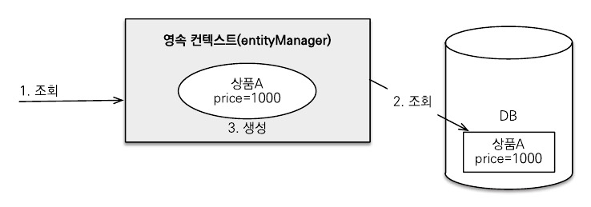
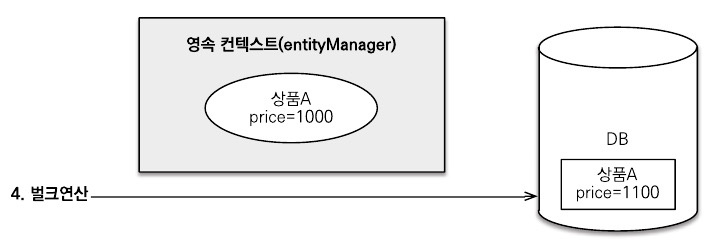
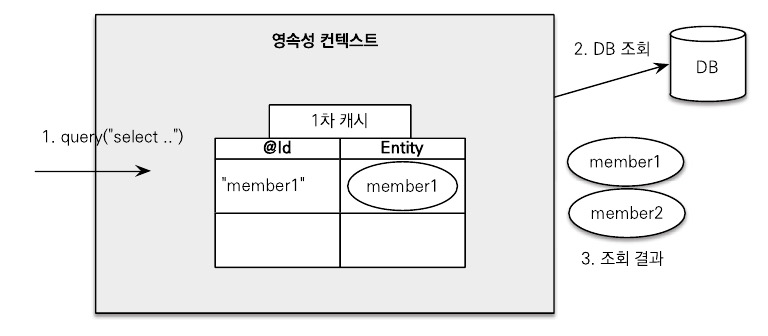
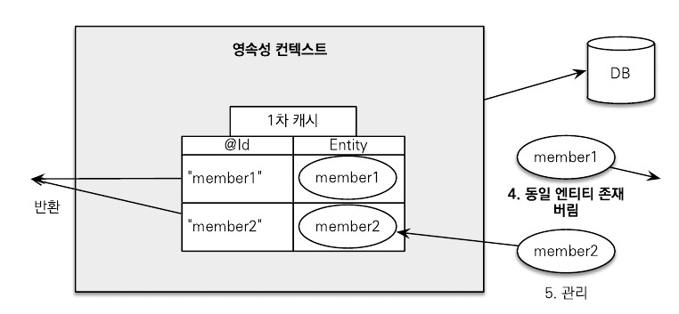

# 10.3 Criteria

Criteria 쿼리는 JPQL을 자바 코드로 작성하도록 도와주는 빌더 클래스 API다. Criteria를 사용하면 문자가 아닌 코드로 JPQL을 작성하므로 문법 오류를 컴파일 단계에서 잡을 수 있고 문자 기반의 JPQL보다 동적 쿼리를 안전하게 생성할 수 있는 장점이 있다. 하지만 실제 Criteria를 사용해서 개발해보면 코드가 복잡하고 장황해서 직관적으로 이해가 힘들다는 단점도 있다.

## 10.3.1 Criteria 기초

다음은 간단한 Criteria 예제이다. 

```java
// JPQL: select m from Member m

CriteriaBuilder cb = em.getCriteriaBuilder();

// Criteria 생성
CriteriaQuery<Member> cq = cb.createQuery(Member.class);

Root<Member> m = cq.from(Member.class); // FROM 절
cq.select(m) // SELECT 절

TypedQuery<Member> query = em.createQuery(cq);
List<Member> members = query.getResultList();
```

Criteria는 검색 조건부터 정렬까지 CriteriaBuilder를 사용해서 코드를 완성한다.

쿼리 루트와 별칭을 알아보자.

- Root<Member> m = cq.from(Member.class): 여기서 m이 쿼리 루트이다.
- 쿼리 루트는 조회의 시작점이다.
- Criteria에서 사용되는 특별한 별칭이다. JPQL의 별칭이라 생각하면 된다.
- 별칭은 엔티티에만 부여할 수 있다.

## 10.3.2 Criteria 쿼리 생성

Criteria를 사용하려면 CriteriaBuilder.createQuery() 메소드로 Criteria 쿼리를 생성하면 된다.

Criteria 쿼리를 생성할 때 파라미터로 쿼리 결과에 대한 반환 타입을 지정할 수 있다. 반환 타입을 지정해주면 em.createQuery()에서 반환 타입을 지정해주지 않아도 된다.

```java
CriteriaQuery<Member> cq = cb.createQuery(Member.class);
```

반환 타입을 지정할 수 없으면 다음 예제와 같이 Object로 반환받으면 된다.

```java
CriteriaQuery<Object> cq = cb.createQuery();
```

반환 타입이 둘 이상이면 Object[]를 사용하는 것이 편리하다.

```java
CriteriaQuery<Object[]> cq = cb.createQuery(Object[].class);
```

반환 타입을 튜플로 받고 싶으면 다음과 같이 튜플을 사용하면 된다.

```java
CriteriaQuery<Tuple> cq = cb.createQuery();
```

## 10.3.3 조회

다음은 SELECT 절을 만드는 select에 대해 정리한 것이다.

```java
// 한 건 지정
CriteriaQuery<T> select(Selection<? extends T> selection);

// 여러 건 지정
CriteriaQuery<T> multiselect(Selection<?> ... selections);

// 여러 건 지정
CriteriaQuery<T> multiselect(List<Selection<?>> selectionList);
```

### 조회 대상을 한 건, 여러 건 지정

select에 조회 대상을 하나만 지정하려면 다음처럼 작성하면 된다.

```java
cq.select(m);
```

조회 대상을 여러 건을 지정하려면 multiselect를 사용하면 된다.

```java
cq.multiselect(m.get("username"), m.get("age"));
```

여러 건 지정은 다음처럼 cb.array를 사용해도 된다.

```java
cq.select(cb.array(m.get("username"), m.get("age")));
```

### DISTINCT

distinct는 select, multiselect 다음에 distinct(true)를 사용하면 된다.

```java
cq.multiselect(m.get("username"), m.get("age")).distinct(true);
```

### NEW, construct()

JPQL에서 select new 생성자() 구문을 Criteria에서는 cb.construct(클래스 타입, …)로 사용한다.

```java
cq.select(cb.construct(MemberDTO.class), m.get("username"), m.get("age"));
```

JPQL에서는 select new jpabook.domain.MemberDTO()처럼 패키지명을 다 적어주었지면 Criteria는 코드를 직접 다루므로 MemberDTO.class처럼 간략하게 사용할 수 있다.

### 튜플

Criteria는 Map과 비슷한 튜플이라는 특별한 반환 객체를 제공한다.

다음은 튜플을 사용한 예제이다.

```java
CriteriaBuilder cb = em.getCriteriaBuilder();

CriteriaQuery<Tuple> cq = cb.createTupleQuery();

Root<Member> m = cq.from(Member.class);
cq.multiselect(m.get("username").alias("username"),
								m.get("age").alias("age")) // alias: 튜플에서 사용할 튜플 별칭
								
TypedQuery<Tuple> query = em.createQuery(cq);
List<Tuple> resultList = query.getReulstList();
for(Tuple tuple : resultList) {
	String username = tuple.get("username");
	Integer age = tuple.get("age");
}
```

튜플을 사용하려면 cb.createTupleQuery() 또는 cb.createQuery(Tuple.class)로 Criteria를 생성하면 된다.

튜플은 이름 기반이므로 순서 기반의 Object[]보다 안전하다. 그리고 tuple.getElements() 같은 메소드를 사용해서 현재 튜플의 별칭과 자바 타입도 조회할 수 있다.

## 10.3.4 집합

### GROUP BY

다음은 GROUP BY를 사용한 예제이다.

```java
CriteriaBuilder cb = em.getCriteriaBuilder();
CriteriaQuery<Object[]> = cb.createQuery(Object[].class);
Root<Member> m = cq.from(Member.class);

Expression maxAge = cb.max(m.<Integer>get("age"));
Expression minAge = cb.min(m.<Integer>get("age"));

cq.multiselect(m.get("team").get("name"), maxAge, minAge);
cq.groupBy(m.get("team").get("name")); // GROUP BY

TypedQuery<Object[]> query = em.createQuery(cq);
List<Object[]> resultList = query.getReulstList();
```

### HAVING

다음은 HAVING을 사용한 예제이다.

```java
cq.multiselect(m.get("team").get("name"), maxAge, minAge)
	.groupBy(m.get("team").get("name")); // GROUP BY
	.having(cb.gt(minAge, 10)); // HAVING
```

## 10.3.5 정렬

정렬 조건도 Criteria 빌더를 통해서 생성한다.

cb.desc(…) 또는 cb.asc(…)로 생성할 수 있다.

```java
cq.select(m)
	.where(ageGt)
	.orderby(cn.desc(m.get("age")));
```

## 10.3.6 조인

조인은 join() 메소드와 JoinType 클래스를 사용한다.

다음은 조인을 사용한 예제이다.

```java
Root<Member> m = cq.from(Member.class);
Join<Member, Team> t = m.join("team", JoinType.INNER); // 내부 조인

cq.multiselect(m, t)
	.where(cb.equal(t.get("name"), "팀A"));
```

쿼리 루트(m)에서 바로 m.join() 메소드를 사용해서 회원과 팀을 조인햇다. 그리고 조인한 team에 t라는 별칭을 주었다. 여기서는 JoinType.INNER를 설정해서 내부 조인을 사용했다.

```java
m.join("team") // 내부 조인
m.join("team", JoinType.INNER) // 내부 조인
m.join("team", JoinType.LEFT) // 외부 조인
```

FETCH JOIN은 다음과 같이 사용한다.

```java
m.fetch("team", JoinType.LEFT);
```

## 10.3.7 서브쿼리

다음은 간단한 서브쿼리를 사용한 예제이다.

```java
CriteriaBuilder cb = em.getCriteriaBuilder();
CriteriaQuery<Member> mainQuery = cb.createQuery(Member.class);

// 서브 쿼리 생성
Subquery<Double> subQuery = mainQuery.subquery(Double.class);

Root<Member> m2 = subQuery.from(Member.class);
subQuery.select(cb.avg(m2.<Integer>get("age")));

// 메인 쿼리 생성
Root<Member> m = mainQuery.from(Member.class);
mainQuery.select(m)
				.where(cb.ge(m.<Integer>get("age"), subQuery));
```

다음은 메인 쿼리와 서브 쿼리 간에 서로 관련이 있을 때의 예제이다.

```java
CriteriaBuilder cb = em.getCriteriaBuilder();
CriteriaQuery<Member> mainQuery = cb.createQuery(Member.class);

// 서브 쿼리에서 사용되는 메인 쿼리의 m
Root<Member> m = mainQuery.from(Member.class);

// 서브 쿼리 생성
Subquery<Double> subQuery = mainQuery.subquery(Double.class);
Root<Member> subM = subQuery.correlate(m); // 메인 쿼리의 별칭을 가져옴

Join<Member, Team> t = sumM.join("team");
subQuery.select(t)
				.where(cb.equal(t.get("name"), "팀A"));
				
// 메인 쿼리 생성
mainQuery.select(m)
				.where(cb.exists(subQuery));
				
List<Member> resultList = em.createQuery(mainQuery).getResultList();
```

서브 쿼리에서 메인 쿼리의 정보를 사용하려면 메인 쿼리에서 사용한 별칭을 얻어야 한다. 서브 쿼리는 메인 쿼리의 Root나 Join을 통해 생성된 별칭을 받아서 사용할 수 있다. subQuery.correlate(m) 메소드를 사용하여 메인 쿼리의 별칭을 서브 쿼리에서 사용한 것을 볼 수 있다.

## 10.3.8 IN 식

IN 식은 Criteria 빌더에서 in(…) 메소드를 사용한다. 다음은 IN을 사용한 예제이다.

```java
CriteriaBuilder cb = em.getCriteriaBuilder();
CriteriaQuery<Member> cq = cb.createQuery(Member.class);
Root<Member> m = cq.from(Member.class);

cq.select(m)
		.where(cb.in(m.get("username"))
		.value("회원1")
		.value("회원2");
```

## 10.3.9 CASE 식

CASE 식에는 selectCase() 메소드와 when(), otherwise() 메소드를 사용한다.

```java
Root<Member> m = cq.from(Member.class);

cq.multiselect(
			m.get("username"),
			cb.selectCase()
				.when(cb.ge(m.<Integer>get("age"), 60), 600)
				.when(cb.le(m.<Integer>get("age"), 15), 500)
				.otherwise(1000)
);
```

## 10.3.10 파라미터 정의

JPQL에서 파라미터를 정의했듯이 Criteria도 파라미터를 정의할 수 있다.

```java
Root<Member> m = cq.from(Member.class);

cq.select(m)
	.where(cb.equal(m.get("username"), cb.parameter(String.class, "usernameParam")));

List<Member> resultList = em.createQuery(cq)
														.setParameter("usernameParam", "회원1")
														.getResultList();
```

## 10.3.11 네이티브 함수 호출

네이티브 SQL 함수를 호출하려면 cb.function() 메소드를 사용하면 된다.

```java
Root<Member> m = cq.from(Member.class);
Expression<Long> function = cb.function("SUM", Long.class, m.get("age"));
cq.select(function);
```

예제에서는 전체 회원의 나이 합을 구하는 SUM을 사용하였다. SUM 대신에 원하는 네이티브 SQL 함수를 입력하여 사용할 수 있다.

## 10.3.12 동적 쿼리

다양한 검색 조건에 따라 실행 시점에 쿼리를 생성하는 것을 동적 쿼리라고 한다. 동적 쿼리는 문자 기반인 JPQL 보다는 코드 기반인 Criteria로 작성하는 것이 더 편리하다.

먼저 JPQL로 작성한 동적 쿼리부터 살펴보겠다.

```java
// 검색 조건
Integer age = 10;
String username = null;
String teamName = "팀A";

// JPQL 동적 쿼리 생성
StringBuilder jpql = new StrinBuilder("select m from Member m join m.team t");
List<String> query = new ArrayList<String>();

if(age != null) query.add("m.age = :age");
if(username != null) query.add("m.useranme = :username");
if(teamName != null) query.add("t.name = :teamName");

if(query.size() > 0) jpql.append(" where ");

for(int i = 0; i < query.size(); i++) {
	if(i > 0) jpql.append(" and ");
	jpql.append(query.get(i));
}

TypedQuery<Member> query = em.createQuery(jpql.toString(), Member.class);
if(age != null) query.setParameter("age", age);
if(username != null) query.setParameter("username", username);
if(teamName != null) query.setParameter("teamName", teamName);

List<Member> resultList = query.getResultList();
```

JPQL로 동적 쿼리를 구성하면 단순한 동적 쿼리를 개발해도 문자 더하기로 인해 여러 번 버그가 생길 수 있다. 특히 문자 사이에 공백을 입력하지 않아서 오류가 나거나 where와 and의 위치를 구성하는 것도 신경을 써야 한다.

다음은 Criteria를 사용해 구성한 동적 쿼리의 예제이다.

```java
// 검색 조건
Integer age = 10;
String username = null;
String teamName = "팀A";

CriteriaBuilder cb = em.getCriteriaBuilder();
CriteriaQuery<Member> cq = cb.createQuery(Member.class);

Root<Member> m = cq.from(Member.class);
Join<Member, Team> t = m.join("team");

List<Predicate> criteria = new ArrayList<Predicate>();

if(age != null) criteria.add(cb.equal(m.<Integer>get("age"),
									cb.parameter(Integer.class, "age")));
if(username != null) criteria.add(cb.equal(m.get("username"),
									cb.parameter(String.class, "username")));
if(teamName != null) criteria.add(cb.equal(t.get("name"),
									cb.parameter(String.class, "teamName")));
									
cq.where(cb.and(criteria.toArray(new Predicate[0])));

TypedQuery<Member> query = em.createQuery(cq);
if(age != null) query.setParameter("age", age);
if(username != null) query.setParameter("username", username);
if(teamName != null) query.setParameter("teamName", teamName);

List<Member> resultList = query.getReulstList();
```

Criteria로 동적 쿼리를 구성하면 최소한 공백이나 where, and의 위치로 인해 에러가 발생하는 일은 없다. 이런 장점에도 불구하고 Criteria의 장황하고 복잡함으로 인해 코드가 읽기 힘들다는 단점은 여전히 남아있다.

## 10.3.13 함수 정리

Criteria는 JPQL 빌더 역할을 하므로 JPQL 함수를 코드로 지원한다.

- Expression의 메소드
    
    
    | 함수명 | JPQL |
    | --- | --- |
    | isNull() | IS NULL |
    | isNotNull() | IS NOT NULL |
    | in() | IN |
- 조건 함수
    
    
    | 함수명 | JPQL |
    | --- | --- |
    | and() | and |
    | or() | or |
    | not() | not |
    | equal(), notEqual() | =, <> |
    | It(), lessThan() | < |
    | le(), LessThanOrEqualTo() | ≤ |
    | gt(), greaterThan() | > |
    | ge(), greaterThanOrEqualTo() | ≥ |
    | betweeon() | between |
    | like(), notLike() | like, not like |
- 조건 함수
    
    
    | 함수명 | JPQL |
    | --- | --- |
    | isTrue(), isFalse() | is true, is false |
    | in(), not(in()) | in, not(in()) |
    | exists(), not(exists()) | exists, not exists |
    | isNull(), isNotNull() | is null, is not null |
    | isEmpty(), isNotEmpty() | is empty, is not empty |
    | isMember(), isNotMember() | member of, not memer of |
- 스칼라와 기타 함수
    
    
    | 함수명 | JPQL |
    | --- | --- |
    | sum() | + |
    | neg(), diff() | - |
    | prod() | * |
    | quot() | / |
    | all() | all |
    | any() | any |
    | some() | some |
    | abs() | abs |
    | sqrt() | sqrt |
    | mod() | mod |
    | size() | size |
    | length() | length |
    | locate() | locate |
    | concat() | concat |
    | upper() | upper |
    | lower() | lower |
    | substring() | substring |
    | trim() | trim |
    | currentDate() | current_date |
    | currentTime() | current_time |
    | currentTimestamp() | current_timestamp |
- 집합 함수
    
    
    | 함수명 | JPQL |
    | --- | --- |
    | avg() | avg |
    | max(), greatest() | max |
    | min(), least() | min |
    | sum(), sumAsLong(), sumAsDouble() | sum |
    | count() | count |
    | countDistinct() | count distinct |
- 분기 함수
    
    
    | 함수명 | JPQL |
    | --- | --- |
    | nullif() | nullif |
    | coalesce() | coalesce |
    | selectCase() | case |

## 10.3.14 Criteria 메타 모델 API

Criteria는 코드 기반이므로 컴파일 시점에 오류를 발견할 수 있다. 하지만 m.get(”age”)에서 age는 문자다 실수로 잘못 적어도 컴파일 시점에 에러를 발견하지 못한다. 따라서 이런 부분까지 코드로 작성하려면 메타 모델 API를 사용해면 된다.

```java
// 메타 모델 API 사용 전
cq.select(m)
	.where(cb.gt(m.<Integer>get("username"), 20))
	.orderBy(cb.desc(m.get("age")));

// 메타 모델 API 사용 후
cq.select(m)
	.where(cb.gt(m.get(Member_age), 20))
	.orderBy(cb.desc(m.get(Member_age)));
```

# 10.4 QueryDSL

## 10.4.1 QueryDSL 설정

### 필요 라이브러리

QueryDSL을 사용하려면 pom.xml에 라이브러리를 추가해서 사용해야 한다.

```xml
<dependency>
	<groupId>com.mysema.querydsl</groupId>
	<artifactId>querydsl-jpa</artifactId>
	<version>3.6.3</version>
</dependency>

<dependency>
	<groupId>com.mysema.querydsl</groupId>
	<artifactId>querydsl-apt</artifactId>
	<version>3.6.3</version>
	<scope>provided</scope>
</dependency>
```

- querydsl-jpa: QueryDSL JPA 라이브러리
- querydsl-apt: 쿼리 타입을 생성할 때 필요한 라이브러리

### 환경설정

QueryDSL을 사용하려면 Criteria의 메타 모델처럼 엔티티를 기반으로 쿼리 타입이라는 쿼리용 클래스를 생성해야 한다. 다음과 같이 쿼리 타입 생성용 플러그인을 pom.xml에 추가하자.

```xml
<build>
	<plugins>
		<plugin>
			<groupId>com.mysema.maven</groupId>
			<artifactId>apt-maven-plugin</artifactId>
			<version>1.1.3</version>
			<executions>
				<execution>
					<goals>
						<goal>process</goal>
					</goals>
					<configuration>
						<outputDirectory>target/generated-sources/java</outputDirectory>
						<processor>com.mysema.query.apt.jpa.JPAAnnotationProcessor</processor>
					</configuration>
				</execution>
			<executions>
		</plugin>
	</plugins>
</build>
```

콘솔에서 mvn compile을 입력하면 outputDirectory에 지정한 target/generated-sources 위치에 QMember.class처럼 Q로 시작하는 쿼리 타입들이 생성된다.

## 10.4.2 시작

다음은 QueryDSL을 사용한 예제이다.

```java
EntityManager em = emf.createEntityManager();

JPAQuery query = new JPAQuery(em);
QMember qMember = new QMember("m") // 생성되는 JPQL의 별칭이 m
List<Member> members = query.from(qMember)
														.where(qMember.name.eq("회원1"))
														.orderBy(qMember.name.desc())
														.list(qMember);
```

QueryDSL을 사용하려면 우선 com.mysema.query.jpa.impl.JPAQuery 객체를 생성해야 하는데 이때 엔티티 매니저를 생성자에 넘겨준다. 다음으로 사용할 쿼리 타입을 생성하는데 생성자에는 별칭을 주면 된다. 이 별칭을 JPQL에서 별칭으로 사용한다.

그 다음에 나오는 from, where, orderby, list는 코드만 보아도 쉽게 이해가 될 정도로 간단하다.

### 기본 Q 생성

쿼리 타입은 사용하기 편하도록 다음 예제와 같이 기본 인스턴스를 보관하고 있다. 하지만 같은 엔티티를 조인하거나 같은 엔티티를 서브쿼리에 사용하면 같은 별칭이 사용되므로 이때는 별칭을 직접 지정해서 사용해야 한다.

```java
public class QMember extends EntityPathBase<Member> {
	public static final QMember member = new QMember("member1");
	...
}
```

쿼리 타입은 다음 예제와 같이 사용한다.

```java
QMember qMember = new QMember("m") // 직접 지정
QMember qMember = QMember.member; // 기본 인스턴스 사용
```

쿼리 타입의 기본 인스턴스를 사용하면 다음 예제와 같이 import static을 활용해서 코드를 더 간결하게 작성할 수 있다.

```java
import static jpabook.jpashop.domain.QMember.member;

public void basic(){
	EntityManager em = emf.createEntityManager();

	JPAQuery query = new JPAQuery(em);
	List<Member> members = query.from(member)
														.where(member.name.eq("회원1"))
														.orderBy(member.name.desc())
														.list(member);
}
```

## 10.4.3 검색 조건 쿼리

다음은 QueryDSL의 기본 쿼리를 사용한 예제이다.

```java
JPAQuery query = new JPAQuery(em);
QItem item = QItem.item;
List<Item> list = query.from(item)
											.where(item.name.eq("좋은상품").and(item.price.gt(20000)))
											.list(item);
```

QueryDSL의 where절에는 and나 or를 사용할 수 있다. 또한 다음처럼 여러 검색조건을 사용해도 된다. 이때는 and 연산이 된다.

```java
.where(item.name.eq("좋은상품"), item.price.gt(20000))
```

## 10.4.4 결과 조회

쿼리 작성이 끝나고 결과 조회 메소드를 호출하면 실제 데이터베이스를 조회한다. 보통 uniqueResult()나 list()를 사용하고 파라미터로 프로젝션 대상을 넘겨준다.

대표적인 결과 조회 메소드는 다음과 같다.

- uniqueResult(): 조회 결과가 한 건일 때 사용한다. 조회 결과가 없으면 null을 반환하고 결과가 하나 이상이면 NonUniqueResultException 예외가 발생한다.
- singleResult(): uniqueResult()와 같지만 결과가 하나 이상이면 처음 데이터를 반환한다.
- list(): 결과가 하나 이상일 때 사용한다. 결과가 없으면 빈 컬렉션을 반환한다.

## 10.4.5 페이징과 정렬

다음은 페이징을 사용한 예제이다.

```java
QItem item = QItem.item;

List<Item> list = query.from(item)
											.where(item.price.gt(20000))
											.orderBy(item.price.desc(), item.stockQuantity.asc())
											.offset(10).limit(20)
											.list(item);
```

정렬은 orderBy를 사용하는데 쿼리 타입이 제공하는 asc(), desc()를 사용하면 된다. 페이징은 offset과 limit을 적절히 조합해서 사용하면 된다.

페이징은 다음 예제와 같이 restrict() 메소드에 QueryModifiers를 파라미터로 사용해도 된다.

```java
QueryModifiers queryModifiers = new QueryModifiers(20L, 10L); // limit, offset
List<Item> list = query.from(item)
											.restrict(queryModifiers)
											.list(item);
```

실제 페이징 처리를 하려면 검색된 전체 데이터 수를 알아야 한다. 이때는 list() 대신에 다음 예제와 같이 listResults()를 사용한다.

```java
SearchResults<Item> result = query.from(item)
																	.where(item.price.gt(20000))
																	.offset(10).limit(20)
																	.listResults(item);
																	
long total = result.getTotal(); // 검색된 전체 데이터 수
long limit = result.getLimit();
long offset = result.getOffset();
List<Item> results = result.getResults(); // 조회된 데이터
```

listResults()를 사용하면 전체 데이터 조회를 위한 count 쿼리를 한 번 더 실행한다. 그리고 SearchResults를 반환하는데 이 객체에서 전체 데이터 수를 조회할 수 있다.

## 10.4.6 그룹

다음은 groupBy를 사용한 예제이다.

```java
query.from(item)
		.groupBy(item.price)
		.having(item.price.gt(10000))
		.list(item);
```

## 10.4.7 조인

조인은 innerJoin(join), leftJoin, rightJoin, fullJoin을 사용할 수 있고 추가로 JPQL의 on과 성능최적화를 위한 fetch 조인도 사용할 수 있다.

조인의 기본 문법은 첫번째 파라미터에 조인 대상을 지정하고 두번째 파라미터에 별칭으로 사용할 쿼리 타입을 지정하면 된다.

다음은 조인을 사용한 예제이다.

```java
QOrder order = QOrder.order;
QMember member = QMember.member;
QOrderItem orderItem = QOrderItem.orderItem;

query.from(order)
		.join(order.member, member)
		.leftJoin(order.orderItems, orderItem)
		.list(order);
```

다음은 조인에 on을 사용한 예제이다.

```java
query.from(order)
		.leftJoin(order.orderItems, orderItem)
		.on(orderItem.count.gt(2))
		.list(order);
```

다음은 페치 조인을 사용한 예제이다.

```java
query.from(order)
		.innerJoin(order.member, member).fetch()
		.leftJoin(order.orderItems, orderItem).fetch()
		.list(order);
```

다음은 from 절에 여러 조인을 사용하는 세타 조인 예제이다.

```java
query.from(order, member)
		.where(order.member.eq(member))
		.list(order);
```

## 10.4.8 서브 쿼리

서브 쿼리는 JPASubQuery를 생성해야 한다. 서브 쿼리의 결과가 하나이면 unique(), 여러 건이면 list()를 사용한다.

다음은 서브 쿼리를 사용한 예제이다.

```java
QItem item = QItem.item;
QItem itemSub = new QItem("itemSub");

query.from(item)
		.where(item.price.eq(
		new JPASubQuery().from(itemSub).unique(itemSub.price.max())
		))
		.list(item);
```

## 10.4.9 프로젝션과 결과 반환

select 절에 조회 대상을 지정하는 것을 프로젝션이라고 한다.

### 프로젝션 대상이 하나

프로젝션 대상이 하나면 다음 예제와 같이 해당 타입으로 반환한다.

```java
QItem item = QItem.item;
List<String> result = query.from(item).list(item.name);

for(String name : result) {
	Sytem.out.println("name = " + name);
}
```

### 여러 칼럼 반환과 튜플

프로젝션 대상으로 여러 필드를 선택하면 QueryDSL은 기본으로 Tuple이라는 Map과 비슷한 내부 타입을 사용한다. 다음은 튜플을 사용한 예제이다.

```java
QItem item = QItem.item;

List<Tuple> result = query.from(item).list(item.name, item.price);

for(Tuple tuple : result) {
	Sytem.out.println("name = " + tuple.get(item.name));
	Sytem.out.println("price = " + tuple.get(item.price));
}
```

### 빈 생성

쿼리 결과를 엔티티가 아닌 특정 객체로 받고 싶으면 빈 생성 기능을 사용한다. QueryDSL은 객체를 생성하는 다양한 방법을 제공한다.

- 프로퍼티 접근
- 필드 직접 접근
- 생성자 사용

다음은 프로퍼티 접근을 사용한 예제이다.

```java
QItem item = QItem.item;
List<ItemDTO> result = query.from(item).list(
	Projections.bean(ItemDTO.class, item.name.as("username"), item.price));
```

다음은 필드 직접 접근을 사용한 예제이다.

```java
QItem item = QItem.item;
List<ItemDTO> result = query.from(item).list(
	Projections.fields(ItemDTO.class, item.name.as("username"), item.price));
```

다음은 생성자를 사용한 예제이다.

```java
QItem item = QItem.item;
List<ItemDTO> result = query.from(item).list(
	Projections.constructor(ItemDTO.class, item.name, item.price));
```

### DISTINCT

distinct는 다음과 같이 사용한다.

```java
query.distinct().from(itme)...
```

## 10.4.10 수정, 삭제 배치 쿼리

QueryDSL도 수정, 삭제 같은 배치 쿼리를 지원한다. JPQL 배치 쿼리와 같이 영속성 컨텍스트를 무시하고 데이터베이스를 직접 쿼리한다.

다음은 수정 배치 쿼리의 예제이다.

```java
QItem item = QItem.item;
JPAUpdateClause updateClause = new JPAUpdateClause(em, item);
long count = updateClause.where(item.name.eq("시골개발자의 JPA 책"))
												.set(item.price, item.price.add(100))
												.execute();
```

다음은 삭제 배치 쿼리의 예제이다.

```java
QItem item = QItem.item;
JPADeleteClause deleteClause = new JPADeleteClause(em, item);
long count = deleteCaluse.where(item.name.eq("시골개발자의 JPA 책")).excute();
```

## 10.4.11 동적 쿼리

BooleanBuilder를 사용하면 특정 조건에 따른 동적 쿼리를 편리하게 사용할 수 있다.

```java
SearchParam param = new SearchParam();
param.setName("시골개발자");
param.setPrice(10000);

QItem item = QItem.item;

BooleanBuilder builder = new BooleanBuilder();
if(StringUtils.hasText(param.getName())) {
	builder.and(item.name.contains(param.getName()));
}
if(param.getPrice() != null) {
	builder.and(item.price.gt(param.getPrice()));
}
List<Item> result = query.from(item)
												.where(builder)
												.list(item);
```

## 10.4.12 메소드 위임

메소드 위임 기능을 사용하면 쿼리 타입에 검색 조건을 직접 정의할 수 있다.

메소드 위임 기능을 사용하려면 먼저 다음 예제와 같이 정적 메소드를 만들고 @QueryDelegate 어노테이션에 속성으로 이 기능을 적용할 엔티티를 지정한다. 정적 메소드의 첫번째 파라미터는 대상 엔티티의 쿼리 타입을 지정하고 나머지는 필요한 파라미터를 정의한다.

```java
public class ItemExpression {
	@QueryDelegate(Item.class)
	public static BooleanExpression isExpensive(QItem item, Integer price) {
		return item.price.gt(price);
	}
}
```

다음은 메소드 위임을 사용한 예제이다.

```java
query.from(item).where(item.isExpensive(30000)).list(item);
```

# 10.5 네이티브 SQL

네이티브 쿼리 API는 다음 3가지가 있다.

```java
// 결과 타입 정의
public Query createNativeQuery(String sqlString, class resultClass);

// 결과 타입을 정의할 수 없을 때
public Query createNativeQuery(String sqlString);

// 결과 매핑 사용
public Query createNativeQuery(String sqlString, String resultSetMapping);
```

### 엔티티 조회

네이티브 SQL은 em.createNativeQuery() 메소드를 사용한다.

다음은 엔티티를 조회하는 예제이다.

```java
String sql = "SELECT ID, AGE, NAME, TEAM_ID FROM MEMBER WHERE AGE > ?";

Query nativeQuery = em.createNativeQuery(sql, Member.class).setParameter(1, 20);

List<Member> resultList = natvieQuery.getResultList();
```

네이티브 SQL로 SQL만 직접 사용할 뿐이지 나머지는 JPQL을 사용할 때와 같다.

### 값 조회

다음은 단순히 값으로만 조회하는 예제이다.

```java
String sql = "SELECT ID, AGE, NAME, TEAM_ID FROM MEMBER WHERE AGE > ?";

Query nativeQuery = em.createNativeQuery(sql).setParameter(1, 10);

List<Object[]> resultList = nativeQuery.getResultList();
for(Object[] row : resultList) {
	System.oyt,println("id = " row[0]);
	System.oyt,println("age = " row[1]);
	System.oyt,println("name = " row[2]);
	System.oyt,println("tema_id = " row[3]);
}
```

이렇게 여러 값으로 조회하면 em.createNativeQuery(sql)의 두번째 파라미터를 사용하지 않으면 된다. 

### 결과 매핑 사용

엔티티와 스칼라 값을 함께 조회하는 것처럼 매핑이 복잡해지면 @SqlResultSetMapping을 정의해서 결과 매핑을 사용해야 한다.

```java
String sql = "SELECT M.ID, AGE, TEAM_ID, I.ORDER_COUNT " +
							"FROM MEMBER M " +
							"LEFT JOIN " +
							"(SELECT IM.ID, COUNT(*) AS ORDER_COUNT " +
							"FROM ORDERS O, MEMBER IM " +
							"WHERE O.MEMBER_ID = IM.ID) I" +
							"ON M.ID = I.ID";
							
Query nativeQuery = em.createNativeQuery(sql, "memberWithOrderCount");
List<Object[]> resultList = nativeQuery.getResultList();
for(Object[] row : resultList) {
	Member member = (Member)row[0];
	BigInteger orderCount = (BigInteger)row[1];
	
	System.out.println("member = " + member);
	System.out.println("orderCount = " + orderCount);
}
							
```

em.createNativeQuery(sql, "memberWithOrderCount")를 보면 두번째 파라미터에 결과 매핑 정보의 이름이 사용되었다.

다음은 결과 매핑을 정의하는 코드이다.

```java
@Entity
@SqlResultSetMapping(name = "memberWithOrderCount",
	entities = (@EntityResult(entityClass = Member.class)),
	columns = (@ColumnResult(name = "ORDER_COUNT")
)
public class Member {...}
```

### 결과 매핑 어노테이션

결과 매핑에 사용되는 어노테이션은 다음과 같다.

- @SqlResultSetMapping
    
    
    | 속성 | 기능 |
    | --- | --- |
    | name | 결과 매핑 이름 |
    | entities | @EntityResult를 사용해서 엔티티를 결과로 매핑한다. |
    | columns | @ColumnResult를 사용해서 칼럼을 결과로 매핑한다. |
- @EntityResult
    
    
    | 속성 | 기능 |
    | --- | --- |
    | entityClass | 결과로 사용할 엔티티 클래스를 지정한다. |
    | fields | @FieldResult를 사용해서 결과 칼럼을 필드와 매핑한다. |
    | discriminatorColumn | 엔티티의 인스턴스 타입을 구분하는 필드 |
- @FieldResult
    
    
    | 속성 | 기능 |
    | --- | --- |
    | name | 결과를 받을 필드명 |
    | column | 결과 칼럼명 |
- @ColumnResult
    
    
    | 속성 | 기능 |
    | --- | --- |
    | name | 결과 칼럼명 |

## 10.5.2 Named 네이티브 SQL

JPQL처럼 네이티브 SQL도 Named 네이티브 SQL을 사용해서 정적 SQL을 작성할 수 있다.

Named 네이티브 SQL을 사용하려면 다음과 같이 엔티티에 먼저 정의해주어야 한다.

```java
@Entity
@NamedNativeQuery(
	name = "Member.memberSQL",
	query = "SELECT ID, AGE, NAME, TEAM_ID FROM MEMBER WHERE AGE > ?",
	resultClass = Member.class
)
public class Member {...}
```

다음은 Named 네이티브 SQL에서 결과를 매핑한 예제이다.

```java
@Entity
@SqlResultSetMapping(name = "memberWithOrderCount",
	entities = (@EntityResult(entityClass = Member.class)),
	columns = (@ColumnResult(name = "ORDER_COUNT")
)
@NamedNativeQuery(
	name = "Member.memberWithOrderCount",
	query = "SELECT M.ID, AGE, TEAM_ID, I.ORDER_COUNT " +
							"FROM MEMBER M " +
							"LEFT JOIN " +
							"(SELECT IM.ID, COUNT(*) AS ORDER_COUNT " +
							"FROM ORDERS O, MEMBER IM " +
							"WHERE O.MEMBER_ID = IM.ID) I" +
							"ON M.ID = I.ID",
	resultSetMapping = "memberWithOrderCount"
)
public class Member {...}
```

Named 네이티브 쿼리에서 resultSetMapping = “memberWithOrderCount”로 조회 결과를 매핑할 대상까지 지정했다.

다음은 Named 네이티브 쿼리를 사용한 예제이다.

```java
List<Object[]> resultList = em.createNamedQuery("Member.memberWithOrderCount")
															.getResultList();
```

### @NamedNativeQuery

다음은 @NamedNativeQuery의 속성들이다.

| 속성 | 기능 |
| --- | --- |
| name | 네임드 쿼리 이름 |
| query | SQL 쿼리 |
| hints | 벤더 종속적인 힌트 |
| resultClass | 결과 클래스 |
| resultSetMapping | 결과 매핑 사용 |

## 10.5.3 네이티브 SQL 정리

네이티브 SQL도 JPQL을 사용할 때와 마찬가지로 Query, TypeQuery를 반환한다. 따라서 JPQL API를 그대로 사용할 수 있다. 그 중 페이징 API를 사용해보자.

다음은 네이티브 SQL 페이징 처리의 예제이다.

```java
String sql = "SELECT ID, AGE, NAME, TEAM_ID FROM MEMBER";
Query nativeQuery = em.createNativeQuery(sql, Member.class)
											.setFirstResult(10)
											.setMaxResults(20);
```

# 10.6 객체지향 쿼리 심화

객체지향 쿼리와 관련된 다양한 고급 주제를 알아보자. 먼저 한번에 여러 데이터를 수정할 수 있는 벌크 연산에 대해 알아보고 다음으로 JPQL과 영속성 컨텍스트에 대해 다룬다. 마지막으로 JPQL과 플러시 모드를 다룬다.

## 10.6.1 벌크 연산

엔티티를 수정하려면 영속성 컨텍스트의 변경 감지 기능이나 병합을 사용하고, 삭제하려면 EntityManager.remove() 메소드를 사용한다. 하지만 이 방법으로 수백 개 이상의 엔티티를 하나씩 처리하기에는 시간이 너무 오래 걸린다. 이럴 때 여러 건을 한 번에 수정하거나 삭제하는 벌크 연산을 사용하면 된다.

다음은 Update 벌크 연산을 사용한 예제이다.

```java
String qlString = "update Product p " +
									"set p.price = p.price * 1.1 " +
									"where p.stockAmount < :stockAmount";
									
int resultCount = em.createQuery(qlString)
										.setParameter("stockAmount", 10)
										.executeUpdate();
```

벌크 연산은 executeUpdate() 메소드를 사용한다. 이 메소드는 벌크 연산으로 영향을 받은 엔티티의 건수를 반환한다. 삭제도 같은 메소드를 사용한다.

### 벌크 연산의 주의점

벌크 연산을 사용할 때는 벌크 연산이 영속성 컨텍스트를 무시하고 데이터베이스 직접 쿼리한다는 점에 주의해야 한다. 

다음 예제를 통해 알아보자

```java
// 상품 A 조회(상품 A의 가격은 1000원이다.)
Product productA = em.createQuery("select p from Product p where p.name = :name",
											Product.class)
											.setParameter("name", "productA")
											.getSingleResult();

// 출력 결과 : 1000
System.out.println("productA 수정 전 = " + productA.getPrice());

// 벌크 연산 수행으로 모든 상품 가격 10% 상승
em.createQuery("update Product p set p.price = p.price * 1.1").excuteUpdate();

// 출력 결과 : 1000
System.out.println("productA 수정 후 = " + productA.getPrice());
```

가격이 1000원인 상품 A를 조회하고 벌크 연산으로 모든 상품의 가격을 10% 상승시켰다. 그러나 상품 A의 가격을 출력하면 기대했던 1100원이 아닌 1000원이 출력된다.

이 상황을 그림으로 분석해보자.


그림 10.1 벌크 연산 수행 직전

그림 10.1은 벌크 연산 직전의 상황을 나타낸다. 상품 A를 조회했으므로 가격이 1000원인 상품A가 영속성 컨텍스트에 관리된다.



그림 10.2 벌크 연산 수행 후

그림 10.2를 보면 벌크 연산은 영속성 컨텍스트를 통하지 않고 데이터베이스에 직접 쿼리한다. 따라서 영속성 컨텍스트에 있는 상품A와 데이터베이스에 있는 상품A의 가격이 다를 수 있다. 따라서 벌크 연산은 주의해서 사용해야 한다.

이런 문제를 해결하는 방법은 여러가지가 있다.

- em.refresh() 사용
- 벌크 연산 먼저 실행
- 벌크 연산 수행 후 영속성 컨텍스트 초기화

## 10.6.2 영속성 컨텍스트와 JPQL

### 쿼리 후 영속 상태인 것과 아닌 것

JPQL의 조회 대상은 엔티티, 임베디드 타입, 값 타입 같이 다양한 종류가 있다. JPQL로 엔티티를 조회하면 영속성 컨텍스트에서 관리되지만 엔티티가 아니면 영속성 컨텍스트에서 관리되지 않는다.

예를 들어 임베디드 타입은 조회해서 값을 변경해도 영속성 컨텍스트가 관리하지 않으므로 변경 감지에 의한 수정이 일어나지 않는다. 물론 엔티티를 조회하면 해당 엔티티가 가지고 있는 임베디드 타입은 함께 수정된다. 즉 조회한 엔티티만 영속성 컨텍스트가 관리한다.

### JPQL로 조회한 엔티티와 영속성 컨텍스트

만약 영속성 컨텍스트에 회원1이 이미 있는데 JPQL로 회원1을 다시 조회하면 어떻게 될까?



그림 10.3 엔티티 쿼리1



그림 10.4 엔티티 쿼리2

1. JPQL을 사용해서 조회를 요청한다.
2. JPQL은 SQL로 변환되어 데이터베이스를 조회한다.
3. 조회한 결과와 영속성 컨텍스트를 비교한다.
4. 식별자 값을 기준으로 member1은 이미 영속성 컨텍스트에 있으므로 버리고 기존에 있던 member1이 반환 대상이 된다.
5. 식별자 값을 기준으로 member2는 영속성 컨텍스트에 없으므로 영속성 컨텍스트에 추가한다.
6. 쿼리 결과인 member1, member2를 반환한다. 여기서 member1은 쿼리 결과가 아닌 영속성 컨텍스트에 있던 엔티티이다.

다음 그림과 과정을 통해 2가지를 확인할 수 있다.

- JPQL로 조회한 엔티티는 영속 상태이다.
- 영속성 컨텍스트에 이미 존재하는 엔티티가 있으면 기존 엔티티를 반환한다.

영속성 컨텍스트는 영속 상태인 엔티티의 동일성을 보장한다. em.find()로 조회하든 JPQL을 사용하든 영속성 컨텍스트가 같으면 동일한 엔티티를 반환한다.

### find() vs JPQL

em.find() 메소드는 엔티티를 영속성 컨텍스트에서 먼저 찾고 없으면 데이터베이스에서 찾는다. 따라서 해당 엔티티가 영속성 컨텍스트에 있으면 메모리에서 바로 찾으므로 성능상 이점이 있다.

JPQL은 항상 데이터베이스에 SQL을 실행해서 결과를 조회한다.

# 10.7 정리

- JPQL은 SQL을 추상화해서 특정 데이터베이스 기술에 의존하지 않는다.
- Criteria나 QueryDSL은 JPQL을 만들어주는 빌더 역할을 할 뿐이므로 핵심은 JPQL을 잘 알아야 한다.
- Criteria나 QueryDSL을 사용하면 동적으로 변하는 쿼리를 편리하게 작성할 수 있다.
- Criteria는 JPA가 공식 지원하는 기능이지만 직관적이지 않고 사용하기에 불편하다. 반면에 QueryDSL은 JPA가 공식 지원하는 기능은 아니지만 직관적이고 편리하다.
- JPA도 네이티브 SQL을 제공하므로 직접 SQL을 사용할 수 있다. 하지만 특정 데이터베이스에 종속적인 SQL을 사용하면 다른 데이터베이스로 변경하기 쉽지 않다. 따라서 최대한 JPQL을 사용하고 그래도 방법이 없을 때 네이티브 SQL을 사용하는 것이 바람직하다.
- JPQL은 대량의 데이터를 수정하거나 삭제하는 벌크 연산을 지원한다.