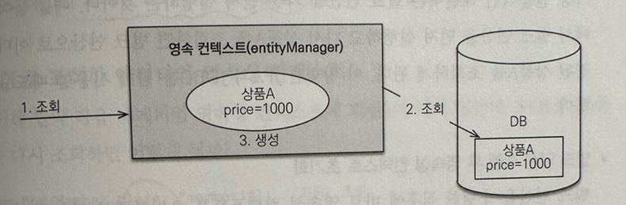
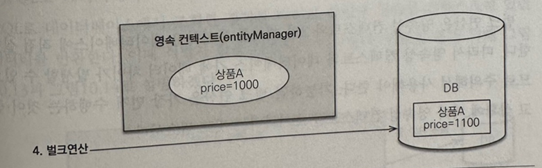
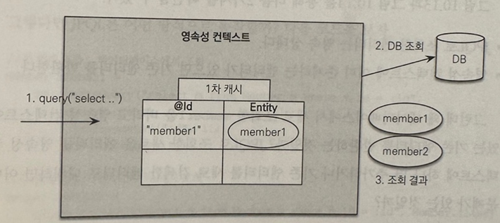
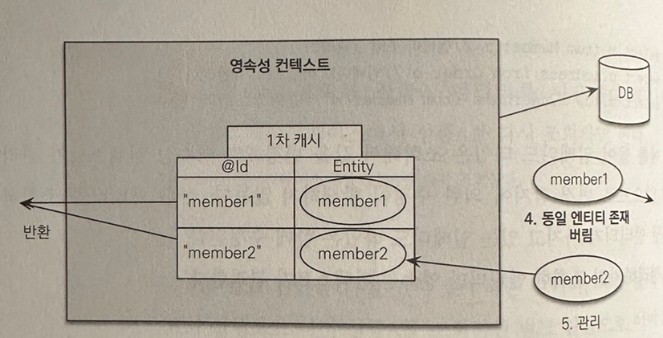
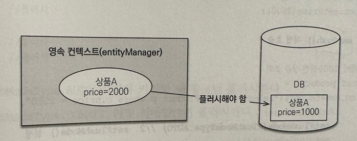

# 10.3. Criteria

Criteria 쿼리는 JPQL을 자바 코드로 작성하도록 도와주는 빌더 클래스 API다.  

코드로 JPQL을 작성하므로 문법 오류를 컴파일 단계에서 잡을 수 있고 문자 기반의 JPQL보다 동적 쿼리를 안전하게 생성할 수 있다.  

## 10.3.1. Criteria 기초

모든 회원을 조회하는 단순한 JPQL을 Criteria로 작성해보자.  

```java
// JPQL : select m from Member m

CriteriaBuilder cb = em.getCriteriaBuilder(); // 1. Criteria 쿼리 빌더
        
      
CriteriaQuery<Member> cq = cb.createQuery(Member.class); // 2. Criteria 생성, 반환타입 지정  

Root<Member> m = cq.from(Member.class); // 3. FROM 절
cq.select(m); //4. SELECT 절

TypedQuery<Member> query = em.createQuery(cq);
List<Member> members = query.getResultList();
```

1. Critera 쿼리를 생성하려면 먼저 Criteria 빌더를 얻어야 한다.
2. Criteria 쿼리 빌더에서 Criteria 쿼리를 생성한다.
3. FROM 절 생성. 반환된 값 m은 Criteria에서 사용하는 특별한 별칭이다. m을 조회의 시작점이라는 의미로 쿼리 루트라 한다.
4. SELECT 절 생성.

이렇게 Criteria 쿼리를 완성하고 나면 다음 순서는 JPQL과 같다.  

em.createQuery(cq)에 완성된 Criteria 쿼리를 넣어주기만 하면 된다.

```java
// JPQL
// select m from Member m where m.username='회원1' order by m.age desc

CriteriaBuilder cb = em.getCriteriaBuilder(); 

CriteriaQuery<Member> cq = cb.createQuery(Member.class); 
Root<Member> m = cq.from(Member.class); // from


Predicate usernameEqueal = cb.equal(m.get("username"), "회원1") // 1. 검색 조건 정의

javax.persistence.criteria.Order ageDesc = cb.desc(m.get("age")) // 2. 정렬 조건 정의


cq.select(m) // 3. 쿼리 생성
    .where(usernameEqual) //WHERE 절 생성
    .orderBy(ageDesc); // ORDER BY 절 생성

List<Member> members = em.createQuery(cq).getResultList();
```

1. 검색 조건을 정의한 부분을 보면 `m.get(”username”)`으로 되어 있는데 m은 회원 엔티티의 `별칭`이라는 뜻이다. 그리고 `cb.equla(A, B)`는 이름 그대로 `A = B`라는 뜻이다.
2. 정렬 조건을 정의하는 코드인 `cb.desc(m.get(”age”))`는 JPQL의 `m.age desc`와 같은 표현이다.
3. 만들어둔 조건을 where, orderBy에 넣어서 원하는 쿼리를 생성한다.

쿼리 루트와 별칭을 알아보자.  

- Root<Member> m = cq.from(Member.class); 여기서 m이 쿼리 루트다.
- 쿼리 루트는 조회의 시작점이다.
- Cirteria에서 사용되는 특별한 별칭이다. JPQL의 별칭이라 생각하면 된다.
- 별칭은 엔티티에만 부여할 수 있다.

Criteria는 코드로 JPQL을 완성하는 도구기 때문에 경로 표현식도 있다.

- m.get(”username”) 는 JPQL의 m.username과 같다.
- m.get(”team”).get(”name”) 는 JPQL의 m.team.name과 같다.

10살을 초과하는 회원을 조회하고 나이 역순으로 정렬해보자.  

```java
// JPQL
// select m from Member m where m.age > 10 order by m.age desc

Root<Member> m = cq.from(Member.class);

//타입 정보 필요
Predicate ageGt = cb.greaterThan(m.<Integer>get("age", 10));

cq.select(m);
cq.where(ageGt);
cq.orderBy(cb.desc(m.get("age")));
```

- 제네릭으로 반환 타입 정보를 명시해야 한다. String같은 문자 타입은 지정하지 않아도 된다.
- greaterThan() 대신 gt()로 사용해도 된다.

## 10.3.2. Criteria 쿼리 생성

Criteria를 사용하려면 CriteriaBuilder.createQuery() 메서드로 Criteria 쿼리를 사용하면 된다.  

Criteria 쿼리를 생성할 때 파라미터로 쿼리 결과에 대한 반환 타입을 지정할 수 있다.  

예를 들어 CriteriaQuery를 생성할 때 Member.class를 반환 타입으로 지정하면 em.createQuery(cq)에서 반환 타입을 지정하지 않아도 된다.  

```java
// 반환 타입 지정
CriteriaQuery<Member> cq = cb.createQuery(Member.class);

// 위에서 Member를 타입으로 지정했으므로 지정하지 않아도 Member 타입 반환
List<Member> resultList = em.createQuery(cq).getResultList();
```

반환 타입을 지정할 수 없거나 반환 타입이 둘 이상이면 타입을 지정하지 않고 Object로 반환받으면 된다.  

둘 이상일 경우 Object[]를 사용하는 것이 편리하다.  
```java

CriteriaQuery<Object[]> cq = cb.createQuery(Object[].class);

List<Object[]> resultList = em.createQuery(cq).getResultList();
```

튜플 반환타입에 대해서는 조금 뒤에 알아보겠다.

## 10.3.3. 조회

SELECT 절을 만드는 select()에 대해 알아보자.  

```java
public interface CriteriaQuery<T> extends AbstractQuery<T> {
    // 한 건 지정
    CriteriaQuery<T> select(Selection<? extends T> selection);
    // 여러 건 지정
    CriteriaQuery<T> multiselect(Selection<?>... selections);
    // 여러 건 지정
    CriteriaQuery<T> multiselect(List<Selection<?>> selectionList);
}
```

### 조회 대상을 한 건, 여러 건 지정

SLECT에 조회 대상을 하나만 지정하려면 다음처럼 작성하면 된다.

```java
cq.select(m); // JPQL : select m
```

조회 대상을 여러 건 지정하려면 multiselect를 사용하면 된다.  

```java
// JPQL : select m.username, m.age
cq.multiselect(m.get("username"), m.get("age"));
```

여러 건 지정은 다음처럼 cb.array를 사용해도 된다.  

```java
CriteriaBuiler cb = em.getCriteriaBuilder();
    //JPQL : select m.username, m.age
cq.select(cb.array(m.get("username"), m.get("age")));
```

### DISTINCT

distinct는 select, multiselect 다음에 distinct(true)를 사용하면 된다.  

```java
// JPQL : select distinct m.usernmae, m.age from Member m

CriteriaQuery<Object[]> cq = cb.createQuery ~~
        ...
        ...
cq.multiselect(m.get("username"), m.get("age")).distinct(true);
```

### NEW, construct()

JPQL에서 select new 생성자() 구문을 Criteria에서는 cb.construct(클래스 타입, …)로 사용한다.


```java
// JPQL : select new jpabook.domain.MemberDTO(m.username, m.age) from Member m

CriteriaQuery<MemberDTO> cq = cb.createQuery(MemberDTO.class);
        ...
        ...
cq.select(cb.construct(MemberDTO.class, m.get("username"), m.get("age")));
```

JPQL에서는 패키지 명을 다 적어주었지만 Criteria는 코드를 직접 다루므로MemberDTO.class처럼 간략하게 사용할 수 있다.

### 튜플

Criteria는 Map과 비슷한 튜플이라는 특별한 반환 객체를 제공한다.  

```java
// JPQL : select m.username, m.age from Member m

CriteriaBuilder cb = em.getCriteriabBuiler();

CriteriaQuery<Tuple> cq = cb.createTupleQuery();

Root<Member> m = cq.from(Member.class);
cq.multiselect(
        m.get("username").alias("username") // 1. 튜플에서 사용할 튜플 별칭
        m.get("age").alias("age")
);

TypedQuery<Tuple> query = em.createQuery(cq);
List<Tuple> resultList = query.getResultList();
for (Tuple tuple : resultList){
		// 2. 튜플 별칭으로 조회
		String username = tuple.get("username", String.class);
		Integer age = tuple.get("age", Integer.class);
}
```

1. 튜플은 검색 키로 사용할 튜플 전용 별칭을 필수로 할당해야 한다. 별칭은 allas()메소드를 사용해서 지정할 수 있다.  
2. 선언해둔 튜플 별칭으로 데이터를 조회할 수 있다.  

튜플은 이름 기반이므로 순서 기반의 Object[]보다 안전하다.  

그리고 tuple.getElements() 같은 메서드를 사용해서 현재 튜플의 별칭과 자바 타입도 조회할 수 있다.  

## 10.3.4. 집합

### GROUP BY

팀 이름별로 나이가 가장 많은 사람과 가장 적은 사람을 구해보자.  

```java
/*
    JPQL :
    select m.team.name, max(m.age), min(m.age)
    from Member m
    group by m.team.name
*/

CriteriaBuilder cb = em.getCriteriaBuilder();
CriteriaQuery<Object[]> cq = cb.createQuery(Object[].class);
Root<Member> m = cq.from(Member.class);

Expression maxAge = cb.max(m.<Integer>get("age"));
Expression minAge = cb.min(m.<Integer>get("age"));

cq.multiselect(m.get("team").get("name"), maxAge, minAge);
cq.groupBy(m.get("team").get("name")); // GROUP BY

TypedQuery<Object[]> query = em.createQuery(cq);
List<Object[]> resultList = query.getReusltList();
```
cq.groupBy(m.get("team").get("name"))은 JPQL에서 group by m.team.name과 같다.

### HAVING

이 조건에 팀에 가장 나이 어린 사람이 10살을 초과하는 팀을 조회한다는 조건을 추가해보자.  

```java
cq.multiselect(m.get("team").get("name"), maxAge, minAge)
    .groupBy(m.get("team").get("name"))
    .having(cb.gt(minAge, 10)); // HAVING
```

JPQL에서 having min(m.age) > 10과 같다.  

## 10.3.5. 정렬

정렬 조건도 Criteria 빌더를 통해서 생성한다.  

`cb.desc()` 또는 `cb.asc()`로 생성할 수 있다.  

## 10.3.6. 조인

조인은 join() 메서드와 JoinType 클래스를 사용한다.  

```java
public enum JoinType {
    INNER,
    LEFT,
    RIGHT
}

```

```java
/* JOIN  예시
    JPQL :
    select m, t
    from m inner join m.team t
    where t.name = '팀A'
*/

Root<Member> m = cq.from(Member.class);
Join<Member, Team> t = m.join("team", JoinType.INNER); //내부 조인

cq.multiselect(m, t);
		.where(cb.equal(t.get(name), "팀A"));
```

조인 타입을 생략하면 내부 조인을 사용한다.

### Fetch Join

fetch join은 다음과 같이 사용한다.  

```java
Root<Member> m = cq.from(Member.class);
m.fetch("team", JoinType.LEFT);

cq.select(m);
```

페치 조인은 fetch(조인대상, JoinType)을 사용한다.  

주의사항은 JPQL과 같다.

## 10.3.7. 서브 쿼리

- 간단한 서브 쿼리

우선 메인 쿼리와 서브 쿼리 간에 관련이 없는 단순한 서브 쿼리부터 시작해보자.  

평균 나이 이상의 회원을 구하는 서브 쿼리다.


```java
/*  JPQL :
    select m from Member m
    where m.age >= (select AVG(m2.age) from Member m2) 
*/
    
CriteriaBuilder cb = em.getCriteriaBuilder(); 
CriteriaQuery<Member> mainQuery = cb.createQuery(Member.class);
    
// 1. 서브 쿼리 생성
Subquery<Double> subQuery = mainQuery.subquery(Double.class);
    
Root<Member> m2 = subQuery.from(Member.class);
subQuery.select(cb.avg(m2.<Integer>get("age")));
    
// 2. 메인 쿼리 생성
Root<Member> m = mainQuery.from(Member.class);
mainQuery.select(m)
        .where(cb.ge(m.<Integer>get("age"), subQuery));
```

1. 서브 쿼리 생성 부분을 보면 서브 쿼리는 mainQuery.subquery()로 생성한다.
2. 메인 쿼리 생성부분을 보면 where() 메서드에서 생성한 서브 쿼리를 사용한다. 

- 상호 관련 서브 쿼리

메인 쿼리와 서브 쿼리 간에 서로 연관이 있을 때 Criteria를 어떻게 작성하는지 알아보자.  

서브 쿼리에서 메인 쿼리의 정보를 사용하려면 메인 쿼리에서 사용한 별칭을 얻어야 한다.  

서브 쿼리는 메인 쿼리의 Root나 Join을 통해 생성된 별칭을 받아서 사용할 수 있다.  

```java
/* JPQL : 
    select m from Member m
    where exists
    (select t from m.team t where t.name='팀A')
*/
    
// 서브 쿼리에서 사용되는 메인 쿼리 m
Root<Member> m = mainQuery.from(Member.class);
    
// 서브 쿼리 생성
Subquery<Team> subQuery = mainQuery.subquery(Team.class); 
Root<Member> subM = subQuery.correlate(m); // 메인 쿼리의 별칭을 가져옴.
        
Join<Member, Team> t = subM.join("team");
subQuery.select(t).where(cb.equal(t.get("name"), "팀A"));
    
// 메인 쿼리 생성
mainQuery.select(m)
    .where(cb.exists(subQuery));
    		
List<Member> resultList = em.createQuery(mainQuery).getResultList();
```

correlate(..) 메소드를 사용하면 메인 쿼리의 별칭을 서브 쿼리에서 사용할 수 있다.


## 10.3.8. IN 식

IN 식은 Criteria 빌더에서 in() 메서드를 사용한다.  

```java
/*
    JPQL : 
    select m from Member m
    where m.username in ("회원1", "회원2")
*/

CriteriaBuilder cb = em.getCriteriaBuilder();
CriteriaQuery<Member> cq = cb.createQuery(Member.class);
Root<Member> m = cq.from(Member.class);

cq.select(m)
    .where(cb.in(m.get("username"))
    .value("회원1")
    .value("회원2"));
```

## 10.3.9. CASE식

CASE 식에는 selectCase() 메서드와 when(), otherwise() 메서드를 사용한다.


```java
/* JPQL : 
    select m.username,
        case when m.age>=60 then 600
             when m.age<=15 then 500
             else 1000
        end
    from Member m
*/

Root<Member> m = cq.from(Member.class);

cq.multiselect(
    m.get("username"),
    cb.selectCase()
    .when(cb.ge(m.<Integer>get("age"), 60), 600)
    .when(cb.le(m.<Integer>get("age"), 15), 500)
    .otherwise(1000)
);
```

## 10.3.10. 파라미터 정의

JPQL에서 :PARAM1처럼 파라미터를 정의했듯이 Criteria도 파라미터를 정의할 수 있다.

```java
/* JPQL :
    select m from Member 
    where m.username = :usernameParam
*/

Root<Member> m = cq.from(Member.class);

// 1. 정의
cq.select(m).where(cb.equal(m.get("username"), cb.parameter(String.class,"usernameParam")));
			
// 2. 파라미터 바인딩
List<Member> resultList = em.createQuery(cq).setParameter("usernameParam", "회원1").getResultList();
```

## 10.3.11. 네이티브 함수 호출

네이티브 SQL 함수를 호출하려면 cb.function() 메서드를 사용하면 된다.

```java
Root<Member> m = cq.from(Member.clas);
Expression<Long> function = cb.function("SUM", Long.class, m.get("age"));
cq.select(function);
```

## 10.3.12. 동적 쿼리

다양한 검색 조건에 따라 실핼 시점에 쿼리를 생성하는 것을 동적 쿼리라 한다.  

동적 쿼리는 문자 기반인 코드 기반인 Criteria로 작성하는 것이 더 편리하다.  

나이, 이름, 팀명을 검색 조건으로 사용해서 동적으로 쿼리를 생성해보자.  

```java
// 검색 조건
Integer age = 10;
String username = null;
String teamName = "팀A";

// JPQL 동적 쿼리 생성
StringBuilder jpql = new StringBuilder("select m from Member m join m.team t ");
List<String> criteria = new ArrayList<String>();

if(age != null) criteria.add(" m.age = :age ");

...
...        
```
JPQL은 단순한 동적 쿼리 코드를 개발해도 문자 더하기로 인해, 여러 번 버그를 만날 것이다.  

ex ) age=:ageandusername=:username같은 문제.  

Criteria로 구성한 동적 쿼리를 보자.

```java
// 검색 조건
Integer age = 10;
String username = null;
String teamName = "팀A";

//동적 쿼리 생성
CriteriaBuilder cb = em.getCriteraBuilder();
CriteriaQuery<Member> cq = cb.createQuery(Member.class);

Root<Member> m = cq.from(Member.class);
Join<Member, Team> t = m.join("team");

List<Predicate> criteria = new ArrayList<Predicate>();

if(age != null) criteria.add(cb.equal(m.<Integer>get("age"),
		cb.parameter(Integer.class, "age")));

...
...
```

Criteria로 동적 쿼리를 구성하면 최소한 공백이나 where, and 위치로 인해 에러가 발생하지 않는다.  

하지만 Criteria의 장황하고 복잡함으로 인해, 코드가 읽기 힘들다는 단점은 여전히 남아 있다.  

## 10.3.13. 함수 정리

표 사진을 첨부하려 했으나 도서 예약으로 실패.

## 10.3.14. Criteria 메타 모델 API

Criteria는 코드 기반이므로 컴파일 시점에 오류를 발견할 수 있다.  

하지만 m.get(”age”) 에서 age는 문자다.  

‘age’ 대신에 실수로 ‘ageaaa’ 이렇게 잘못 적어도 컴파일 시점에 에러를 발견하지 못한다.  

따라서 완전한 코드 기반이라 할 수 없다.  

이런 부분까지 코드로 작성하려면 메타 모델 API를 사용하면 된다.  
 
- 메타 모델 API 적용 전

```java
cq.select(m)
    .where(cb.gt(m.<Integer>get("username"), 20))
    .orderBy(cb.desc(m.get("age")));
```

- 메타 모델 API 적용 후

```java
cq.select(m)
    .where(cb.gt(m.get(Member_.age), 20))
    .orderBy(cb.desc(m.get(Member_.age)));
```
이렇게 하려면 Membe_클래스가 필요한데 Member_ 메타 모델 클래스는 Member 엔티티 기반으로 만들어야 한다.  

이 복잡한 코드는 개발자가 직접 작성하지 않고 코드 자동 생성기가 만들어준다.   

그래서 참조코드는 작성하지 않겠다.  

# 10.4. QueryDSL

JPA Criteria는 문자가 아닌 코드로 JPQL을 작성하므로 문법 오류를 컴파일 단계에서 잡을 수 있고 IDE 자동 완성 기능의 도움을 받을 수 있는 등 여러 가지 장점이 있다.  

하지만 너무 복잡하고 어렵다.  

작성된 코드를 보면 그 복잡성으로 인해 어떤 JPQL이 생성될지 파악하기 쉽지 않다.  

쿼리를 문자가 아닌 코드로 작성해도, 쉽고 간결하며 그 모양도 쿼리와 비슷하게 개발할 수 있는 프로젝트가 바로 `QueryDSL`이다.

## 10.4.1. QueryDSL 설정

QueryDSL 라이브러리를 추가하자.

## 10.4.2. 시작

QueryDSL을 어떻게 사용하는지 알아보자.  

```java
public void queryDSL(){
    EntityManager em = emf.createEntityManager();
		
    JPAQuery query = new JPAQuery(em);
    QMember qMember = new QMember("m"); // 생성되는 JPQL의 별칭이 m
    List<Member> members =
        query.from(qMember)
            .where(qMember.name.eq("회원1"))
            .orderBy(qMember.name.desc())
            .list(qMember);
}
```

### 기본 Q 생성

쿼리 타입(Q)은 사용하기 편리하도록 기본 인스턴스를 보관하고 있다.  

하지만 같은 엔티티를 조인하거나 같은 엔티티를 서브 쿼리에 사용하면 같은 별칭이 사용되므로 이때는 별칭을 직접 정의해서 사용해야 한다.  

```java
public class QMember extends EntityPathBase<Member>{
    
    public static final QMember member = new QMember("member1");
    ...
}
```

쿼리 타입은 다음과 같이 사용한다.

```java
QMember qMember = new QMember("m"); //직접 지정
QMember qMember = QMember.member; // 기본 인스턴스 사용
```

쿼리 타입의 기본 인스턴스를 사용하면 import static을 활용해서 코드를 더 간결하게 적을 수 있다.

```java
import static jpabook.jpashop.domain.QMember.member;  // 기본 인스턴스

public void queryDSL(){
    EntityManager em = emf.createEtityManager();
		
    JPAQuery query = new JPAQuery(em);
    List<Member> members =
        query.from(member)
            .where(member.name.eq("회원1"))
            .orderBy(member.name.desc())
            .list(member);
}
```

## 10.4.3. 검색 조건 쿼리

QueryDSL의 기본 쿼리 기능을 알아보자.

```java
JPAQuery query = new JPAQuery(em);
QItem item = QItem.item;
List<Item> list = query.from(item)
    .where(item.name.eq("좋은상품").and(item.price.gt(20000)))
    .list(item); // 조회할 프로젝션 지정
```

실행된 JPQL은 다음과 같다.
```java
    select item
    from Item item
    where item.name = ?1 and item.price > ?2
```

여러 검색 조건을 사용해도 된다. 이 때는 and 연산이 된다. 

```java
item.price.between(10000, 20000);
item.name.contains("상품1"); // like '%상품1%'
item.name.startsWith("고급") // like '고급%'
```

## 10.4.4. 결과 조회

쿼리 작성이 끝나고 결과 조회 메소드를 호출하면 실제 데이터베이스를 조회한다.  

대표적인 결과 조회 메소드는 다음과 같다.

- uniqueResult() : 조회 결과가 한 건일 때 사용한다.  
결과가 없으면 null, 하나 이상이면 NonUniqueResultException 예외가 발생한다.


- singleResult() : uniqueResult와 같지만 결과가 하나 이상이면 처음 데이터를 반환한다.


- list() : 결과가 하나 이상일 때 사용한다.   
결과가 없으면 빈 컬렉션을 반환한다.

## 10.4.5. 페이징과 정렬

```java
QItem item = QItem.item;

query.from(item)
    .where(item.price.gt(20000))
    .orderBy(item.price.desc(), item.stockQuantity.asc())
    .offset(10).limit(20)
    .list(item);
```

정렬은 orderBy를 사용하는데 쿼리 타입이 제공하는 asc(), desc()를 사용한다.  

페이징은 offset과 limit을 적절히 조합해서 사용하면 된다.  

restrict() 메서드에 QueryModifiers를 파라미터로 사용해도 된다.  

```java
//페이징과 정렬 QueryModifiers 사용
QueryModifiers queryModifiers = new QueryModifiers(20L, 10L); // limit, offset
List<Item> list = 
		query.from(item)
		.restrict(queryModifiers)
		.list(item);
```

실제 페이징 처리를 하려면 검색된 전체 데이터 수를 알아야 한다.  이때는 list() 대신에 listResults()를 사용한다.

```java
SearchResults<Item> result = 
    query.from(item)
        .where(item.price.gt(10000))
        .offset(10).limit(20)
        .listResults(item);
				
long total = result.getTotal(); //검색된 전체 데이터 수
long limit = result.getLimit();
long offset = result.getOffset();
List<Item> results = result.getResults(); //조회된 데이터
```

listResults()를 사용하면 전체 데이터 조회를 위한 count 쿼리를 한 번 더 실행한다.  

그리고 SearchResults를 반환하는데 이 객체에서 전체 데이터 수를 조회할 수 있다.

## 10.4.6. 그룹

그룹은 groupBy를 사용하고 그룹화된 결과를 제한하려면 having을 사용하면 된다.  

```java
query.from(item)
    .groupBy(item.price)
    .having(item.price.gt(1000))
    .list(item);
```

## 10.4.7. 조인

innerJoin(join), lieftJoin, rightJoin, fullJoin을 사용할 수 있다.  

JPQL의 on과 성능 최적화를 위한 fetch 조인도 사용할 수 있다.  

`join(조인 대상, 별칭으로 사용할 쿼리 타입)`  

```java
// 기본 조인
QOrder order = QOrder.order;
QMember member = QMember.member;
QOrderItem orderItem = QOrderItem.orderItem;

query.from(order)
		.join(order.member, member)
		.leftJoin(order.orderItems, orderItem)
		.list(lorder);
```

- ON 절


```java
query.from(order)
    .leftJoin(order.orderItems, orderItems)
    .on(orderItem.count.gt(2))
    .list(order);
```

- 페치 조인

```java
query.from(order)
    .innerJoin(order.member, member).fetch()
    .leftJoin(order.orderItems, orderItem).fetch()
    .list(order);
```

- 세타 조인

```java
QOrder order = QOrder.order;
QMember member = QMember.member;

query.from(order, member)
    .where(order.member.eq(member))
    .list(order);
```

## 10.4.8 서브 쿼리

서브 쿼리는 `com.mysema.query.jpa.JPASubQuery`를 생성해서 사용한다.  

결과가 하나면 unique(), 여러 건이면 list()를 사용할 수 있다.  

```java
QItem item = QItem.item;
QItem itemSub = new QItem("itemSub");

query.from(item)
    .where(item.price.eq(
        new JPASubQuery().from(itemSub).unique(itemSub.price.max())
    ))
    .list(item);
```

- 여러 건의 서브 쿼리를 사용하는 방법

```java
QItem item = QItem.item;
QItem itemSub = new QItem("itemSub");

query.from(item)
    .where(item.in(
        new JPASubQuery().from(itemSub)
            .where(item.name.eq(itemSub.name))
            .list(itemSub)
    ))
    .list(item);
```

## 10.4.9. 프로젝션과 결과 반환

select 절에 조회 대상을 지정하는 것을 프로젝션이라 한다.  

### 프로젝션 대상이 하나

프로젝션 대상이 하나면 해당 타입으로 반환한다.  

```java
QItem item = QItem.item;
List<String> result = query.from(item).list(item.name);

for(String name : result){
    System.out.println("name = " + name);
}
```

### 여러 컬럼 반환과 튜플

프로젝션 대상으로 여러 필드를 선택하면 QueryDSL은 기본으로 com.mysema.query.Tuple이라는 Map과 비슷한 내부 타입을 사용한다.  

조회 결과는 tuple.get() 메소드에 조회한 쿼리 타입을 지정하면 된다.  

```java
QItem item = QItem.item;

List<Tuple> result = query.from(item).list(item.name, item.price);

for(Tuple tuple : result){
    System.out.println("name = " + tuple.get(item.name));
    System.out.println("price = " + tuple.get(item.price));
}
```

### 빈 생성

쿼리 결과를 엔티티가 아닌 특정 객체로 받고 싶으면 빈 생성 기능을 사용한다.  

QueryDSL은 객체를 생성하는 다양한 방법을 제공한다.  

1. 프로퍼티 접근
2. 필드 직접 접근
3. 생성자 사용

원하는 방법을 지정하기 위해 com.mysema.query.types.Projections를 사용하면 된다.

```java
//예시 IteamDTO
public class ItemDTO{
    private String username;
    private int price;
		
    public ItemDTO() {}
		
    public ItemDTO(String username, int price){
        this.username = username;
        this.price = price;
    }
		
    // Getter, Setter ...
}
```

```java
// 프로퍼티 접근 (Setter)
QItem item = QItem.item;
List<ItemDTO> result = query.from(item).list(
    Projections.bean(ItemDTO.class, item.name.as("username"), item.price));
```

Projections.bean()메서드는 수정자(Setter)를 사용해서 값을 채운다.

쿼리 결과는 name인데 ItemDTO는 username 프로퍼티를 가지고 있다.  

이처럼 쿼리 결과와 매핑할 프로퍼티 이름이 다르면 as를 사용해서 별칭을 주면된다.  

```java
// 필드 직접 접근
QItem item = QItem.item;
List<ItemDTO> result = query.from(item).list(
    Projections.fields(ItemDTO.class, item.name.as("username"),
        item.price));
```

Projections.fields() 메서드를 사용하면 필드에 직접 접근해서 값을 채워주며 필드가 private로 설정해도 동작한다.

```java
// 생성자 사용
QItem item = QItem.item;
List<ItemDTO> result = query.from(item).list(
    Projections.constructor(ItemDTO.class, item.name, item.price));
```

Projections.constructor() 메서드는 생성자를 사용한다.  파라미터 순서가 같은 생성자가 필요하다.  

### DISTINCT

`query.distinct().from(item)`

## 10.4.10. 수정, 삭제 배치 쿼리

QueryDSL도 수정, 삭제 같은 배치 쿼리를 지원한다.  

JPQL 배치 쿼리와 같이 영속성 컨텍스트를 무시하고 데이터베이스를 직접 쿼리한다는 점에 유의.  

## 10.4.11. 동적 쿼리

com.mysema.query.BooleanBuilder를 사용하면 특정 조건에 따른 동적 쿼리를 편리하게 생성할 수 있다.  

```java
SearchParam param = new SearchParam();
param.setName("시골개발자");
param.setPrice(10000);

QItem item = QItem.item;

BooleanBuilder builder = new BooleanBuilder();
if(StringUtils.hasText(param.getName())){
    builder.and(item.name.contains(param.getName()));
}
if(param.getPrice() != null){
    builder.and(item.price.gt(param.getPrice()));
}
List<Item> result = query.from(item)
    .where(builder)
    .list(item);
```

상품 이름과 가격 유무에 따라 동적으로 쿼리를 생성한다.  

## 10.4.12. 메소드 위임

메소드 위임 기능을 사용하면 쿼리 타입에 검색 조건을 직접 정의할 수 있다.

```java
public class ItemExpression{
		@QueryDelegate(Item.class)
		public static BooleanExpression isExpensive(QItem item, Integer price){
				return item.price.gt(price);
		}
}
```

메서드 위임 기능을 사용하려면 위와 같이 정적 메서드를 만들고 @com.mysema.query.annotations.QueryDelegate 어노테이션 속성으로 이 기능을 적용할 엔티티를 지정한다.  

정적 메서드의 첫 번째 파라미터에는 대상 엔티티의 쿼리 타입을 지정하고 나머지는 필요한 파라미터를 정의한다.  

```java
public class QItem extends EntityPathBase<Item>{
    ...
    public com.mysema.query.types.expr.BooleanExpression
        isExpensive(Integer price){
        return ItemExpression.isExpensive(this, price);		
    }
}
```

생성된 쿼리 타입을 보면 기능이 추가된 것을 확인할 수 있다.

`query.from(item).where(item.isExpensive(30000)).list(item);`

필요하다면 String, Date 같은 자바 기본 내장 타입에도 메서드 위임 기능을 사용할 수 있다.

```java
@QueryDelegate(String.class)
public static BooleanExpression isHelloStart(StringPath stringPath){
    return stringPath.startsWith("Hello")
}
```

# 10.5. 네이티브 SQL
 
JPQL은 표준 SQL이 지원하는 대부분의 문법과 SQL 함수들을 지원하지만 특정 데이터베이스에 종속적인 기능은 지원하지 않는다.

- 특정 데이터베이스만 지원하는 함수, 문법, SQL 쿼리 힌트
- 인라인 뷰 (FROM 절에서 사용하는 서브 쿼리), UNION, INTERSECT
- 스토어드 프로시저

때로는 특정 데이터베이스에 종속적인 기능이 필요하다.  

특정 데이터베이스에 종속적인 기능을 지원하는 방법은 다음과 같다.

### 특정 데이터베이스만 사용하는 함수

- JPQL에서 네이티브 SQL 함수를 호출할 수 있다(JPA2.1).
- 하이버네이트는 데이터베이스 방언에 각 데이터베이스에 종속적인 함수들을 정의해두었다. 또한 직접 호출할 함수를 정의할 수도 있다.

### 특정 데이터베이스만 지원하는 SQL 쿼리 힌트

- 하이버네이트를 포함한 몇몇 JPA 구현체들이 지원한다.

### 인라인 뷰 (FROM 절에서 사용하는 서브쿼리), UNION, INTERSECT

- 하이버네이트는 지원하지 않지만 일부 JPA 구현체들이 지원한다.

### 스토어 프로시저

- JPQL에서 스토어드 프로시저를 호출할 수 있다.

### 특정 데이터베이스만 지원하는 문법

- 오라클의 CONNECT BY처럼 특정 데이터베이스에 너무 종속적인 SQL 문법은 지원하지는 않는다. 이때는 네이티브 SQL을 사용해야 한다.

다양한 이유로 JPQL을 사용할 수 없을 때 JPA는 SQL을 직접 사용할 수 잇는 기능을 제공하는데 이것을 네이티브 SQL이라 한다.  

JPQL은 JPA가 SQL을 생성하지만 네이티브 SQL은 개발자가 SQL을 직접 정의하는 것이다.

네이티브 SQL을 사용하면 엔티티를 조회할 수 있고 JPA가 지원하는 영속성 컨텍스트의 기능을 그대로 사용할 수 있다.

## 10.5.1. 네이티브 SQL 사용

네이티브 쿼리 API는 다음 3가지가 있다.

```java
// 결과 타입 정의
public Query createNativeQuery(String sqlString, Class resultClass);

// 결과 타입을 정의할 수 없을 때
public Query createNativeQuery(String sqlString);

// 결과 매핑 사용
public Query createNativeQuery(String sqlString, String resultSetMapping)
```

### 엔티티 조회

JPQL를 사용할 때와 거의 비슷하지만 실제 데이터베이스 SQL을 사용한다는 것과 위치기반 파라미터만 지원한다는 차이가 있다.

```java
// SQL 정의
String sql = "SELECT ID, AGE, NAME, TEAM_ID" +
             "FROM MEMBER WHERE AGE > ?";

Query nativeQuery = em.createNativeQuery(sql, Member.class)
    .setParameter(1, 20);
		
List<Member> resultList = nativeQuery.getResultList();
```

네이티브로 SQL만 직접 사용할 뿐이지 나머지는 JPQL 사용시와 같다. 조회한 엔티티도 영속성 컨텍스트에서 관리한다.

### 값 조회

JPA는 조회한 값들을 Object[]에 담아서 반환한다.  

여기서는 스칼라 값들을 조회했을 뿐이므로 결과를 영속성 컨텍스트가 관리하지 않는다.  

JDBC와 동일하다고 볼 수 있다.  

```java
// SQL
String sql = "SELECT ID, AGE, NAME, TEAM_ID" +
             "FROM MEMBER WHERE AGE > ?";
							
Query nativeQuery = em.createNativeQuery(sql)
    .setParameter(1, 10);
		
List<Object[]> resultList = nativeQuery.getResultList();
    for(Object[] row : resultList){
        System.out.println("id = " + row[0]);
        ...    
    }
```

### 결과 매핑 사용

엔티티와 스칼라 값을 함께 조회하는 것처럼 매핑이 복잡해지면 `@SqlResultsSetMapping`을 정의해서 결과 매핑을 사용해야 한다.

```java
// SQL
String sql = 
    "SELECT M.ID, AGE, NAME, TEAM_ID, I.ORDER_COUNT" +
    "FROM MEMBER M" +
    "LEFT JOIN" +
    "(SELECT IM.ID, COUNT(*) AS ORDER_COUNT" +
    "FROM ORDERS O, MEMBER IM" +
    "WHERE O.MEMBER_ID = IM.ID) I" +
    "ON M.ID = I.ID";

Query nativeQuery = em.createNativeQuery(sql, "memberWithOrderCount");

List<Object[]> resultList = nativeQuery.getResultList();
for(Object[] row : resultList){
    Member member = (Member) row[0];
    BigInteger orderCount = (BigInteger) row[1];
		
    System.out.println("member = " + member );
    System.out.println("orderCount = " + orderCount);
}
```

em.createNativeQuery(sql, “memberWithOrderCount”)의 두 번째 파라미터에 결과 매핑 정보의 이름이 사용되었다.  

결과 매핑을 정의하는 코드를 보자.  
```java
@Entity
@SqlResultSetMapping(name = "memberWithOrderCount",
    entities = {@EntityResult(entityClass = Member.class)},
    columns = {@EntityResult(name = "ORDER_COUNT")})
public class Member{ ...}
```

사용한 쿼리 결과에서 ID, AGE, NAME, TEAM_ID는 Member 엔티티와 매핑하고 ORDER_COUNT는 단순히 값으로 매핑한다.

JPA 표준 명세에 있는 예제 코드로 결과 매핑을 어떻게 하는지 좀 더 자세히 알아보자. 네이티브 SQL 사용.

```java
Query q = em.createNativeQuery(
    "SELECT o.id AS order_id," +
        "o.quantity AS order_quantity, " +
        "o.item AS order_item, " +
        "i.name AS item_name," +
    "FROM Order o, Itemn i " +
    "WHERE (order_quantity > 25) AND" +
        "(order_item = i.id)", "OrderResults");
)
```

```java
// 표준 명세 예제 - 매핑 정보
@SqlResultSetMapping(name="OrderResults",
    entities={
        @EntityResult(entityClass=com.acme.Order.class, fields={
            @FieldResult(name="id", column="order_id"),
            @FieldResult(name="quantity", column="order_quantity"),
            @FieldResult(name="item", column="order_item")})},
    columns={
        @ColumnResult(name="item_name")}
)
```

이 설정은 엔티티의 필드에 정의한 @Column보다 앞선다.

조금 불편한 것은 @FieldResult를 한 번이라도 사용하면 전체 필드를 @FieldResult로 매핑해야 한다.

다음처럼 두 엔티티를 조회하는데 컬럼명이 중복될 때도 @FieldResult를 사용해야 한다.

```java
SELECT A.ID, B.ID, FROM A, B
```

컬럼명이 충돌하기 때문에 다음과 같이 별칭을 적절히 사용하고 @FieldResult로 매핑하면 된다.

```java
SELECT
    A.ID AS A_ID,
    B.ID AS B_ID
FROM A, B
```

- SQLResultSetMapping 속성

| 속성       | 기능                                 | 
|----------|------------------------------------|
| name     | 결과 매핑 이름                           |
| entities | @EntityResult를 사용해서 엔티티를 결과로 매핑한다. |
| columns  | @ColumnResult를 사용해서 컬럼을 결과로 매핑한다.  | 

- @EntityResult 속성

| 속성                  | 기능                                  |
|---------------------|-------------------------------------|
| entityClass         | 결과로 사용할 엔티티 클래스를 지정한다.              |
| fileds              | @FiledResult을 사용해서 결과 컬럼을 필드와 매핑한다. |
| discriminatorColumn | 엔티티의 인스턴스 타입 구분 필드(상속)              |

- @FiledResult 속성

| 속성                  | 기능         |
|---------------------|------------|
| name                | 결과를 받을 필드명 |
| column              | 결과 컬럼명     |

- @ColumnResult 속성

| 속성                  | 기능     |
|---------------------|--------|
| name                | 결과 컬럼명 |

## 10.5.2. Named 네이티브 SQL

네이티브 SQL도 Named 네이티브 SQL을 사용해서 정적 SQL을 작성할 수 있다.

```java
@Entity
@NamedNativeQuery(
    name = "Member.memberSQL",
    query = "SELECT ID, AGE, NAME, TEAM_ID" +   
        "FROM MEMBER WHERE AGE > ?",
    resultClass = Member.class
)
public class Member {...}
```

@NamedNativeQueyr로 Named 네이티브 SQL을 등록했다. 사용 예제를 보자.

```java
// 사용
TypedQuery<Member> nativeQuery =
    em.createNamedQuery("Member.memberSQL", Member.class)
        .setParameter(1, 20);
```

흥미로운 점은 JPQL Named 쿼리와 같은 createNamedQuery 메서드를 사용한다는 것이다.  

따라서 TypeQuery를 사용할 수 있다.  

Named 네이티브 SQL에서 결과 매핑을 사용해보자.

```java
@Entity
@SqlResultSetMapping( name = "memberWithOrderCount",
    entities = {@EntityResult(entityClass = Member.class)},
    columns = {@ColumnResult(name = "ORDER_COUNT")}
)
@NamedNativeQuery(
    name = "Member.memberWithOrderCount",
    query = "SELECT M.ID, AGE, NAME, TEAM_ID, I.ORDER_COUNT" +
        "FROM MEMBER M " +
        "LEFT JOIN " +
        "(SELECT IM.ID, COUNT(*) AS ORDER_COUNT "+
        "FROM ORDERS O, MEMBER IM " +
        "WHERE O.MEMBER_ID = IM.ID) I" +
        "ON M.ID = I.ID",
    resultSetMapping = "memberWithOrderCount"
)
public class Member {...}
```

조회 결과를 매핑할 대상을 지정했다.  

다음은 위에서 정의한 Named 네이티브 쿼리를 사용하는 쿼리다.

```java
List<Object[]> resultList =
    em.createNamedQuery("Member.memberWithOrderCount")
        .getResultList();
```

- @NamedNativeQuery

| 속성               | 기능            |
|------------------|---------------|
| name             | 네임드 쿼리 이름(필수) |
| query            | SQL 쿼리(필수)    |
| hints            | 벤더 종속적인 힌트    |
| resultClass      | 결과 클래스        |
| resultSetMapping | 결과 매핑 사용      |


XML 정의 생략....  
## 10.5.4. 네이티브 SQL 정리

네이티브 SQL도 JPQL을 사용할 때와 마찬가지로 Query, TypeQuery를 반환한다.  

따라서 JPQL API를 그대로 사용할 수 있다.  

네이티브 SQL을 사용해도 페이징 처리 API를 사용할 수 있다.  

```java
String sql = "SELECT ID, AGE, NAME, TEAM_ID FROM MEMBER";
Query nativeQuery = em.createNativeQuery(sql, Member.class)
    .setFirstResult(10)
    .setMaxresults(20)
        
// 실행된 SQL
SELECT ID, AGE, NAME, TEAM_ID
FROM MEMBER
limit ? offset ?
```

데이터베이스 방언에 따라 결과는 다르겠지만, 페이징 정보를 추가한 SQL을 실행한다.  

네이티브 SQL은 JPQL이 자동 생성하는 SQL을 수동으로 직접 정의하는 것이다.  

따라서 JPA가 제공하는 기능 대부분을 그대로 사용할 수 있다.  

네이티브 SQL은 관리하기 쉽지 않고 자주 사용하면 특정 데이터베이스에 종속적인 쿼리가 증가해서 이식성이 떨어진다.  

그렇다고 현실적으로 네이티브 SQL을 사용하지 않을 수는 없다.  

될 수 있으면 표준 JPQL을 사용하고 기능이 부족하면 차선책으로 하이버네이트 같은 구현체가 제공하는 기능을 사용하자.  

그래도 안되면 마지막 방법으로 네이티브 SQL을 사용하자.  

그리고 네이티브 SQL도 부족함을 느낀다면 MyBatis나 스프링 프레임워크가 제공하는 Jdbctemplate같은 SQL 매퍼와 함께 사용하는 것도 고려할만하다.  

## 10.5.5. 스토어드 프로시저

JPA는 2.1부터 스토어드 프로시저를 지원한다.

스토어 프로시저란 일련의 쿼리를 마치 하나의 함수 처럼 실행하기 위한 쿼리의 집합이다. 일종의 메소드.  

### 스토어드 프로시저 사용

다음과 같이 단순히 입력 값을 두 배로 증가시켜 주는 proc_multiply라는 스토어드 프로시저가 있다.  

이 프로시저는 첫 번째 파라미터로 값을 입력받고 두 번째 파라미터로 결과를 반환한다.  

```sql
DELIMITER //

CREATE PROCEDURE proc_multiply (INOUT inParam INT, INOUT outParam INT)
BEGIN
    SET outParam = inParam * 2;
END //
```

JPA로 이 스토어드 프로시저를 호출해보자. 먼저 순서 기반 파라미터 호출 코드를 보자.

```java
StoredProcedureQuery spq =
    em.createStoredProcedureQuery("proc_multiply");
spq.registerStoredProcedureParameter(1, Integer.class,
    ParameterMode.IN)
spq.registerStoredProcedureParameter(2, Integer.class,
    ParameterMode.OUT)
		
spq.setParameter(1, 100);
spq.excute();

Integer out = (Integer) spq.getOutputParameterValue(2);
System.out.println("out = " + out); // 결과 200
```

스토어드 프로시저를 사용하려면 em.createStoredProcedureQuery() 메소드에 사용할 프로시저 이름을 입력하면 된다.  

registerStoredProcedureParameter() 메서드를 사용해서 프로시저에서 사용할 파라미터 순서, 타입, 파라미터 모드 순으로 정의하면 된다.  

사용할 수 있는 ParameterMode는 다음과 같다.

```java
public enum ParameterMode{
    IN, // INPUT
    INOUT, // INPUT, OUTPUT
    OUT, // OUTPUT
    REF_CUSOR // CURSOR
}
```

파라미터에 순서 대신에 이름을 사용할 수 있다.

```java
StoredProcedureQuery spq =
    em.createStoredProcedureQuery("proc_multiply");
spq.registerStoredProcedureParameter("inParam", Integer.class,
    ParameterMode.IN)
spq.registerStoredProcedureParameter("outParam", Integer.class,
    ParameterMode.OUT)
		
spq.setParameter(1, 100);
spq.excute();

Integer out = (Integer) spq.getOutputParameterValue(2);
System.out.println("out = " + out); // 결과 200
```

### Named 스토어드 프로시저 사용

스토어드 프로시저 쿼리에 이름을 부여해서 사용하는 것을 Named 스토어드 프로시저라 한다.

```java
@NamedStoredProcedureQuery(
    name = "multiply",
    procedureName = "proc_multiply",
    parameters = {
        @StoredProcedureParameter(name = "inParam", mode = 
            ParameterMode.IN, type = Integer.class),
        @StoredProcedureParameter(name = "outParam", mode = 
        ParameterMode.OUT, type = Integer.class),		
    }
)
@Entity
public class Member{ ... }
```

@NamedStoredProcedureQuery로 정의하고 name 속성으로 이름을 부여하면 된다.  

procedureName 속성에 실제 호출할 프로시저 이름을 적어주고 @StoredProcedureParameter를 사용해 파라미터 정보를 정의하면 된다.  


XML 생략...

# 10.6. 객체지향 쿼리 심화

## 10.6.1. 벌크 연산

엔티티를 수정하려면 영속성 컨텍스트의 변경 감지 기능이나 병합을 사용하고, 삭제하려면 EntityManage.remove() 메서드를 사용한다.  

하지만 이 방법으로 수 백개 이상의 엔티티를 하나씩 처리하기에는 시간이 너무 오래 걸린다.  

이럴 때 여러 건을 한 번에 수정하거나 삭제하는 벌크 연산을 사용하면 된다.

다음과 같이 재고가 10개 미만인 모든 상품의 가격을 10% 상승시키려면 다음과 같이 벌크 연산을 사용하면 된다.
```java
String sqlString =
    "update Product p " +
    "set p.price = p.price * 1.1" +
    "where p.stockAmount < :stockAmount";

int resultCount = em.createQuery(sqlString)
                    .setParameter("stockAmount", 10)
                    .executeUpdate();
```

벌크 연산은 executeUpdate() 메서드를 사용한다.  

삭제도 같은 메서드를 사용한다.

가격이 100원 미만인 상품을 삭제하는 코드를 보자.  

```java

String sqlString =
		"delete from Product p " +
		"where p.price < :price";
		
int resultCount = em.createQuery(sqlString)
                    .setParameter("price", 100)
                    .executeUpdate();
```

JPA 표준은 아니지만 하이버네이트는 INSERT 벌크 연산도 지원한다.

### 벌크 연산의 주의점

벌크 연산을 사용할 때는 벌크 연산이 영속성 컨텍스트를 무시하고 데이터베이스에 직접 쿼리한다는 점에 주의해야 한다.  

예제를 통해 알아보자. 데이터베이스에는 가격이 1000원인 '상품A'가 있다.

```java
Product product A = // 1. 상품A 는 1000원이다.
    em.createQuery("select p from Product p where p.name = :name",
        Product.class)
        .setParameter("name", "productA")
        .getSingleResult();
				
// 출력 결과 1000
System.out.println("product A 수정 전 : " + productA.getPrice());

// 2. 벌크 연산 수행으로 모든 상품 가격 10% 상승
em.createQuery("update Product p set p.price = p.price * 1.1")
    .executeUpdate();

// 3. 출력 결과 1000
System.out.println("product A 수정 후 : " + productA.getPrice());
```

1. 가격이 1000원인 상품 A를 조회했다. 조회된 상품은 영속성 컨텍스트에서 관리된다.
2. 벌크 연산으로 모든 상품의 가격을 10% 상승시켰다. 따라서 상품A의 가격은 1100원이 되어야 한다.
3. 벌크 연산을 수행한 후 상품 A의 가격을 출력하면 기대했던 1100원이 아니라 1000원이 출력된다.

  

벌크 연산 직전의 상황을 나타낸다. 상품을 조회했으므로 가격이 1000원인 상품 A가 영속성 컨텍스트에 관리된다.  

  

벌크 연산은 영속성 컨텍스트를 통하지 않고 데이터베이스에 직접 쿼리한다.

따라서 영속성 컨텍스트에 있는 상품 A와 데이터베이스에 있는 상품A의 가격이 다를 수 있다.  

이런 문제를 해결할 수 있는 방법을 알아보자.  

### 벌크연산 주의점 해결방안

- em.refresh() 사용

벌크 연산을 수행한 직후에 정확한 상품A 엔티티를 사용해야 한다면 em.refresh()를 사용해서 데이터베이스에서 상품 A를 다시 조회하면 된다.  

`em.refresh(productA);`


- 벌크 연산 먼저 실행

가장 실용적인 해결책은 벌크 연산을 가장 먼저 실행하는 것이다.  

예를 들어 위에서 벌크 연산을 먼저 실행하고 나서 상품A를 조회하면 벌크 연산으로 이미 변경된 상품A를 조회하게 된다.  

- 벌크 연산 수행 후 영속성 컨텍스트 초기화

벌크 연산을 수행한 직후에 바로 영속성 컨텍스트를 초기화해서 영속성 컨텍스트에 남아 있는 엔티티를 제거하는 것도 좋은 방법이다.  

그렇지 않으면 엔티티를 조회할 때 영속성 컨텍스트에 남아 있는 엔티티를 조회할 수 있는데 이 엔티티에는 벌크 연산이 적용되어 있지 않다.  

벌크 연산은 영속성 컨텍스트와 2차 캐시를 무시하고 데이터베이스에 직접 실행한다.  

따라서 영속성 컨텍스트와 데이터베이스 간에 데이터 차이가 발생할 수 있으므로 주의해서 사용해야 한다.  

## 10.6.2 영속성 컨텍스트와 JPQL

### 쿼리 후 영속 상태인 것과 아닌 것

JPQL로 엔티티를 조회하면 영속성 컨텍스트에서 관리되지만 엔티티가 아니면 영속성 컨텍스트에서 관리되지 않는다.

```java
select m from Member m // 엔티티로 관리 O
select o.address from Order o // 임베디드 타입으로 관리 x 
select m.id, m.username from Member m // 단순필드 조회로 관리 x
```

정리히자면 조회한 엔티티만 영속성 컨텍스트가 관리한다.

### JPQL로 조회한 엔티티와 영속성 컨텍스트

그런데 만약 다음 처럼 영속성 컨텍스트에 회원1이 이미 있는데, JPQL로 회원1을 다시 조회하면 어떻게 될까?  

```java
em.find(Member.class, "member1");

List<Member> resultList = em.createQuery("select m from Member m",
                            Member.class)
                            .getResultList();
```

JPQL로 데이터베이스에서 조회한 엔티티가 영속성 컨텍스트에 이미 있으면 JPQL로 데이터베이스에서 조회한 결과를 버리고 대신에 영속성 컨텍스트에 있던 엔티티를 반환한다.  

이때 식별자 값을 사용해서 비교한다.
  

  

1. JPQL을 사용해서 조회를 요청한다.
2. JPQL은 SQL로 변환되어 DB를 조회한다.
3. 조회한 결과와 영속성 컨텍스트를 비교한다.
4. 식별자 값을 기준으로 member1은 이미 영속성 컨텍스트에 있으므로 버리고 기존에 있던 member1이 반환 대상이 된다.
5. 식별자 값을 기준으로 member2는 영속성 컨텍스트에 없으므로 영속성 컨텍스트에 추가한다.
6. 쿼리 결과인 member1, member2를 반환한다. member1은 쿼리 결과가 아닌 영속성 컨텍스트에 있던 엔티티다.

그런데 왜 DB에서 새로 조회한 member1을 버리고 영속성 컨텍스트에 있는 기존 엔티티를 반환하는 것일까?  

세 가지 방법을 알아보자.

1. 새로운 엔티티를 영속성 컨텍스트에 하나 더 추가한다.
2. 기존 엔티티를 새로 검색한 엔티티로 대체한다.
3. 기존 엔티티는 그대로 두고 새로 검색한 엔티티를 버린다.

영속성 컨텍스트는 기본 키 값을 기준으로 엔티티를 관리한다. 따라서 같은 기본 키 값을 가진 엔티티는 등록할 수 없으므로 1번은 아니다.  

2번은 언뜻보면 합리적인 것 같지만, 영속성 컨텍스트에 수정 중인 데이터가 사라질 수 있으므로 위험하다.  

영속성 컨텍스트는 영속 상태인 엔티티의 동일성을 보장한다.  

em.find()로 조회하든 JPQL을 사용하든 영속성 컨텍스트가 같으면 동일한 엔티티를 반환한다.  

따라서 영속성 컨텍스트는 `3번`으로 동작한다.

### find() vs JPQL

em.find() 메서드는 엔티티를 영속성 컨텍스트에서 먼저 찾고 없으면 데이터베이스에서 찾는다.  

따라서 해당 엔티티가 영속성 컨텍스트에 있으면 메모리에서 바로 찾으므로 성능상 이점이 있다. (1차 캐시)  

JPQL은 `항상 데이터베이스에 SQL을 실행해서 결과를 조회`한다.  

em.find() 메서드는 영속성 컨텍스트에서 엔티티를 먼저 찾고 없으면 데이터베이스를 조회하지만 JPQL을 사용하면 데이터베이스를 먼저 조회한다.

## 10.6.3 JPQL과 플러시 모드

### 쿼리와 플러시 모드

JPQL은 DB에서 먼저 데이터를 조회한다. 따라서 JPQL을 실행하기 전에 영속성 컨텍스트 내용을 DB에 반영해야 한다.  

  

```java
//가격을 1000->2000원으로 변경
product.setPrice(2000);

//가격이 2000원인 상품 조회
Product product2 = 
    em.createQuery("select p from Product p where p.price = 2000",
        Product.class)
        .getSingleResult();
```

영속성 컨텍스트의 상품 엔티티는 2000원으로 가격이 변경되지만 DB에는 1000원인 상태로 남아있다.  

JPQL을 호출해서 가격이 2000원인 상품을 조회했는데 이때 플러시 모드를 따로 설정하지 않으면 AUTO이므로 쿼리 실행 직전 플러시가 일어난다.  

그래서 2000원으로 수정한 상품을 조회할 수 있다.  

이런 상황에서 플러시 모드를 COMMIT으로 설정하면 쿼리시에는 플러시 하지 않으므로 방금 수정한 데이터를 조회할 수 없다.  

이때는 직접 em.flush()를 호출하거나 Query 객체에 플러시 모드를 설정해주면 된다.  

근데 왜 이런 번거로움에도 COMMIT 모드를 사용하는 것일까?  

### 플러시 모드와 최적화

플러시는 영속성 컨텍스트의 변경 내역을 DB에 동기화하는 것이다.

JPA는 플러시가 일어날 때 변경된 엔티티를 찾아 맞는 SQL을 만들어 DB에 반영한다.

플러시를 호출하려면 em.flush() 메소드를 직접 사용해도 되지만 보통 픓러시 모드에 따라 커밋하기 직전 or 쿼리 실행 직전에 플러시가 호출된다.

```java
em.setFlushMode(FlushModeType.AUTO); //기본값, 커밋 또는 쿼리 실행 시 플러시
em.setFlushMode(FlushModeType.COMMIT); // 커밋 시에만 플러시.
```

COMMIT 모드는 커밋시에만 플러시하고 쿼리를 실행할 때는 플러시하지 않는다.  

따라서 JPA 쿼리를 사용할 때 영속성 컨텍스트에는 있지만 아직 데이터베이스에 반영하지 않은 데이터를 조회할 수 없다.  

이런 상황은 잘못하면 데이터베이스 무결성에 심각한 피해를 줄 수 있다.

그럼에도 다음과 같이 플러시가 너무 자주 일어나는 상황에 이 모드를 사용하면 쿼리시 발생하는 플러시 횟수를 줄여서 성능을 최적화할 수 있다.

```java
// 비즈니스 로직
등록()
쿼리() // 플러시
등록()
쿼리() // 플러시
등록()
쿼리() // 플러시
커밋() // 플러시
```

- AUTO : 쿼리와 커밋할 때 총 4번 플러시한다.
- COMMIT : 커밋 시에만 1번 플러시한다.

JPA를 통하지 않고 JDBC로 쿼리를 직접 실행하면 JPA는 JDBC가 실행한 쿼리를 인식할 방법이 없다.  

따라서 별도의 JDBC 호출은 플러시 모드를 AUTO로 설정해도 플러시가 일어나지 않는다.  

이때는 쿼리를 실행하기 직전에 em.flush()를 호출해서 데이터베이스에 동기화해야 한다.  