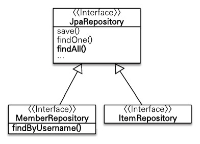
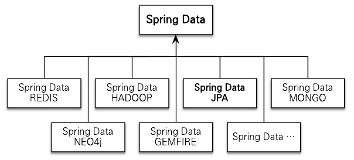
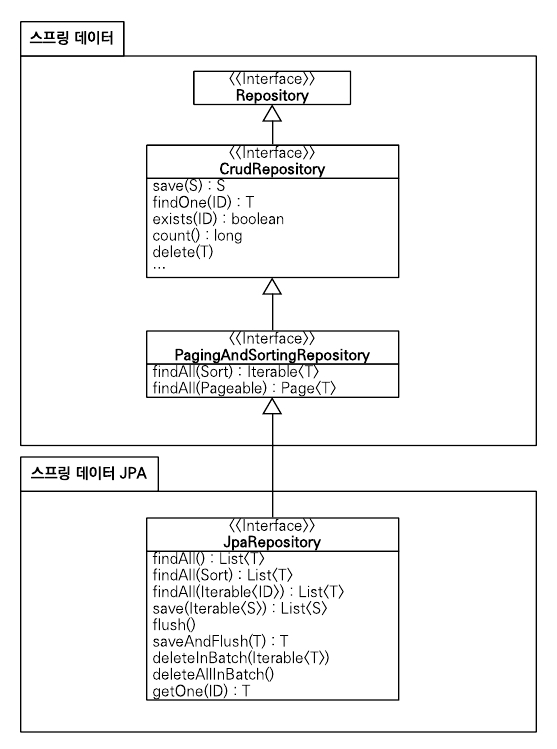

대부분의 데이터 접근 계층은 CRUD로 부르는 유사한 등록, 수정, 삭제, 조회 코드를 반복해서 개발한다. JPA를 사용해서 데이터 접근 계층을 개발할 때도 이 같은 문제가 발생한다. 이런 문제를 해결하려면 제네릭과 상속을 적절히 사용해서 공통 부분을 처리하는 부모 클래스를 만들면 된다. 이것을 보통 GenericDAO라고 한다. 하지만 이 방법은 공통 기능을 구현한 부모 클래스에 너무 종속되고 구현 클래스 상속이 가지는 단점에 노출된다.

# 12.1 스프링 데이터 JPA 소개

스프링 데이터 JPA는 스프링 프레임워크에서 JPA를 편리하게 사용할 수 있도록 지원하는 프로젝트이다. 이 프로젝트는 데이터 접근 계층을 개발할 때 지루하게 반복되는 CRUD 문제를 해결해준다. 우선 CRUD를 처리하기 위한 공통 인터페이스를 제공한다. 그리고 레포지토리를 개발할 때 인터페이스만 작성하면 실행 시점에 스프링 데이터 JPA가 구현 객체를 동적으로 생성해서 주입해준다. 따라서 데이터 접근 계층을 개발할 떄 구현 클래스 없이 인터페이스만 작성해도 개발을 완료할 수 있다.

다음은 스프링 데이터 JPA를 사용한 예제이다.

```java
public interface MemberRespository extends JpaRepository<Member, Long> {
	Member findByUsername(String username);
}

public interface ItemRepository extends JpaRespository<Item, Long> {
}
```

클래스 다이어그램은 다음 그림과 같다.


그림 12.1 스프링 데이터 JPA 사용

일반적인 CRUD 메소드는 JpaRepository 인터페이스가 공통으로 제공하므로 문제가 없다.

그리고 MemberRepsitory.findByUsername(…)처럼 직접 작성한 공통으로 처리할 수 없는 메소드는 스프링 데이터 JPA가 메소드 이름을 분석해서 적절한 JPQL을 실행한다.

## 12.1.1 스프링 데이터 프로젝트

스프링 데이터 JPA는 스프링 데이터 프로젝트의 하위 프로젝트 중 하나다.

스프링 데이터 프로젝트는 JPA, 몽고DB, NEO4J, REDIS, HADOOP, GEMFIRE 같은 다양한 데이터 저장소에 대한 접근을 추상화해서 개발자 편의를 제공하고 지루하게 반복하는 데이터 접근 코드를 줄여준다.



그림 12.2 스프링 데이터 연관 프로젝트

여기서 스프링 데이터 JPA 프로젝트는 JPA에 특화된 기능을 제공한다.

# 12.2 스프링 데이터 JPA 설정

스프링 데이터 JPA를 사용하기 위한 라이브러리와 환경설정 방법을 알아보자.

build.gradle의 dependencies에 스프링 데이터 JPA 의존성을 추가하면 된다.

```java
dependencies {
    // JPA
    implementation 'org.springframework.boot:spring-boot-starter-data-jpa'
}
```

# 12.3 공통 인터페이스 기능

스프링 데이터 JPA는 간단한 CRUD 기능을 공통으로 처리하는 JpaRepository 인터페이스를 제공한다. 스프링 데이터 JPA를 사용하는 가장 단순한 방법은 다음 예제와 같이 이 인터페이스를 상속받는 것이다.

```java
public interface MemberRepository extends JpaRepository<Member, Long> {
}
```

제네릭에 엔티티 클래스와 엔티티 클래스가 사용하는 식별자 타입을 지정하면 된다.

다음 그림은 JpaRepository 인터페이스의 계층 구조이다.



그림 12.3 공통 인터페이스 구성

그림 12.3를 보면 윗부분에 데이터 모듈이 있고 그 안에 Repository, CrudRepository, PagingAndSortingRespotiroy가 있는데 이것은 스프링 데이터 프로젝트가 공통으로 사용하는 인터페이스이다. 스프링 데이터 JPA가 제공하는 JpaRepository 인터페이스는 여기에 추가로 JPA에 특화된 기능을 제공한다.

JpaRepository를 상속받으면 사용할 수 있는 주요 메소드는 다음과 같다. T는 엔티티, ID는 엔티티의 식별자 타입, S는 엔티티와 그 자식 타입을 말한다.

- save(S): 새로운 엔티티는 저장하고 이미 있는 엔티티는 수정한다.
- delete(T): 엔티티 하나를 삭제한다. 내부에서 EntityManager.remove()를 호출한다.
- findOne(ID): 엔티티 하나를 조회한다. 내부에서 EntityManager.find()를 호출한다.
- getOne(ID): 엔티티를 프록시로 조회한다. 내부에서 EntityManager.getReference()를 호출한다.
- findAll(…): 모든 엔티티를 조회한다. 정렬이나 페이징 조건을 파라미터로 제공할 수 있다.

save(S) 메소드는 엔티티에 식별자 값이 없으면 새로운 엔티티로 판단해서 EntityManager.persist()를 호출하고 식별자 값이 있으면 이미 있는 엔티티로 판단해서 EntityManager.merge()를 호출한다.

# 12.4 쿼리 메소드 기능

쿼리 메소드 기능은 스프링 데이터 JPA가 제공하는 기능이다. 대표적으로 메소드 이름만으로 쿼리를 생성하는 기능이 있는데 인터페이스에 메소드만 선언하면 해당 메소드의 이름으로 적절한 JPQL 쿼리를 생성해서 실행한다.

스프링 데이터 JPA가 제공하는 쿼리 메소드 기능은 크게 3가지가 있다.

- 메소드 이름으로 쿼리 생성
- 메소드 이름으로 JPA NamedQuery 호출
- @Query 어노테이션을 사용해서 레포지토리 인터페이스에 쿼리 직접 정의

이 기능들을 활용하면 인터페이스만으로 필요한 대부분의 쿼리 기능을 개발할 수 있다.

## 12.4.1 메소드 이름으로 쿼리 생성

이메일과 이름으로 회원을 조회하려면 다음과 같은 메소드를 정의하면 된다.

```java
public interface MemberRepository extends JpaRepository<Member, Long> {
	List<Member> findByEmailAndName(String email, String name);
}
```

인터페이스에 정의한 findByEmailAndName(…) 메소드를 실행하면 스프링 데이터 JPA는 메소드 이름을 분석해서 JPQL을 생성하고 실행한다.

물론 정해진 규칙에 따라서 메소드 이름을 지어야 하는데 스프링 데이터 JPA 공식 문서에서 찾아볼 수 있다.

## 12.4.2 JPA NamedQuery

스프링 데이터 JPA는 메소드 이름으로 JPA Named 쿼리를 호출하는 기능을 제공한다. JPA Named 쿼리는 이름 그대로 쿼리에 이름을 부여해서 사용하는 방법이다.

다음은 NamedQuery를 사용하는 예제이다.

```java
@Entity
@NamedQuery(
	name = "Member.findByUsername",
	query = "select m from Member m where m.username = :useranme")
)
public class Member {
	...
}

public interface MemberRepository extends JpaRepository<Member, Long> {
	List<Member> findByUsername(@Param("username") String username);
}
```

만약 실행할 Named 쿼리가 없으면 메소드 이름으로 쿼리 생성 전략을 사용한다.

## 12.4.3 @Query, 레포지토리 메소드에 쿼리 정의

레포지토리 메소드에 직접 쿼리를 정의하려면 다음 예제와 같이 @Query 어노테이션을 사용한다.

```java
public interface MemberRepository extends JpaRepository<Member, Long> {
	@Query("select m from Member m where m.username = ?1")
	Member findByUsername(String username);
}
```

네이티브 SQL을 사용하려면 nativeQuery = true를 설정한다. 네이티브 SQL의 위치 기반 파라미터는 0부터 시작한다.

```java
public interface MemberRepository extends JpaRepository<Member, Long> {
	@Query(value = "SELECT * FROM MEMBER WHERE USERNAME = ?0", nativeQueryt = true)
	Member findByUsername(String username);
}
```

## 12.4.4 파라미터 바인딩

스프링 데이터 JPA는 위치 기반 파라미터 바인딩과 이름 기반 파라미터 바인딩을 모두 지원한다. 기본값은 위치 기반인데 파라미터 순서로 바인딩한다. 이름 기반 파라미터 바인딩을 사용하려면 다음 예제와 같이 @Param 어노테이션을 사용하면 된다.

```java
public interface MemberRepository extends JpaRepository<Member, Long> {
	@Query("select m from Member m where m.uersname = :name)
	Member findByUsername(@Param("name) String username);
}
```

## 12.4.5 벌크성 수정 쿼리

다음은 JPA로 벌크성 수정 쿼리 예제이다.

```java
int bulkPriceUp(String stockAmount) {
	...
	String qlString = 
		"update Product p set p.price = p.price * 1.1 " +
		"where p.stockAmount < :stockAmount";
	
	int resultCount = em.createQuery(qlString)
											.setParameter("stockAmount", stockAmount)
											.excuteUpdate();
}
```

다음은 스프링 데이터 JPA를 사용한 벌크성 수정 쿼리 예제이다.

```java
@Modifying
@Query("update Product p set p.price = p.price * 1.1 " +
			"where p.stockAmount < :stockAmount")
int bulkPriceUp(@Param("stockAmount"), String stockAmount);
```

스프링 데이터 JPA에서 벌크성 수정, 삭제 쿼리는 @Modifying 어노테이션을 사용하면 된다. 벌크성 쿼리를 실행하고 나서 영속성 컨텍스트를 초기화하고 싶으면 @Modifying(clearAutomatically = true)처럼 clearAutomatically 옵션을 true로 설정하면 된다. 참고로 이 옵션의 기본값은 false이다.

## 12.4.6 반환 타입

스프링 데이터 JPA는 유연한 반환 타입을 지원하는데 결과가 한 건 이상이면 컬렉션 인터페이스를 사용하고 단건이면 반환 타입을 지정한다.

만약 조회 결과가 없으면 컬렉션을 빈 컬렉션을 반환하고 단건은 null을 반환한다. 그리고 단건을 기대하고 반환 타입을 지정하는데 결과가 2건 이상 조회되면 NonUniqueResultException 예외가 발생한다.

참고로 단건으로 지정한 메소드를 호출하면 스프링 데이터 JPA는 내부에서 JPQL의 getSingleResult() 메소드를 호출한다. 이 메소드를 호출했을 때 조회 결과가 없으면 NoResultException 예외가 발생하는데 개발자 입장에서 다루기가 상당히 불편하다. 스프링 데이터 JPA는 단건을 조회할 때 이 예외가 발생하면 예외를 무시하고 대신에 null을 반환한다.

## 12.4.7 페이징과 정렬

스프링 데이터 JPA는 쿼리 메소드에 페이징과 정렬 기능을 사용할 수 있도록 2가지 특별한 파라미터를 제공한다.

- org.springframework.data.domain.Sort: 정렬 기능
- org.springframework.data.domain.Pageable: 페이징 기능(내부에 Sort 포함)

다음은 페이징과 정렬 예제이다.

```java
// count 쿼리 사용
Page<Member> findByName(String name, Pageable pageable);

// count 쿼리 사용 안 함
List<Member> findByName(String name, Pageable pageable);

List<Member> findByName(String name, Sort sort);
```

다음은 페이징과 정렬을 사용하는 예제이다.

```java
// 페이징 조건과 정렬 조건 설정
PageResult pageResult = new PageResult(0, 10, new Sort(Direction.DESC, "name"));

Page<Member> result = memberRepository.findByNameStartingWith("김", pageResult);

List<Member> members = result.getContent(); // 조회된 데이터
int totalPages = result.getTotalPages(); // 전체 페이지 수
boolean hasNextPage = result.hasNextPage(); // 다음 페이지 존재 여부
```

Pageable은 인터페이스이다. 따라서 실제 사용할 때는 다음 예제와 같이 해당 인터페이스를 구현한 PageResult 객체를 사용한다. 생성자의 첫 번째 파라미터에는 현재 페이지를, 두 번째 파라미터에는 조회할 데이터 수를 입력한다. 여기에 추가로 정렬 정보도 파라미터로 사용할 수 있다.

## 12.4.8 힌트

JPA 쿼리 힌트를 사용하려면 org.springframework.data.jpa.repository.QueryHints 어노테이션을 사용하면 된다. 

다음은 힌트를 사용한 예제이다.

```java
@QueryHints(value = (@QueryHint(name = "org.hibernate.readOnly", value = "true")),
						forCounting = true)
Page<Member> findByName(String name, Pageable pageable);
```

forCounting 속성은 반환 타입으로 Page 인터페이스를 적용하면 추가로 호출 하는 페이징을 위한 count 쿼리에도 힌트를 적용할지를 설정하는 옵션이다.

## 12.4.9 Lock

쿼리 시 락을 걸려면 org.springframework.data.jpa.repository.Lock 어노테이션을 사용하면 된다.

```java
@Lock(LockModeType.PESSIMISTIC_WRITE)
List<Member> findByName(String name);
```

# 12.5 명세

스프링 데이터 JPA는 JPA Criteria로 명세라는 개념을 사용할 수 있도록 지원한다. 명세를 이해하기 위한 핵심 단어는 술어인데 이것은 단순히 참이나 거짓으로 평가된다. 그리고 이것은 AND, OR 같은 연산자로 조합할 수 있다. 이 술어를 스프링 데이터 JPA는 org.springfreamwork.data.jpa.domain.Specification 클래스로 정의했다.

Specification은 컴포지트 패턴으로 구성되어 있어서 여러 Specification을 조합할 수 있다. 따라서 다양한 검색 조건을 조립해서 새로운 검색조건을 쉽게 만들 수 있다.

명세 기능을 사용하려면 레포지토리에서 JpaSpecifiacationExecutor 인터페이스를 상속받으면 된다.

```java
public interface OrderRepository extends JpaRepository<Order, Long>,
JpaSpecificationExecutor<Order> {

}
```

다음은 명세를 사용하는 예제이다.

```java
public List<Order> findOrders(String name) {
	List<Order> result = orderRepository.findAll(
		where(memberName(name)).and(isOrderStatus())
	);
	
	return result;
}
```

Specifications는 명세들을 조립할 수 있도록 도와주는 클래스인데 where(), and(), or(), not() 메소드를 제공한다. findAll()을 보면 회원 이름 명세와 주문 상태 명세를 and로 조합해서 검색 조건으로 사용한다.

# 12.6 사용자 정의 레포지토리 구현

스프링 데이터 JPA로 레포지토리를 개발하면 인터페이스만 정의하고 구현체는 만들지 않는다. 하지만 다양한 이유로 메소드를 직접 구현해야 할 때도 있다. 그렇다고 레포지토리를 직접 구현하면 공통 인터페이스가 제공하는 기능까지 모두 구현해야 한다. 스프링 데이터 JPA는 이런 문제를 우회해서 필요한 메소드만 구현할 수 있는 방법을 제공한다..

먼저 직접 구현할 메소드를 위한 사용자 정의 인터페이스를 작성한다.

```java
public interface MemberRepositoryCustom{
	public List<Member> findMemberCustom();
}
```

다음으로 사용자 정의 인터페이스를 구현한 클래스를 작성한다 이때 클래스 이름을 짓는 규칙으로 레포지토리 인터페이스 이름+Impl로 지어야 한다. 이렇게 하면 스프링 데이터 JPA가 사용자 정의 구현 클래스로 인식한다.

```java
public class MemberRepositoryImpl implements MemberRepositoryCustom {
	@Override
	public List<Member> findMemberCustom() {
		...
	}
}
```

마지막으로 다음 예제와 같이 레포지토리 인터페이스에서 사용자 정의 인터페이스를 상속 받으면 된다.

```java
public interface MemberRepository
	extends JpaRepository<Member, Long>, MemberRepositoryCustom {
}
```

# 12.7 Web 확장

스프링 데이터 프로젝트는 스프링 MVC에서 사용할 수 있는 편리한 기능을 제공한다. 식별자로 도메인 클래스를 바로 바인딩해주는 도메인 클래스 컨버터 기능과, 페이징과 정렬 기능을 알아보자.

## 12.7.1 설정

스프링 데이터가 제공하는 Web 확장 기능을 활성화하려면 org.springframework.data.web.config.SrpingDataWebConfiguration을 스프링 빈으로 등록하면 된다.

## 12.7.2 도메인 클래스 컨버터 기능

도메인 클래스 컨버터는 HTTP 파라미터로 넘어온 엔티티의 아이디로 엔티티 객체를 찾아서 바인딩해준다. 

예를 들어 특정 회원을 수정하는 화면을 보여주려면 컨트롤러는 HTTP 요청으로 넘어온 회원의 아이디를 사용해서 레포지토리를 통해 회원 엔티티를 조회해야 한다.

```java
@Controller
public class MemberController {
	@Autowired MemberRepository memberRepository;
	
	@RequestMapping("member/memberUpdateForm")
	public String memberUpdateForm(@RequestParam("id") Long id, Model model) {
		Member member = memberRepository.findOne(id);
		model.addAttribute("member", member);
		return "member/memberSaveForm";
	}
}
```

예제를 보면 컨트롤러에서 파라미터로 넘어온 회원 아이디로 엔티티를 찾는다. 그리고 찾아온 엔티티를 model을 사용해서 뷰에 넘겨준다.

다음은 도메인 클래스 컨버터를 적용한 예제이다.

```java
@Controller
public class MemberController {
	@Autowired MemberRepository memberRepository;
	
	@RequestMapping("member/memberUpdateForm")
	public String memberUpdateForm(@RequestParam("id") Member member, Model model) {
		model.addAttribute("member", member);
		return "member/memberSaveForm";
	}
}
```

@RequestParam(”id”) Member member 부분을 보면 HTTP 요청으로 회원 아이디를 받지만 도메인 클래스 컨버터가 중간에 동작해서 아이디를 회원 엔티티 객체로 변환해서 넘겨준다. 따라서 컨트롤러를 단순하게 사용할 수 있다.

## 12.7.3 페이징과 정렬 기능

스프링 데이터가 제공하는 페이징과 정렬 기능을 스프링 MVC에서 편리하게 사용할 수 있도록 제공한다.

- 페이징 기능: PageableHandlerMethodArgumentResolver
- 정렬 기능: SortHandlerMethodArgumentResolver

다음은 페지이과 정렬의 예제이다.

```java
@RequestMapping(value = "/members", method = RequestMethod.GET)
public String list(Pagealbe pagealbe, Model model) {
	Page<Member> page = memberSevice.findMembers(pageable);
	model.addAttribut("members", page.getContent());
	return "members/memberList"
}
```

파라미터로 Pageable을 받은 것을 확인할 수 있다. Pageable은 다음 요청 파라미터 정보로 만들어진다. 

- page: 현재 페이지, 0부터 시작
- size: 한 페이지에 노출할 데이터 건수
- sort: 정렬 조건을 정의한다.

### 접두사

사용해야 할 페이징 정보가 둘 이상이면 접두사를 사용해서 구분할 수 있다. 접두사는 스프링 프레임워크가 제공하는 @Qualifier 어노테이션을 사용한다.

```java
public String list(
	@Qualifier("member") Pageable memberPageable,
	@Qualifier("order") Pageable orderPageable, ...
)
```

### 기본값

Pageable의 기본값은 page=0, size=20이다. 만약 기본값을 변경하고 싶으면 @PaeableDefault 어노테이션을 사용하면 된다.

# 12.8 스프링 데이터 JPA가 사용하는 구현체

스프링 데이터 JPA가 제공하는 공통 인터페이스는 SimpleJpaRepository가 구현한다.

```java
@Repository
@Transactional(readOnly = true)
public class SimpleJpaRepository<T, ID extends Serializable> implements
JpaRepository<T, ID>, JpaSpecificationExecutor<T> {
	@Transactional
	public <S extends T> S save(S entity) {
		...
	}	
}
```

- @Repository 적용: JPA 예외를 스프링이 추상화한 예외로 변환한다.
- @Transactional 트랜잭션 적용: JPA의 모든 변경은 트랜잭션 안에서 이루어져야 한다. 스프링 데이터 JPA가 제공하는 공통 인터페이스를 사용하면 데이터를 변경하는 메소드에 트랜잭션 처리가 되어있다.
- @Transactional(readOnly = true): 데이터를 조회하는 메소드에는 readOnly=true 옵션이 적용되어 있다.
- save() 메소드: 이 메소드는 저장할 엔티티가 새로운 엔티티면 저장하고 이미 있는 엔티티면 병합한다.

# 12.9 JPA 샵에 적용

스프링 프레임워크와 JPA로 개발한 웹 애플리케이션에 스프링 데이터 JPA를 적용해보자.

## 12.9.1 환경 설정

build.gradle의 dependencies에 스프링 데이터 JPA 의존성을 추가하면 된다.

```java
dependencies {
    // JPA
    implementation 'org.springframework.boot:spring-boot-starter-data-jpa'
}
```

## 12.9.2 레포지토리 리팩토링

### 회원 레포지토리

```java
@Repository
public interface MemberRepository extends JpaRepository<Member, Long> {
	List<Member> findByName(String name);
}
```

### 상품 레포지토리

```java
@Repository
public interface ItemRepository extends JpaRepository<Item, Long> {
}
```

### 주문 레포지토리

```java
@Repository
public interface OrderRepository extends JpaRepository<Order, Long> {
}
```

## 12.9.3 명세 적용

명세로 검색하는 기능을 사용하려면 레포지토리에 JpaSpecificationExecutor를 추가로 상속받아야 한다.

# 12.10 스프링 데이터 JPA와 QueryDSL 통합

스프링 데이터 JPA는 2가지 방법으로 QueryDSL을 지원한다.

- org.springframework.data.querydsl.QueryDslPredicateExecutor
- org.springframework.data.querydsl.QueryDslRepositorySupport

## 12.10.1 QueryDslPredicateExecutor 사용

첫번째 방법은 레포지토리에서 QueryDslPredicateExecutor를 상속받으면 된다.

```java
public interface ItemRepository
extends JpaRepository<Item, Long>, QueryDslPredicateExecutor<Item> {
}
```

이렇게 하면 상품 레포지토리에서 QueryDSL을 사용할 수 있다.

다음은 QueryDSL 사용 예제이다.

```java
QItem item = QItem.item;
Iterable<Item> result = itemRepository.findAll(
	item.name.contains("장난감").and(item.price.between(10000, 20000))
);
```

## 12.10.2 QueryDslRepositorySupport 사용

QueryDSL의 모든 기능을 사용하려면 JPAQuery 객체를 직접 생성해서 사용하면 된다. 이때 스프링 데이터 JPA가 제공하는 QueryDslRepositorySupport를 상속받아 사용하면 조금 더 편리하게 QueryDSL을 사용할 수 있다.

다음은 QueryDslRepositorySupport를 사용한 예제이다.

```java
public interface CustomOrderRepository {
	public List<Order> search(OrderSearch orderSearch);
}

public class OrderRepositoryImpl extends QueryDslRepositorySupport,
implements CustomOrderRepository {
	public OrderRepositoryImpl() {
		super(Order.class);
	}
	
	@Override
	public List<Order> search(OrderSearch orderSearch) {
		QOrder order = QOrder.order;
		QMember member = QMember.member;
		
		JPQLQuery query = from(order);
		
		if(StringUtils.hasText(orderSearch.getMemberName())) {
			query.leftJoin(order.member, member)
						.where(member.name.contains(orderSearch.getMemberName());
		}
		
		if(orderSearch.getOrderStatus() != null) {
			query.where(order.status.eq(orderSearch.getOrderStatus()));
		}
		
		return query.list(order);
	}
}
```

# 12.11 정리

지금까지 스프링 데이터 JPA 기능을 학습하고 앞서 만든 웹 애플리케이션에 적용해보았다. 적용한 예제를 보면 지루한 데이터 접근 계층의 코드가 상당히 많이 줄어든 것을 알 수 있다. 스프링 데이터 JPA는 버전이 올라가면서 다양한 기능이 추가되고 사용할 수 있다.