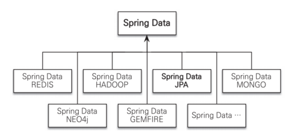
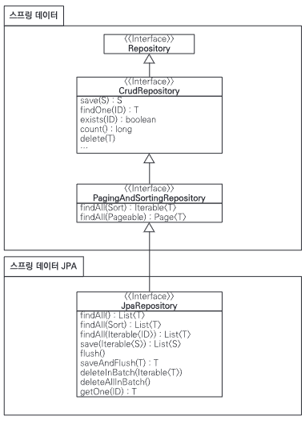

# 12.1. 스프링 데이터 JPA 소개

`스프링 데이터 JPA`는 스프링 프레임워크에서 JPA를 편리하게 사용할 수 있도록 지원하는 프로젝트다.  

데이터 접근 계층을 개발할 때 지루하게 반복되는 CRUD 문제를 해결해준다.  

우선 CRUD를 처리하기 위한 공통 인터페이스를 제공한다.  

그리고 레포지토리를 개발할 때 인터페이스만 작성하면 실행 시점에 스프링 데이터 JPA가 구현 객체를 동적으로 생성해 주입해준다.  

따라서 데이터 접근 계층을 개발할 때 구현 클래스 없이 인터페이스만 작성해도 개발할 수 있다.  

회원, 상품 레포지토리를 스프링 데이터 JPA를 사용해서 개발하면 다음과 같이 인터페이스만 작성하면 된다.

```java
public interface MemberRepository extends JPARepository<Member, Long>{
    Member findByUsername(String username);
}

public interface ItemRepository extends JPARepository<Item, Long>{ ;
}
```

CRUD를 처리하기 위한 공통 메소드는 스프링 데이터 JPA가 제공하는 org.springframework.data.jpa.repository.JpaRepository 인터페이스에 있다.  

그런데 findByUsername 처럼 직접 작성한 공통으로 처리할 수 없는 메소드는 어떻게 해야할까?  

스프링 데이터 JPA는 메소드 이름을 분석해서 다음 JPQL을 실행한다.
```sql
select m from Member m where username =: username
```

## 12.1.1. 스프링 데이터 프로젝트


스프링 데이터 JPA는 스프링 데이터 프로젝트의 하위 프로젝트 중 하나다.  

스프링 데이터 프로젝트는 JPA, 몽고DB, REDIS와 같은 다양한 데이터 저장소에 대한 접근을 추상화해서 개발자 편의를 제공한다.  

스프링 데이터 JPA 프로젝트는 JPA에 특화된 기능을 제공한다.

# 12.2. 스프링 데이터 JPA 설정

- 필요 라이브러리  
build.gradle에 다음 코드 추가
```java
dependencies {
implementation 'org.springframework.boot:spring-boot-starter-data-jpa'
}
```

- 환경 설정  
스프링 설정에 XML을 사용하면 `<jpa:repositories>`를 사용하고 레포지토리를 검색할 base-package를 적는다.  
```java
<?xml version="1.0" encoding="UTF-8"?>
<beans xmlns="http://www.springframework.org/schema/beans"
    xmlns:xsi="http://www.w3.org/2001/XMLSchema-instance"
    xmlns:jpa="http://www.springframework.org/schema/data/jpa"
    xsi:schemaLocation="http://www.springframework.org/schema/beans
        http://www.springframework.org/schema/beans/spring-beans.xsd 
        http://www.springframework.org/schema/data/jpa 
        http://www.springframework.org/schema/data/jpa/spring-jpa.xsd">

    <jpa:repositories base-package="jpabook.jpashop.repository" />
    
</beans>
```

스프링 설정에 JavaConfig를 사용하면 다음과 같이 한다.  

basePackages에는 레포지토리를 검색할 패키지 위치를 적는다.
```java
@Configuration
@EnableJpaRepositories(basePackages = "jpabook.jpashop.repository")
public class AppConfig { }
```  

이제 스프링 데이터 JPA는 애플리케이션 실행 시 basePackage에 있는 레포지토리 인터페이스를 찾는다.  

그 후 해당 인터페이스를 구현한 클래스를 동적으로 생성한 다음 스프링 빈으로 등록한다.  

따라서 개발자가 직접 구현 클래스를 만들지 않아도 된다.

# 12.3. 공통 인터페이스 기능

스프링 데이터 JPA를 사용하는 가장 단순한 방법은 인터페이스를 상속받는 것이다.  

그리고 제네릭에 엔티티 클래스와 엔티티 클래스가 사용하는 식별자 타입을 지정하면 된다.

```java
public interface MemberRepository extends JpaRepository<Member, Long>{
}
```

JpaRepository 인터페이스의 계층 구조를 살펴보자.  



JpaRepository 인터페이스를 상속받으면 사용할 수 있는 주요 메소드 몇 가지를 소개하겠다.  

T는 엔티티, ID는 엔티티 식별자 타입, S는 엔티티와 그 자식 타입을 뜻한다.  

1. save(S): 새로운 엔티티는 저장하고, 이미 있는 엔티티는 수정.
2. delete(T): 엔티티 하나를 삭제한다. 내부에서 EntityManager.remove() 호출.
3. findOne(ID): 엔티티 하나 조회한다. 내부에서 EntityManager.find() 호출.
4. getOne(ID): 엔티티를 프록시로 조회한다. 내부에서 EntityManager.getReference() 호출.
5. findAll(...): 모든 엔티티 조회한다. 정렬이나 페이징 조건을 파라미터로 제공할 수 있다.  

save 메소드는 엔티티에 식별자 값이 없으면(null) 새로운 엔티티로 판단해 persist()를 호출.  

값이 있다면 이미 있는 엔티티로 판단해 merge() 호출.  

기능을 확장해서 신규 엔티티 판단 전략을 변경할 수 있다.  

# 12.4. 쿼리 메소드 기능

인터페이스에 메소드만 선언하면 해당 메소드의 이름으로 적절한 JPQL 쿼리를 생성해서 실행한다.  

스프링 데이터 JPA가 제공하는 쿼리 메소드 기능은 크게 3가지가 있다.  

1. 메소드 이름으로 쿼리 생성
2. 메소드 이름으로 JPA NamedQuery 호출
3. @Query 어노테이션을 사용해서 레포지토리 인터페이스 쿼리 직접 정의

## 12.4.1. 메소드 이름으로 쿼리 생성

이메일과 이름으로 회원 조회 시 다음과 같은 메소드 정의
```java
public interface MemberRepository extends JpaRepository<Member, Long>{
    List<Member> findByEmailAndName(String email, String name);
}
```

스프링 데이터 JPA는 메소드를 실행하면 메소드 이름을 분석해 JPQL을 생성하고 실행한다.   

물론 정해진 규칙에 따라서 메소드 이름을 지어야 한다. 

```sql
select m from Member m where m.email = ?1 and m.name = ?2
```

https://docs.spring.io/spring-data/jpa/reference/jpa/query-methods.html  

다음 페이지에서 JPA 쿼리 생성 메커니즘에 대해 상세하게 알 수 있다.  

이 기능은 엔티티의 필드명이 변경되면 인터페이스에 정의한 메소드 이름도 꼭 함께 변경해야 한다.  

## 12.4.2. JPA NamedQuery

메소드 이름으로 JPA Named 쿼리를 호출하는 기능을 제공한다.  

말 그대로 쿼리에 이름을 부여해서 사용하는 방법인데 어노테이션이나 XML에 쿼리를 정의할 수 있다.  

```java
//어노테이션으로 Named 쿼리 정의
@Entity
@NamedQuery(
    name = "Member.findByUsername",
    query = "select m from Member m where m.username =: username")
public class Member {
    ...
}
```

정의한 Named 쿼리를 JPA에서 직접 호출하려면 다음과 같이 코드를 작성한다.  

스프링 데이터 JPA를 사용하면 메소드 이름만으로 Named 쿼리를 호출할 수 있다.  

```java
public interface MemberRepository extends JPARepository<Member, Long>{
    List<Member> findByUsername(@Param("username") String username);
}
```

선언한 "도메인 클래스 + .(점) + 메소드 이름"으로 Named 쿼리를 찾아서 실행한다. 

## 12.4.3. @Query, 레포지토리 메소드에 쿼리 정의

애플리케이션 실행 시점에 문법 오류를 발견할 수 있는 장점이 있다.
```java
public interface MemberRepository extends JPARepository<Member, Long>{
    @Query("select m from Member m where m.username = ?1")
    Member findByUsername(String username);
}
```

네이티브 SQL을 사용하려면 @Query 어노테이션에 nativeQuery = true를 설정한다.  

## 12.4.4. 파라미터 바인딩

위치 기반 파라미터 바인딩과 이름 기반 파라미터 바인딩을 모두 지원한다.  

```java
select m from Member m where m.username = ?1  //위치 기반
select m from Member m where m.username = :name  //이름 기반
```

기본값은 위치 기반인데 파라미터 순서로 바인딩한다.  

이름 기반 파라미터 바인딩을 사용하려면 @Param 어노테이션을 사용하면 된다.  

코드 가독성과 유지보수를 위해 이름 기반 파라미터 바인딩을 사용하자.

## 12.4.5. 벌크성 수정 쿼리

```java
@Modifying
@Query("update Product p set p.price = p.price * 1.1 where
    p.stockAmount < :stockAmount")
int bulkPriceUp(@Param("stockAmount") String stockAmount);
```

벌크성 수정, 삭제 쿼리는 @Modifying 어노테이션을 사용한다.  

벌크성 쿼리르 실행하고 나서 영속성 컨텍스트를 초기화하고 싶으면 `@Modifying(clearAutomatically = true)` 로 설정하면 된다.  

기본값은 false다.

## 12.4.6. 반환 타입

결과가 한 건 이상이면 컬렉션 인터페이스를 사용하고 단건이면 반환 타입을 지정한다.  

```java
List<Member> findByName(String name); //컬렉션
Member findByEmail(String email); //단건
```

조회 결과가 없으면 컬렉션은 빈 컬렉션을 반환, 단건은 null을 반환한다.

## 12.4.7. 페이징과 정렬

쿼리 메소드에 페이징과 정렬 기능을 사용할 수 있도록 2가지 파라미터를 제공한다.

1. org.springframework.data.domain.Sort : 정렬 기능
2. org.springframework.data.domain.Pageable : 페이징 기능(내부에 Sort 포함)

파라미터에 Pageable을 사용하면 반환 타입으로 List나 Page를 사용할 수 있다.  

반환 타입으로 Page를 사용하면 스프링 데이터 JPA는 페이징 기능을 제공하기 위해 검색된 전체 데이터 건수를 조회하는 count 쿼리를 추가 호출한다.  

```java
Page<Member> findByName(String name, Pageable pageable); // count 쿼리 사용
List<Member> findByName(String name, Pageable pageable); // count 쿼리 사용안함
List<Member> findByName(Stirng name, Sort sort);
```

> 예제  
> 검색 조건 : 이름이 김으로 시작하는 회원  
> 정렬 조건 : 이름으로 내림차순  
> 페이징 조건 : 첫 번째 페이지, 페이지당 보여줄 데이터는 10건  

```java
public interface MemberRepository extends JPARepository<Member,Long>{
    Page<Member> findByNameStartingWith(String name, Pageable Pageable);
}


//페이징 조건과 정렬 조건 설정
PageRequest pageRequest =
    new PageRequest(0, 10, new Sort(Direction.DESC, "name"));

Page<Member> result =
    memberRepository.findByNameStartingWith("김", pageRequest);

List<Member> members = result.getContent (); //조회된 데이터
int totalPages = result.getTotalPages (); //전체 페이지 수
boolean hasNextPage = result .hasNextPage (); //다음 페이지 존재 여부
```

## 12.4.8. 힌트

JPA 쿼리 힌트를 사용하려면 @QueryHints 어노테이션을 사용하면 된다.  

SQL 힌트가 아니라 JPA 구현체에게 제공하는 힌트다.  

```java
@QueryHints(value = { @QueryHint(name = "org.hibernate.readOnly", value = "true")}, forCounting = true)
Page<Member> findByName(String name, Pageable pageable);
```

forCounting 속성은 반환 타입으로 Page 인터페이스를 적용하면 추가로 호출하는 페이징을 위한 count 쿼리에도 쿼리 힌트를 적용할지 설정하는 옵션이다(기본값 true).  

## 12.4.9. Lock

쿼리시 락을 걸려면 @Lock 어노테이션을 사용하면 된다.  

```java
@Lock(LockModeType.PESSIMISTIC_WRITE)
List<Member> findByNAme(String name);
```

# 12.5. 명세

명세를 이해하기 위한 핵심 단어는 `술어`인데 이것은 단순히 참이나 거짓으로 평가된다.  

그리고 이것은 AND, OR 같은 연산자로 조합할 수 있다.  

데이터를 검색하기 위한 제약 조건 하나하나 역시 술어라 할 수 있다.  

술어를 스프링 데이터 JPA는 Specification 클래스로 정의했다.  

명세 기능을 사용하려면 레포지토리에서 JpaSpecificationExecutor 인터페이스를 상속받으면 된다.  

```java
public interface OrderRepository extends JpaRepository<Order, Long>, JpaSpecificationExecutor<Order>{
    
}
```

# 12.6. 사용자 정의 레포지토리 구현

메소드를 직접 구현해야 할 때도 있다.  

스프링 데이터 JPA는 필요한 메소드만 구현할 수 있는 방법을 제공한다.  

먼저 구현할 메소드를 위한 사용자 정의 인터페이스를 작성해야 한다. 자유롭게 지으면 된다.  

```java
public interface MemberRepositoryCustom {
    public List<Member> findMemberCustom();
}
```

다음 사용자 정의 인터페이스를 구현한 클래스를 작성해야 한다.  

규칙은 레포지토리 인터페이스 이름 + Impl로 지어야 한다. 이렇게 하면 스프링 데이터 JPA가 사용자 정의 구현 클래스로 인식한다.  

```java
public class MemberRepositorylmpl implements MemberRepositoryCustom {
    @Override
    public List<Member> findMemberCustom () {
        ... //사용자정의구현
    }
}
```

마지막으로 레포지토리 인터페이스에서 사용자 정의 인터페이스를 상속받으면 된다.
```java
public interface MemberRepository extends JpaRepository<Member, Long>, MemberRepositoryCustom{
    
}
```

# 12.7. Web 확장

스프링 데이터 프로젝트는 스프링 MVC에서 사용할 수 있는 편리한 기능을 제공한다.  

## 12.7.1. 설정

스프링 데이터가 제공하는 Web 확장 기능을 활성화하려면 SpringDataWebConfiguration을 스프링 빈으로 등록하면 된다.  

`JavaConfig`를 사용하면 다음과 같이 EnableSpringDataWebSupport 어노테이션을 사용하면 된다.  

```java
@Configuration
@EnableWebMvc
@EnableSpringDataWebSupport
public class WebAppConfig {
	...
}
```

## 12.7.2. 도메인 클래스 컨버터 기능

도메인 클래스 컨버터는 HTTP 파라미터로 넘어온 엔티티의 아이디로 엔티티 객체를 찾아서 바인딩해준다.  

예를 들어 특정 회원을 수정하는 화면을 보여주려면 컨트롤러는 HTTP 요청으로 넘어온 회원의 아이디를 사용해서 레포지토리를 통해 회원 엔티티를 조회해야 한다.  

수정화면 요청 URL : /member/memberUpdateForm?id=1
```java
@Controller
public class MemberController {

    @Autowired MemberRepository memberRepository;

    @RequestMapping("member/memberUpdateFrom")
    public String memberUpdateFrom(@RequestParam("id") Long id, Model model) {
        Member member = memberRepository.findOne(id);  //회원을 찾는다.
        model.addAttribute("member", member);
        return "member/memberSaveFrom";
    }
}
```

파라미터로 넘어온 회원 아이디로 회원 엔티티를 찾는다. 그리고 찾아온 회원 엔티티를 model을 사용해서 뷰에 넘겨준다.  

도메인 클래스 컨버터를 사용한 예를 보자.  

```java
@Controller
public class MemberController {
    
    @RequestMapping("member/memberUpdateFrom")
    public String memberUpdateFrom(@RequestParam("id") Member member, Model model) {
        model.addAttribute("member", member);
        return "member/memberSaveFrom";
    }
}
```

@RequestParam("id") Member member 부분을 보면 HTTP 요청으로 회원 아이디를 받는다.  

하지만 도메인 클래스 컨버터가 중간에 동작해서 아이디를 회원 엔티티 객체로 변환해서 넘겨줘 컨트롤러를 단순하게 사용할 수 있다.  

도메인 클래스 컨버터는 해당 엔티티와 관련된 리포지토리를 사용해서 엔티티를 찾는다.

## 12.7.3. 페이징과 정렬 기능

스프링 데이터가 제공하는 페이징과 정렬 기능을 스프링 MVC에서 편리하게 사용할 수 있도록 `HandlerMethodArgumentResolver`를 제공한다.  

- 페이징 기능: PageableHandlerMethodArgumentResolver
- 정렬 기능: SortHandlerMethodArgumentResolver

```java
@RequestMapping(value = "/members", method = RequestMethod.GET)
public String list(Pageable pageable, Model model) {
    	
    Page<Member> page = memberService.findMembers(pageable);
    model.addAttribute("members", page.getContent());
    return "members/memberList";
}
```

파라미터로 Pageable을 받은 것을 확인할 수 있다. Pageable은 다음 요청 파라미터 정보로 만들어진다.  

요청 파라미터는 다음과 같다.  

- page : 현재 페이지, 0부터 시작
- size : 한 페이지에 노출할 데이터 건수
- sort : 정렬 조건을 정의한다. ex) 정렬 속성, 정렬 방향을 변경하고 싶으면 sort 파라미터 추가.

### 접두사

사용해야 할 페이징 정보가 둘 이상이면 접두사를 사용해서 구분할 수 있다.  

접두사는 @Qualifier 어노테이션을 사용한다. 그리고 "[접두사명]_"로 구분한다.  

```java
public String list (
    @Qualifier("member") Pageable memberPageable,
    @Qualifier("order") Pageable orderPageable, ...

// 예) /members?member_page=0&order_page=1
```

### 기본값

Pageable의 기본값은 page=0, size=20이다.  

만약 기본값을 변경하고 싶으면 @PageableDefault 어노테이션을 사용하면 된다.

```java
@RequestMapping(value = "/members_page", method = RequestMethod.GET)
public String list(@PageableDefault(size= 12, sort = "name",
    direction = Sort.Direction.DESC) Pageable pageable){
        ...
}
```

# 12.8. 스프링 데이터 JPA가 사용하는 구현체

스프링 데이터 JPA가 제공하는 공통 인터페이스는 SimpleJpaRepository 클래스가 구현한다.  

# 12.9. JPA 샵에 적용

코드 리팩토링 과정으로 생략

# 12.10. 스프링 데이터 JPA와 QueryDSL 통합

스프링 데이터 JPA는 2가지 방법으로 QueryDSL을 지원한다.  

- org.springframework.data.querydsl.QueryDslPredicateExecutor
- org.springframework.data.querydsl.QueryDslRepositorySupport 

## 12.10.1. QueryDslPredicateExecutor 사용

첫 번째 방법은 레포지토리에서 QueryDslPredicateExecutor를 상속받으면 된다.  

```java
public interface ItemRepository
    extends JpaRepository<Item, Long>, QueryDslPredicateExecutor<Item> {
}
```

장난감이라는 이름을 포함하고 가격이 10000~20000원인 상품을 검색하는 QueryDSL을 생성해보자.  
```java
QItem item = QItem.item;
Iterable<Item> result = itemRepository.findALl(
    item.name.contains("장난감").and(item.price.between(10000,20000))
);
```

QueryDSL을 검색 조건으로 사용하면서 스프링 데이터 JPA가 제공하는 페이징과 정렬 기능도 함께 사용할 수 있다.  

그러나 join, fetch를 사용할 수 없다.  

따라서 QueryDSL이 제공하는 다양한 기능을 사용하려면 JPAQuery를 직접 사용하거나 스프링 데이터 JPA가 제공하는 QueryDslRepositorySupport를 사용해야 한다.

## 12.10.2. QueryDslRepositorySupport 사용

QueryDSL의 모든 기능을 사용하려면 JPAQuery 객체를 직접 생성해서 사용하면 된다.   

이때 스프링 데이터 JPA가 제공하는 QueryDslRepositorySupport를 상속받으면 조금 더 편리하게 QueryDSL을 사용할 수 있다.

```java
public interface CustomOrderRepository {
    
    public List<Order> search(OrderSearch orderSearch);
}
```

스프링 데이터 JPA가 제공하는 공통 인터페이스는 직접 구현할 수 없기 떄문에 CustomOrderRepository라는 사용자 정의 레포지토리를 생성한다.  
```java
public class OrderRepositoryImpl extends QuerydslRepositorySupport
implements CustomOrderRepository{

    public OrderRepositoryImpl() {
        super(Order.class);
    }

    @Override
    public List<Order> search(OrderSearch orderSearch) {
        QOrder order = QOrder.order;
        QMember member = QMember.member;

        JPQLQuery query = from(order);
        if (StringUtils.hasText(orderSearch.getMemberName())) {
            query.leftJoin(order.member, member)
                    .where(member.name.contains(orderSearch.getMemberName()));
        }

        if(orderSearch.getOrderStatus() != null) {
            query.where(order.status.eq(orderSearch.getOrderStatus()));
        }

        return query.fetch();
    }
}
```

