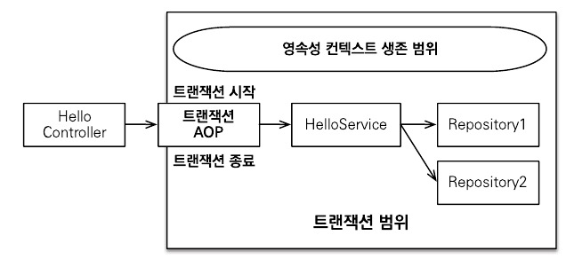
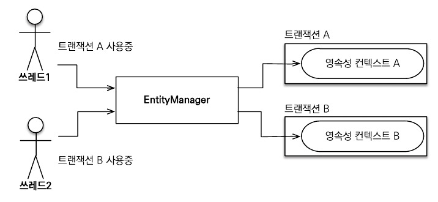
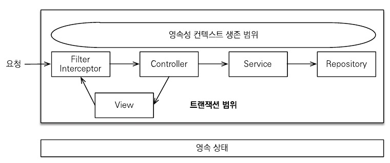
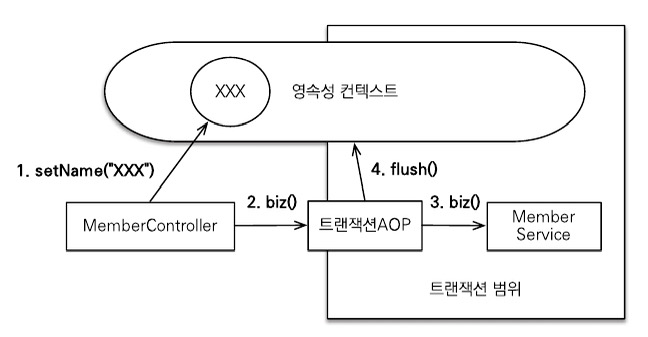

# 13.1 트랜잭션 범위의 영속성 컨텍스트

순수하게 J2SE 환경에서 JPA를 사용하면 개발자가 직접 엔티티 매니저를 생성하고 트랜잭션도 관리해야 한다. 하지만 스프링이나 J2EE 컨테이너 환경에서 JPA를 사용하면 컨테이너가 제공하는 전략을 따라야 한다.

## 13.1.1 스프링 컨테이너의 기본 전략

스프링 컨테이너는 트랜잭션 범위의 영속성 컨텍스트 전략을 기본으로 사용한다. 이 전략은 이름 그대로 트랜잭션의 범위와 영ㅅ오성 컨텍스트의 생존 범위가 같다. 즉, 트랜잭션을 시작할 때 영속성 컨텍스트를 생성하고 트랜잭션이 끝날 때 영속성 컨텍스트를 종료한다. 그리고 같은 트랜잭션 안에서는 항상 같은 영속성 컨텍스트에 접근한다.


그림 13.1 트랜잭션 범위의 영속성 컨텍스트

스프링 프레임워크를 사용하면 서비스 계층에 @Transactional 어노테이션을 선언해서 트랜잭션을 시작한다. 이 어노테이션이 있으면 호출한 메소드를 실행하기 직전에 스프링 트랜잭션의 AOP가 먼저 동작한다.



그림 13.2 트랜잭션 범위의 영속성 컨텍스트-예제

그림 13.2를 보자. 스프링 트랜잭션 AOP는 대상 메소드를 호출하기 직전에 트랜잭션을 시작하고, 대상 메소드가 정상 종료되면 트랜잭션을 커밋하면서 종료한다. 트랜잭션을 커밋하면 JPA는 먼저 영속성 컨텍스트를 플러시해서 변경 내용을 데이터베이스에 반영한 후에 데이터베이스 트랜잭션을 커밋한다. 따라서 영속성 컨텍스트의 변경 내용이 데이터베이스에 정상 반영 된다. 만약 예외가 발생하면 트랜잭션을 롤백하고 종료하는데 이때는 플러시를 호출하지 않는다.

트랜잭션 범위의 영소겅 컨텍스트 전략을 조금 더 구체적으로 살펴보자.

### 트랜잭션이 같으면 같은 영속성 컨텍스트를 사용한다.


그림 13.3 트랜잭션과 영속성 컨텍스트

그림 13.3과 같이 트랜잭션 범위의 영속성 컨텍스트 전략은 다양한 위치에서 엔티티를 주입받아 사용해도 트랜잭션이 같으면 항상 같은 영속성 컨텍스트를 사용한다. 

### 트랜잭션이 다르면 다른 영속성 컨텍스트를 사용한다.



그림 13.4 스레드와 영속성 컨텍스트

그림 13.4와 같이 여러 스레드에서 동시에 요청이 와서 같은 엔티티 매니저를 사용해도 트랜잭션에 따라 접근하는 영속성 컨텍스트가 다르다. 스프링 컨테이너는 스레드마다 각각 다른 트랮ㄴ잭션을 할당한다. 따라서 같은 엔티티 매니저를 호출해도 접근하는 영속성 컨텍스트가 다르므로 멀티스레드 상황에 안전하다.

# 13.2 준영속 상태와 지연 로딩

스프링이나 J2EE 컨테이너는 트랜잭션 범위의 영속성 컨텍스트 전략을 기본으로 사용한다. 그리고 트랜잭션은 보통 서비스 계층에서 시작하므로 서비스 계층이 끝나는 시점에 트랜잭션이 종료되면서 영속성 컨텍스트도 함께 종료된다. 따라서 조회한 엔티티가 서비스와 레포지토리 계층에서는 영속성 컨텍스트에 관리되면서 영속 상태를 유지하지만 컨트롤러나 뷰 같은 프레젠테이션 계층에서는 준영속 상태가 된다.

다음 주문 엔티티 코드를 보자. 상품을 주문한 회원 엔티티를 지연 로딩으로 설정했다.

```java
@Entity
public class Order {
	@Id @GeneratedValue
	private Long id;
	
	@ManyToOne(fetch = FetchType.LAZY) // 지연 로딩 전략
	private Member member; // 주문 회원
}
```

컨테이너 환경의 기본 전략인 트랜잭션 범위의 영속성 컨텍스트 전략을 사용하면 트랜잭션이 없는 트레젠테이션 계층에서는 준영속 상태이다. 따라서 변경 감지와 지연 로딩이 동작하지 않는다. 다음 예제는 컨트롤러에 있는 로직인데 지연 로딩 시점에 예외가 발생한다.

```java
class OrderController {
	public String view(Long orderId) {
		Order order = orderService.findOne(orderId);
		Member member = order.getMember();
		member.getName(); // 지연 로딩 시 예외 발생
	}
}
```

### 준영속 상태와 변경 감지

변경 감지 기능은 영속성 컨텍스트에 살아 있는 서비스 계층까지만 동작하고 영속성 컨텍스트가 종료된 프레젠테이션 계층에서는 동작하지 않는다. 보통 변경 감지 기능은 서비스 계층에서 비즈니스 로직을 수행하면서 발생한다. 단순히 데이터를 보여주기만 하는 프레젠테이션 계층에서 데이터를 수정할 일은 거의 없다. 오히려 변경 감지 기능이 프레젠테이션 계층에서도 동작하면 애플리케이션 계층이 가지는 책임이 모호해지고 무엇보다 데이터를 어디서 어떻게 변경했는지 프레젠테이션 계층까지 다 찾아야 하므로 애플리케이션을 유지보수하기 어렵다.

### 준영속 상태와 지연 로딩

준영속 상태의 가장 골치 아픈 문제는 지연 로딩 기능이 동작하지 않는다는 점이다. 뷰를 렌더링할 때 연관된 데이터도 함께 사용해야 하는데 연관된 데이터를 지연 로딩으로 설정해서 프로시 객체로 조회했다고 가정하자. 아직 초기화하지 않은 프록시 객체를 사용하면 실제 데이터를 불러오려고 초기화를 시도한다. 하지만 준영속 상태는 영속성 컨텍스트가 없으므로 지연 로딩을 할 수 없다. 이때 지연 로딩을 시도하면 LazyInitializationException 에러가 발생한다.

준영속 상태의 지연 로딩 문제를 해결하는 방법은 크게 2가지가 있다.

- 뷰가 필요한 시점에 엔티티를 미리 로딩해두는 방법
- OSIV를 사용해서 엔티티를 항상 영속 상태로 유지하는 방법

뷰가 필요한 시점에 엔티티를 미리 로딩해두는 방법 먼저 알아보는데 3가지 방법이 있다.

1. 글로벌 페치 전략 수정
2. JPQL 페치 조인
3. 강제로 초기화

## 13.2.1 글로벌 페치 전략 수정

가장 간단한 방법은 글로벌 페치 전략을 지연 로딩에서 즉시 로딩으로 변경하면 된다. 엔티티에 있는 fetch 타입을 변경하면 애플리케이션 전체에서 이 엔티티를 로딩할 때마다 해당 전략을 사용하므로 글로벌 페치 전략이라 한다. 하지만 이렇게 글로벌 페치 전략을 즉시 로딩으로 설정하는 것은 2가지 단점이 있다.

### 글로벌 페치 전략에 즉시 로딩 사용 시 단점

- 사용하지 않는 엔티티를 로딩한다.
    
    화면 A에서 order와 member 둘 다 필요해서 글로벌 전략을 즉시 로딩으로 설정했지만 화면 B에서는 order 엔티티만 필요한 경우 화면 B는 즉시 로딩 전략으로 인해 order를 조회하면서 사용하지도 않는 member를 조회하게 된다.
    
- N+1 문제가 발생한다.
    
    JPA를 사용하면서 성능상 가장 조심해야 하는 것이 바로 N+1 문제이다. em.find() 메소드로 엔티티를 조회할 때 연관된 엔티티를 로딩하는 전략이 즉시 로딩이면 데이터베이스에 JOIN 쿼리를 사용해서 한번에 연관된 엔티티까지 조회한다. JPQL을 사용할 때 JPA는 order와 연관된 member를 영속성 컨텍스트에서 찾고 없으면 조회한 order 엔티티 수만큼 member 엔티티를 조회한다.
    
    만약 조회한 order엔티티가 10개이면 member를 호출하는 SQL도 10번 실행한다. 이처럼 처음 조회한 데이터 수만큼 다시 SQL을 사용해서 조회하는 것을 N+1 문제라고 한다. N+1이 발생하면 SQL이 상당히 많이 호출되므로 조회 성능에 치명적이다.
    

## 13.2.2 JPQL 페치 조인

글로벌 페치 전략을 즉시 로딩으로 설정하면 애플리케이션 전체에 영향을 주므로 너무 비효율적이다. 이번에는 JPQL을 호출하는 시점에 함께 로딩할 엔티티를 선택할 수 있는 페치 조인을 알아보자.

```sql
select o
from Order o
join fetch o.member
```

페치 조인은 조인 명령어 마지막에 fetch를 넣어주면 된다. 페치 조인을 사용할 경우 SQL 조인을 사용해서 페치 조인 대상까지 함께 조회한다. 따라서  N+1 문제가 발생하지 않는다. 페치 조인은 N+1 문제를 해결하면서 화면에 필요한 엔티티를 미리 로딩하는 현실적인 방법이다.

### JPQL 페치 조인의 단점

페치 조인이 현실적인 대안이긴 하지만 무분별하게 사용하면 화면에 맞춘 레포지토리 메소드가 증가할 수 있다. 결국 프레젠테이션 계층이 알게 모르게 데이터 접근 계층을 침범하는 것이다. 따라서 무분별한 최적화로 프레젠테이션 계층과 데이터 접근 계층 간에 의존 관계가 급격하게 증가하는 것보다는 적절한 선에서 타협점을 찾는 것이 합리적이다.

## 13.2.3 강제로 초기화

강제로 초기화하기는 영속성 컨텍스트가 살아있을 때 프레젠테이션 계층이 필요한 엔티티를 강제로 초기화해서 반환하는 방법이다.

다음 예제는 강제로 초기화하는 예제이다.

```java
class OrderService {
	@Transactional
	public Order findOrder(Long id) {
		Order order = orderRepository.findOrder(id);
		order.getMember().getName(); // 프록시 객체를 강제로 초기화한다.
		return order;
	}
}
```

글로벌 페치 전략을 지연 로딩으로 설정하면 연관된 엔티티를 실제 엔티티가 아닌 프록시 객체로 조회한다. 프록시 객체는 실제 사용하는 시점에 초기화된다. 예를 들어 order.getMember()까지만 호출하면 단순히 프록시 객체만 반환하고 아직 초기화하지 않는다. 프록시 객체는 member.getName()처럼 실제 값을 사용하는 시점에 초기화 된다.

위의 예제처럼 프레젠테이션 계층에서 필요한 프록시 객체를 영속성 컨텍스트가 살아 있을 때 강제로 초기화해서 반환하면 이미 초기화했으므로 준영속 상태에서도 사용할 수 있다.

하지만 예제처럼 프록시를 초기화하는 역할을 서비스 계층이 담당하면 뷰가 필요한 엔티티에 따라 서비스 계층의 로직을 변경해야 한다. 은근 슬쩍 프레젠테이션 계층이 서비스 계층을 침범하는 상황이다. 서비스 계층을 비즈니스 로직을 담당해야지 이렇게 프레젠테이션 계층을 위한 일까지 하는 것은 좋지 않다. 따라서 비즈니스 로직을 담당하는 서비스 계층에서 프레젠테이션 계층을 위한 프록시 초기화 역할을 분리해야 한다. FACADE 계층이 그 역할을 담당해준다.

## 13.2.4 FACADE 계층 추가

그림 13.5를 보자. 이것은 프레젠테이션 계층과 서비스 계층 사이에 FACADE 계층을 하나 더 두는 방법이다. 이제부터 뷰를 위한 프록시 초기화는 이곳에서 담당한다. 덕분에 서비스 계층은 프레젠테이션 계층을 위해 프록시를 초기화 하지 않아도 된다. 결과적으로 FACADE 계층을 도입해서 서비스 계층과 프레젠테이션 계층 사이에 논리적인 의존성을 분리할 수 있다.

### FACADE 계층의 역할과 특징

- 프레젠테이션 계층과 도메인 모델 계층 간의 논리적 의존성을 분리해준다.
- 프레젠테이션 계층에서 필요한 프록시 객체를 초기화한다.
- 서비스 계층을 호출해서 비즈니스 로직을 실행한다.
- 레포지토리를 직접 호출해서 뷰가 요구하는 엔티티를 찾는다.

## 13.2.5 준영속 상태와 지연 로딩의 문제점

지금까지 준영속 상태일 때 지연 로딩 문제를 극복하기 위해 글로벌 페치 전략도 수정하고, JPQL의 페치 조인도 사용하고, 강제로 초기화까지 하다가 결국 FACADE 계층까지 알아보았다.

뷰를 개발할 때 필요한 엔티티를 미리 초기화하는 방법은 생각보다 오류가 발생할 가능성이 높다. 왜냐하면 보통 뷰를 개발할 때는 엔티티 클래스를 보고 개발하지 이것이 초기화되어 있는지 아닌지 확인하기 위해 FACADE나 서비스 클래스까지 열어보는 것은 상당히 번거롭고 놓치기 쉽기 때문이다.

그리고 애플리케이션 로직과 뷰가 물리적으로는 나누어져 있지만 논리적으로는 서로 의존한다는 문제가 있다. 물론 FACADE 계층을 사용해서 이런 문제를 어느 정도 해소할 수는 있지만 상당히 번거롭다.

결국 모든 문제는 엔티티가 프레젠테이션 계층에서 준영속 상태이기 떄문에 발생한다. 영속성 컨텍스트를 뷰까지 살아있게 열어두면 뷰에서도 지연 로딩을 사용할 수 있는데 이것이 OSIV이다.

# 13.3 OSIV

OSIV는 영속성 컨텍스트를 뷰까지 열어둔다는 뜻이다. 영속성 컨텍스트가 살아있으면 엔티티는 영속 상태로 유지된다. 따라서 뷰에서도 지연 로딩을 사용할 수 있다.

## 13.3.1 과거 OSIV: 요청 당 트랜잭션

OSIV의 핵심은 뷰에서도 지연 로딩이 가능하도록 하는 것이다. 가장 단순히 구현 방법은 클라이언트의 요청이 들어오자마자 서블릿 필터나 스프링 인터셉터에서 트랜잭션을 시작하고 요청이 끝날 때 트랜잭션도 끝내는 것이다. 이것을 요청 당 트랜잭션 방식의 OSIV라고 한다.



그림 13.5 요청 당 트랜잭션 OSIV

그림 13.5에서 보는 것처럼 요청이 들어오자마자 서블릿 필터나 스프링 인터셉터에서 영속성 컨텍스트를 만들면서 트랜잭션을 시작하고 요청이 끝날 때 트랜잭션과 영속성 컨텍스트를 함께 종료한다. 이렇게 하면 영속성 컨텍스트가 처음부터 끝까지 살아있으므로 조회한 엔티티도 영속성 상태를 유지한다.

### 요청 당 트랜잭션 방식의 OSIV 문제점

요청 당 트랜잭션 방식의 OSIV가 가지는 문제점은 컨트롤러나 뷰 같은 프레젠테이션 계층이 엔티티를 변경할 수 있다는 점이다. 예를 들어 고객을 출력해야 하는데 보안상의 이유로 고객 이름을 XXX로 변경해서 출력해야 한다고 가정하자. 컨트롤러에서 고객 이름을 XXX로 변경해서 렌더링할 뷰에 넘겨주었다. 개발자의 의도는 단순히 뷰에 노출할 때만 고객 이름을 XXX로 변경하고 싶은 것이지 실제 데이터베이스에 있는 고객 이름까지 변경하고 싶은 것은 아니다. 하지만 요청 당 트랜잭션 방식의 OSIV는 뷰를 렌더링한 후에 트랜잭션을 커밋한다. 따라서 영속성 컨텍스트 플러시가 동작하고 변경사항이 데이터베이스에 반영된다.

이런 문제를 해결하려면 프레젠테이션 계층에서 엔티티를 수정하지 못하도록 막으면 된다.

엔티티를 수정하지 못하게 막는 방법들은 다음과 같다.

- 엔티티를 읽기 전용 인터페이스로 제공
    
    이 방법은 엔티티를 직접 노출하는 대신에 읽기 전용 메소드만 제공하는 인터페이스를 프레젠테이션 계층에 제공하는 방법이다. 
    
- 엔티티 래핑
    
    이 방법은 엔티티의 읽기 전용 메소드만 가지고 있는 엔티티를 감싼 객체를 만들고 이것을 프레젠테이션 계층에 제공하는 방법이다.
    
- DTO만 반환
    
    이 방법은 가장 전통적인 방법인데 프레젠테이션 계층에 엔티티 대신 단순히 데이터만 전달하는 객체인 DTO를 생성해서 반환하는 것이다. 하지만 이 방법은 OSIV를 사용하는 장점을 살릴 수 없고 엔티티를 거의 복사한듯한 DTO 클래스도 하나 더 만들어야 한다.
    

지금까지 실행한 방법 모두 코드량이 상당히 증가된다는 단점이 있다. 차라리 프레젠테이션 계층에서 엔티티를 수정하면 안된다고 개발자들끼리 합의하는 것이 더 실용적일 수 있다. 또는 적절한 도구를 사용해서 프레젠테이션 계층에서 엔티티의 수정자를 호출하는 코드를 잡아내는 것도 하나의 방법이 될 수 있지만 이것도 쉽지 않다.

최근에는 이런 문제를 어느정도 보완해서 비즈니스 계층에서만 트랜잭션을 유지하는 방식의 OSIV를 사용한다.

## 13.3.2 스프링 OSIV: 비즈니스 계층 트랜잭션

### 스프링 OSIV 분석

이전에 설명했던 요청 당 트랜잭션 방식의 OSIV는 프레젠테이션 계층에서 데이터를 변경할 수 있다는 문제가 있다. 스프링 프레임워크가 제공하는 OSIV는 이런 문제를 어느 정도 해결했다.

스프링 프레임워크가 제공하는 OSIV는 비즈니스 계층에서 트랜잭션을 사용하는 OSIV이다. 이름 그대로 OSIV를 사용하기는 하지만 트랜잭션은 비즈니스 계층에서만 사용한다는 뜻이다.


그림 13.6 스프링 OSIV

동작 원리는 다음과 같다. 클라이언트의 요청이 들어오면 영속성 컨텍스트를 생성한다. 이때 트랜잭션은 시작하지 않는다. 서비스 계층에서 트랜잭션을 시작해면 앞에서 생성해둔 영속성 컨텍스트에 트랜잭션을 시작한다. 비즈니스 로직을 실행하고 서비스 계층이 끝나면 트랜잭션을 커밋하면서 영속성 컨텍스트를 플러시 한다. 이때 트랜잭션만 종료하고 영속성 컨텍스트는 살려둔다. 이후 클라이언트의 요청이 끝날 때 영속성 컨텍스트를 종료한다.

### 트랜잭션 없이 읽기

영속성 컨텍스트를 통한 모든 변경은 트랜잭션 안에서 이루어져야 한다. 만약 트랜잭션 없이 엔티티를 변경하고 영속성 컨텍스트를 플러시하면 예외가 발생한다.

엔티티를 변경하지 않고 단순히 조회만 할 때는 트랜잭션이 없어도 되는데 이것을 트랜잭션 없이 읽기라고 한다. 프록시를 초기화하는 지연 로딩도 조회 기능이므로 트랜잭션 없이 읽기가 가능하다.

### 스프링 OSIV 주의사항

스프링 OSIV를 사용하면 프레젠테이션 계층에서 엔티티를 수정해도 수정 내용을 데이터베이스에 반영하지 앟는다. 그런데 여기에는 한 가지 예외가 있다. 프레젠테이션 계층에서 엔티티를 수정한 직후에 트랜잭션을 시작하는 서비스 계층을 호출하면 문제가 발생한다.

다음 예제를 통해 확인하자.

```java
class MemberController {
	public String viewMember(Long id) {
		Member member = memberService.getMember(id);
		member.setName("XXX"); // 보안 상의 이유로 고객 이름을 XXX로 변경
		
		memberService.biz(); // 비즈니스 로직
		return "view";
	}
}

class MemberService {
		@Transactional
		public void biz() {
			// 비즈니스 로직 수행
		}
}
```



그림 13.7 스프링 OSIV 주의사항

다음 예제와 그림을 분석하면 다음과 같다.

1. 컨트롤러에서 회원 엔티티를 조회하고 이름을 member.setName(”XXX”)로 수정했다.
2. biz() 메소드를 실행해서 트랜잭션이 있는 비즈니스 로직 실행했다.
3. 트랜잭션 AOP가 동작하면서 영속성 컨텍스트에 트랜잭션을 시작한다. 그리고 biz() 메소드를 실행한다.
4. biz() 메소드가 끝나면 트랜잭션 AOP는 트랜잭션을 커밋하고 영속성 컨텍스트를 플러시한다. 이때 변경 감지가 동작하면서 회원 엔티티의 수정 사항을 데이터베이스에 반영한다.

컨트롤러에서 엔티티를 수정하고 즉시 뷰를 호출한 것이 아니라 트랜잭션이 동작하는 비즈니스 로직을 호출했으므로 이런 문제가 발생한다. 문제를 해결하는 단순한 방법은 트랜잭션이 있는 비즈니스 로직을 모두 호출하고 나서 엔티티를 변경하면 된다. 보통 컨트롤러는 비즈니스 로직을 먼저 호출하고 그 결과를 조회하는 순서로 실행하므로 이런 문제는 거의 발생하지 않는다.

스프링 OSIV는 같은 영속성 컨텍스트를 여러 트랜잭션이 공유할 수 있으므로 이런 문제가 발생한다. OSIV를 사용하지 않는 트랜잭션 범위의 영속성 컨텍스트 전략은 트랜잭션의 생명주기와 영속성 컨텍스트의 생명주기가 같으므로 이런 문제가 발생하지 않는다.

# 13.4 정리

스프링이나 J2EE 컨테이너 환경에서 JPA를 사용하면 트랜잭션 범위의 영속성 컨텍스트 전략이 적용된다. 이 전략은 트랜잭션 범위와 영속성 컨텍스트의 생존 범위가 같다. 그리고 같은 트랜잭션 안에서는 항상 같은 영속성 컨텍스트에 접근한다. 이 전략은 트랜잭션이라는 단위로 영속성 컨텍스트를 관리하므로 트랜잭션을 커밋하거나 롤백할 때 문제가 없다. 이 전략의 유일한 단점은 프레젠테이션 계층에서 엔티티가 준영속 상태가 되므로 지연 로딩을 사용할 수 없다는 점이다.

OSIV를 사용하면 이런 문제들을 해결할 수 있다. 기존 OSIV는 프레젠테이션 계층에서도 엔티티를 수정할 수 있다는 단점이 있었다. 스프링 프레임워크가 제공하는 OSIV는 기존 OSIV의 단점들을 해결해서 프레젠테이션 계층에서 엔티티를 수정하지 않는다.